# C++ STL内核

## 分配器 allocators (主要涉及内存管理)

### VC6标准库 allocator 实现(参考)

VC6 的 allocator没有独特的设计，其底层还是调用**C**的 **malloc()**函数分配内存(operator new 的底层调用的是 **malloc** 和 **free**),而使用 malloc的时候往往会为申请的空间额外分配空间(非蓝色的那部分)，会导致额外开销(比如申请容器元素数目有 100万个，可能额外的空间比元素所占的空间还多)

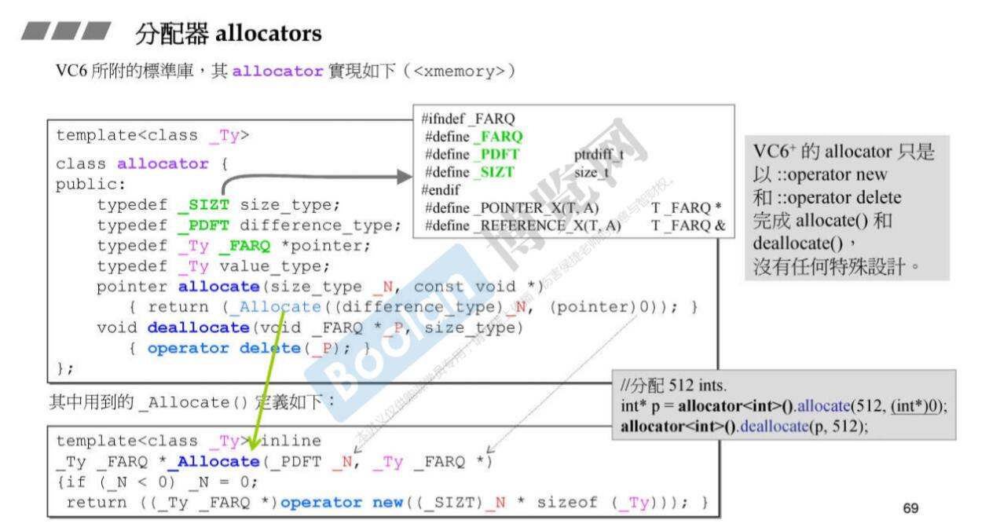
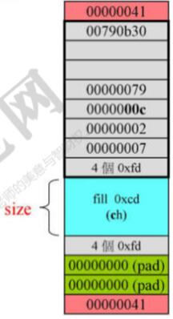

### G2.9(GCC 2.9) 的 alloc 分配器

如上所述，使用malloc的时候可能会产生额外的开销，那么对于容器来说，其每个元素的信息(大小)都是相同的，那么能不能去除这些冗余的信息呢(只保存一份冗余信息?因此一种分配器的设计思路就是尽量减少malloc的次数. 
G2.9的 alloc分配器采用的方案:它设计16条链表，o#链表负责的单元是8个字节，15#链表负责每一个单元是 128 个字节。所有的容器需要内存的时候，找分配器要内存，所有容器单元内存被调整为8的倍数，非配器看相应的链表里有没有内存，如果没有再通过malloc向操作系统要一大块内存。分一小块给容器，不同小块用单链表串起来。（也就是说做了一种2次分配的操作) 

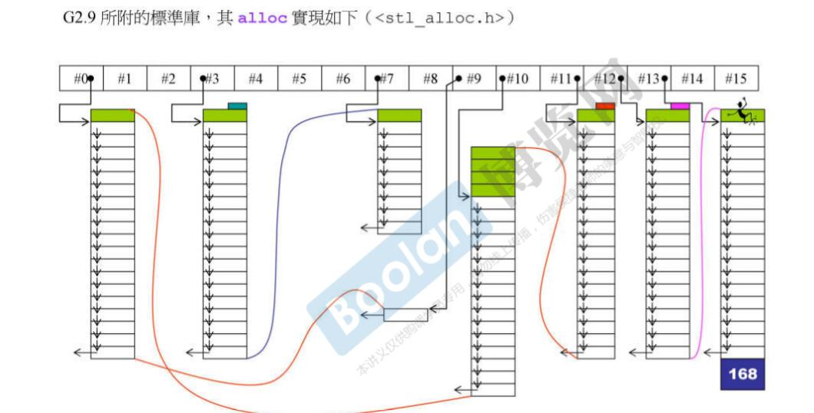

**ps**: 内存管理是一门大学问，受水平和需求所限，目前只能“浅尝辄止”了，上面给出的仅供参考。

## 容器

### List

GC2.9(版本)

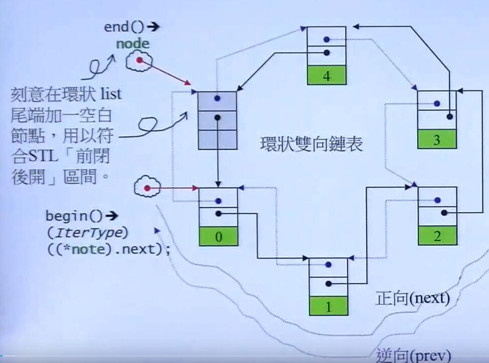

* 如图所示在标准库中，list采用的数据结构是环状双向链表。
* 有一个空白节点，list的迭代器 **.end()**所指向的就是该节点。用来表示一个节点的末尾。
* list是双向链表所以每一个节点都有一个**next**指针指向正向的下一个节点，同时也有一个**prev**指针指向逆向的下一个节点(正向的上一个节点)。

list部分代码

```c++
template<class T>
struct __list_node{
    typedef void* void_pointer;
    void_pointer prev;  //反向指针
    void_pointer next;  //正向指针
}

template<class T,class Alloc = alloc>
class list{
    protected:
        typedef __list_node<T> list_node;
    public:
        typedef list_node* link_type;
        typedef __list_iterator<T,T&,T*> iterator;
        //容器都有的迭代器接口
        // list<Foo>::iterator ite;
    protected:
        link_type node;
    ....

    /*
    所以每一个链表事实上，只保存着一个指向头
    节点的指针。
    */
};

template<class T,class Ref,class Ptr>
struct __list_iterator{
    typedef __list_iterator<T,Ref,Ptr> self;
    typedef bidirectional_iterator_tag iterator_category; //(1)
    typedef T value_type ;// (2)
    typedef Ptr pointer ;  // (3)
    typedef Ref reference;  //(4)
    typedef __list_node<T>* link_type; 
    typedef ptrdiff_t difference_type;  //(5)

    /*
    (1)-（5）是标准库提供的接口
    每个容器都有定义，可以通过这些
    自定义的类型获得容器的内部信息
    */

    link_type node; // 指针，指向一个节点
    reference operator*() const{return (*node).data;}
    pointer operator->()const{return &(operator*());}
    // 括号里的 int 是哑元用来表示前置++ 和后缀++
    self& operator++()
    { node =(link_type)((*node).next));return *this;}

    //后缀 ++
    self operator++(int)
    { self tmp = *this, ++*this; return tmp;}
    ...
    // 还有很多其它的操作符重载
}

```

### 关于list的迭代器

* 迭代器是一个pointer-like class，是一个智能指针。该智能指针指向了链表的node。
* 迭代器重载 * 和 -> 操作，因为用户使用并不关心容器采用的数据结构，而值关心数据本身。因此这两个操作数返回的都是 node 里 data 的 **引用** 或者 **指针**
* 迭代器之所以称为智能指针，还因为它具有一般指针的行为。因此这里重载了 ++(前置和后置)。从使用的角度来说，指针的 ++，找到的是下一个元素，因此在迭代器类中++操作就是取得 next，即获取指向下一个节点的指针。()
* 标准库中有很多自定义类型 eg  `typedef __list_iterator<T,T&,T*>` 目的是为了提供统一化的接口。
* 注意 前置型++ 和 后缀++的区别。
* 仔细阅读代码，我们应该认识到，理解操作符重载极其意义(模仿基本类型的行为，就比如迭代器)，对认识STL很重要.
* 注意在迭代器代码里`self operator++(int)`中的*this 操作是解引用，this是指向**当前迭代器对象的指针**，因此 *this 是获得当前迭代器的引用，而不会调用重载的 `operator*()`,如果要调用`operator*()`应该是 `*(*this)`得到的是当前节点的 data的引用。


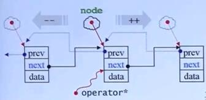

### GC2.9版本的“设计缺陷”

事实上上述代码也有部分设计有瑕疵的地方(在后续的标准库中改进了)

1. `template<class T,class Ref,class Ptr>` 没必要设计三个模板参数，一个就够了
2. `void_pointer prev;  //反向指针` 没必要设计成 void* 指针

我们学习应该有批判性的思维，吸收精髓的部分，同时也要有独立思考和辨别的能力！

## Iterator 需要遵循的原则。

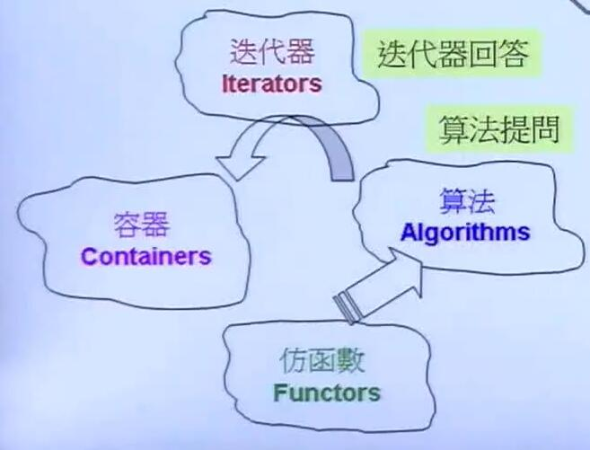

iterator 是 容器和算法的桥梁。iterator除了需要实现对容器的遍历，和对容器的访问，还需要能够回答算法的问题。

### Iterator Traits

traits 的意思是萃取，这里的含义就是我们能够通过某种手段来获得iterator的一些内部的性质(比如value_type)，在list的iterator里有体现。通过typedef 把一些变量类型重定义为共有的接口。

### Iterator "必须回答的问题“

Iterator 必须提供 5 种 associated type

1. **iterator_catagory** 回答迭代器的类型，比如是单向(只能++或--）的还是双向的迭代器，迭代器是否支持跳跃(是否可以+=)
2. **value_type** 迭代器所指向的数据(比如链表节点中的data)的数据类型
3. **pointer**  迭代器所指向的数据(比如链表节点中的data)的指针类型
4. **reference** 迭代器所指向的数据(比如链表节点中的data)的引用类型
5. **difference_type** 迭代器之间距离(两个迭代器作减法的结果)的类型。

算法提问:

```c++
template<typename T>
inline void
algorithm(I first, Ilast){
    // 算法提问
    I::iterator_catagory
    I::pointer
    I::reference
    I::value_type
    I::difference_type
}
```

ps： bidirectional_iterator_tag 表示这是一个双向的迭代器

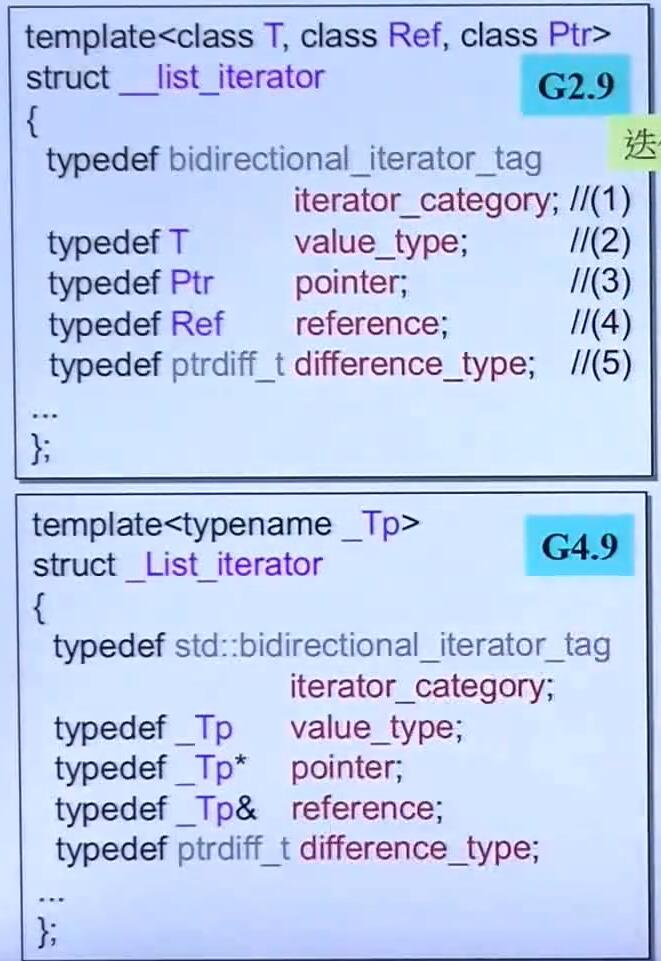

### Traits 的特性

从上面的代码，我们看到，就算没有 traits 不也可以拿到我们需要的类型么？看起来没错，但是前提是给算法的是 **pointer-class**，换言之如果给算法的是一种 **non-class iterators**，就不能通过上述方式获得需要的类型。
因此需要 triats机制。**Iterator Traits**用以分里 **class** iterators 和 **non-class** iterators

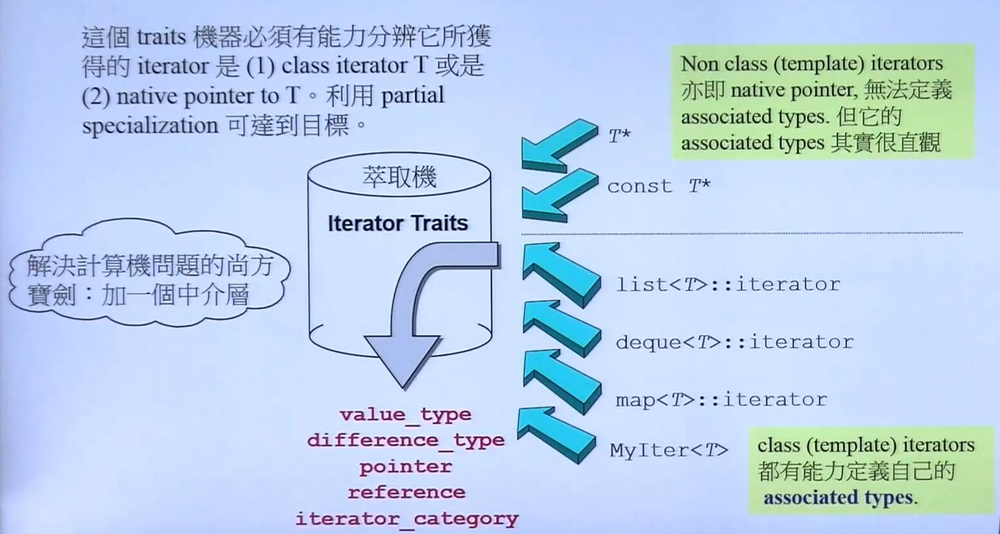

#### 通过偏特化实现 Traits

eg: 

模板会优先匹配偏特化的版本

```c++
// 泛化版本
template<class T>
struct iterator_traits {
    typedef typename I::iterator_catagory;
    typedef typename I::value_type ;
    typedef typename I::pointer ;
    typedef typename I::reference ;
    typedef typename I::difference_type ;
    value_type;  //必须加上typename
}
// 两种偏特化
// 如果 I是 pointer to T 也就是 non-class iterators
template <class T>
struct iterator_traits<T*>{
    typedef random_access_iterator_tag ;iterator_category; //指针肯定是随机访问的
    typedef T value_type;
    typedef T* pointer;
    typedef T& reference;
    typedef ptrdiff_t difference_type;

};
// 如果 I是 const pointer to T 也就是 non-class iterators
template<class T>
struct iterator_traits<const T*>{
    typedef random_access_iterator_tag ;
    typedef T value_type; // 注意这里是不是const
    /*
        不能加const 是因为 value_type是用来
        声明变量用的，如果加上const,
        声明的变量就用不了了
        没有意义。
    */
      typedef T* pointer;
    typedef T& reference;
    typedef ptrdiff_t difference_type;
};

// 如果算法需要知道 value type
template<typename I,...>
void algorithm(...){
    typename iterator_traits<I>::value_type v1;
}
```

## vector

* vector 事实上可以看成一个能够自动扩容的，自动进行内存管理，提供STL接口的数组。
* vector在内存中是连续空间存放，因此其指针(迭代器)可以做到随机访问

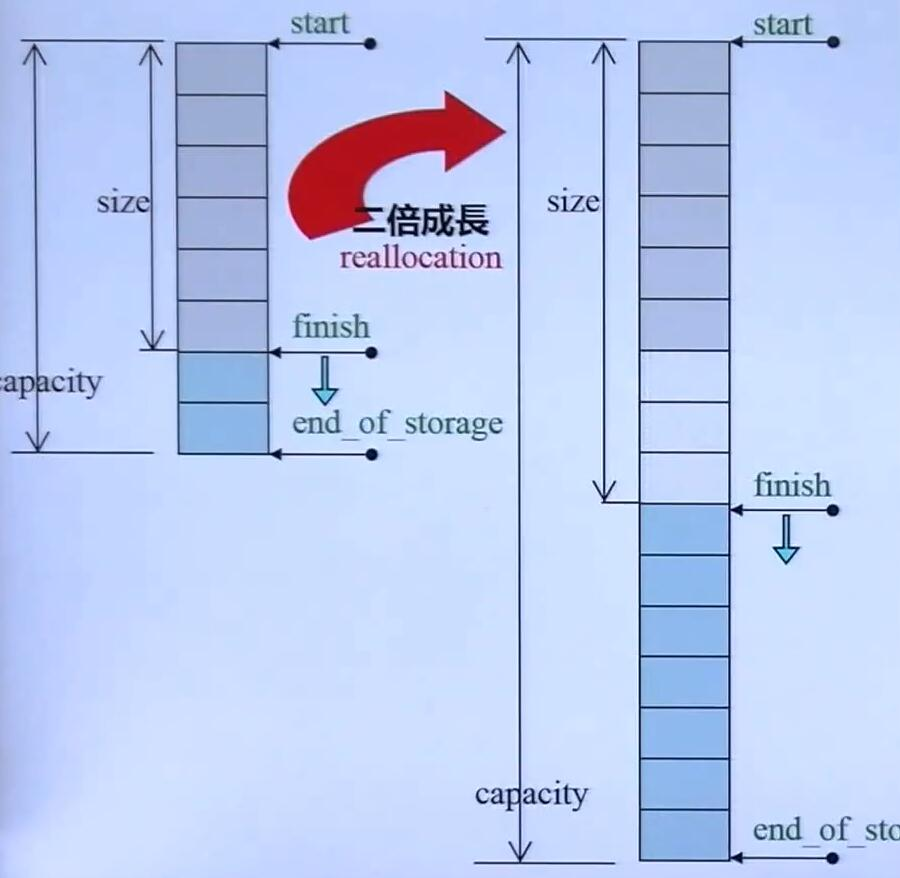

GC2.9

```c++
template<class T, class Alloc = alloc>
class vector{
    public:
        typedef T   value_type;
        typedef value_type* iterator; // T*
        // 这里迭代器类型就是普通的指针，non-class iterator
        typedef value_type& reference;
        typedef size_t  size_type;
    protected:
        iterator start;
        iterator finish;
        iterator end_of_storage;
    public:
        // begin和end是前闭后开区间
        iterator begin(){return start;}
        ietrator end(){return finish;}
        size_type size() const
        {return size_type(end()-begin());}
        size_type capacity()const
        {return size_type(end_of_storage-begin());}
        bool empty() const {return begin() ==end();}
        reference operator[](size_type n)
        {return *(begin()+n);}
        reference front() {return *begin();}
        reference back(){return *(end()-1);}
}

// push_back
void push_back(const T&x){
    if(finish != end_of_storage){ //还有备用空间
        construct(finish,x); //全局函数
        ++finish; //指针下移动 
    }
}else{
    //没有备用空间了
    insert_aux(end(),x);
}

template<class T,class Alloc>
void vector<T,Alloc>::insert_aux(iterator position, const T& x)
{
    if(finish !=end_of_storage){
        //还有备用空间
        //在备用空间(finish指针下一个空的空间)
        /*
        这里这个地方这么些，是因为 insert_aux还可能被 insert函数
        调用，所有有一个把所有的元素
        往后搬的操作
        */
        construct(finish,*(finish-1));
        ++finish;
        T x_copy = x;
        copy_backward(position,finish-2,finish-1); 
        // 个人推测这里就是把position之后的元素往后搬一格
        //腾出 position的位置,这个函数应该是insert的实现。
        *position = x_copy;
    }else{
        //如果空间不够，vector需要进行扩容
        const size_type old_size = size();
        const size_type len = old_size !=0 ? 2*old_size : 1;
        // 以上的分配原则如果大小是0设为1
        //如果原大小不为0，分配为原大小的2倍
        //前半段用来放置旧的数据后半段放新数据
        //扩容的标准，不同编译器实现不同
        iterator new_start = data_allocator::allocate(len);// realloc
        iterator new_finish = new_start;
        try{
            new_finish = uninitialized_copy(start,position,new_start);
            //前闭后开把 [start,position)的元素，也就是前半段元素进行复制
            construct(new_finish,x);//将x填充到position位置
            ++new_finish;
            //复制原vector,的[position,end)的内容
            new_finish = uninitialized_copy(position,finish,new_finish);

            //这里为什么会复制前半段，和后半段？
            //如前所述，这个函数可能被insert调用的
            //其实push_back可以看成insert的特殊形式。
            //push_back(value)等价于insert(end(),value)
        }catch(...){
            destory(new_start,new_finish);
            data_allocator::deallocate)new_start,len);
            throw;
        }
        //析构并释放原来的vector
        destory(begin(),end());
        deallocate();
        //调整迭代器
        start = new_start;
        finish = new_finish;
        end_of_storage = new_start +len;
        //对于前闭后开区间，区间长度等于end-start。
    }
}
```

* 上述代码为GC2.9的实现，使用老版本的代码，是因为其实现比较简单，更能够让我们从中体会容器的原理，新版的代码使用了很多多重继承，代码不容易阅读
* 从vector的设计代码，我们可以知道，vector的扩容的代价是很大的，因为它要不断调用复制构造函数。
* 在使用vector的时候，一开始就指定一个合适的容量大小，减少其扩容的次数，显然对提升效率很有帮助(使用 `reverse`函数)
* 在C++11之后，可以通过move语义来减少上述开销
* vector的insert操作的复杂度应该是**O(n)**,因为插入一个元素，要搬动后面的元素，所以要减少在数组前进行insert操作，同时insert操作也有可能会诱发vector扩容。

## array

Array 和 内置的数组本质上没有区别，Array是对内置数组的包装，包装之后的array提供和其它容器一样的公共接口(比如 iterator)，这样array就可以使用算法，仿函数等其它标准库的部件了。

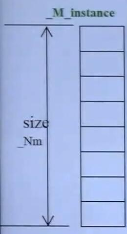

TR1版本的 array实现

```c++
template<typename _Tp, std::size_t _Nm>
struct array
{
    typedef _Tp value_type;
    typedef _Tp*  pointer;
    typedef value_type* iterator; 
    // array的迭代器类型就是 T* 是 non-class vector

    // support for zero-sized arrays mandatory
    value_type _M_instance[_Nm ? _Nm :1];
    iterator begin()
    {return iterator (&_M_instance[0]);}
    iterator end()
    {return iterator(&_M_instance[_Nm]);}
    ...
}

```

## forward_list  

forward_list就是单链表。因为forward_list是单链表，所以forward_list缺少很多接口，比如只有 `front` ,比如是在一个节点之后进行插入。这都和其单链表的特性相关。可以再看看forward_list的接口好好体会一下. 因为已经说了双链表list了所以forward_list不再缀述

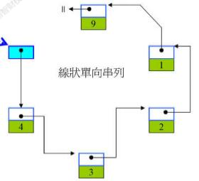
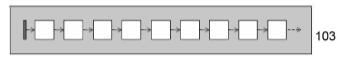


## deque

* deque是分段连续容器，它给使用者一种连续的感觉，但事实上只是**分段连续**的,一个buffer的数据是连续的，不同buffer的指针放在一个vector里。通过vector把buffer串接起来

* 对于push_back操作，如果尾部的 buffer没有满，那么直接放到尾部的buffer就可以了，如果尾部的buffer满了，那么重新申请一块buffer，将新的buffer作为新的尾部buffer，再把数据放进去(push_front同理)，所以deque可以实现双向扩充

* 其迭代器有四个变量，first 和 last (前闭后开)分别表示buffer的头尾，标识出了buffer的边界。node 标识了该buffer在 vector中的位置。cur指向buffer中的当前元素。

* deque的begin()返回start迭代器，end()返回finish迭代器

* 对于deque来说，中间的buffer(除了首尾的buffer) buffer都是**满的**

deque结构图:

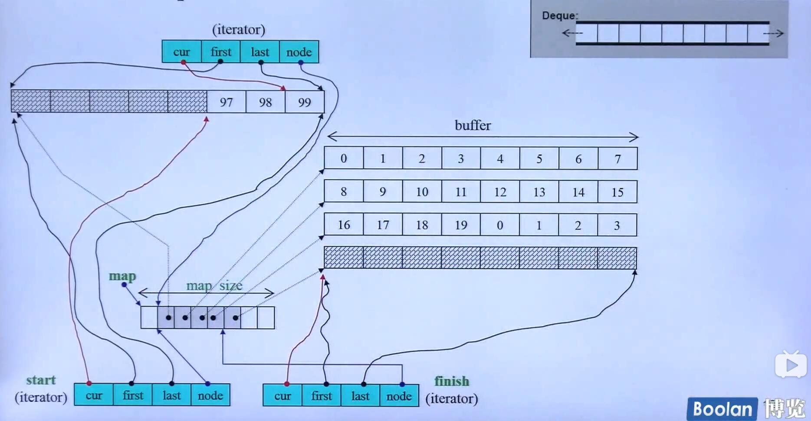

### deque 总体架构

GC2.9

```C++
template<class T, class Alloc =alloc , size_t BufSiz =0>
// buffer size 指的是每个buffer容纳的元素个数

class deque{
    public:
        typedef T value_type;
        typedef __deque_iterator<T,T&,T*,BufSiz> iterator; //迭代器对象
    protected:
        typedef pointer* map_pointer; // T**
    protected:
        iterator start;
        iterator finish;
        map_pointer map;  
        // map 就是把所有的buffer，都串起来的数组，
        //当map空间不够的时候会成长(和vector类似)
        size_type map_size;
    public:
        iterator begin() {return start;}
        iterator end() { return finish;}
        size_type size() const {return finish-start;}
}

//下面的操作依赖于迭代器的设计
reference operator[](size_type n)
{
    return start[differnce_type(n)];
}

reference front()
{return *start;}

reference back()
{
    iterator tmp = finish;
    --tmp;
    return *tmp;
}

size_type size() const
{
    return finish -start;
}

bool empty(0 const {
    return finish == start;
})
; 

// 和 BuffSiz 有关的函数， BuffSiz = 0 表示使用默认值

inline size_t __deque_buf_size(size_t n,size_t sz)
{
    return n !=0  ?  n : ( sz<512 ? size_t(512/sz):size_t(1))
    /*
     n 表示 buffer_size , sz表示一个元素的大小
     如果n不为0 表示 buffer_size由使用者指定。
     如果n为0采用默认值：
     如果元素大小 sz<512 返回 512/sz
     如果元素大小 sz>512 返回 1 
     这里的 512是字节
    */
}


```

### deque insert操作

```c++
// 在 position 处安插一个元素，其值为 x
iterator insert(iterator position, const value_type& x){
    if(position.cur == start.cur){
        //如果安插的点是deque的最前端
        //交给 push_front来做
        push_front(x);
        return start;
    }
    else if(position.cur == finish.cur)
    {
        //如果安插点是deque的最尾端
        //交给push_back来做
        push_back(x);
        iterator tmp = finish;
        --tmp;
        return tmp; // finish是最后一个元素的下一个
    }else{
        return insert_aux(position,x);
    }
}

template<class T, class Alloc, size_t BufSize>
//返回一个迭代器
typename deque<T,Alloc, BufSize>:: iterator
deque<T,Alloc,BufSize>::insert_aux(iterator pos , const value_type& x){
    difference_type index = pos-start; //获取position之前的元素个数
    value_type x_copy =x;
    if(index < size() /2){
        //如果安插点之前的元素个数较少
        //将节点往前推
        push_front(front());
        ...
        copy_forward(front2,pos1,front1) //把元素往前搬
    }
    else{
        //如果position之后的元素个数较少
        //就将节点往后搬
        push_back(back());
        ...
        copy_backward(pos,back2,back1);//将元素往后搬动
    }
    *pos = x_copy;// 设定新值
    return pos;
}
```

**deque**聪明的地方在于，由于deque的buffer机制，元素既可以往前搬也可以往后搬，在insert一个元素的时候，如果它离头比较近就往前搬，反之往后搬动，从而**最小化**搬动元素的次数

### deque迭代器

```c++
// 迭代器
template <class T, class Ref , class Ptr,size_t BuffSiz >
struct __deque_iterator{
    typedef random_access_iterator_tag iterator_catagory //(1) 支持随机访问 
    typedef T value_type;
    typedef Ptr pointer;
    typedef Ref reference;
    typedef size_t size_type;
    typedef ptrdiff_t  difference_type;
    typedef T** map_pointer ;
    typedef __deque_iterator self;

    T* cur;
    T* first;
    T* last;
    map_pointer node;
    ...
}

reference operator*() const
{return *cur; //返回data的引用}

pointer operator->()const
{return &(operator*());}

//计算 iterators之间的距离

/*
两个 iterators之间的距离: itr - x;
(1)两个iterators之间的 buffer(不包含两个迭代器本身所在的buffer)
也就是代码中的 (buffer_size()) * (node-x.node-1) 
注意 node-x.node-1是指针减法
(2) itr所在的buffer内，itr至该buffer开头的长度
也就是末尾的那一小段buffer的长度
代码中表现为: cur-first
(3) x所在的buffer内，x至该buffer末尾的长度
也就是开头的那一小段buffer的长度
代码中表现为: x.last-x.cur
*/
difference_type
operator-(const self& x)const
{
    return difference_type(buffer_size()) * (node-x.node-1) + (cur-first)+(x.last-x.cur);
}

// 通过下面的这些函数让使用者感受不到
//deque的分段，给使用者deque是连续的错觉

self& oeprator++(){
    ++cur;    //移到下一个元素
    if(cur==last){ //如果到达缓冲区尾端
        set_node(node+1); 
        //跳到下一个缓冲区的起点
        cur = first; 
    }
    return *this;
}
self oeprator++(int){
    self tmp = *this;
    ++*this;   // 利用 前++ 
    return tmp; //返回 迭代器对象
}

self& oeprator--(){
    // -- 和 ++ 不同 --要一开始就判断,
    // 产生区别的原因是 前闭后开区间
    if(cur == first){
        // 如果目前在缓冲区开头
        // 就跳到前一个缓冲区的最末端
        set_node(node-1); //
        cur = last;
    }
    --cur;
    return *this;
}

self oeprator--(int){
    self tmp = *this;
    --*this;   // 利用 前++ 
    return tmp; //返回 迭代器对象
}

void set_node(map_pointer new_node ){
    node = new_node ;
    first = *new_node; // new_node的内容本事就是 buffer的首地址
    last = first + difference_type(buffer_size());
}

self& oeprator+=(difference_type n){
    difference_type offset = n +(cur-first);
    if(offset >=0 && offset< difference_type(buffer_size())){
        // 如果目标位置在同一 buffer内
        cur +=n;
    }else{
        // 目标不再统一缓冲区内
        difference_type node_offset =
        offset >0 ? offset/difference_type(buffer_size()) 
        : -difference_type((-offset-1) / buffer_size() ) -1;

        // 切换到正确的缓冲区
        set_node(node + node_offset);
        // 切换到正确的元素
        cur = first+(offset - node_offset* difference_type(buffer_size()));
        return *this;
    }
}

self operator+(difference_type n) const{
    self tmp = *this;
    return tmp+= n;
}

self& operator-=(difference_type n ){
    return *this += -n;
}

self operator-(difference_type n)const
{
    self tmp = *this;
    return tmp-= n;
}
reference operator[](difference_type n)const
{
    return *(*this+n);
}

```

### queue 和 stack

* 事实上 stack 和 queue 是一种 adapter。 默认情况下，stack和 queue选择 deque作为其底层容器。queue/stack 也可以使用 list 作为底层容器。
* stack 和 queue 不允许遍历，也不提供 iterator。
* stack 可以选择 vector作为底层结构, 而 queue不能选择 vector 作为底层结构。
* stack 和 queue 都不能选择 set 或者 map 作为底层容器
