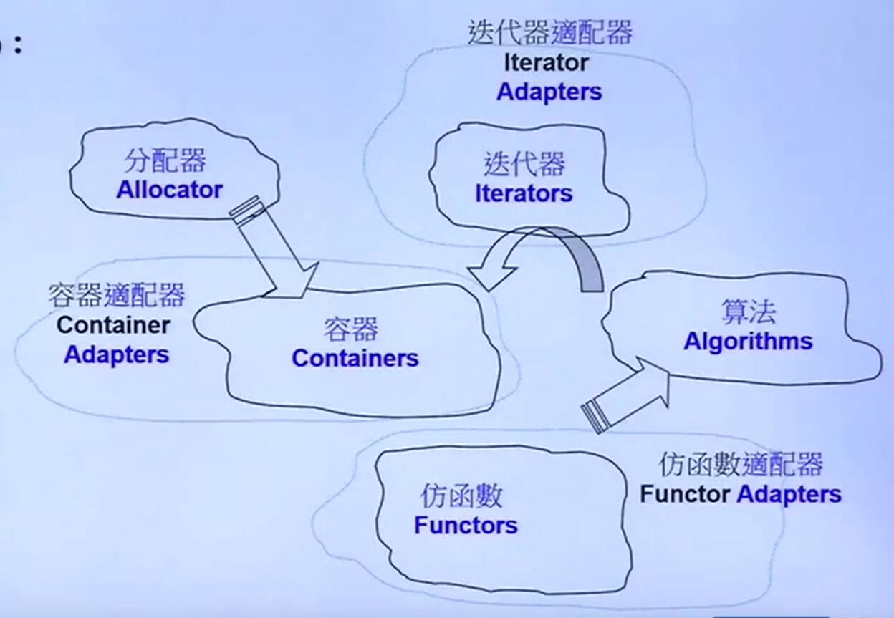
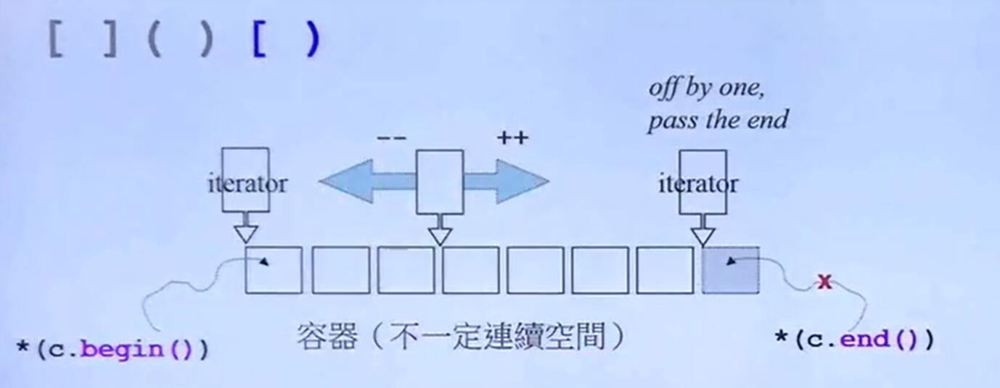
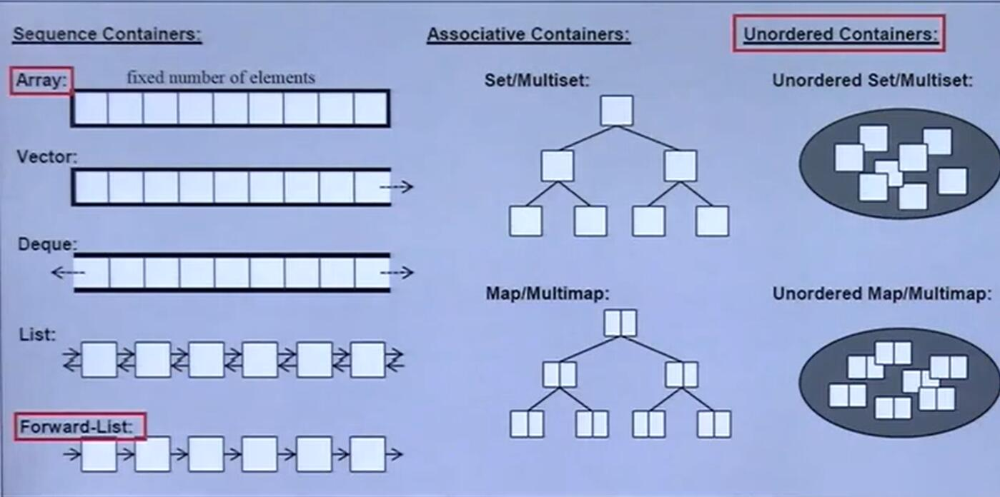

# C++ STL 和 泛型编程

## 使用C++标准库

### STL六大组件

* 容器(Containers)
* 分配器(Allocations)
* 算法(Algorithms)
* 迭代器(Iterators)
* 适配器(Adapters)
* 仿函式(Functors)



example:

```c++
#include<vector>
#include<algorithm>
#include<functional>
##include<iostream>

using namespace std;

int main(){
    int ia[6] = { 27,210,12,47,109,83};
    vector<int , allocator<int>> vi(ia,ia+6);
    cout<< count_if(vi.begin(),vi.end(),
    not1( bind2nd( less<int>(),40 ) ) );

    // vector :容器
    // allocator<int>  分配器
    // count_if 算法
    // vi.begin(),vi.end() 迭代器
    // not1 , bind2nd 适配器
    // less<int>  仿函数 
}
```

#### 前闭后开区间

c++ 里 STL 的迭代器的 `begin()` 和 `end()`都是采用前闭后开的模式，也就是说`.begin()`是容器的第一个元素，`.end()`是容器最后一个元素的下一个元素



容器遍历(使用 迭代器):

```c++
Container<T> c;

Container<T>:::iterator ite = c.begin();
for( ; ite != c.end(); itr++){
    ...
}

// 容器遍历也可以用 range-base语法

for(decl:coll){
    statement;
}

vector<double> vec;
for(auto elem : vec){
    cout<<elem<<" ";
}
```

### 容器的结构与分类



* multiset/multimap 表示元素内容(key)是可以重复，set/map的key只能有一个值。

* Unordered 容器底层是 hash table(散列表)

### 顺序型容器接口表

下面以表格的形式列出顺序形容器拥有的接口，对于不同类的名称相同的接口行为类似。具体的需要查询API，这里谨以表格的形式对结构进行总结。

Element access:

|  接口(都是函数) | **array** |**vector**|**deque**|**list**|**forward-list**| 接口描述
|:----: |:----: |:----: |:----: |:----: |:----: |:---- | 
| **at**|  yes  |    yes   |     yes |       |       | 根据下标取元素(返回值一般是一个引用`coll.at(5)`
| **operator[]**| yes   |   yes    |    yes   |       |       | 重载了索引操作符， `coll[5]`
|  **front** | yes      |     yes  |      yes |  yes     |  yes     | 获取第一个元素。 `coll.front()` (返回的一般是引用)
| **back** | yes        |    yes   |    yes   |  yes     |       | 获取最后一个元素 `coll.back()` (返回的一般是引用)
| **data** | yes        |    yes   |      |       |       | 直接接触底层(underline)的数组 ,返回一个指针(T*),比如 `array<int,3> a{1,2,3}; a.data()返回一个 int*`
Iterators:

|  接口(都是函数) | **array** |**vector**|**deque**|**list**|**forward-list**| 接口描述
|:----: |:----: |:----: |:----: |:----: |:----: |:---- |
|**begin** | yes|     yes  |    yes   |    yes   |  yes     | 返回指向第一个元素的迭代器(正向也就是从下标 0 开始) `coll.begin(0`)
| **end** |  yes   |     yes  |   yes    |  yes     |   yes    | 返回指向结尾的迭代器`coll.end()` 上面说过 STL 采用前开后闭的方式，end指向最后一个元素的下一个位置
| **cbegin**|  yes |  yes     |   yes    |   yes    |    yes   |  返回类型为 const（内容不能修改） 的指向开头的迭代器。`coll.cbegin()`
| **cend**|  yes   |  yes     |   yes    |  yes     |  yes     |   返回类型为 const 指向结尾的迭代器 `coll.end()`
| **rbegin**|  yes |  yes     |   yes    |   yes    |       | 返回指向第一个元素的迭代器(逆向，也就是 rbegin指向最后一个元素，每次 rbegin++就往前移) `auto itr = coll.rbegin()`
| **rend**|   yes  |   yes    |   yes    |    yes   |       | 返回指向结尾(逆向）的迭代器  `coll.rend()`
| **crbegin**| yes  |   yes    |   yes    |    yes   |       |  返回类型为 const（内容不能修改） 的指向开头(逆向)的迭代器。`auto itr = coll.crbegin()`
| **crend**|  yes  |   yes    |   yes    |    yes   |       | 回类型为 const 指向结尾(逆向)的迭代器 `coll.crend()`
| **before_begin**|   |      |    |      |     yes  |  返回一个指向begin前面的元素的迭代器
| **cbefore_begin**|    |      |      |      |   yes    | before_begin的 const版本


Capacity:

|  接口(都是函数) | **array** |**vector**|**deque**|**list**|**forward-list**| 接口描述
|:----: |:----: |:----: |:----: |:----: |:----: |:---- |
| **empty**|  yes  |    yes   |    yes   |  yes     |     yes  |  判断容器是否为空 `bool isempty = coll.empty()`
| **size**|   yes  |    yes   |   yes    |  yes     |       |  获得容器元素个数 `int s = coll.size()`
| **capacity** |  |    yes   |       |       |       | 返回当前容器能够存放的最大元素个数，由于vector 内存分配的特性和vector能够grow的特点，这个接口主要用在vector上。
Modifiers:


|  接口(都是函数) | **array** |**vector**|**deque**|**list**|**forward-list**| 接口描述
|:----: |:----: |:----: |:----: |:----: |:----: |:---- |
| **clear**|    |   yes    |   yes    |   yes    |   yes    | 清空容器的内容，`coll.clear()`
| **insert**|   |    yes   |   yes    |    yes   |  forward_list的版本是**insert_after**,同**insert**的区别在于，插入结果放在**指定的迭代器之后**其余接口相同。(原因是f_list是单向链表)     | 插入元素，这个函数常用的使用方法  1.在指定的迭代器位置插入元素`coll.insert(iter,value)` 2 插入一定个数的元素 `coll.instert(iter,count,value)`  3 通过 initializer_list插入元素其中 `coll.insert(itr,{v1,v2})` 其中 1 的结果返回指向插入元素的迭代器， 2,3返回插入的第一个元素的迭代器，如果initializer_list为空或者count =0,返回 pos的迭代器 。 insert实现了右值引用的版本，能提高对临时变量的插入效率.
| **emplace**|   |    yes   |   yes    |  yes     |  forward_list的版本是**emplace_after**,同**emplace**的区别在于，插入结果放在**指定的迭代器之后**其余接口相同。     | c++11之后，函数原型为 `iterator emplace(const_iterator, Args&&...args)` 通过右值引用的方式，在 指定的 pos(iter)，前插入一个元素, eg `coll.emplace(iter,value)`注意这里采用了右值引用，也就是说 value必须是一个右值或者 std::move(rvaluee)。其效率会比insert来得高
| **erase** |    |     yes  |  yes     |   yes    |  forward_list的版本是**erase_after**,同**erase**的区别在于，删除**指定迭代器之后**的元素，以及删除的范围变更为(first,last) | 删除指定位置的元素，有两种调用方式 1 删除指定位置的元素 `coll.erase(pos_iter)` 2 删除 [first,last)范围的元素 `coll.erase(first_iter,last_iter)` ,返回值 对于1 返回 删除位置元素的下一个元素的迭代器,如果 pos是最后一个返回 end(), 对于 2 返回last的迭代器，
| **push_back**|  |    yes   |  yes     |    yes   |       | 添加一个元素到容器末尾，`coll.push_back(value)` 注意 value可以是左值也可以是右值(采用右值引用的方式)
| **emplace_back**|       |    yes   |    yes   |   yes    |       | 函数原型 `void emplace_back(Args&& ...args)` ，上面的emplace的 push_back版本。在容器末尾添加一个元素
| **pop_back**|       |    yes   |    yes   |   yes    |       |  移除容器最后一个元素，**无返回值**
| **push_front**|     |       |    yes   |   yes    |   yes    | 把元素添加到容器的开头 `coll.push_front(value)`,其余同push_back
| **emplace_front**|   |       |  yes     |    yes   |   yes    | emplace的 push_front 版本，在容器开头添加一个元素
| **pop_front**|        |       |   yes   |   yes    |  yes      |  移除容器的第一个元素
| **swap** |      yes     |   yes    |       |   yes    |   yes    | 交换容器的内容 `coll1.swap(coll2)`
| **fill** |   yes |       |       |       |       | 用特定的值填充容器 
`coll.fill(value)`

**improtant** : 

* 部分容器在执行 insert/emplace , erase, 或者是 push等更改容器内容操作之后，其部分元素的迭代器会失效。**vector** 和 **deque** 影响很大，**list**和**forward_list**影响较小。

* 部分容器有 front操作 部分没有，这种现象的原因是由于不同的容器底层的数据结构不同，在这里不加缀述，简要版本可以看上面那张图。


其它操作表:
(我认为常用的 不全)
  接口(都是函数) | **list**|**forward-list**| 接口描述
|:----: |:----: |:----: |:---- | 
| **merge** | yes   |    yes  |       合并两个排好序的链表 1 ，不指定比较函数 `list.merge(other_list)`  2 指定比较函数对象，比较函数的签名为 `bool cmp(const Type& a, const Type2& b)` `list.merge(other_list,cmp)` cmp可以是函数指针或者 function-like-class。
| **reverse** | yes   |    yes  |    反转链表， `list.reverse()`
| **sort** | yes   | yes     |     对链表的元素进行排序(复杂度 NlogN),可以指定比较函数，或者不指定比较函数。(比较函数同 merge)  `list.sort()` `list.sort(cmp)`

### 关联容器接口表(一)

没有给出描述的说明和顺序性容器接口相同，功能类似

Element access:

|  接口(都是函数) | **map** | 接口描述
|:----: |:----: |:---- |
|**oeprator[]**| yes  |函数原型`T& operator[](const Key* key)`。返回指定key的元素所携带的值的引用。如果指定key不存在那么执行插入操作 `coll[key] =value`可以像用python的字典一样使用map了
|**at**| yes | 回指定key的元素所携带的值的引用。如果元素不存在**抛出异常。**
iterators

|**接口(都是函数)**|set|multiset|map|multimap|接口描述
|:-----:|:-----:|:-----:|:-----:|:-----:|:-----|
| **begin** |   yes    |  yes   |  yes   | yes     | 对于set 型容器，不管是 `begin()`还是`cbegin()`返回的迭代器都是 const 迭代器，即无法通过迭代器修改set的元素(其余的 rbegin也同理)。 map型迭代器可以修改值，但不能修改key 。  
| **cbegin** |   yes   |   yes  |   yes  |  yes    |       
| **end** |   yes   |   yes  |  yes   |  yes   |       
| **cend**|    yes  |  yes   |  yes   |   yes   |       
| **rbegin**|  yes  |   yes  |  yes   |  yes    |       
| **crbegin**|  yes |  yes   |  yes   |   yes   |       
| **rend**|     yes |  yes   |  yes   |   yes   |       
| **crend**|     yes    | yes    |   yes  |  yes    |       

capacity

|**接口(都是函数)**|set|unordered_set|map|unordered_map|接口描述
|:-----:|:-----:|:-----:|:-----:|:-----:|:-----|
| **empty** |   yes    | yes    | yes    |   yes   |      
| **size** |   yes   |   yes  |  yes   |    yes  |       

Modifiers

ps:只给出常见操作的接口，部分接口没有给出，如有必要以后补上，还请查找详细的API

|**接口(都是函数)**|set|unordered_set|map|unordered_map|接口描述
|:-----:|:-----:|:-----:|:-----:|:-----:|:-----|
| **clear** |   yes    |   yes  |  yes   |   yes   |      
| **insert** |    yes  |   yes  |  yes  |   yes   | 插入元素(set是key,map是key和value的组合),或者节点。插入值的方式有 **1.** 直接插入值 `coll.insert(value)` **2.** 提供一个hint迭代器，让其尽量在hint附近插入，如果hint给定得当可以提升插入的速度  `coll.instert(hint_iter,value)` **3** 通过 initializer_list进行插入 `coll.insert({value1,value2})` **返回值** : 对于**非multi**容器: 对于 **1** 返回 一个 std::pair， pari.first 是插入元素的迭代器(成功)，或者阻止其插入元素的迭代器, pair.second 插入是否成功，成功为 false 。对于 **2** 返回插入元素的迭代器，或者阻止其插入的元素的迭代器。对于**3**无返回值。 对于 **multi**容器 1,2返回插入元素的迭代器(multi容器允许多个key),3无返回值
|**insert_or_assign**| |         | yes |      | 插入一个元素，如果元素存在就把值赋值给当前存在的元素。 有两种方式 1. 直接插入 `coll.insert_or_assign(key,value)` 2 指定 hint `coll.insert_or_assign(hint_iter,key,value)` 返回值同insert(set版本)的 无hint 和带hint版本
| **emplace** |  yes    |   yes  |   yes  |  yes    |  函数原型(非multi)为 `std::pair<iterator,bool> emplace( Args&&... args );`,插入**一个**元素并防止必要的copy，对于**非multi**返回值是 pair。pair的内容和 insert部分相同。 eg：`coll.emplace`(value); 对于**multi**返回值是插入元素的迭代器。
| **emplace_hint**|   yes   |  yes   |  yes   | yes     |   函数原型(非multi)为 `iterator emplace_hint( const_iterator hint, Args&&... args );` 给定一个迭代器 hint,让其尽量插入到hint之前，采用emplace能够防止不必要的copy(采用右值引用)如果hint得当能够提升插入的速度(反之会降低插入速度，使用hint需要对容器的底层有深入的了解)。对于**非multi** 返回值同 insert的hint版本。对于**multi**返回值是插入元素的迭代器
| **try_emplace**|    |     |    yes     |     | 如果key不存在执行插入操作如果key存在什么都不做。 `coll.emplace(key,value)` (用法和返回值和emplace类似),
| **erase**|   yes |   yes  |  yes   |   yes   |  删除元素 有3种使用方法 **1**通过迭代器删 `coll.erase(iter)` **2** 通过**key**删 coll.erase(key) **3** 删除范围[first,last)的元素，`coll.erase(first_iter,last_iter)`.返回值：对于**1，3**返回最后一个被删除元素下一个元素的迭代器。对于 **2** 返回被删除元素的个数。
| **swap**| yes  |  yes   |  yes   |  yes    |       


Lookup:


|**接口(都是函数)**|set|unordered_set|map|unordered_map|接口描述
|:-----:|:-----:|:-----:|:-----:|:-----:|:-----|
| **count** |    yes   |  yes   |   yes  |  yes    |   返回匹配给定key的数目，对于非multi类型容器，所以返回值为 0 或者 1 `coll.count(key)`
| **find** |   yes   |  yes   |  yes   |  yes    |    给定key，找到key于给定key相等的元素。如果找到返回该元素的迭代器，否则否则返回 end()迭代器。 `auto iter= coll.find(key)`   
| **contains** |  yes    |  yes   |  yes   |   yes   |    判断在容器中是否有元素的key等于给定的key,如果存在返回 true，否则返回 false `coll.find(key)`  
| **equal_range**|  yes    |   yes  | yes    |   yes   |  给定key，在容器中查找和给定key相等的所有元素。 返回值 `std::pair<iterator,iteratoe>` pari.first 是 lower_bound()的返回值, pair.second是 upper_bound()的返回值 (lower_bound,和upper_bound是左开右闭的关系)
| **lower_bound**|   yes |  yes   |   yes  |  yes    |   返回**第一个**不小于(>=)给定key的元素的迭代器。   `auto lower = coll.lower_bound(key)`
| **upper_bound**| yes   |  yes   |  yes   |   yes   |    返回**第一个**大于(>)给定key的元素的迭代器。   `auto upper = coll.upper_bound(key)`,也就是说 [lower_bound,upper_bound)是前开后闭的关系

