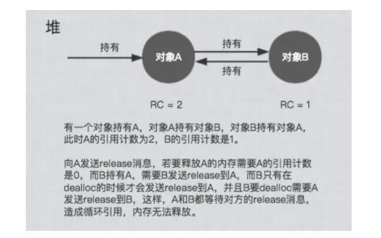
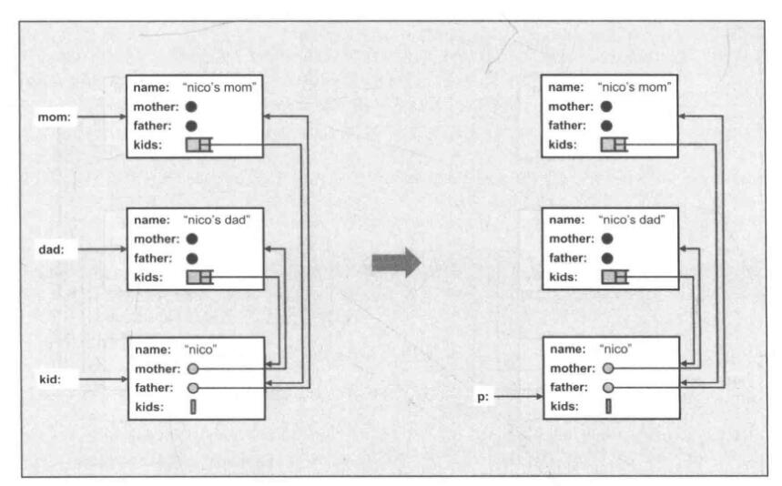
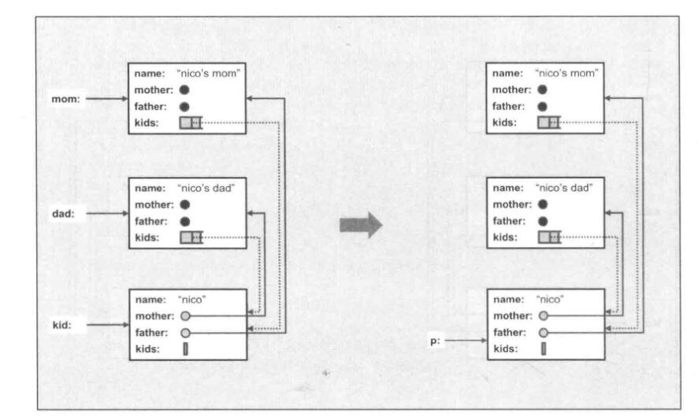
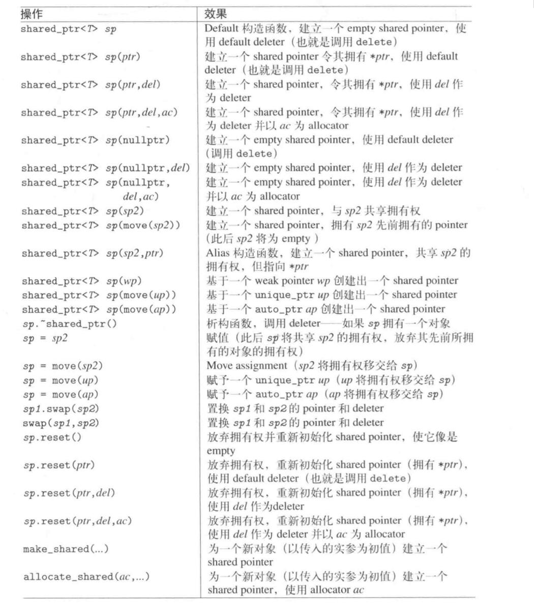
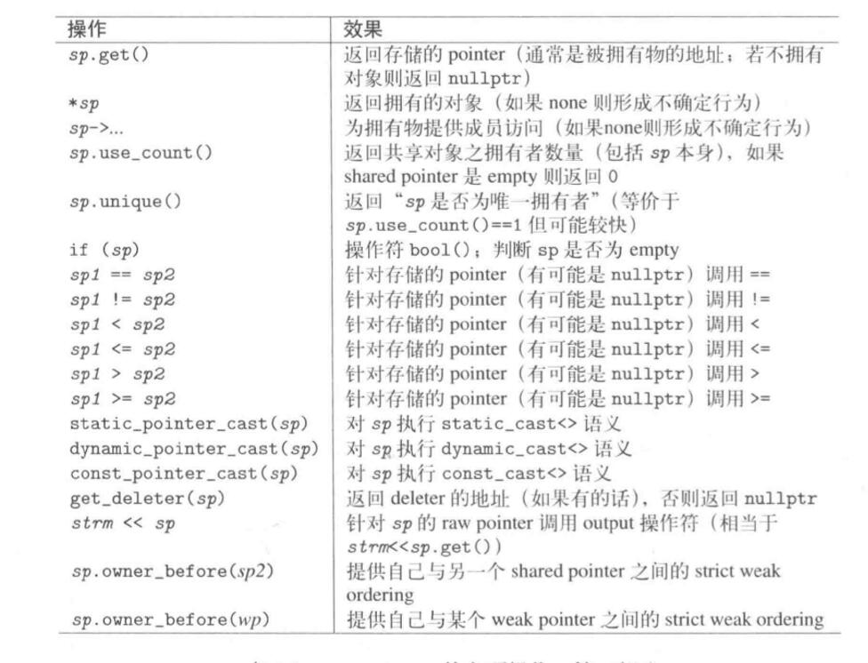
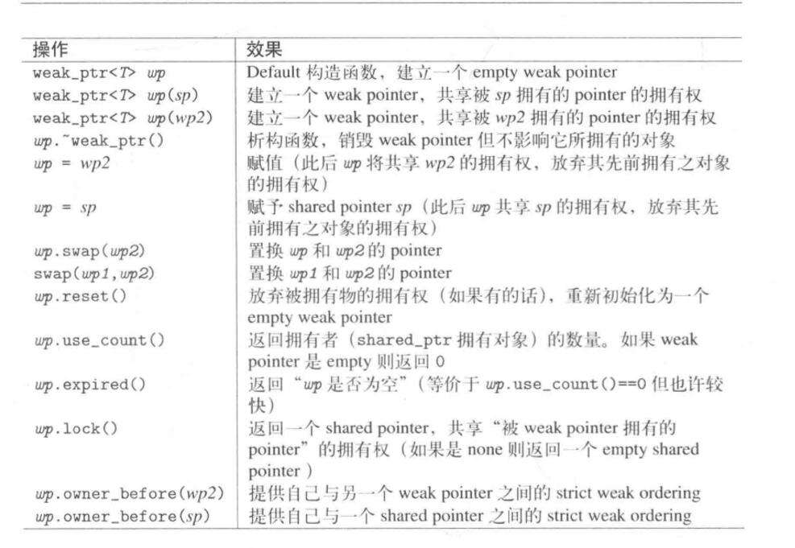

# C++11新特性——标准库篇

## 1. Rvalue reference 右值引用

> Rvalue references are a **new reference** type introduced in C++0x that help solve the porblem of **unnecessary copying** and enable **pefect forwarding**. When the **right-hand side** of an assignment is an **rvalue**, the the left-hand side object can **steal** resources from the right-hand side object **rather than** performing a separate allocation, thus enable **move semantics**
>

右值引用可以减少不必要的copy。当赋值操作的右手边是一个**右值**，可以**偷**右手边资源，而不需要非必要的拷贝。

### 1.1. 左值和右值

* **左值 Lvalue**: 可以出现在 **operator=** 的左边，也就是变量(也可以放在右边)
* **右值 Rvalue**: 只能出现在 **operator=** 的右侧。也就是**临时对象**，临时变量没有名字。

eg 1: 

```c++
    int a =9;
    int b =4;
    a = b; //ok
    a+b = 42 // error ,a+b是右值
```

eg2 :

```c++
int foo(){return 5;}
...
int x = foo() ; // ok x是左值
int* p = &foo(); //Error，之前对右值无法取地址
fool() =7;        // error ,右值无法赋值
```

### 1.2. 右值引用

右值引用可以减少不必要的copy。当赋值操作的右手边是一个**右值**，可以**偷**右手边资源，而不需要非必要的拷贝。

所谓的**偷**指的是指针的**浅拷贝**,直接进行指针赋值，进行**move**.

copy 操作 vs move 操作

 

在这种情况下为什么浅拷贝是被允许的?

* 临时变量本身不能够放在赋值符号的右边，所以临时变量被创建之后其内存里的内容不会被更改的，直接用指针指向临时变量的内存区域十分安全。
* 如果我们能够保证一个变量之后不再使用它，我们可以把左值当成右值(将使用移动构造函数).
  
  ```c++
    M c1(c);
    M c2(std::move(c1));
      c1.swap(c2);
    // 必须要保证 之后不再继续使用 c1
  ```

### 1.3. 右值引用语法

```c++
iterator
insert(const_iterator __position, const value_type& x); //普通引用

iterator
insert(const_iterator __position, value_type&& __x); // 右值引用的语法， x是一个临时变量 或者 使用了 std::move

```

#### 1.3.1. 右值引用的问题 unperfect forward

```c++
void process(int & i){
  cout<<"process(int&):"<<i<<endl;
}
void process(int && i){
  cout<<"process(int&&):"<<i<<endl;
}

void forward(int && i){
  cout<<"fowrard(int &&):"<<i<<",";
  process(i);
}

int a =0; 
porcess(a);// 调用 process(int &)
process(1)   // 调用 process(int &&)
process(move(a)); //调用 process(int &&)
fworard(2) ; // fworard(int&&):2, process(int&):2
fworard(move(a)) ; // fworard(int&&):0, process(int&):0
```

如上所述，RValue 经过 forward 再调用两外一个函数就变成了 LValue，原因是经过第一次 forward函数之后，原本的RValue有了参数名称，变成了左值(named object)，所以在forward内部调用了左值的版本.

#### 1.3.2. Perfect Forwarding

> **Perfect forwarding** allows you to write a single function template that takes n arbitrary arguments and forwrds them **transparentlly** to **another arbitrary function**. The **nature** of the argument(modifiable,const,lvalue or **rvalue**) is preserved in this forwarding process
>

通过标准库提供的 std::forward实现 perfect forward

eg:

```c++
template<typename T1, typename T2>
void function A(T1&& t1, T2 && t2)
{
  functionB(std::forward<T1>(t1), std::forward<T2>(t2));
}

```

### 1.4. move-aware class

eg:

```c++
class MyString
{
  private :
    char* _data;
    size_t _len;
    void __init_data(const char*s){
      _data = new char[_len+1];
      memcpy(_data,s,_len);
      _data[_len] ='\0';
    }
  public:
  //default constructor
  MyString():_data(NULL),_len(0){}
  // constructor
  MyString(const char* p):_len(strlen(p)){
    _init_data(p);
  }
  // copy constructor
  MyString(const MyString & str):_len(str._len){
    _init_data(str.data);
  }
  // move constructor 。移动构造函数必须加上 nonexcept 关键字
  MyString(MyString&& str) noexcept
  :_data(str._data), _len(str._len){
    // 上面的指针赋值是一个浅拷贝
    str._len =0; 
    str._data = NULL ; 
    //一定把原指针设成NULL
    // 否则可能导致临时变量销毁的时候
    //其析构函数把内存空间也销毁了， 
    //这不是我们想要的
    //设置成NULL要配合析构函数，判断
    //指针是不是NULL再delete
  }

  // copy assignment 
  MyString& operator= ( const MyString& str){
    if( this != &str){
      if(_data) delete _data; // 不是空指针才 delete
      len = str._len;
      _init_data(str.data); //COPY
    }else{

    }
    return *this
  }

  //move assignment
  MyString& operator=(MyString&& str) noexcept{
    // 先判断是不是自我赋值
    if(this !=&str){
      // 判断空然后释放原有的空间
      if(_data) delete _data; 
      _len = str._len;
      _data = str._data; //MOVE，浅拷贝
      // 下面部分同 move ctor，很重要
      str._len =0;
      str._data =NULL; //配合析构函数,重要
    }else{}
    return *this;
  }

  // dtor
  virtual ~MyString(){
    ++Dtor;
    if(_data){
      delete _data;
    }
  }
}
```

在移动复制构造函数里的NULL，就是下面这张图中的红叉
 

ps : move ctor 对 vector的 insert 影响很大(因为在 vector 容器中，是一个节点一个节点存在的)对link_list等容器的影响较小。 先插个桩，待深入研究..。

## 2. 容器array

Array 就是把 C++ 自带的数组封装成一个类，使得其拥有c++ STL 的接口，`.begin()`,`.end()`... 其本质上就是c++自身的数组。 

可能的实现(TR1)

```C++
template<typename _Tp, std::size_t _Nm>
struct array
{
  typedef _Tp    value_type;
  typedef _Tp*   pointer;
  typedef value_type* iterator;  // 这里的 iterator是 navie pointer

  // Support for zero-sized arrays madatory
  value_type _M_instance[_Nm? _Nm:1];
  
  iterator begin()
  {return iterator(&_M_instanck[0]);}
  iterator end()
  {return iterator(&_M_instance[_Nm];)}
}
```

具体的API和很多容器的通用 API 相同，若感兴趣请查询(日后有时间再打上去吧): https://en.cppreference.com/w/cpp/container/array

example1:

```c++

#include <string>
#include <iterator>
#include <iostream>
#include <algorithm>
#include <array>
 
int main()
{
    // construction uses aggregate initialization
    std::array<int, 3> a1{ {1, 2, 3} }; // double-braces required in C++11 prior to the CWG 1270 revision
                                        // (not needed in C++11 after the revision and in C++14 and beyond)
    std::array<int, 3> a2 = {1, 2, 3};  // never required after =
    std::array<std::string, 2> a3 = { std::string("a"), "b" };
 
    // container operations are supported
    std::sort(a1.begin(), a1.end());
    std::reverse_copy(a2.begin(), a2.end(), 
                      std::ostream_iterator<int>(std::cout, " "));
 
    std::cout << '\n';
 
    // ranged for loop is supported
    for(const auto& s: a3)
        std::cout << s << ' ';
}
/* output
3 2 1 
a b 
*/
```

example: (2维数组)

```c++ 
#include <string>
#include <iterator>
#include <iostream>
#include <algorithm>
#include <array>
using namespace std;
int main()
{
    // construction uses aggregate initialization
    array<std::array<int,3>,2> a {array<int,3>{1,2,3},array<int,3>{4,5,6}};
    for(const auto& line : a){
        for(const int& e : line ){
            cout<<e<<" ";
        }
       cout<<endl;
    }
}

/* 
output:
1 2 3 
4 5 6

```

array 有着内置数组的效率同时还有着STL的接口..

## 3. hashtable

STL里很多 unordered 容器底层是 hashtable 支撑。


ps : 当元素的个数>篮子的个数 就扩充篮子的数目，扩充规则是 >2*目前篮子数的素数。(这块可以再复习一下 数据结构的 hash 表，先插个桩不详细说)，使用 hashtable 必须指定 hashfunction

### 3.1. unordered 容器 和 hash functions

STL提供了很多基本类型的 hash函数，该hash接受一个该类型的变量，返回值为 size_t类型，根据hash函数的定义，不同的输入产生的 hash值相同的概率应该很小

STL的 hash 函数是一个 template function-like class ,重载了 oeprator()方法
```c++
template<> struct hash<bool>;
template<> struct hash<char>;
template<> struct hash<signed char>;
template<> struct hash<unsigned char>;
template<> struct hash<char8_t>;        // C++20
template<> struct hash<char16_t>;
template<> struct hash<char32_t>;
template<> struct hash<wchar_t>;
template<> struct hash<short>;
template<> struct hash<unsigned short>;
template<> struct hash<int>;
template<> struct hash<unsigned int>;
template<> struct hash<long>;
template<> struct hash<long long>;
template<> struct hash<unsigned long>;
template<> struct hash<unsigned long long>;
template<> struct hash<float>;
template<> struct hash<double>;
template<> struct hash<long double>;
template<> struct hash<std::nullptr_t>; // C++17
template< class T > struct hash<T*>;

// 部分 STL

std::hash<std::string>  // (C++11)
std::hash<std::u8string>  //(C++20)
std::hash<std::u16string>  //(C++11)
std::hash<std::u32string>  // (C++11)
std::hash<std::wstring>   //  (C++11)

// 使用 hash 

 std::string str = "Meet the new boss...";
    std::size_t str_hash = std::hash<std::string>{}(str);

// ps 这里的 hash<std::string>{}表示
//初始化一个 hash类，(采用 uniform inilization )如前所述 hash 是
//一个 function-like class

   std::size_t int_hash = std::hash<int>{}(1024);
    std::cout << "hash(" << 1024 << ") = " << int_hash << '\n';
```

output:

```c++
hash("Meet the new boss...") = 10656026664466977650
hash(1024) = 1024

```

#### 3.1.1. 万用 Hash Function

如果要更进一步地使用 unordered 容器，有必要进一步的为自己的类写一个 hash function(特化 hash 类)。先提供一种万用Hash Function 的思路 

任何的类的数据都可以分解为基础类型，而每一中基础类型都有它们自己的 hash function，因此一种思路就是把这些基本类型的hash值 组合起来。 

正式开始:

为 Customer 写 Hash Function

```c++

// 整体框架

//方式1:
#include<fucntional>
class Customer{
  ...
};

class CustomerHash
{
  public:
  std::size_t operator()(const Customenr& c)const
  {
    return ...
  }
}

// CustomerHash 是一个函数对象
unordered_set<Customer,CustomerHash> custset;

//方式 2：7
namespace std
{
  //在 命名空间 std内对 hash类进行偏特化
template<>
struct hash<Customer>
{
  size_t oeprator()
  (const MyString& s)const noexcept
  {.......}
}
}

//方式3 使用函数指针
size_t customer_hash_func(const Customer& c){
  .....
}
// 函数指针的类型可以使用 decltype获得
//使用
unordered_set<Customer, size_t(*)(const Customer&)>
custset(20,customer_hash_func)
```

现在的问题是如和实现 CustomerHash

一种可能的实现:

```c++
class CustomerHash {
  public :
    std::size_t operator() (const Customer & c) const{
      return std::hash<sud::string>()(c.fname) 
      + std::hash<sud::string>c.lname()
      + std::hash<sud::string>c.lname()
      // 这种方法太简单了
    }
}

```

用C++11 variadic_template 实现一种万用hash 

```c++
using namespace std;
class CustomerHash{
  public:
    size_t operator()
    (const Customer &c) const{
      return hash_val(c.fname,c.lname,c.no); // hash_val就是万用散列
    }
}

// func1 
template<typename...Types>
inline size_t hash_val(const Types& ...args){
  size_t seed =0;
  hash_val(seed,args...) // 调用 func2
  return seed;
}
// func2
template<typename T, typename...Types>
inline void hash_val(size_t& seed,const T& val, const Types& args){
  hash_combine(seed,val) ; // 叠加hash值修改seed,调用 func4
  hash_val(seed,args...)  //递归调用，对args剩下的进行处理
}

// func3 , 递归边界
template<typename T>
inline void hash_val(size_t & seed, const T& val){
  hash_combine(seed,val);
}
// func4
#include<functional>
template<typename T>
inline void hash_combine(size_t& seed,const T& val){
  seed ^= std::hash<int>{}(val) + 0x9e3779b9 +(seed<<6) + (seed>>2); 
  //对seed 根据基本值的 hash做混乱的处理
}

```

## 4. tuple,用例

```c++
// tuples
// create and initialize a tuple explicity
tuple<int, float, string> t1(41, 6.3, "nico");
cout << "tuple<int,float,string>,sizeof=" << sizeof(t1) << endl; //12

//iterate over elements
cout << "t1: " << get<0>(t1) << " " << get<1>(t1) << " " << get<2>(t1) << endl;
// careat tuple with make_tuple()
auto t2 = make_tuple(22, 44, "stacy");

// assign second value in t2 to t1
get<1>(t1) = get<1>(t2);  // get<1>是函数模板

if (t1 < t2) {
  // compares value for value
  cout << "t1<t2" << endl;
}
else {
  cout << "t1>=t2" << endl;
}
t1 = t2; // OK, assigns value for value

tuple<int, float, string> t3(77, 1.1, "more light");
int i1;
float f1;
string s1;
tie(i1, f1, s1) = t3; // assigns values of t to i f and s 

typedef tuple<int, float, string> TupleType;
cout << tuple_size<TupleType>::value << endl;    //元编程
tuple_element<1, TupleType>::type f2 = 1.0;

```

## 5. 智能指针

使用智能指针的可以解决

1. 垂悬指针(dangling pointer)问题。即当多个指针指向同一个对象，其中某一个指针析构的时候，将内存空间销毁。导致其它的指针指向了"意义不明"的内存区域
2. 内存泄漏(resource lack)。即当指针销毁的时候却没有释放其分配的内存。(或者也可以说分配的内存区域不在受程序员的掌控)

C++11 标准库提供了两大类型的 mart pointer(放在 momory头文件中 `#inlucde<memory>`)

1. Class shared_ptr (实现共享式拥有)
2. Class unique_ptr (实现独占式拥有，严格拥有) ps:C++11提出之后，原本的 auto_ptr不被推荐使用了，unique_ptr就是用来替代 auto_ptr的

### 5.1. Class shared_ptr

* 提供"当对象再也不使用时该对象本身也被删除的语义
* shared_Ptr 提供 **共享式**拥有的语义，也就是说，多个**shared_ptr**可以共享(拥有)同一个对象。最后一个拥有对象的**shared_ptr**有责任销毁对象，并清理和该对象有关的资源

#### 5.1.1. 使用 shared_ptr

#### 5.1.2. 正常使用

```c++
#include<iostream>
#include<memory>
#include<vector>
  using namespace std;
  /*
      初始化 shared_ptr
  */

  // shared_ptr的初始化,直接初始化
  shared_ptr<string> pNico(new string("nico"));  // 通过构造函数初始化 OK
  shared_ptr<string> pJutta{ new string("jutta") };  // 通过 initializer_list OK
  
  // shared_ptr<string> pJason = new string("jason")  // error shared_ptr 只有一个参数的默认构造函数设置关键词  	explicit
  
  shared_ptr<string> pTom = make_shared<string>("Tom"); // 推荐使用该方式，只使用一次分配

  // shared_ptr初始化，先声明再初始化
  shared_ptr<string> pJason;
  
  //pJason = new string("jason")    // error shared_ptr 不能赋值
  pJason.reset(new string("jason"));  // OK 通过 reset函数

  /*
    使用 shared_ptr,可以像使用其它 pointer 一样使用 shared_ptr
  */
  cout << "使用 shared_ptr" << endl;

  (*pNico)[0] = 'N';     //通过解引用获得指针所指向对象的引用
  pJutta->replace(0, 1, "N");  // 通过指针直接调用方法
  
  cout << "pNico: " << *pNico << endl;
  cout << "pJutta: " << *pJutta << endl;

  /*
    shared_ptr和容器
    由于 shared_ptr 有共享语义，在
    容器中多次插入同一个 shared_ptr,
    这些 shared_ptr将指向同一个对象，体现了共享语义
  */

  vector<shared_ptr<string>> whoMadeCoffee;
  whoMadeCoffee.push_back(pJutta);
  whoMadeCoffee.push_back(pJutta);
  whoMadeCoffee.push_back(pNico);
  whoMadeCoffee.push_back(pJutta);
  whoMadeCoffee.push_back(pNico);

  cout << "\n打印vector:" << endl;
  for (auto pstr : whoMadeCoffee) {
    cout << *pstr << endl;
  }
  cout << "打印指针的引用计数" << endl;
  cout << "pJutta：" << pJutta.use_count() << endl;

  cout << "修改pJutta所指向对象的值" << endl;
  *pJutta = "Mocolai";
  cout << "\n打印vector:" << endl;
  for (auto pstr : whoMadeCoffee) {
    cout << *pstr << endl;
  }

  /*
      shared_ptr 一些其它的特性
  */
  cout << endl;
  // swap  swaps the managed objects
  cout << "swap pJutta 和 pNico"<< endl;
  pJutta.swap(pNico);
  cout << *pJutta << " " << *pNico << endl;
  cout << "把 pJutta 的 指向对象重新设置为为 pNico指向的对象" << endl;
  pJutta.reset(pNico.get());
  cout << *pJutta << " " << *pNico << endl;

  /*
  上述代码输出结果:
  使用 shared_ptr
  pNico: Nico
  pJutta: Nutta

  打印vector:
  Nutta
  Nutta
  Nico
  Nutta
  Nico
  打印指针的引用计数
  pJutta：4
  修改pJutta所指向对象的值

  打印vector:
  Mocolai
  Mocolai
  Nico
  Mocolai
  Nico

  swap pJutta 和 pNico
  Nico Mocolai
  把 pJutta 的 指向对象重新设置为为 pNico指向的对象
  Mocolai Mocolai

  */

```

* 因为接收单一 pointer 作为唯一实参的构造函数加了 `explict`关键字，所以不能进行隐式转换，也就是不能 `shared_ptr<int> = new int`
* 初始化可以通过
  1. 构造函数   `shared_ptr<string> p(new string("hello"));`
  2. initializer_list `shared_ptr<string> p{new string("hello")};`
  3. make_shared   `shared_ptr<string> p = make_share<string>("hello");`,推荐使用 make_shared , 可以提升效率
  4. 先声明 shared_ptr ，然后再用 `reset()`函数给智能指针重新分配对象
* 使用 shared_ptr 可以像使用其它指针一样。可以使用解引用 `*`操作，和 `->`操作
* shared_ptr 维护了引用计数，可以用 `shared_ptr.use_count()`方法获取引用计数
* 在对象的最后一个指向对象的 shared_ptr被销毁，会将对象销毁
* 在对象的最后一个指向对象的 shared_ptr 转移拥有者(reset),设为空，对象会被销毁
* 可以将shared_ptr 放入容器中，放入容器中的 shared_ptr 遵循 **共享式**语义和引用计数规则
* 可以用 `swap`方法交换两个指针指向的对象。
* 可以用 `get`方法获取原始指针

#### 5.1.3. 自定义 delete函数

使用 shared_ptr的时候，可以声明自己的 deleter, 在 deleter中我们可以加入辅助信息，或者释放一些资源(比如文件等)

```c++
// 自定义的delete
template<typename T>
struct mydelete {
  void operator()(T* p) {

    // 注意 如果使用了 nullptr 判断语句不能写程 if(!p)
    if (p!=nullptr) {
      cout << "delete " << *p << endl;
      delete p;
    }
    else {
      cout << "null delete "  << endl;
    }
  }
};

// 偏特化 处理 数组的 delete
template<typename T>
struct mydelete<T[]> {
  void operator()(T* p) {

    // 注意 如果使用了 nullptr 判断语句不能写程 if(!p)
    if (p != nullptr) {
      cout << "delete[] "  << endl;
      delete p;
    }
    else {
      cout << "null delete " << endl;
    }
  }
};

void test_delete() {
  /*
    为 shared_ptr 自定义一个 deleter
    我们可以声明属于自己的 deleter,其中的一种函数原型为
    template< class Y, class Deleter >
        shared_ptr( Y* ptr, Deleter d );
  */

  // 使用 lambda表达式
  shared_ptr<string> pNico(new string("nico"),
    [](string* p) -> void {
    cout << "delete " << *p << endl;
    delete p;
  }
  );

  //使用 struct 函数对象
  {
    cout << "in to block" << endl;
    shared_ptr<string> pJutta{ new string("jutta"),mydelete<string>() };
    shared_ptr<string> pJutta2{ pJutta };
    shared_ptr < string> null{ nullptr,mydelete<string>() };
    vector<shared_ptr<string>> v1;
    v1.push_back(pJutta);
    v1.push_back(pJutta2);
    vector<shared_ptr<string>> v2 = vector<shared_ptr<string>>();
    v1.swap(v2);
    cout << "out of block" << endl;
  }

}
/*
上述代码输出结果：
in to block
out of block
null delete
delete jutta
delete nico
*/
```

使用自己的 deleter的时候可以:

* 使用 Lambda表达式
* 使用 函数指针
* 使用函数对象(function-like class)
* 使用标准库提供的一些函数，比如为 `unique_ptr`提供的辅助函数`std::default_delete`

#### 5.1.4. shared_ptr 和 array

```c++
/*
    如果让 shared_ptr 配合 array 
    shared_ptr 的 default deleter 调用的是 delete ,而不是 delete[]
    因此 如果其内部指针指向的是一个数组(不是指向单一对象)的时候就会出错
    换言之如果使用 new[]建立一个 array of object 必须定义自己的 delete(在 delete里调用 delete[])。

    ps: 上述说明是 c++标准库2.0d的，但在 cppreference，却是允许

    In C++11 and C++14 it is valid to construct a std::shared_ptr<T> from a std::unique_ptr<T[]>:

    std::unique_ptr<int[]> arr(new int[1]);
    std::shared_ptr<int> ptr(std::move(arr));
    Since the shared_ptr obtains its deleter (a std::default_delete<T[]> object) from the unique_ptr, the array will be correctly deallocated.

  This is no longer allowed in C++17. Instead the array form std::shared_ptr<T[]> should be used.
*/

void test_array() {
  //shared_ptr<int> p1{ new int[10] };   // error,编译可通过，但是因为 shared_ptr的内部默认 delete 是 delete不是 delete[]
  {
    cout << "Into block\n";

    /*
    C++11 后 C++17 前
    
    */
    // 使用 lambda
    shared_ptr<int> p1{ new int[10] , [](int* p) {
      if (p != nullptr ) {
        cout << "调用 delete[]" << endl;
        delete[] p;
      }
    } };
    // 使用 unique_ptr提供的辅助函数
    shared_ptr<int> p2{ new int[10], std::default_delete<int[]>() };
    // 尝试使用模板偏特化用自己的delete
    shared_ptr<int> p3{ new int[10], mydelete<int[]>() };

    cout << "测试数组使用1" << endl;
    /*
      采用上述方式进行数组赋值，不能直接只用 operator[]
    */
    for (int i = 0; i < 10; i++) {
      p3.get()[i] = i;
    }
    for (int i = 0; i < 10; i++) {
      cout << p3.get()[i] << " ";
    }
    cout << endl;
    /*
    c++17 起 shared_ptr 可以使用 operator[]
    并且 可以直接放 array 类型的数据。
    ps : c++17 不支持使用 make_shared 构造 array类型的指针
    但 c++20支持
    */
    cout << "测试 原生shared_ptr存放 array" << endl;
    shared_ptr<int[]> p4{ new int[10] };
    for (int i = 0; i < 10; i++) {
      p4[i] = i;
    }
    for (int j = 0; j < 10; j++) {
      cout << p4[j] << " ";
    }
    cout << endl;
    cout << "out of block\n";
  }
}
/*
输出结果:
Into block
测试数组使用1
0 1 2 3 4 5 6 7 8 9
测试 原生shared_ptr存放 array
0 1 2 3 4 5 6 7 8 9
out of block
delete[]
调用 delete[]
*/

```

在 C++17以前 (C++11之后):

* shared_ptr 提供的 default deleter 里 调用的是 delete 而不是 delete[],因此不能让shared_ptr 里的指针指向一个数组 eg `shared_ptr<int> p{new int[10]};` 在编译的时候能通过，但是delete会有问题
* c++17之前，如果要让 shared_array 指向 array，必须定义自己的 deleter,在 deleter里调用 delete[].(如例子所示3种方法)
* c++17之前，shared_ptr不支持 `operator[]`, 也就是说不能像使用数组名(数组首地址的指针)一样使用 , 不能 `shared_ptr<int> a{new int[10]}; a[0] // error`。
* c++17之前，如果要使用 `operator[]` 必须 先用 get方法获取原始指针。`a.get()[9]`
* c++17之前，不支持这种语法 `shared_ptr<int[]> a{new int[10]}`

C++17之后:

* 可以使用  `shared_ptr<int[]> a{new int[10]}` 类似的语法来区分智能指针指向的对象是数组还是单一对象。
* 对于使用指向数组对象的 shared_ptr,不需要再定义自己的析构函数了。其内部调用了 `std::default_delete<T[]>()`
* 对于使用指向数组对象的 shared_ptr, 可以使用 `operator[]` ，也就是说可以像使用数组名称一样使用 shared_ptr。
* c++17不支持 用 `make_shared`初始化指向数组的 shared_ptr , 但 c++20支持(具体请翻阅文档)

#### 5.1.5. Class weak_ptr 和 shared_ptr

在使用 shared_ptr的时候，我们实现了共享的语义，不用再操心资源释放的问题。但是 shared_ptr 不是万能的。它不能解决:

1. 循环引用(cyclic reference)。即两对象使用**shared_ptr** 互相指向对方。当外部最后一个引用要销毁的时候，因为存在循环引用，导致两对象的 **shared_ptr**的引用计数仍然为1(不包括外部引用) 会导致无法调用 deleter 释放内存，从而导致内存泄漏。eg

  
  
对象 A 里有 指向对象 B 的 shared_ptr, 对象B里也有指向对象 A的 shared_ptr，当外部指向对象A的shared_ptr 消失之后，对象A和B并不能被正常释放(因为互相引用导致引用计数不为0)

2. 如果想要实现"共享但是不愿拥有”的语义。因为 shared_ptr 提供的是"共享并且共同拥有的语义"

为了解决上述两点(特别是 循环引用), C++ 标准库提出了 **weak_ptr**

* 从字面上理解， **weak_ptr**表示弱引用，而 **shared_ptr**表示强引用。
* **weak_ptr** 提供 "共享但不拥有"的语义。当**weak_ptr**指向对象的时候，不增加引用计数
* 一旦最后一个拥有对象的 **shared_ptr**失去了拥有权(可能是 reset,或者销毁了)，**所有**指向该对象的 **weak_ptr**都会被自动设置为**空**
* 除了 `default ctor` 和 `copy ctor` ， weak_ptr 的构造函数只 接受 一个 **shared_ptr**。换言之只能给其 **shared_ptr** 来构造指向 该是 shared_ptr所指对象的 weak_ptr
* 没有`oeprator*()`和`operator->()`。不能通过解引用或者箭头来访问 weak_ptr所指向的对象。(这很自然，因为 weak_ptr并不拥有对象，所以它不能确定其内容是否为空)
* 要想使用 `weak_ptr`必须, 将 **weak_ptr** 转化为 **shared_ptr**。该转化有两个目的 
  1. 确定 **weak_ptr**所指向的内容是否存在，转化可以使用 `lock()`函数，确认指向的内容是否为空，可以使用 `expired()`(返回 bool)
  2. 确保 对象在处理的时候，因为存在一个 **shared_ptr**所以对象无法被释放。 

##### 5.1.5.1. 不使用 weak_ptr 导致的循环引用问题

```c++
class Person1 {
public:
  string name;

  // 这里可能会有循环引用 kid->mother->kid
  shared_ptr<Person1> mother;
  shared_ptr<Person1> father;
  vector<shared_ptr<Person1>> kids;  

  Person1(const string&n, shared_ptr<Person1> m = nullptr, shared_ptr<Person1> f = nullptr) :name(n), mother(m), father(f) {};
 ~Person1() {
    cout << "delete " << name << endl;
  }
};
shared_ptr<Person1> initFamily(const string & name) {
  // 初始化家庭成员
  shared_ptr<Person1> mom = make_shared<Person1>(name + "'s mom");
  shared_ptr<Person1> dad = make_shared<Person1>(name + "'s dad");
  shared_ptr<Person1> kid = make_shared<Person1>(name, mom,dad);
  mom->kids.push_back(kid);   //形成了循环引用
  dad->kids.push_back(kid);
  return kid;
}

void test_no_weak_ptr() {
  shared_ptr<Person1> p = initFamily("nico");
  cout << "打印 nico 的家庭信息" << endl;
  cout << "nico 的引用次数为 " << p.use_count() << endl;
  cout << "nico 母亲的第一个孩子为 " << p->mother->kids[0]->name << endl;
}

/*
输出结果为:
打印 nico 的家庭信息
nico 的引用次数为 3
nico 母亲的第一个孩子为 nico
*/
```



观察上述代码的输出结果，我们发现:

* 因为产生了循环引用，所以 nico的引用次数为3，即 kid 引用了 mother ,mother 又引用了 kid。
* 当唯一的外部 shared_ptr p 被销毁的时候，因为循环引用， Person类的析构函数**没有被调用**。

##### 5.1.5.2. 使用 weak_ptr 解决循环引用问题

```c++
class Person2 {
public:
  string name;

  // 这里可能会有循环引用 kid->mother->kid
  shared_ptr<Person2> mother;
  shared_ptr<Person2> father;
  vector<weak_ptr<Person2>> kids;  // 使用了 weak_ptr,只有 kid->mother 单向是强引用。而 mother->kid 是弱引用。

  Person2(const string&n, shared_ptr<Person2> m = nullptr, shared_ptr<Person2> f = nullptr) :name(n), mother(m), father(f) {};
  ~Person2() {
    cout << "delete " << name << endl;
  }
};
shared_ptr<Person2> initFamily2(const string & name) {
  // 初始化家庭成员
  shared_ptr<Person2> mom = make_shared<Person2>(name + "'s mom");
  shared_ptr<Person2> dad = make_shared<Person2>(name + "'s dad");
  shared_ptr<Person2> kid = make_shared<Person2>(name, mom, dad);

  // 通过 shared_ptr 构造 weak_ptr
  mom->kids.push_back(weak_ptr<Person2>(kid));   
  dad->kids.push_back(weak_ptr<Person2>(kid));
  return kid;
}

void test_weak_ptr() {
  shared_ptr<Person2> p = initFamily2("nico");
  cout << "打印 nico 的家庭信息" << endl;
  cout << "nico 的引用次数为 " << p.use_count() << endl;

  /*
  使用 weak_ptr 需要将其转化为 shared_ptr 可以
  1. 使用 lock函数 并用 expired() 来判断对象是否为空
  2. 使用 shared_ptr的构造函数进行转化。如果转化出错会抛出 bad_weak_ptr异常
  */
  cout << "nico 母亲的第一个孩子为 " << p->mother->kids[0].lock()->name << endl;
}

/*
输出结果为:
打印 nico 的家庭信息
nico 的引用次数为 1
nico 母亲的第一个孩子为 nico
delete nico
delete nico's dad
delete nico's mom
*/
```


使用 weak_ptr 需要将其转化为 shared_ptr 可以

1. 使用 lock函数(lock()返回对应的 shared_ptr ) 并用 expired() 来判断对象是否为空
2. 使用 shared_ptr的构造函数进行转化。如果转化出错会抛出 bad_weak_ptr异常

#### 5.1.6. 误用 shared pointer

虽然 shared_ptr 能够 自动释放资源，但是在使用过程中很可能出现以下问题

1. 上文所述的 当使用循环引用问题。
2. 同时有多组 shared_ptr 共享对象。必须确保对象只被一组 shared_ptr 拥有。eg:
  
    ```c++
    // 错误代码
    int * p = new int;
    shared_ptr<int> sp1(p);  // group1
    shared_ptr<int> sp2(p);  // group2

    // 正确代码
    shared_ptr<int> sp1(new int);  // group1
    shared_ptr<int> sp2(sp1);  // group1
    ```

    多组拥有权会导致，当其中一组最后一个 shared_ptr 释放拥有权的时候会释放对象占用的内存。此时另外一组 shared_ptr 再使用就会出错。

3. 共享this问题。上述2也可能在间接情况下发生

    ```c++
    class Person{
      public:
      ...
      void setParentsAndTheirKids(shared_ptr<Person> m = nullptr, 
      shared_ptr<Person> f = nullptr){
        mother = m;
        father = f;
        if(m!=nullptr){
          m->kitds.push_back(shared_ptr<Person>(this)); //ERROR
          m->kitds.push_back(shared_ptr<Person>(this)); //ERROR
        }
      }
    }
    ```

  上述代码会导致 this 有多组所有权，在这里我们需要的应该是是指向 this对象的 shared_ptr。也就是和已经存在的指向this对象的 shared_ptr 共享所有权的新的 shared_ptr. 

4. 为解决 3 的问题，标准库提供了解决方案，我们可以用自己的类派生标准库提供的
`class std::enable_shared_from_this<>` ,模板参数为自己类的类名。然后使用 派生的成员函数 `shared_from_this()` 获得一个和指向 *this 的 std::shared_ptr 共享 *this 所有权的 std::shared_ptr<T> 。(注意: `shared_from_this()` 不能在构造函数中使用)

    ```c++
     class Person:public enable_shared_from_this<Person> {
      public:
      ...
      void setParentsAndTheirKids(shared_ptr<Person> m = nullptr, 
      shared_ptr<Person> f = nullptr){
        mother = m;
        father = f;
        if(m!=nullptr){
          m->kitds.push_back(shared_from_this()); //OK
          m->kitds.push_back(shared_from_this()); //OK
        }
      }
    }


    ```

#### 5.1.7. 线程安全(Thread-Safe) 和 shared_ptr 原子接口

(还不是很确定)

* 一般而言，使用 **shared_ptr**并非线程安全。(比如 在执行 swap(), reset()等函数的时候)。因此要用额外的机制保证其线程安全
* shared_ptr 的 引用计数的改变是线程安全的。也就是说：当某个线程改变对象的时候，其他的线程读取其使用此时不会导致 data race。(按照源代码，貌似在修改count的那一块是临界区)
* c++提供了shared_ptr 高级原子操作的 API:

    ```c++
    std::atomic_is_lock_free(std::shared_ptr)
    std::atomic_load(std::shared_ptr)
    std::atomic_load_explicit(std::shared_ptr)
    std::atomic_store(std::shared_ptr)
    std::atomic_store_explicit(std::shared_ptr)
    std::atomic_exchange(std::shared_ptr)
    std::atomic_exchange_explicit(std::shared_ptr)
    std::atomic_compare_exchange_weak(std::shared_ptr)
    std::atomic_compare_exchange_strong(std::shared_ptr)
    std::atomic_compare_exchange_weak_explicit(std::shared_ptr)
    std::atomic_compare_exchange_strong_explicit(std::shared_ptr)
    ```

#### 5.1.8. shared_ptr, weak_ptr 接口总结





### 5.2. Class unique_ptr

* unique_ptr 提供**独占式拥有**的语义。可以确保一个对象极其相应资源，同一时间只能被统一个pointer拥有。
* 一旦拥有者被 **销毁**、**置空**、**拥有另一个对象** 先前拥有的对象会**销毁**相应的资源会被释放。
* unique_ptr 是一种在异常发生时可帮助避免资源泄漏的 **smart pointer**

下面的部分会用到的数据结构:

```c++
// 这两个类为了演示智能指针和多态
class Base {
  public:
    static int scount ; 
    int count;
    virtual void print_info() {
      cout << "Base" << count;
    }
    Base() {
      scount++;
      count = scount;
      cout << "create ";
      print_info();
      cout << endl;
    }
    virtual ~Base() {
      cout << "delete ";
      print_info();
      cout << endl;
    }
};
int Base::scount = 0;  // 初始化
class Derived:public Base {
public:
  virtual void print_info() {
    cout << "Derived" << count;
  }
  Derived() {
    cout << "create ";
    print_info();
    cout << endl;
  }
  virtual ~Derived() {
    cout << "delete ";
    print_info();
    cout << endl;
  }
  
};
```

#### 5.2.1. 使用 unique_ptr

```c++
void test_base_use(){
  /*
    unique_ptr初始化， 和 shared_ptr 初始化可以 
    1. 利用构造函数初始化
    2. 使用 initializer_list初始化
    3. 先初始化一个空的 unique_ptr (内部指针为empty), 在 用 = 设空，或者用 reset 函数设置初值
  */
  cout << "初始化" << endl;
  unique_ptr<string> p1(new string("nico1") );   //1 
  unique_ptr<string> p2{ new string("nico2") };  //2 
  unique_ptr<string> p3;           // empty , 其内部指针为 nullptr
  if (p3.get() == nullptr) cout << "p3 have nullptr" << endl;
  p3.reset(new string("nico3"));       // reset

  /*
    基本使用
    1. 使用 * 解引用
    2. 使用 ->操作符
    3. 不支持 普通指针的 ++ 操作
    4. 使用 get()获取原始指针
    5. 使用 swap()交换两个指针的内容
    6. 使用 release() 释放所有权， 返回原始指针，交出使用权,执行release后原指针的内容为 nullptr
    7. 使用 reset() 重设指针，原本的对象会被析构
    7. 用 unique_ptr 实现多态
  */
  cout << "\n使用 unique_ptr\\n";
  cout << *p1 << endl;
  p2->replace(0, 1, "N");
  cout << *p2 << endl;
  // p1++; // error

  cout << "\n使用get()\n";
  cout << *(p1.get()) << endl;

  cout << "\n使用swap()\n";
  p1.swap(p2);
  cout <<"p1:"<<*p1 << endl;
  cout << "p2:" << *p2 << endl;

  cout << "\n使用release()\n";
  string * pstr1 = p1.release();
  cout << "pstr1 " << *pstr1<<endl;
  if (p1.get() == nullptr) cout << "p1 have nullptr" << endl;

  cout << "\n使用reset()\n";
  unique_ptr<Base> p5(new Base());
  p5.reset(new Base());

  cout << "\nunique_ptr和多态" << endl;
  unique_ptr<Base> p6(new Base());
  unique_ptr<Base> p7(new Derived());  // ps 如果析构函数不是虚析构函数，这里将调用Base的析构函数
}
/*
上述代码输出结果
p3 have nullptr

使用 unique_ptr\nnico1
Nico2

使用get()
nico1

使用swap()
p1:Nico2
p2:nico1

使用release()
pstr1 Nico2
p1 have nullptr

使用reset()
create Base1
create Base2
delete Base1

unique_ptr和多态
create Base3
create Base4
create Derived4
delete Derived4
delete Base4
delete Base3
delete Base2
*/
```


##### 5.2.1.1. unique_ptr 初始化

1. 利用构造函数初始化 `unique_ptr<string> p1(new string("nico1") );`
2. 利用initializer_list初始化 `unique_ptr<string> p2{new string("nico1") };
3. 不支持直接赋值(和 shared_ptr一样，只有一个参数的构造函数加上了 explict关键字) `unique_ptr<string> p = new string("hello") // error`
4. 先初始化一个空的 unique_ptr (内部指针为empty), 在 用 = 设空，或者用 reset 函数设置初值。ps:初始化一个空的 unique_ptr后，其内部指针为 nullptr

    ```c++
    unique_ptr<string> p3;           // empty , 其内部指针为 nullptr
    p3 = nullptr  ;                // OK
    p3.reset(new string("nico3"));       // reset OK
    ```

##### 5.2.1.2. unique_ptr 基本用法

1. 使用 * 解引用  `*p`
2. 使用 ->操作符  `p->replace()`
3. 不支持 普通指针的 ++ 操作  `p++ //error`
4. 使用 get()获取原始指针   `string* pstr = p.get()`
5. 使用 swap()交换两个指针的内容   `p1.swap(p2)`
6. 使用 release() 释放所有权， 返回原始指针，交出使用权,执行release后原指针的内容为 nullptr `string* pstr = p.release()`
7. 使用 reset() 重设指针，原本的对象会被析构  `p.reset(new string())`
8. 用 unique_ptr 实现多态。(参考代码以及结果)

#### 5.2.2. unique_ptr的拥有权。

```c++
void test_ownership() {

  cout << "\ninto block\n";
  /*
    unique_ptr 的独占式拥有
    1. unique_ptr 不支持 copy 语义的 复制构造 和 复制拷贝
    2. unique_ptr 只支持 move 语义的 移动构造和移动拷贝。(相当于拥有权的转移) 
    3. unique_ptr 支持移动语义，因此 其赋值操作符的右边可以是一个 右值 unique_ptr (临时对象 或者 std::move())
    4. unique_ptr 发生了 move，比如2，那么如果左边的 unique_ptr有绑定对象，那么会先delete原来的对象，再绑定新的对象。
  */
  
  unique_ptr<string> p1{ new string("nico") };
  cout << "p1:" << *p1 << endl;

  // unique_ptr<string> p2(p1);  // error 编译期报错
  //unique_ptr<string> p2 = p1;    // error 

  cout << "\np2移动复制构造p1 p2(std::move(p1)" << endl;
  unique_ptr<string> p2{ std::move(p1) };     // OK
  if (p1.get() == nullptr) cout << "p1现在为 nullptr\n";
  cout << "p2:" << *p2 << endl;
  
  cout << "\np3移动赋值p2 p3 = std::move(p2)" << endl;
  unique_ptr<string> p3 = std::move(p2) ;     // OK
  if (p2.get() == nullptr) cout << "p2现在为 nullptr\n";
  cout << "p3:" << *p3 << endl;

  cout << "\n采用移动语义并验证第4点\n";
  unique_ptr<Base> p5{ new Base() };
  unique_ptr<Base> p6{ new Base() };
  p5 = std::move(p6);
  p5 = unique_ptr<Base>{ new Base() };  // 右边的是临时对象

  cout << "\nout of block\n";
}

  /*
  输出结果:
  into block
  p1:nico

  p2移动复制构造p1 p2(std::move(p1)
  p1现在为 nullptr
  p2:nico

  p3移动赋值p2 p3 = std::move(p2)
  p2现在为 nullptr
  p3:nico

  采用移动语义并验证第4点
  create Base1
  create Base2
  delete Base1
  create Base3
  delete Base2

  out of block
  delete Base3

  */
```

##### 5.2.2.1. unique_ptr 独占式拥有

在一开始说到，unique_ptr提供的是提供**独占式拥有**的语义。这意味着:

1. unique_ptr 不支持 copy 语义的 复制构造 和 复制拷贝 `unique_ptr<int> p(p1);// error`
2. unique_ptr 只支持 move 语义的 移动构造和移动拷贝。(相当于拥有权的转移)  `unique_ptr<int> p(std::move(p1));// error`
3. unique_ptr 支持移动语义，因此 其赋值操作符的右边可以是一个 右值 unique_ptr (临时对象 或者 std::move()) `p1 = unique_ptr<int>(new int(5))`
4. unique_ptr 发生了 move，比如2，那么如果左边的 unique_ptr有绑定对象，那么会先delete原来的对象，再绑定新的对象。

从上面几点我们可以得知，unique_ptr 的独占式拥有体现在

1. 限制了copy语义,支持move语义
2. 当所有权发生变化时，自动释放园有的对象。

**独占式拥有仍可能发生的错误**
但是即使有 unique_ptr提供的独占式语义，仍有**可能发生错误**，这种错误和 **shared_ptr**使用出错一样——**用一个原生指针初始化多个 unique_ptr**

```c++
int* a = new int(5);
unique_ptr<int> p1(a);
unique_ptr<int> p2(b);   // 编译时不出错，运行时出错
```

##### 5.2.2.2. 改变 unique_ptr 所有权总结

1. 使用了 move 语义。 移动复制构造，移动赋值。
2. 使用 release() 释放所有权。
3. 使用 reset() 重置所有权(原先绑定的对象将被释放)
4. 使用 swap() 交换所有权(交换所有权不触发 delete)

ps: 如果一个 unique_ptr 是空(empty)的表示未拥有对象，那么get()返回 nullptr

#### 5.2.3. unique_ptr 其它特殊使用

```c++
// 辅助函数
template<typename T>
unique_ptr<T> unique_ptr_func(unique_ptr<T> p) {
  cout << "Inside unique_ptr_func 1(带返回值)"<< endl;
  return p;
}

template<typename T>
void unique_ptr_func2(unique_ptr<T> p) {
  cout << "Inside unique_ptr_func 2(不带返回值)" << endl;
}

void test_special_use() {
  cout << "inside block\n";
  /*
    如果将 unique_ptr作为 函数 参数和 返回值
    1. 作为参数必须使用移动语义。(std::move()),值和使用权会相应地传递给函数参数。(外部变量将失去使用权)
    2. 作为返回值，就算返回值不指定右值引用。函数内的 unique_ptr 仍会将拥有权传递出去，
        如果 函数内的 unique_ptr不作为参数返回，那么函数结束后，函数内的 unique_ptr 极其绑定的对象就会被析构
  */
  cout << "\n将 unique_ptr作为参数和返回值1\n";
  unique_ptr<string> p1{ new string("nico") };
  cout << "p1-> " << *p1 << endl;
  unique_ptr<string> p2 = unique_ptr_func(std::move(p1));   //必须是 move 语义
  if (p1.get() == nullptr) cout << "p1 is nullptr" << endl;
  cout << "p2->" << *p2 << endl;

  cout << "\n将 unique_ptr作为参数2\n";
  unique_ptr<Base> p3{ new Base() };
  unique_ptr_func2(std::move(p3));


  /*
    unique_ptr 和 容器
    1. 可以将 unique_ptr 和 容器一起使用，但必须使用移动语义
    2. 从容器中取出 unique<ptr>:
        1. 通过 [] 操作符 (但是不能赋值)
        2. 如果用 ranged base 语法，必须用 引用 
  */
  cout << "\nunique_ptr和容器\n";
  unique_ptr<string> p4{ new string("nico4") };
  unique_ptr<string> p5{ new string("nico5") };
  vector<unique_ptr<string>> v;
  v.reserve(4);

  cout << "将 unique_ptr 放入容器\n";
  // 将 p 放入容器里
  //v.push_back(p4); // error 需要使用移动语义
  //v.push_back(p5);
  v.push_back(std::move(p4));
  v.push_back(std::move(p5));
  if (p4.get() == nullptr) cout << "p4 is nullptr" << endl;

  cout << "将 unique_ptr 从容器中取出\n";
  cout << *v[0] << endl;  // 通过 []取 

  // ranged base 需要用引用，注意此时 vector 里的指针指向空对象。取引用出来后内容依然存在

  /*
  // error
  for (auto e : v) {
    cout << *e<<" ";
  }
  */
  cout << "ranged base + 引用" << endl;
  for (auto& e : v) {
    cout << *e<<" ";
  }
  cout << endl;
  if (v[0].get() == nullptr) cout << "v[0] is nullptr" << endl;
  cout << endl;
  cout << "\nout of block\n";
}
/*
上述代码执行结果:
inside block

将 unique_ptr作为参数和返回值1
p1-> nico
Inside unique_ptr_func 1(带返回值)
p1 is nullptr
p2->nico

将 unique_ptr作为参数2
create Base1
Inside unique_ptr_func 2(不带返回值)
delete Base1

unique_ptr和容器
将 unique_ptr 放入容器
p4 is nullptr
将 unique_ptr 从容器中取出
nico4
ranged base + 引用
nico4 nico5


out of block
*/
```

##### 5.2.3.1. unique_ptr 作为函数参数

* 必须使用 move 语义 `func(std::move(ptr))`
* 使用move 语义传参之后，unique_ptr的使用权被转移给函数参数，也就是外部的unique_ptr现在为空

##### 5.2.3.2. unique_ptr 作为返回值

* 就算返回值不指定为右值引用。函数内的 unique_ptr 仍会将拥有权传递出去(因为C++11 规定，编译器必须自动尝试加上 move)
* 如果 函数内的 unique_ptr不作为参数返回，那么函数结束后，函数内的 unique_ptr 其绑定的对象就会被销毁

##### 5.2.3.3. unique_ptr 作为成员变量

* 使用 unique_ptr 作为成员变量可以防止**内存泄漏**，比如构造期内的资源泄露。
* 如果使用 unique_ptr 代替寻常的 pointer ，可以不写虚构函数了。
* 因为 unique_ptr不支持 copy语义，所以必须自己写构造函数和赋值函数。

##### 5.2.3.4. unique_ptr 和 STL容器

 1. 可以将 unique_ptr 和 容器一起使用，但必须使用移动语义。ps:使用 move语义将 unique_ptr存入容器之后，外部的 unique_ptr会变为空
 2. 从容器中取出  unique_ptr:
    * 通过 [] 操作符 (但是不能赋值)
    * 如果用 ranged base 语法，必须用 引用 (查看范例代码)

#### 5.2.4. unique_ptr 和 array

```c++
void test_array() {
  /*
    1. unique_ptr 提供了 array的特化版本。如果要使用 array 需要在模板参数进行指定。
    (c++无法区分 一个指针是指向单一对象还是指向数组) 
    2. array 版本的 unique
        1. 不支持 * 和  -> 操作
        2. 其默认版本的 deleter 使用 delete[](区别于 c++17之前的 shared_ptr)
        3. 不支持不同类型之间的转换，特别是 如果array是(基类的指针数组）那么不允许指向派生元素类型
  */

  unique_ptr<int[]> a{ new int[10] };
  for (int i = 0; i < 10; i++) {
    a[i] = i;               // 支持 [] 操作
  }
  for (int i = 0; i < 10; i++) {
    cout << a[i] << " ";
  }
  cout << endl;

  // cout << *a;   // error 编译报错
  
  // unique_ptr<Base[]> p{ new Derived[2] };  //error 编译报错
  
}
/*
输出结果:
0 1 2 3 4 5 6 7 8 9
*/
```

* unique_ptr 提供了 array的特化版本。如果要使用 array 需要在模板参数进行指定。`unique_ptr<int[]>{new int[10]}`
* array 版本的 unique
  1. 不支持 * 和  -> 操作
  2. 支持 [] 操作
  3. 其默认版本的 deleter 使用 delete[](区别于 c++17之前的 shared_ptr)
  4. 不支持不同类型之间的转换，特别是 如果array是(基类的指针数组）那么不允许指向派生元素类型

#### 5.2.5. 自定义 deleter

```c++
// function-like class
template<typename T>
struct myDeleter {
  void operator()(T* p) {
    cout << "function-class deleter\n";
    delete p;
  }
};
template<typename T>
void deleterfunc(T* p) {
  cout << "function-pointer deleter\n";
  delete p;
}
void test_deleter() {
  /*
      1. unique_ptr 和 shared_ptr一样 可以指定 deleter，
      但是与 shared_ptr不同的是，unique_ptr必须指定模板参数。
      2. 使用 函数指针
      3. 使用 lambda 表达之
      4. 使用 function-like class 
      5. 和 shared_pointer 一样， unique pointer 的 deleter不可抛出异常
  */
  cout << " into block\n";
  // 使用 lambda
  unique_ptr<int, void(*)(int* )> p1 {new int(5), 
  [](int* p)->void {
    cout << "delete use lambda\n";
    delete p;
  } };

  // 使用 lambda 也可以这么写
  auto l = [](int* p)->void {
    cout << "delete use lambda\n";
    delete p;
  };
  unique_ptr<int, decltype(l)> p2{ new int(5),l };

  // 使用 函数指针
  unique_ptr<int, void(*)(int*)> p3{ new int(5),
    deleterfunc
  };

  // 使用 function-like class
  unique_ptr<int, myDeleter<int>> p4{ new int(5) };

  // 或者
  unique_ptr<int, myDeleter<int>> p5{ new int(5),myDeleter<int>() };  // 把 myDeleter作为参数传进去
  cout << "\nout of block\n";
}

/*
输出结果:
into block

out of block
function-class deleter
function-class deleter
function-pointer deleter
delete use lambda
delete use lambda
*/
```

* unique_ptr 和 shared_ptr一样 可以指定 deleter，但是与 shared_ptr不同的是，unique_ptr**必须指定模板参数**。
* 可以采用 3 种方式:
  1. 使用 函数指针
  2. 使用 lambda 表达式(看范例)
  3. 使用 function-like class 
* 和 shared_pointer 一样， unique pointer 的 deleter不可抛出异常
* 我们通常可以自定义 deleter，在自定义的 deleter里释放资源(比如文件)

#### 5.2.6. unique_ptr 接口总结

