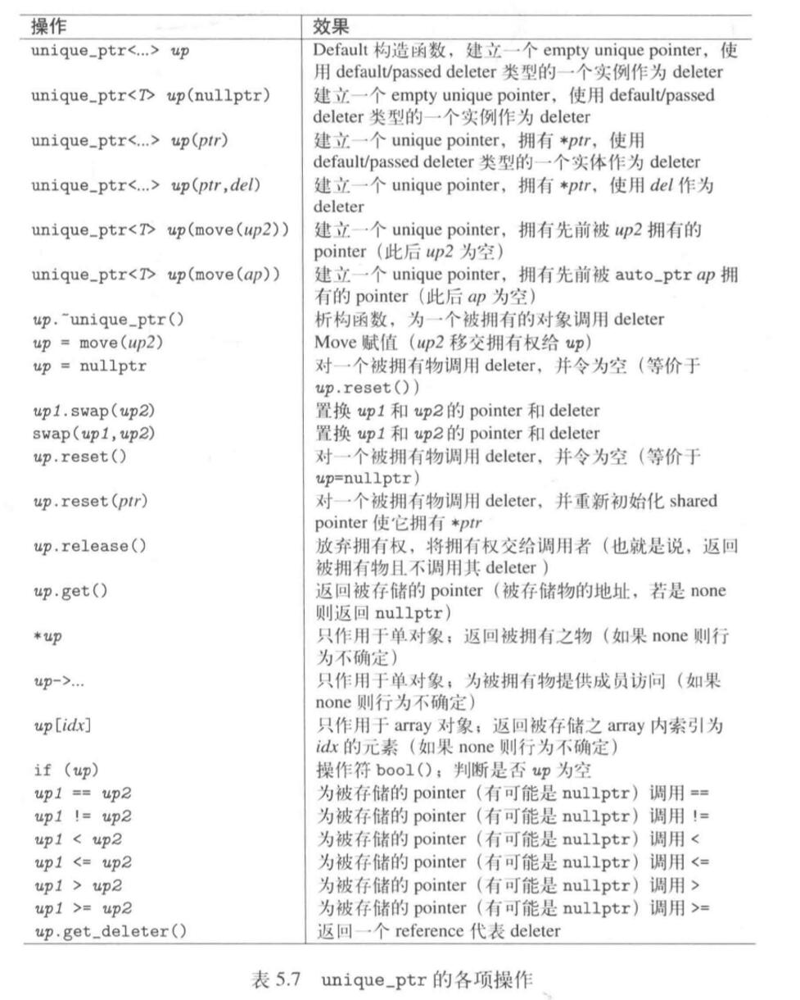

# C++11新特性——标准库篇

## 智能指针

使用智能指针的可以解决

1. 垂悬指针(dangling pointer)问题。即当多个指针指向同一个对象，其中某一个指针析构的时候，将内存空间销毁。导致其它的指针指向了"意义不明"的内存区域
2. 内存泄漏(resource lack)。即当指针销毁的时候却没有释放其分配的内存。(或者也可以说分配的内存区域不在受程序员的掌控)

C++11 标准库提供了两大类型的 mart pointer(放在 momory头文件中 `#inlucde<memory>`)

1. Class shared_ptr (实现共享式拥有)
2. Class unique_ptr (实现独占式拥有，严格拥有) ps:C++11提出之后，原本的 auto_ptr不被推荐使用了，unique_ptr就是用来替代 auto_ptr的

### Class unique_ptr

* unique_ptr 提供**独占式拥有**的语义。可以确保一个对象极其相应资源，同一时间只能被统一个pointer拥有。
* 一旦拥有者被 **销毁**、**置空**、**拥有另一个对象** 先前拥有的对象会**销毁**相应的资源会被释放。
* unique_ptr 是一种在异常发生时可帮助避免资源泄漏的 **smart pointer**

下面的部分会用到的数据结构:

```c++
// 这两个类为了演示智能指针和多态
class Base {
  public:
    static int scount ; 
    int count;
    virtual void print_info() {
      cout << "Base" << count;
    }
    Base() {
      scount++;
      count = scount;
      cout << "create ";
      print_info();
      cout << endl;
    }
    virtual ~Base() {
      cout << "delete ";
      print_info();
      cout << endl;
    }
};
int Base::scount = 0;  // 初始化
class Derived:public Base {
public:
  virtual void print_info() {
    cout << "Derived" << count;
  }
  Derived() {
    cout << "create ";
    print_info();
    cout << endl;
  }
  virtual ~Derived() {
    cout << "delete ";
    print_info();
    cout << endl;
  }
  
};
```

#### 使用 unique_ptr

```c++
void test_base_use(){
  /*
    unique_ptr初始化， 和 shared_ptr 初始化可以 
    1. 利用构造函数初始化
    2. 使用 initializer_list初始化
    3. 先初始化一个空的 unique_ptr (内部指针为empty), 在 用 = 设空，或者用 reset 函数设置初值
  */
  cout << "初始化" << endl;
  unique_ptr<string> p1(new string("nico1") );   //1 
  unique_ptr<string> p2{ new string("nico2") };  //2 
  unique_ptr<string> p3;           // empty , 其内部指针为 nullptr
  if (p3.get() == nullptr) cout << "p3 have nullptr" << endl;
  p3.reset(new string("nico3"));       // reset

  /*
    基本使用
    1. 使用 * 解引用
    2. 使用 ->操作符
    3. 不支持 普通指针的 ++ 操作
    4. 使用 get()获取原始指针
    5. 使用 swap()交换两个指针的内容
    6. 使用 release() 释放所有权， 返回原始指针，交出使用权,执行release后原指针的内容为 nullptr
    7. 使用 reset() 重设指针，原本的对象会被析构
    7. 用 unique_ptr 实现多态
  */
  cout << "\n使用 unique_ptr\\n";
  cout << *p1 << endl;
  p2->replace(0, 1, "N");
  cout << *p2 << endl;
  // p1++; // error

  cout << "\n使用get()\n";
  cout << *(p1.get()) << endl;

  cout << "\n使用swap()\n";
  p1.swap(p2);
  cout <<"p1:"<<*p1 << endl;
  cout << "p2:" << *p2 << endl;

  cout << "\n使用release()\n";
  string * pstr1 = p1.release();
  cout << "pstr1 " << *pstr1<<endl;
  if (p1.get() == nullptr) cout << "p1 have nullptr" << endl;

  cout << "\n使用reset()\n";
  unique_ptr<Base> p5(new Base());
  p5.reset(new Base());

  cout << "\nunique_ptr和多态" << endl;
  unique_ptr<Base> p6(new Base());
  unique_ptr<Base> p7(new Derived());  // ps 如果析构函数不是虚析构函数，这里将调用Base的析构函数
}
/*
上述代码输出结果
p3 have nullptr

使用 unique_ptr\nnico1
Nico2

使用get()
nico1

使用swap()
p1:Nico2
p2:nico1

使用release()
pstr1 Nico2
p1 have nullptr

使用reset()
create Base1
create Base2
delete Base1

unique_ptr和多态
create Base3
create Base4
create Derived4
delete Derived4
delete Base4
delete Base3
delete Base2
*/
```


##### unique_ptr 初始化

1. 利用构造函数初始化 `unique_ptr<string> p1(new string("nico1") );`
2. 利用initializer_list初始化 `unique_ptr<string> p2{new string("nico1") };
3. 不支持直接赋值(和 shared_ptr一样，只有一个参数的构造函数加上了 explict关键字) `unique_ptr<string> p = new string("hello") // error`
4. 先初始化一个空的 unique_ptr (内部指针为empty), 在 用 = 设空，或者用 reset 函数设置初值。ps:初始化一个空的 unique_ptr后，其内部指针为 nullptr

    ```c++
    unique_ptr<string> p3;           // empty , 其内部指针为 nullptr
    p3 = nullptr  ;                // OK
    p3.reset(new string("nico3"));       // reset OK
    ```

##### unique_ptr 基本用法

1. 使用 * 解引用  `*p`
2. 使用 ->操作符  `p->replace()`
3. 不支持 普通指针的 ++ 操作  `p++ //error`
4. 使用 get()获取原始指针   `string* pstr = p.get()`
5. 使用 swap()交换两个指针的内容   `p1.swap(p2)`
6. 使用 release() 释放所有权， 返回原始指针，交出使用权,执行release后原指针的内容为 nullptr `string* pstr = p.release()`
7. 使用 reset() 重设指针，原本的对象会被析构  `p.reset(new string())`
8. 用 unique_ptr 实现多态。(参考代码以及结果)

#### unique_ptr的拥有权。

```c++
void test_ownership() {

  cout << "\ninto block\n";
  /*
    unique_ptr 的独占式拥有
    1. unique_ptr 不支持 copy 语义的 复制构造 和 复制拷贝
    2. unique_ptr 只支持 move 语义的 移动构造和移动拷贝。(相当于拥有权的转移) 
    3. unique_ptr 支持移动语义，因此 其赋值操作符的右边可以是一个 右值 unique_ptr (临时对象 或者 std::move())
    4. unique_ptr 发生了 move，比如2，那么如果左边的 unique_ptr有绑定对象，那么会先delete原来的对象，再绑定新的对象。
  */
  
  unique_ptr<string> p1{ new string("nico") };
  cout << "p1:" << *p1 << endl;

  // unique_ptr<string> p2(p1);  // error 编译期报错
  //unique_ptr<string> p2 = p1;    // error 

  cout << "\np2移动复制构造p1 p2(std::move(p1)" << endl;
  unique_ptr<string> p2{ std::move(p1) };     // OK
  if (p1.get() == nullptr) cout << "p1现在为 nullptr\n";
  cout << "p2:" << *p2 << endl;
  
  cout << "\np3移动赋值p2 p3 = std::move(p2)" << endl;
  unique_ptr<string> p3 = std::move(p2) ;     // OK
  if (p2.get() == nullptr) cout << "p2现在为 nullptr\n";
  cout << "p3:" << *p3 << endl;

  cout << "\n采用移动语义并验证第4点\n";
  unique_ptr<Base> p5{ new Base() };
  unique_ptr<Base> p6{ new Base() };
  p5 = std::move(p6);
  p5 = unique_ptr<Base>{ new Base() };  // 右边的是临时对象

  cout << "\nout of block\n";
}

  /*
  输出结果:
  into block
  p1:nico

  p2移动复制构造p1 p2(std::move(p1)
  p1现在为 nullptr
  p2:nico

  p3移动赋值p2 p3 = std::move(p2)
  p2现在为 nullptr
  p3:nico

  采用移动语义并验证第4点
  create Base1
  create Base2
  delete Base1
  create Base3
  delete Base2

  out of block
  delete Base3

  */
```

##### unique_ptr 独占式拥有

在一开始说到，unique_ptr提供的是提供**独占式拥有**的语义。这意味着:

1. unique_ptr 不支持 copy 语义的 复制构造 和 复制拷贝 `unique_ptr<int> p(p1);// error`
2. unique_ptr 只支持 move 语义的 移动构造和移动拷贝。(相当于拥有权的转移)  `unique_ptr<int> p(std::move(p1));// error`
3. unique_ptr 支持移动语义，因此 其赋值操作符的右边可以是一个 右值 unique_ptr (临时对象 或者 std::move()) `p1 = unique_ptr<int>(new int(5))`
4. unique_ptr 发生了 move，比如2，那么如果左边的 unique_ptr有绑定对象，那么会先delete原来的对象，再绑定新的对象。

从上面几点我们可以得知，unique_ptr 的独占式拥有体现在

1. 限制了copy语义,支持move语义
2. 当所有权发生变化时，自动释放园有的对象。

**独占式拥有仍可能发生的错误**
但是即使有 unique_ptr提供的独占式语义，仍有**可能发生错误**，这种错误和 **shared_ptr**使用出错一样——**用一个原生指针初始化多个 unique_ptr**

```c++
int* a = new int(5);
unique_ptr<int> p1(a);
unique_ptr<int> p2(b);   // 编译时不出错，运行时出错
```

##### 改变 unique_ptr 所有权总结

1. 使用了 move 语义。 移动复制构造，移动赋值。
2. 使用 release() 释放所有权。
3. 使用 reset() 重置所有权(原先绑定的对象将被释放)
4. 使用 swap() 交换所有权(交换所有权不触发 delete)

ps: 如果一个 unique_ptr 是空(empty)的表示未拥有对象，那么get()返回 nullptr

#### unique_ptr 其它特殊使用

```c++
// 辅助函数
template<typename T>
unique_ptr<T> unique_ptr_func(unique_ptr<T> p) {
  cout << "Inside unique_ptr_func 1(带返回值)"<< endl;
  return p;
}

template<typename T>
void unique_ptr_func2(unique_ptr<T> p) {
  cout << "Inside unique_ptr_func 2(不带返回值)" << endl;
}

void test_special_use() {
  cout << "inside block\n";
  /*
    如果将 unique_ptr作为 函数 参数和 返回值
    1. 作为参数必须使用移动语义。(std::move()),值和使用权会相应地传递给函数参数。(外部变量将失去使用权)
    2. 作为返回值，就算返回值不指定右值引用。函数内的 unique_ptr 仍会将拥有权传递出去，
        如果 函数内的 unique_ptr不作为参数返回，那么函数结束后，函数内的 unique_ptr 极其绑定的对象就会被析构
  */
  cout << "\n将 unique_ptr作为参数和返回值1\n";
  unique_ptr<string> p1{ new string("nico") };
  cout << "p1-> " << *p1 << endl;
  unique_ptr<string> p2 = unique_ptr_func(std::move(p1));   //必须是 move 语义
  if (p1.get() == nullptr) cout << "p1 is nullptr" << endl;
  cout << "p2->" << *p2 << endl;

  cout << "\n将 unique_ptr作为参数2\n";
  unique_ptr<Base> p3{ new Base() };
  unique_ptr_func2(std::move(p3));


  /*
    unique_ptr 和 容器
    1. 可以将 unique_ptr 和 容器一起使用，但必须使用移动语义
    2. 从容器中取出 unique<ptr>:
        1. 通过 [] 操作符 (但是不能赋值)
        2. 如果用 ranged base 语法，必须用 引用 
  */
  cout << "\nunique_ptr和容器\n";
  unique_ptr<string> p4{ new string("nico4") };
  unique_ptr<string> p5{ new string("nico5") };
  vector<unique_ptr<string>> v;
  v.reserve(4);

  cout << "将 unique_ptr 放入容器\n";
  // 将 p 放入容器里
  //v.push_back(p4); // error 需要使用移动语义
  //v.push_back(p5);
  v.push_back(std::move(p4));
  v.push_back(std::move(p5));
  if (p4.get() == nullptr) cout << "p4 is nullptr" << endl;

  cout << "将 unique_ptr 从容器中取出\n";
  cout << *v[0] << endl;  // 通过 []取 

  // ranged base 需要用引用，注意此时 vector 里的指针指向空对象。取引用出来后内容依然存在

  /*
  // error
  for (auto e : v) {
    cout << *e<<" ";
  }
  */
  cout << "ranged base + 引用" << endl;
  for (auto& e : v) {
    cout << *e<<" ";
  }
  cout << endl;
  if (v[0].get() == nullptr) cout << "v[0] is nullptr" << endl;
  cout << endl;
  cout << "\nout of block\n";
}
/*
上述代码执行结果:
inside block

将 unique_ptr作为参数和返回值1
p1-> nico
Inside unique_ptr_func 1(带返回值)
p1 is nullptr
p2->nico

将 unique_ptr作为参数2
create Base1
Inside unique_ptr_func 2(不带返回值)
delete Base1

unique_ptr和容器
将 unique_ptr 放入容器
p4 is nullptr
将 unique_ptr 从容器中取出
nico4
ranged base + 引用
nico4 nico5


out of block
*/
```

##### unique_ptr 作为函数参数

* 必须使用 move 语义 `func(std::move(ptr))`
* 使用move 语义传参之后，unique_ptr的使用权被转移给函数参数，也就是外部的unique_ptr现在为空

##### unique_ptr 作为返回值

* 就算返回值不指定为右值引用。函数内的 unique_ptr 仍会将拥有权传递出去(因为C++11 规定，编译器必须自动尝试加上 move)
* 如果 函数内的 unique_ptr不作为参数返回，那么函数结束后，函数内的 unique_ptr 其绑定的对象就会被销毁

##### unique_ptr 作为成员变量

* 使用 unique_ptr 作为成员变量可以防止**内存泄漏**，比如构造期内的资源泄露。
* 如果使用 unique_ptr 代替寻常的 pointer ，可以不写虚构函数了。
* 因为 unique_ptr不支持 copy语义，所以必须自己写构造函数和赋值函数。

##### unique_ptr 和 STL容器

 1. 可以将 unique_ptr 和 容器一起使用，但必须使用移动语义。ps:使用 move语义将 unique_ptr存入容器之后，外部的 unique_ptr会变为空
 2. 从容器中取出  unique_ptr:
    * 通过 [] 操作符 (但是不能赋值)
    * 如果用 ranged base 语法，必须用 引用 (查看范例代码)

#### unique_ptr 和 array

```c++
void test_array() {
  /*
    1. unique_ptr 提供了 array的特化版本。如果要使用 array 需要在模板参数进行指定。
    (c++无法区分 一个指针是指向单一对象还是指向数组) 
    2. array 版本的 unique
        1. 不支持 * 和  -> 操作
        2. 其默认版本的 deleter 使用 delete[](区别于 c++17之前的 shared_ptr)
        3. 不支持不同类型之间的转换，特别是 如果array是(基类的指针数组）那么不允许指向派生元素类型
  */

  unique_ptr<int[]> a{ new int[10] };
  for (int i = 0; i < 10; i++) {
    a[i] = i;               // 支持 [] 操作
  }
  for (int i = 0; i < 10; i++) {
    cout << a[i] << " ";
  }
  cout << endl;

  // cout << *a;   // error 编译报错
  
  // unique_ptr<Base[]> p{ new Derived[2] };  //error 编译报错
  
}
/*
输出结果:
0 1 2 3 4 5 6 7 8 9
*/
```

* unique_ptr 提供了 array的特化版本。如果要使用 array 需要在模板参数进行指定。`unique_ptr<int[]>{new int[10]}`
* array 版本的 unique
  1. 不支持 * 和  -> 操作
  2. 支持 [] 操作
  3. 其默认版本的 deleter 使用 delete[](区别于 c++17之前的 shared_ptr)
  4. 不支持不同类型之间的转换，特别是 如果array是(基类的指针数组）那么不允许指向派生元素类型

#### 自定义 deleter

```c++
// function-like class
template<typename T>
struct myDeleter {
  void operator()(T* p) {
    cout << "function-class deleter\n";
    delete p;
  }
};
template<typename T>
void deleterfunc(T* p) {
  cout << "function-pointer deleter\n";
  delete p;
}
void test_deleter() {
  /*
      1. unique_ptr 和 shared_ptr一样 可以指定 deleter，
      但是与 shared_ptr不同的是，unique_ptr必须指定模板参数。
      2. 使用 函数指针
      3. 使用 lambda 表达之
      4. 使用 function-like class 
      5. 和 shared_pointer 一样， unique pointer 的 deleter不可抛出异常
  */
  cout << " into block\n";
  // 使用 lambda
  unique_ptr<int, void(*)(int* )> p1 {new int(5), 
  [](int* p)->void {
    cout << "delete use lambda\n";
    delete p;
  } };

  // 使用 lambda 也可以这么写
  auto l = [](int* p)->void {
    cout << "delete use lambda\n";
    delete p;
  };
  unique_ptr<int, decltype(l)> p2{ new int(5),l };

  // 使用 函数指针
  unique_ptr<int, void(*)(int*)> p3{ new int(5),
    deleterfunc
  };

  // 使用 function-like class
  unique_ptr<int, myDeleter<int>> p4{ new int(5) };

  // 或者
  unique_ptr<int, myDeleter<int>> p5{ new int(5),myDeleter<int>() };  // 把 myDeleter作为参数传进去
  cout << "\nout of block\n";
}

/*
输出结果:
into block

out of block
function-class deleter
function-class deleter
function-pointer deleter
delete use lambda
delete use lambda
*/
```

* unique_ptr 和 shared_ptr一样 可以指定 deleter，但是与 shared_ptr不同的是，unique_ptr**必须指定模板参数**。
* 可以采用 3 种方式:
  1. 使用 函数指针
  2. 使用 lambda 表达式(看范例)
  3. 使用 function-like class 
* 和 shared_pointer 一样， unique pointer 的 deleter不可抛出异常
* 我们通常可以自定义 deleter，在自定义的 deleter里释放资源(比如文件)

#### unique_ptr 接口总结

