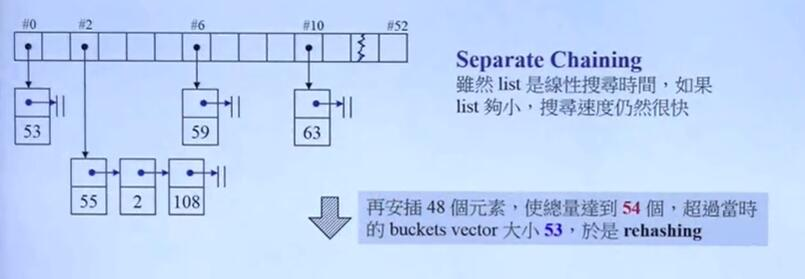

# C++11新特性——标准库篇

## 容器array 

Array 就是把 C++ 自带的数组封装成一个类，使得其拥有c++ STL 的接口，`.begin()`,`.end()`... 其本质上就是c++自身的数组。 

可能的实现(TR1)

```C++
template<typename _Tp, std::size_t _Nm>
struct array
{
  typedef _Tp    value_type;
  typedef _Tp*   pointer;
  typedef value_type* iterator;  // 这里的 iterator是 navie pointer

  // Support for zero-sized arrays madatory
  value_type _M_instance[_Nm? _Nm:1];
  
  iterator begin()
  {return iterator(&_M_instanck[0]);}
  iterator end()
  {return iterator(&_M_instance[_Nm];)}
}
```

具体的API和很多容器的通用 API 相同，若感兴趣请查询(日后有时间再打上去吧): https://en.cppreference.com/w/cpp/container/array

example1:

```c++

#include <string>
#include <iterator>
#include <iostream>
#include <algorithm>
#include <array>
 
int main()
{
    // construction uses aggregate initialization
    std::array<int, 3> a1{ {1, 2, 3} }; // double-braces required in C++11 prior to the CWG 1270 revision
                                        // (not needed in C++11 after the revision and in C++14 and beyond)
    std::array<int, 3> a2 = {1, 2, 3};  // never required after =
    std::array<std::string, 2> a3 = { std::string("a"), "b" };
 
    // container operations are supported
    std::sort(a1.begin(), a1.end());
    std::reverse_copy(a2.begin(), a2.end(), 
                      std::ostream_iterator<int>(std::cout, " "));
 
    std::cout << '\n';
 
    // ranged for loop is supported
    for(const auto& s: a3)
        std::cout << s << ' ';
}
/* output
3 2 1 
a b 
*/
```

example: (2维数组)

```c++ 
#include <string>
#include <iterator>
#include <iostream>
#include <algorithm>
#include <array>
using namespace std;
int main()
{
    // construction uses aggregate initialization
    array<std::array<int,3>,2> a {array<int,3>{1,2,3},array<int,3>{4,5,6}};
    for(const auto& line : a){
        for(const int& e : line ){
            cout<<e<<" ";
        }
       cout<<endl;
    }
}

/* 
output:
1 2 3 
4 5 6

```

array 有着内置数组的效率同时还有着STL的接口..

## hashtable

STL里很多 unordered 容器底层是 hashtable 支撑。



ps : 当元素的个数>篮子的个数 就扩充篮子的数目，扩充规则是 >2*目前篮子数的素数。(这块可以再复习一下 数据结构的 hash 表，先插个桩不详细说)，使用 hashtable 必须指定 hashfunction

### unordered 容器 和 hash functions

STL提供了很多基本类型的 hash函数，该hash接受一个该类型的变量，返回值为 size_t类型，根据hash函数的定义，不同的输入产生的 hash值相同的概率应该很小

STL的 hash 函数是一个 template function-like class ,重载了 oeprator()方法
```c++
template<> struct hash<bool>;
template<> struct hash<char>;
template<> struct hash<signed char>;
template<> struct hash<unsigned char>;
template<> struct hash<char8_t>;        // C++20
template<> struct hash<char16_t>;
template<> struct hash<char32_t>;
template<> struct hash<wchar_t>;
template<> struct hash<short>;
template<> struct hash<unsigned short>;
template<> struct hash<int>;
template<> struct hash<unsigned int>;
template<> struct hash<long>;
template<> struct hash<long long>;
template<> struct hash<unsigned long>;
template<> struct hash<unsigned long long>;
template<> struct hash<float>;
template<> struct hash<double>;
template<> struct hash<long double>;
template<> struct hash<std::nullptr_t>; // C++17
template< class T > struct hash<T*>;

// 部分 STL

std::hash<std::string>  // (C++11)
std::hash<std::u8string>  //(C++20)
std::hash<std::u16string>  //(C++11)
std::hash<std::u32string>  // (C++11)
std::hash<std::wstring>   //  (C++11)

// 使用 hash 

 std::string str = "Meet the new boss...";
    std::size_t str_hash = std::hash<std::string>{}(str);

// ps 这里的 hash<std::string>{}表示
//初始化一个 hash类，(采用 uniform inilization )如前所述 hash 是
//一个 function-like class

   std::size_t int_hash = std::hash<int>{}(1024);
    std::cout << "hash(" << 1024 << ") = " << int_hash << '\n';
```

output:

```c++
hash("Meet the new boss...") = 10656026664466977650
hash(1024) = 1024

```

#### 万用 Hash Function

如果要更进一步地使用 unordered 容器，有必要进一步的为自己的类写一个 hash function(特化 hash 类)。先提供一种万用Hash Function 的思路 

任何的类的数据都可以分解为基础类型，而每一中基础类型都有它们自己的 hash function，因此一种思路就是把这些基本类型的hash值 组合起来。 

正式开始:

为 Customer 写 Hash Function

```c++

// 整体框架

//方式1:
#include<fucntional>
class Customer{
  ...
};

class CustomerHash
{
  public:
  std::size_t operator()(const Customenr& c)const
  {
    return ...
  }
}

// CustomerHash 是一个函数对象
unordered_set<Customer,CustomerHash> custset;

//方式 2：7
namespace std
{
  //在 命名空间 std内对 hash类进行偏特化
template<>
struct hash<Customer>
{
  size_t oeprator()
  (const MyString& s)const noexcept
  {.......}
}
}

//方式3 使用函数指针
size_t customer_hash_func(const Customer& c){
  .....
}
// 函数指针的类型可以使用 decltype获得
//使用
unordered_set<Customer, size_t(*)(const Customer&)>
custset(20,customer_hash_func)
```

现在的问题是如和实现 CustomerHash

一种可能的实现:

```c++
class CustomerHash {
  public :
    std::size_t operator() (const Customer & c) const{
      return std::hash<sud::string>()(c.fname) 
      + std::hash<sud::string>c.lname()
      + std::hash<sud::string>c.lname()
      // 这种方法太简单了
    }
}

```

用C++11 variadic_template 实现一种万用hash 

```c++
using namespace std;
class CustomerHash{
  public:
    size_t operator()
    (const Customer &c) const{
      return hash_val(c.fname,c.lname,c.no); // hash_val就是万用散列
    }
}

// func1 
template<typename...Types>
inline size_t hash_val(const Types& ...args){
  size_t seed =0;
  hash_val(seed,args...) // 调用 func2
  return seed;
}
// func2
template<typename T, typename...Types>
inline void hash_val(size_t& seed,const T& val, const Types& args){
  hash_combine(seed,val) ; // 叠加hash值修改seed,调用 func4
  hash_val(seed,args...)  //递归调用，对args剩下的进行处理
}

// func3 , 递归边界
template<typename T>
inline void hash_val(size_t & seed, const T& val){
  hash_combine(seed,val);
}
// func4
#include<functional>
template<typename T>
inline void hash_combine(size_t& seed,const T& val){
  seed ^= std::hash<int>{}(val) + 0x9e3779b9 +(seed<<6) + (seed>>2); 
  //对seed 根据基本值的 hash做混乱的处理
}

```

## tuple,用例

```c++
// tuples
// create and initialize a tuple explicity
tuple<int, float, string> t1(41, 6.3, "nico");
cout << "tuple<int,float,string>,sizeof=" << sizeof(t1) << endl; //12

//iterate over elements
cout << "t1: " << get<0>(t1) << " " << get<1>(t1) << " " << get<2>(t1) << endl;
// careat tuple with make_tuple()
auto t2 = make_tuple(22, 44, "stacy");

// assign second value in t2 to t1
get<1>(t1) = get<1>(t2);  // get<1>是函数模板

if (t1 < t2) {
  // compares value for value
  cout << "t1<t2" << endl;
}
else {
  cout << "t1>=t2" << endl;
}
t1 = t2; // OK, assigns value for value

tuple<int, float, string> t3(77, 1.1, "more light");
int i1;
float f1;
string s1;
tie(i1, f1, s1) = t3; // assigns values of t to i f and s 

typedef tuple<int, float, string> TupleType;
cout << tuple_size<TupleType>::value << endl;    //元编程
tuple_element<1, TupleType>::type f2 = 1.0;

```

