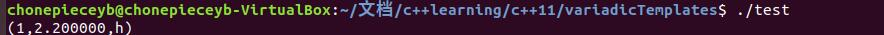
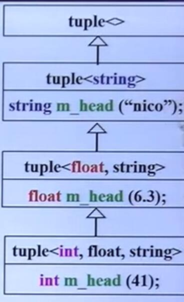
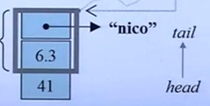
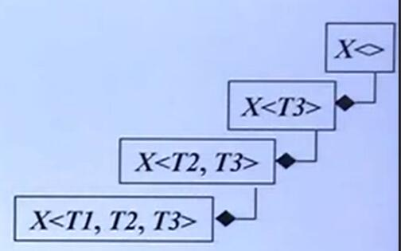
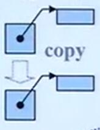
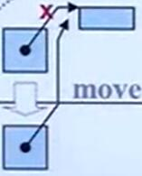

# C++11新特性

* **Variadic Templates** 可变模板参数，能够实现模板参数数目可变，类型可变

* **RValue reference** 右值引用，有了右值引用，出现了移动复制构造函数，和移动赋值函数，可以极大地提升stl容器的效率

## Variadic Templates

语法范例:

```c++
// 递归边界，最后一次调用print(args...)
// args...已经没有参数了
void print()
{

}

//  typename...Types 表示一包模板
// 任意个数任意类型的模板
template<typename T, typename...Types>
void print(const T& first Arg,const Types&...args)
{
    cout<<firstArg<<endl;
    print(args...);
}
// 用 variadic templates 可以方便地实现函数递归

/* 
    简单地理解记忆:
    ...args 表示封包
    args... 表示解包
    所以上面的参数 const Type& ...args 表示 args是一包
    而 print(args...)表示把
    原本的一包进行解包分成一个参数和
    另外一包
    只是帮助理解
*/
```

ps : 可以用`sizeof...(args)`来获得一包里有几个参数 

Variadic Templates, 模板参数可变,模板参数可变有两层含义:

* 参数个数变化(variable number) 利用**参数个数减少的特性**实现递归函数的调用，使用function template 完成.

* 参数类型(different type) 利用**参数个数注意减少**导致**参数类型也注意减少**的特性，实现递归继承或者递归复合，用 class template 实现。

ps: 如果参数类型都相同，只想实现参数个数不定的话，可以使用 `initializer_list<T>`

### Variadic Templates 实战

* **example1** 递归函数调用
  
  ```c++
    void printX(){};   //递归边界

    template<typename T,typename... Types>
    void printX(const T& firstArg,const Types& ...args)
    {
        cout<<firstArg<<endl;  // 打印第一个
        printX(args...);      // 递归调用 又把 args... 分成 一个 + 剩下的一包。
    }
    // 调用
    printX(1,2,1.5,"hello");
    /*
        输出结果:
        1
        2
        1.5
        hello
    */

    /*
        对于模板，模板有特化的概念，
        谁更加特化就调用谁
        eg:
        template<typename...Types>
        void printX(const Type&...args){...}
        这个函数可以和上面的函数共存，因为特化的程度不一样
        上面的版本更加特化
    */
  ```

* **example2** 利用 Variadic Template 模拟 printf

  ```c++
    //边界条件
    void printf(const char* s)
    {
        while(*s)
        {
            if(*s =='% && *(++s)!='%)
                thorw std::runtime_error("invalid format string:missing arguments");
            std::cout<<*s++;
        }
    }

    template<typename T, typename...Args>
    void printf(const char* s, T value, Args ...args)
    {
        while(*s){
            if(*s =='%' && *(++s) !='%'){
                std::cout << value;
                printf(++s,args...) // 这时候 value已经被消耗掉了，args分解成了 一个 value 和 一包 args,如果args没有了会调用上面那个函数
                return ;
            }
            std::cout<<*s++;      //只输出当前字符
        }
        // 字符串扫描完后面还有参数，说明值给的太多了
        throw std::logic_error("extra arguments provided to printf"); 
    }

  ```

* **example3** 用 Variadic Templates 实现多参数的 max函数

  ```c++

    //http://stackoverflow.com/questions/3634379/variadic-templates
    int maximum(int n)
    {
        return n;
    }

    template<typename...Args>
    int maximum(int n, Args...args )
    {
        return std::max(n,maximum(args...));
    }
  ```

* **example4** 用不同于一般的方法处理 first,和 last元素

  ```c++
    //output operator for tuples
    template<typename...Args>
    ostream& operator<<(ostream& os, const typle<Args...>& t){
        os<<"["
            PRINT_TUPLE<0,sizeof...(Args),Args...>::print(os,t);
        return os <<"]";
    };
    
    template <int IDX, int MAX ,typename...Args>
    struct PRINT_TYPLE{
        static void print(ostream& os,const tuple<Args...> & t){
            os<< get<IDX>(t) << (IDX+1 == MAX ?"",",");
            PRINT_TUPLE<IDX+1,MAX,Args...>::print(os,t);
        }
    };

    // 边界，模板偏特化,精髓
    template <int MAX,typename ...Args>
    struct PRINT_TUPLE<MAX,MAX,Args...>{
        static void print(std::ostream& os, const tuple<Args...>& t) {}
    };

    /*
    一些个人的思考：
    模板的递归和普通的递归还是不同的，
    模板的递归是在编译时决定的(感觉
    递归了几次就会真的编几个函数)因为模板事实上是采用一种liline的方式。
    而普通的运行时递归会在运行时压栈。
    (回想一下我们是怎么用汇编写递归代码的)
    */
  ```

    ps: 关于模板递归一些个人的思考(不一定对欢迎指正)

  * 模板的递归和普通的递归还是不同的，模板的递归是在编译时决定的(感觉递归了几次就会真的编几个函数)因为模板事实上是采用一种liline的方式。
  * 而普通的运行时递归会在运行时压栈。
        (回想一下我们是怎么用汇编写递归代码的)
  * 因此个人认为模板递归的效率应该会比普通递归的效率高。

* **example5** 用 Variadic Templates 实现递归继承,tuple实现

  ```c++
    #include<iostream>
    using namespace std;

    template<typename...Args>
    class Tuple; //类声明
    
    // 类特化
    template<>
    class Tuple<> {};

    //类定义 + 偏特化
    template<typename Head, typename...Tail>
    class Tuple<Head, Tail...>: private Tuple<Tail...> 
    {
        typedef Tuple<Tail...> inherited;
        public:
            Tuple(Head v, Tail...vtail):m_head(v),inherited(vtail...){};//这里的 inherited,表示调用父类的构造函数
            Head head(){return m_head;};
            inherited& tail(){return *this;};	 
        protected:
            Head	    	m_head;
    };

    int main(){
        Tuple<int,float,string> t = Tuple<int,float,string>(41,6.3,"nico");
        printf("(%d,%f,%s)\n",t.head(),t.tail().head(),t.tail().tail().head());
    }

  ```
  
  运行结果:
  

  上述代码的继承结构:

  
   
  内存空间:
  
  对于 t , `t.head()`指向 41， `t.tail()`指向方框框起来的区域,这里的  `inherited& tail(){return *this; }`挺精髓的。

* example7 用 Variadic Templates 进行递归复合

  ```c++
    template<typename...Values> class tup; //类声明
    template<> class tup<>{};//边界类，特化

    // 类定义，偏特化
    template<typename Head, typename...Tail>
    class tup<Head,...Tail>
    {
        typedef tup<Tail...> composited;
        protected:
            composited m_tail; //组合变量
            Head m_head;
        public:
            tup(){}
            tup(Head v, Tail...tail):
            m_tail(vtail),m_head(v){}

            Head head(){return m_head;}
            composited& tail(){return m_tail;} //这里一定要用引用返回
    }
    //使用方法和例子6相同
  ```
  组合关系:
  

  ## Rvalue reference 右值引用

> Rvalue references are a **new reference** type introduced in C++0x that help solve the porblem of **unnecessary copying** and enable **pefect forwarding**. When the **right-hand side** of an assignment is an **rvalue**, the the left-hand side object can **steal** resources from the right-hand side object **rather than** performing a separate allocation, thus enable **move semantics**
>

右值引用可以减少不必要的copy。当赋值操作的右手边是一个**右值**，可以**偷**右手边资源，而不需要非必要的拷贝。

### 左值和右值

* **左值 Lvalue**: 可以出现在 **operator=** 的左边，也就是变量(也可以放在右边)
* **右值 Rvalue**: 只能出现在 **operator=** 的右侧。也就是**临时对象**，临时变量没有名字。

eg 1: 

```c++
    int a =9;
    int b =4;
    a = b; //ok
    a+b = 42 // error ,a+b是右值
```

eg2 :

```c++
int foo(){return 5;}
...
int x = foo() ; // ok x是左值
int* p = &foo(); //Error，之前对右值无法取地址
fool() =7;        // error ,右值无法赋值
```

### 右值引用

右值引用可以减少不必要的copy。当赋值操作的右手边是一个**右值**，可以**偷**右手边资源，而不需要非必要的拷贝。

所谓的**偷**指的是指针的**浅拷贝**,直接进行指针赋值，进行**move**.

copy 操作 vs move 操作

 

在这种情况下为什么浅拷贝是被允许的?

* 临时变量本身不能够放在赋值符号的右边，所以临时变量被创建之后其内存里的内容不会被更改的，直接用指针指向临时变量的内存区域十分安全。
* 如果我们能够保证一个变量之后不再使用它，我们可以把左值当成右值(将使用移动构造函数).
  
  ```c++
    M c1(c);
    M c2(std::move(c1));
      c1.swap(c2);
    // 必须要保证 之后不再继续使用 c1
  ```

### 右值引用语法

```c++
iterator
insert(const_iterator __position, const value_type& x); //普通引用

iterator
insert(const_iterator __position, value_type&& __x); // 右值引用的语法， x是一个临时变量 或者 使用了 std::move

```

#### 右值引用的问题 unperfect forward

```c++
void process(int & i){
  cout<<"process(int&):"<<i<<endl;
}
void process(int && i){
  cout<<"process(int&&):"<<i<<endl;
}

void forward(int && i){
  cout<<"fowrard(int &&):"<<i<<",";
  process(i);
}

int a =0; 
porcess(a);// 调用 process(int &)
process(1)   // 调用 process(int &&)
process(move(a)); //调用 process(int &&)
fworard(2) ; // fworard(int&&):2, process(int&):2
fworard(move(a)) ; // fworard(int&&):0, process(int&):0
```

如上所述，RValue 经过 forward 再调用两外一个函数就变成了 LValue，原因是经过第一次 forward函数之后，原本的RValue有了参数名称，变成了左值(named object)，所以在forward内部调用了左值的版本.

#### Perfect Forwarding

> **Perfect forwarding** allows you to write a single function template that takes n arbitrary arguments and forwrds them **transparentlly** to **another arbitrary function**. The **nature** of the argument(modifiable,const,lvalue or **rvalue**) is preserved in this forwarding process
>

通过标准库提供的 std::forward实现 perfect forward

eg:

```c++
template<typename T1, typename T2>
void function A(T1&& t1, T2 && t2)
{
  functionB(std::forward<T1>(t1), std::forward<T2>(t2));
}

```

### move-aware class

eg:

```c++
class MyString
{
  private :
    char* _data;
    size_t _len;
    void __init_data(const char*s){
      _data = new char[_len+1];
      memcpy(_data,s,_len);
      _data[_len] ='\0';
    }
  public:
  //default constructor
  MyString():_data(NULL),_len(0){}
  // constructor
  MyString(const char* p):_len(strlen(p)){
    _init_data(p);
  }
  // copy constructor
  MyString(const MyString & str):_len(str._len){
    _init_data(str.data);
  }
  // move constructor 。移动构造函数必须加上 nonexcept 关键字
  MyString(MyString&& str) noexcept
  :_data(str._data), _len(str._len){
    // 上面的指针赋值是一个浅拷贝
    str._len =0; 
    str._data = NULL ; 
    //一定把原指针设成NULL
    // 否则可能导致临时变量销毁的时候
    //其析构函数把内存空间也销毁了， 
    //这不是我们想要的
    //设置成NULL要配合析构函数，判断
    //指针是不是NULL再delete
  }

  // copy assignment 
  MyString& operator= ( const MyString& str){
    if( this != &str){
      if(_data) delete _data; // 不是空指针才 delete
      len = str._len;
      _init_data(str.data); //COPY
    }else{

    }
    return *this
  }

  //move assignment
  MyString& operator=(MyString&& str) noexcept{
    // 先判断是不是自我赋值
    if(this !=&str){
      // 判断空然后释放原有的空间
      if(_data) delete _data; 
      _len = str._len;
      _data = str._data; //MOVE，浅拷贝
      // 下面部分同 move ctor，很重要
      str._len =0;
      str._data =NULL; //配合析构函数,重要
    }else{}
    return *this;
  }

  // dtor
  virtual ~MyString(){
    ++Dtor;
    if(_data){
      delete _data;
    }
  }
}
```

在移动复制构造函数里的NULL，就是下面这张图中的红叉
 