# C++内存管理

## C++ memory primitives

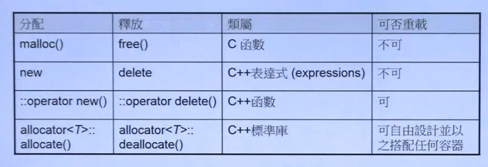

使用:

```c++
void* p1 = malloc(512);
free(p1);

complex<int>* p2 = new complex<int>;// one object
delete p2;

void* p3 = ::operator new(512); //512 bytes
::operator delete(p3);

#ifdef __GUNC__
void* p4 = allocator<int>().allocate(7);
allocator<int>().dealocate((int*)p4,7);

#endif
```

### new expression

```c++
Complex* pc = new Complex(1,2);

// 编译器转化为
Complex *pc;
try{
    void* mem = operator new(sizeof(Complex)); // allocate 内部调用了 malloc
    pc = static_cast<Complex*>(mem);
    pc->Complex::Complex(1,2);  // 这里表示调用构造函数
}catch(std::bad_alloc){
    // allocation 失败就不执行 constructor
}

```

### delete expression

```c++
Complex* pc = new Complex(1,2);
....
delete pc;

// 编译器转化为

pc->~Complex(); // 先析构
operator delete(pc);   // 然后释放内存，内部调用 free

```

### array new, array delete

```c++
Complex* pca = new Complex[3];
/*
上面的代码调用 array new expression
会调用 3 次 的 ctor , new expression 只调用了一次
无法借用参数赋初值
*/

delete[] pca;  // 调用3次 dtor，然后释放整个区域的内存

```

如果使用了 array new,但是没有使用 array delete

* 没有使用 array delete, 只会调用一次 dtor
* 只调用一次 dtor的问题是:
  * 实例本身数据占用的空间能够被释放掉(operator delete 底层调用 free，free知道申请了多少空间)
  * 但是 实例动态分配的空间，必须通过在dtor里手动释放内存。只调用一次 dtor 对于使用指针动态分配内存的类，会发生内存泄漏

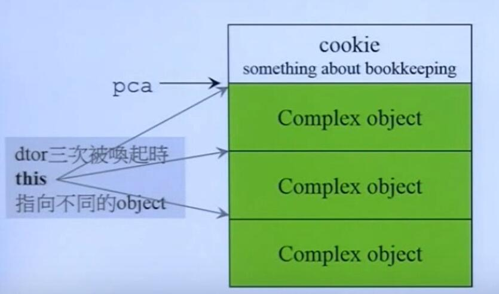
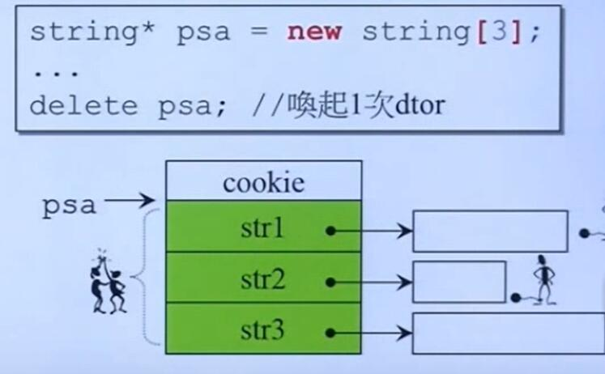
(第二张图里不用 array delete 会发生内存泄漏，因为只调用了一次dtor，右边的白色方框即动态分配的内存无法被释放，发生内存泄漏)

### placement new

* placement new 允许我们将object建构在 allocated memory 中(已经分配的内存)
* 没有所谓的 placement delete, 因为 placement new 根本没有分配 memory

```c++
#include<new>
char* buf = new char[sizeof(Complex)*3];
Complex* pc = new(buf) Complex(1,2);
...
delete[] buf

// 上述操作编译器转化为

Complex * pc;
try{
  void * mem = operator new(sizeof(Complex),buf);
  pc = static_cast<Complex*>(mem);
  pc->Complex::Complex(1,2);
}catch (std::bad__alloc){
  // 如果 allocation 失败就不执行constructor
}

// oeprator new
void* oeprator new(size_t,void* loc){
  return loc;
}
```


### 重载内存管理基本操作

重载类成员函数 operator new 和 operator delete

格式:

```c++
class Foo{
  public:
    static void* operator new(size_t);
    static void operator delete(void* );   //可以重载这两个函数
}
```

```c++
class Foo{
  public:
    static void* operator new[](size_t);
    static void operator delete[](void* );   //可以重载这两个函数
}
```

eg:

```c++
class Foo{
	public:
	Foo(){
		x =0;
		y=1;
		cout<<"ctor of Foo:" <<this<<endl;
	}
	~Foo(){
		cout<<"dtor of Foo:"<<this<<endl;
	}
	// 重载operator new 
	static void* operator new(size_t size){
		cout<<"重载 operator new(size_t) 分配大小为"<<size<<endl;
		void* p = malloc(size);
		cout<<"指针地址为: "<<p <<endl;
		return p;
	}
	// 重载 operator new[]
	static void* operator new[](size_t size){
		cout<<"重载 operator new[](size_t) 分配大小为"<<size<<endl;
		void* p = malloc(size);
		cout<<"指针地址为: "<<p <<endl;
		return p;
	}
	// 重载 operator delete
	static void operator delete(void* p){
		cout<<"重载 operator delete 指针地址为"<<p<<" \n";
    free(p);
	}
        // 重载 operator delete[]
	static void operator delete[](void* p){
		cout<<"重载 operator delete[] 指针地址为"<<p<<" \n";
    free(p);
	}
	private:
		int x;
		int y;

};

void test(){
	Foo* f1 = new Foo;    
	cout<<endl;
	Foo* fa = new Foo[5];
	cout<<endl;
	delete f1;
	cout<<endl;
	delete[] fa;
	cout<<endl;
}

/*
上述代码的输出结果:
重载 operator new(size_t) 分配大小为8
指针地址为: 0x5555f0a1a280
ctor of Foo:0x5555f0a1a280

重载 operator new[](size_t) 分配大小为48
指针地址为: 0x5555f0a1a2a0
ctor of Foo:0x5555f0a1a2a8
ctor of Foo:0x5555f0a1a2b0
ctor of Foo:0x5555f0a1a2b8
ctor of Foo:0x5555f0a1a2c0
ctor of Foo:0x5555f0a1a2c8

dtor of Foo:0x5555f0a1a280
重载 operator delete 指针地址为0x5555f0a1a280 

dtor of Foo:0x5555f0a1a2c8
dtor of Foo:0x5555f0a1a2c0
dtor of Foo:0x5555f0a1a2b8
dtor of Foo:0x5555f0a1a2b0
dtor of Foo:0x5555f0a1a2a8
重载 operator delete[] 指针地址为0x5555f0a1a2a0 
*/

// 如果把 delete[] 改成 delete 则上述代码输出结果为：

/*
重载 operator new(size_t) 分配大小为8
指针地址为: 0x55822453b280
ctor of Foo:0x55822453b280

重载 operator new[](size_t) 分配大小为48
指针地址为: 0x55822453b2a0
ctor of Foo:0x55822453b2a8
ctor of Foo:0x55822453b2b0
ctor of Foo:0x55822453b2b8
ctor of Foo:0x55822453b2c0
ctor of Foo:0x55822453b2c8

dtor of Foo:0x55822453b280
重载 operator delete 指针地址为0x55822453b280 

dtor of Foo:0x55822453b2a8
重载 operator delete 指针地址为0x55822453b2a8 
*/

```

从上述代码中我们发现:

1. new expression 确实 先调用 operator new () 再调用 ctor
2. delete expression 先调用 dtor 再调用 operator delete
3. 使用 array delete 会多次调用 dtor
4. 如果使用  delete 操作数组指针，只会调用一次dtor
5. 展示基本的重载 operator new 和 operator delete 的语法。


#### 可以重载多个版本的 operator new()

* 我们可以重载多个版本的 operator new(), 每个版本的 operator new() 的参数列表不同，同时第一个参数必须为 size_t. placement new 就是一个重载的版本。
* 我们也可以重载多个 operator delete (和 operator new 相对应). 但是他们确不会被调用。只有当执行 operator new 操作的时候发生异常，会调用对应的 operator delete 来解决异常(gcc下)

eg:

```c++
public:
	Foo(){
		x =0;
		y=1;
		cout<<"ctor of Foo:" <<this<<endl;
	}
	Foo(int){
		x =0;
		y=1;
		cout<<"ctor of Foo(int)"<<this<<endl;
		throw 4;
	}
	~Foo(){
		cout<<"dtor of Foo:"<<this<<endl;
	}

	// 重载 oeprator new(size_t extral)
	static void* operator new(size_t size, size_t extral){
		cout<<"重载 operator new(size_t, size_t extral),分配的大小为"<< size + extral<<endl;
		void* p = malloc(size+extral);
		cout<<"指针地址为: "<<p <<endl;
		return p;
	}

  // 重载 placement new
	static void* operator new(size_t size, void* p){
		cout<<"placement new 分配的大小为"<<size<<endl; 
		cout<<"指针地址为: "<<p<<endl;
		return p;
	}

	// 重载 operator delete(size_t extral)
	
	static void operator delete(void* p, size_t extral){
		cout<<"重载 operator delete(size_t extral)  指针地址为"<<p<<" \n";
		free(p);

	}
	private:
		int x;
		int y;

};

void test(){

        Foo* f3 = new(4) Foo;
	cout<<endl;
	delete f3;
	cout<<endl;
	Foo* f5 = new(4) Foo;
	delete f5;
	cout<<endl;
	try{

		Foo* f4 = new(4) Foo(1);
	}catch(int x){
		cout<<endl;
	};

  // placement new 
	cout<<"测试 placement new" <<endl;
	void* p = malloc(8);  // 申请一个Foo的空间
	Foo* f = new(p) Foo;
        cout<<endl;	
	delete f;

}


/*
输出结果为:
重载 operator new(size_t, size_t extral),分配的大小为12
指针地址为: 0x56502dd00280
ctor of Foo:0x56502dd00280

dtor of Foo:0x56502dd00280
重载 operator delete 指针地址为0x56502dd00280 

重载 operator new(size_t, size_t extral),分配的大小为12
指针地址为: 0x56502dd00280
ctor of Foo:0x56502dd00280
dtor of Foo:0x56502dd00280
重载 operator delete 指针地址为0x56502dd00280 

重载 operator new(size_t, size_t extral),分配的大小为12
指针地址为: 0x56502dd00280
ctor of Foo(int)0x56502dd00280
重载 operator delete(size_t extral)  指针地址为0x56502dd00280 

测试 placement new
placement new 分配的大小为8
指针地址为: 0x56502dd00280
ctor of Foo:0x56502dd00280

dtor of Foo:0x56502dd00280
重载 operator delete 指针地址为0x56502dd00280 
*/

```

* 当抛出异常之后对应版本的 operator delete 被调用了，否则不调用 operator delete 
* c++ STL 的 basic_string 就重载了 operator new 。

### 初级内存池

目标:

1. 降低 cookie 数量。从而减少冗余空间。 cookie : 每一次malloc 分配的一整块内存的头和尾各有一个字节，用来存放内存块的大小
2. 提升分配的速度

内存管理实现 1 使用 指针:

```c++
// 内存池实现方案 1 , 用普通的链表实现

class Screen
{
	public:
		Screen(int a=1):x(a){
		}
		// 重载 operator new 
		static void* operator new(size_t size){
			Screen* p;
			if(!free){
				// 如果还没有分配过内存
				size_t chunks = size* CHUNKS;
				// 分配一大块内存
				p = free = static_cast<Screen*>(malloc(chunks));
				// 构建指针
				for(int i=0;i<CHUNKS-1;i++){
					// 直接对内存内容进行操作
					p->next = p+1;
					p = p->next;
				}
				p->next = NULL ;   // 最后一块内存
			}
			p = free;
			free = p->next;
			return p;
		}
		// 重载 operator delete 
		static void operator delete(void* p){
			// delete 相当于把分出去的节点，重新插入到链表头
			static_cast<Screen*>(p)->next = free;
			free = static_cast<Screen*>(p);
		}
	public:
		int x;
		int y;
	private:
		Screen* next;   // 指向下一块内存区域
		static Screen* free;  // free 的内存
		static size_t CHUNKS; // 预分配数目
};
```

内存管理 方式 2： 使用 内嵌指针


```c++
// 采用 embbed 指针 实现简单的内存池

class AirPlane{
	private:
		public:
		AirPlane(int a):x(a){
				}
		int  getX(){
			return x;
		}
		// 重载 operator new 
		static void* operator new(size_t size){
			// 判断 size 大小 ，如果在继承情况下， size 不一定等于 AirPlane的size
			if(size != sizeof(AirPlane)){
				// 调用全局 operator new 
				return :: operator new(size);  
				// ps 这里用全局分配了 到时候怎么回收?
			}

			AirPlane* p = free;
			size_t chunks = CHUNKS*size;
			if(!free){
				p = free =static_cast<AirPlane*>( malloc(chunks));
				// 把链表连起来
				for(int i=0;i<CHUNKS-1;i++){
					p->next = p+1;
					p +=1;
				}
				p -> next = NULL;
			}
			p = free;
			free = p->next;
			return p;
		}
		// 重载 operator delete
		static void operator delete(void* p, size_t size){
			if(p==NULL) return;
			if(size != sizeof(AirPlane)){
				::operator delete(p);
				return ;
			}
			AirPlane* temp = static_cast<AirPlane*>(p);
			temp->next = free;
			free= temp;
			return ;
		}
	private:
		union{
			// 数据区
			
			AirPlane* next;  //指针 和  i  共享数据
			struct{
				int x;
				int y;
				int z;
			}	;
		};
	private:
		static size_t CHUNKS;
		static AirPlane* free;   // 链表头的指针

};
size_t AirPlane::CHUNKS = 10;
AirPlane* AirPlane::free = NULL;

void test(){
	cout<<"size of AirPlane" << sizeof(AirPlane)<<endl;
	AirPlane* pa1[20];
	for(int i=0;i<20;i++){
		pa1[i] = new AirPlane(i);
	}
	for(int i=0;i<20;i++){
		cout<<pa1[i]<<endl; 
	}
	cout<<"测试使用"<<endl;
	for(int i=0;i<20;i++){
		cout<<pa1[i]->getX()<<" ";
	}
	cout<<endl;
	for(int i=0;i<20;i++){
		delete pa1[i];
	}	
	
}

/*
使用全局new 分配结果
size of AirPlane16
0x55bef5b92280
0x55bef5b922a0
0x55bef5b922c0
0x55bef5b922e0
0x55bef5b92300
0x55bef5b92320
0x55bef5b92340
0x55bef5b92360
0x55bef5b92380
0x55bef5b923a0
0x55bef5b923c0
0x55bef5b923e0
0x55bef5b92400
0x55bef5b92420
0x55bef5b92440
0x55bef5b92460
0x55bef5b92480
0x55bef5b924a0
0x55bef5b924c0
0x55bef5b924e0
测试使用
0 1 2 3 4 5 6 7 8 9 10 11 12 13 14 15 16 17 18 19 
*/

/*
使用内存池分配的结果
size of AirPlane16
0x56428d432280
0x56428d432290
0x56428d4322a0
0x56428d4322b0
0x56428d4322c0
0x56428d4322d0
0x56428d4322e0
0x56428d4322f0
0x56428d432300
0x56428d432310
0x56428d432330
0x56428d432340
0x56428d432350
0x56428d432360
0x56428d432370
0x56428d432380
0x56428d432390
0x56428d4323a0
0x56428d4323b0
0x56428d4323c0
测试使用
0 1 2 3 4 5 6 7 8 9 10 11 12 13 14 15 16 17 18 19 

*/
```

可以看到 虽然变量的size 都是 16

1. 如果不是使用内存池，每个变量的头尾都带上了 cookie,同时由于内存管理采用页管理机制，所以要把内存 填充为 16 的倍数，因此每个变量分配32个字节
2. 使用了内存池，不需要额外的 byte，我们看到每个变量只分配了 16个字节。
3. 上述使用内存池的方法，在delete只是将头节点添加到链表上。但是并没有将内存还给操作系统。而实仍然保存在内存池里。(不属于内存泄漏)
4. 使用内嵌指针的好处在于。使用 union,当内存还没分配出去的时候,内存里保存这指针，当内存分配出去的时候，指针没用了，所以内存里保存着数据。

使用 static allocator 

上面的两种方法要对每个类都重载 operator new 很不方便，我们仿照上面内嵌指针的思路，实现一种简单的分配器

```c++

// 内存池实现方案 3 小型 allocate


class Allocator{

	private:
		struct obj{
			obj* next; // 内嵌指针
		};
	public:
		void* allocate(size_t size){
			//简单的实现，不考虑继承的情况
			obj* p;
			size_t chunks = CHUNKS* size;
			if(!freeStore){
				// 分配一大快
				freeStore = p = static_cast<obj*>(malloc(chunks));
				for(int i=0;i<CHUNKS-1;i++){
					// 链表操作
					p ->next =  (obj*)((char*)p+size); // 先将p转化为字节类型的指针，因此加法每次加地址加 1
					p = p->next;
				}
				p ->next = NULL;
			}	
			p = freeStore;
			freeStore = freeStore-> next;
			return p;

		}
		void deallocate(void* p){
			if(p==NULL) return ;
			obj* temp = static_cast<obj*>(p);
			temp->next = freeStore;
			freeStore = temp;   // 加到表头
		}

	private:
		obj* freeStore;   
		const static size_t CHUNKS = 10;
	       	/*
		 * 为什么说是内嵌指针，因为 obj*事实上只是借用了空间的2个字节(64位）
		 * 当内存被分配出去的时候，指针所占用的空间会被覆盖调v
		*/

};

class TestAllocator{

	public: 
		TestAllocator(int a):x(a){};
		int x;
		int y;
		int z;		
	static Allocator myAllocator ;
	// 重载 operator new 
	static void* operator new(size_t size){
		return myAllocator.allocate(size);
	}
	// 重载 oeprator delete
	static void operator delete(void* p, size_t size){
		myAllocator.deallocate(p);
	}
};
Allocator TestAllocator::myAllocator;
void test(){
	cout<<"size of TestAllocator" << sizeof(TestAllocator)<<endl;
	TestAllocator* pa1[20];
	for(int i=0;i<20;i++){
		pa1[i] = new TestAllocator(i);
	}
	for(int i=0;i<20;i++){
		cout<<pa1[i]<<endl; 
	}
	cout<<"测试使用"<<endl;
	for(int i=0;i<20;i++){
		cout<<pa1[i]->x<<" ";
	}
	cout<<endl;
	for(int i=0;i<20;i++){
		delete pa1[i];
	}	
	
}


/*
输出结果
size of TestAllocator12
0x55e2085f6280
0x55e2085f628c
0x55e2085f6298
0x55e2085f62a4
0x55e2085f62b0
0x55e2085f62bc
0x55e2085f62c8
0x55e2085f62d4
0x55e2085f62e0
0x55e2085f62ec
0x55e2085f6300
0x55e2085f630c
0x55e2085f6318
0x55e2085f6324
0x55e2085f6330
0x55e2085f633c
0x55e2085f6348
0x55e2085f6354
0x55e2085f6360
0x55e2085f636c
测试使用
0 1 2 3 4 5 6 7 8 9 10 11 12 13 14 15 16 17 18 19 
*/
```

### new handler

当 operator new 没能力为你分配出我们所申请的 memory, 可能会

1. 抛出一个 std::bad_alloc expression
2. 某些老式编译器返回 0，我们仍然可以用一下`new (nothrow) Foo;` 来让编译器这么做
3. 无法分配抛出 exception 之前 会先(不只一次)调用可以由client指定的handler。

```c++
//形式
typedef void(*new_handler)();
//设定方法
new_handler set_new_handler(new_handler p)throw();
// 返回值是原本的 new_handler
```

new_handler 需要

1. 尝试获得更多内存(释放原有的内存)
2. 执行 abort() 或者 exit()


### =defaulr,=delete

可以给 operator new ,operator delete,operator new[], operator delete[] 添加delete关键之，使之不能进行 new 和 array new 操作(编译会出错)。

## std::allocator

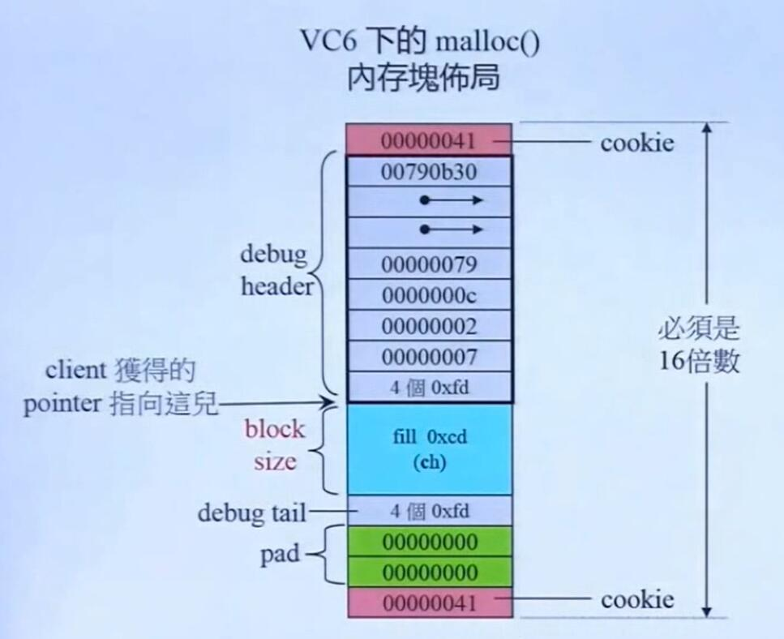

malloc 分配的内存头尾各带一个cookie，每个cookie 4个字节，cookie用来计算区块的大小。上图每个小块 4个字节，浅蓝色是申请的大小有 12个字节(ch)。

### V6 6 的 std::allocator

vc6 的 allocator 只是以 ::operator new 和 ::operator delete 完成 allocate和 deallocate，没有任何特殊设计

### G2.9 的 std::allocator

G2.9 容器使用的分配器不是 std::allocator 而是 std::alloc。

在G4.9中 的 std::alloc 被换成了 `__gnu_cxx::__pool_alloc` 。更高版本的GC不太清楚。目前主要是学习这种内存管理的思路。 std::alloc的最大的好处就是可以去除cookie

### pool_alloc 和 std::allocator对比

在 gcc version 7.5.0 (Ubuntu 7.5.0-3ubuntu1~18.04) 
下测试

#### c++内存边界对齐

* C++ 存在边界对齐，在默认情况下(不清楚能不能改)。按照自然边界进行对齐，自然边界指的是以最大的数据长度对齐

eg：

```c++
struct Base{
// Base 大小设置为 16个字节
int x;
char y,z;
};
/*
sizeof(Base);  的结果为:

测试类型的大小 8

(char 一个字节， int 4个字节，但是以 int 的大小进行边界对齐，所以结果为 8 个字节)
*/
```

#### 不同分配器的对比

```c++
#include<ext/pool_allocator.h>
struct Base{
// Base 大小设置为 16个字节
double x;
};
template<typename Alloc>
void test_cookies(Alloc alloc, size_t n){
/*
 *alloc : 使用的分配器
 *size: 分配数据个数
 */
	typename Alloc::value_type *p1,*p2,*p3;
	p1 = alloc.allocate(n);
	p2 = alloc.allocate(n);
	p3 = alloc.allocate(n);

	// 申请三个指针,查看地址
	cout<<"p1:"<<p1<<endl;
	cout<<"p2:"<<p2<<endl;
	cout<<"p3:"<<p3<<endl;

	// 释放内存
	alloc.deallocate(p3,sizeof(typename Alloc::value_type)); 
	alloc.deallocate(p2,sizeof(typename Alloc::value_type)); 
	alloc.deallocate(p1,sizeof(typename Alloc::value_type)); 
};	

void test(){
	typedef Base test_type;
	cout<<"测试类型的大小 "<<sizeof(test_type)<<endl;
	// 使用 pool_alloc
	cout<<"使用 __pool_alloc"<<endl;
	test_cookies(__gnu_cxx::__pool_alloc<test_type>(),1);
	// 使用  std::allocator
	cout<<"\n使用 std::allocator"<<endl;
	test_cookies(std::allocator<test_type>(),1);

	// 使用 普通的 new 和 delete 表达式
	cout<<"使用 普通 new 和 delete"<<endl;
	test_type * p1 = new test_type;
	test_type * p2 = new test_type;
	test_type * p3 = new test_type;
	cout<<"p1:"<<p1<<endl;
	cout<<"p2:"<<p2<<endl;
	cout<<"p3:"<<p3<<endl;

}	


/* 
结果
测试类型的大小 8
使用 __pool_alloc
p1:0x55e09dab5280
p2:0x55e09dab5288
p3:0x55e09dab5290

使用 std::allocator
p1:0x55e09dab53d0
p2:0x55e09dab53f0
p3:0x55e09dab5410
使用 普通 new 和 delete
p1:0x55e09dab53d0
p2:0x55e09dab53f0
p3:0x55e09dab5410
*/
```

* 对每个元素，pool_allocator 分配的大小就是类型实际占用的字节数
* std::allocator 底层是直接使用 malloc分配内存，对于 8 个字节大小的内容，实际分配的空间是 32 个字节(cookie + 页管理机制)
* 对于 pool_allocator ，经过实际测试,如果 size<8, 那么分配的大小仍然为8，如果size > 8 会报错。所以我这里推测，pool_allocator可能固定给每个单元分配 8 个字节的内存
* 关于 cookie的大小 在当前环境下(64位操作系统)，cookie 大小可能是 8 个字节，前后cookie共16个字节。我们看到 当 Base 的 size 为 8
 的时候，加上 cookie 共 24个字节。由于实际内存必须是 16 的倍数(页管理机制)，所以实际分配32 个字节。
当我把 Base 的 size 调整 为 32个字节的时候，我发现实际分配的大小为48个字节，所以我认为每一个 cookie占 8 个字节，根据环境不同可能有所区别。

关于 cookie 大小的代码印证

```c++
struct Base{
// Base 大小设置为 16个字节
double x,y,z,a;
};
/*
把 Base 大小改为32个字节之后
测试类型的大小 32

使用 std::allocator
p1:0x55a187a7c280
p2:0x55a187a7c2b0
p3:0x55a187a7c2e0
使用 普通 new 和 delete
p1:0x55a187a7c280
p2:0x55a187a7c2b0
p3:0x55a187a7c2e0

*/
```

代码2 用16进制把内存数据打印出来

```c++
Base(){
	a = 1;
	b = 2;
	c= 3;
	d = 4;
	e =5;
	f =6;
	g =7;
	h = 8;
}
int  a,b,c,d,e,f,g,h;
};

void test(){
	typedef Base test_type;
	cout<<"测试类型的大小 "<<sizeof(test_type)<<endl;
	// 使用 普通的 new 和 delete 表达式
	cout<<"使用 普通 new 和 delete"<<endl;
	test_type * p1 = new test_type;
	test_type * p2 = new test_type;
	test_type * p3 = new test_type;
	cout<<"p1:"<<p1<<endl;
	cout<<"p2:"<<p2<<endl;
	cout<<"p3:"<<p3<<endl;
	// 把 p1 的内容打印出来 , 共 32个字节,从高字节到低字节打印
	for(int i =5;i>=-1;i--){
			for(int j=7;j>=0;j--){
	printf("%02x", *((char*)p1+i*8+j));
	
	}
			printf("\n");
	}

	delete p1;
	delete p2;
	delete p3;

}	
/*
输出结果为：
测试类型的大小 32
使用 普通 new 和 delete
p1:0x55aa879b6280
p2:0x55aa879b62b0
p3:0x55aa879b62e0
0000000000000031
0000000000000000
0000000800000007
0000000600000005
0000000400000003
0000000200000001
0000000000000031
*/

/*
ps : 自下而上，地址递增，
自左向右边，地址递增。小端存储
*/
```

出于好奇心，我印证了一下自己的想法

从输出结果来看(个人分析)

* p1指针，一开始指向了 0000000200000001, 由 p1 和 p2地址的差值，我们可以得出 一共分配的内存是 48个字节(一行8个字节)
* 事实上 在执行 new p1 操作时，真正分到的地址数据是:

  ```c++
	0000000000000000
	0000000800000007
	0000000600000005
	0000000400000003
	0000000200000001
	0000000000000031

	// 或者是: (具体哪一种不是很清楚)
	0000000000000031
	0000000000000000
	0000000800000007
	0000000600000005
	0000000400000003
	0000000200000001

  ```
* 和我推断的一样，cookie是8个字节，这里首部的 cookie 是 0000000000000031，这里 a1 = 3 表示接下来的地址空间有 3*16 = 48 个字节。而 a0=1表示这块地址被占用了。free的时候直接把 a0 设置为 0；
* 尾 cookie 是 0000000000000000 ， 如果 Base 的 size 只有 8 的话 ，分配的内存是 32字节(不是16字节！)，仍然有这个 0000000000000000 ，(剩下两个字节是 padding，为了保持16的倍数) 因此我推断它是尾cookie(可能和上面的那张图有点出入，但是实验结果是这样的)

## G2.9 std::alloc

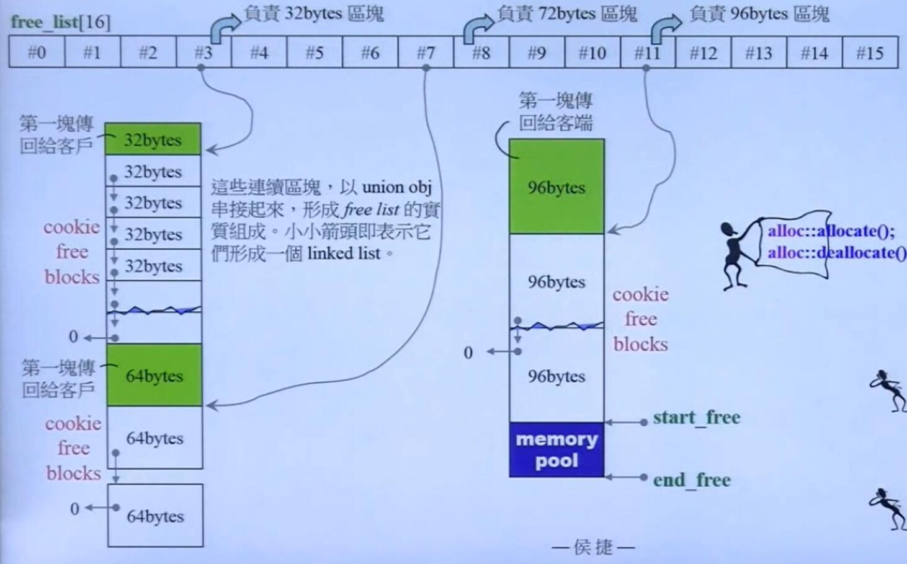

* 分配出去的内存都是 8 的倍数，比如如果是 6 那么会分配8
* alloc 负责的内存范围是 8-128 bytes(二级分配器) ,如果 超出 128 B, 就调用 malloc(一级分配器)
* 每一个大小下面挂着一个链表，链表采用的是内嵌指针(之前的简单 allocator实现过 embedded pointer)。
  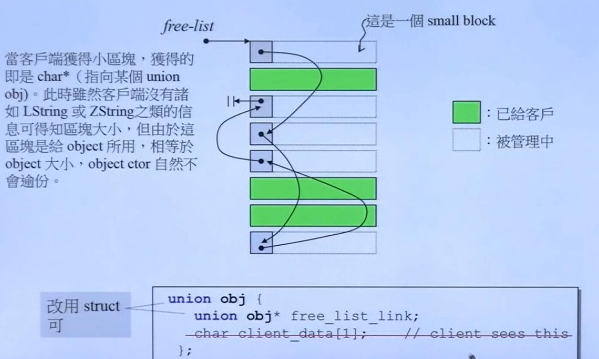

* 第一次分配一般会用 malloc 拿 20 块的空间(20 可能是经验)分给相应的size,同时拿20块的空间作为后备池(等到下次有新的请求的时候直接分给它不需要再调用 malloc), 也就是说一次拿 40块
* std::alloc 有一个重要的概念就是后备池，后备池的内存不属于任何一条链表，当有新的allocate需求并且freelist里不能提供需求的时候，会从后备池中拿内存。
* 当从后备池中拿内存的时候，最多一次拿 20 块资源，当不足20块的时候，能给多少给多少，如果一块都给不了，alloc会把后备池中的内存碎片接到freelist合适的位置上(内存碎片处理),然后用malloc重新申请内存，重新申请的内存作为后备池，然后重新执行分配。
* 如果malloc失败(目前计算机内存较大，很少发生这种情况)，那么在 allocate的时候，alloc会沿着freelist向size更大的方向寻找，取下freelist已经挂着的一块内存，作为后备池，然后重新进行分配。
* std::alloc 的运行逻辑就是，调用 allocate的时候，先尝试着从 freelist上取内存，如果freelist不能满足需求，从后备池中取内存挂到freelist上，如果后备池也不能满足需求，那么先处理后备池的内存碎片(挂到freelist合适的地方)，再调用malloc 补充后备池，然后再尝试从后备池取资源。

ps: (以上请结合源代码和下面的运行过程理解)

### std::alloc 运行过程

step 1 :

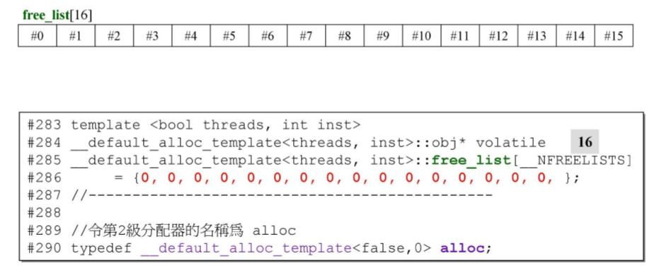

* 初始化 freelist 下没有挂任何内存块链表。freelist下挂着 16 条链表，每条链表的节点是固定大小的内存块。16条链表依次是 8,16,24.....128 bytes

step 2 :

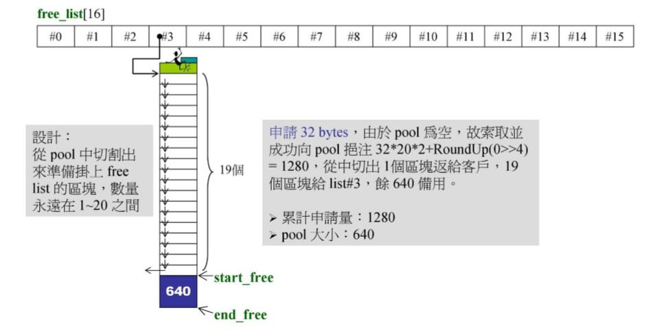

* 申请32个byte，因为freelist为空，从后备池中拿内存，后备池也为空，调用malloc，空申请了 32*20*2 = 1280 放到后备池里。然后重新再次进行分配
* 再次分配的结果就是 640 个 字节，被挂到相应的freelist上，后备池还剩下 604 byte
* RoundUp(0>>4), 后面这一项是指追加两，其将我们已经申请的内存 /16(右移4位)并调整到8的边界。

step3 : 

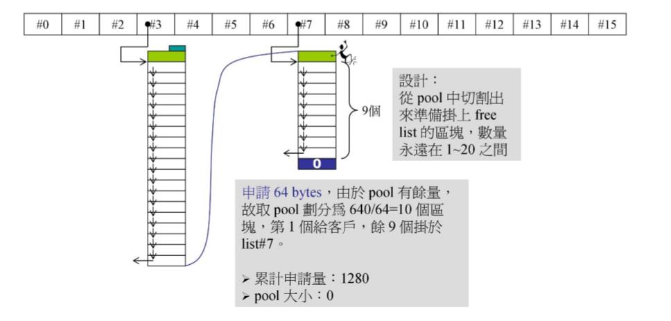

* 又申请了 64 byte, freelist没有相应的内存块，从后备池中取
* 后备池中剩余640 byte, 能够分出10个内存块。直接将后备池分给freelist。此时后备池为0

step 4 : 

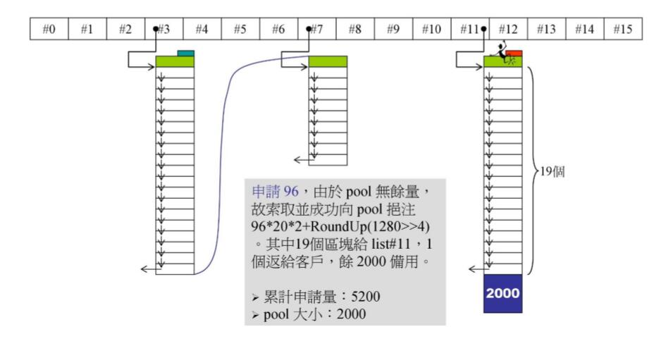

ps :  类似 step2

step 5 : 

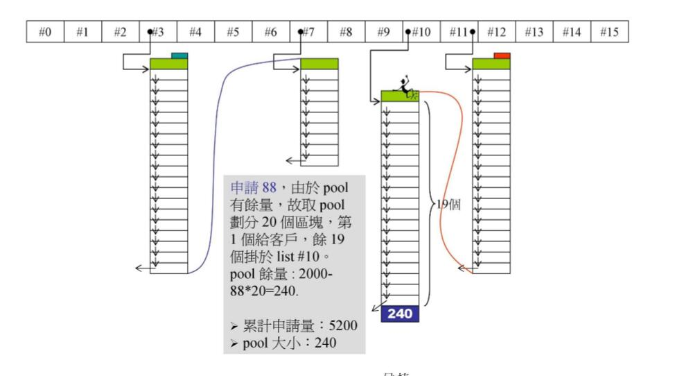

ps :  类似 step3

step 6 :

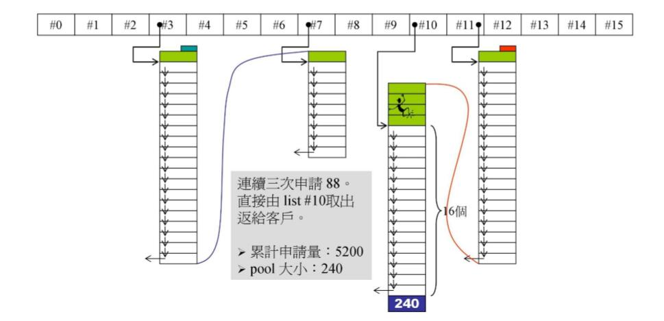

* 申请 88个 byte的内存，由于 freelist上已经有内存块链表了，直接 从 list#10 取出给用户

step7 :

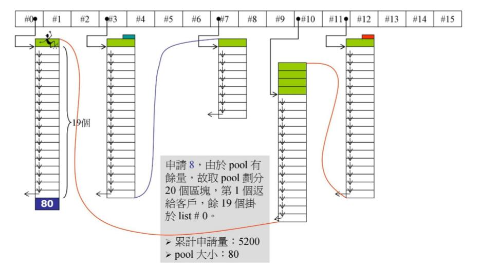

ps : 类似 step 3

step 8 : 

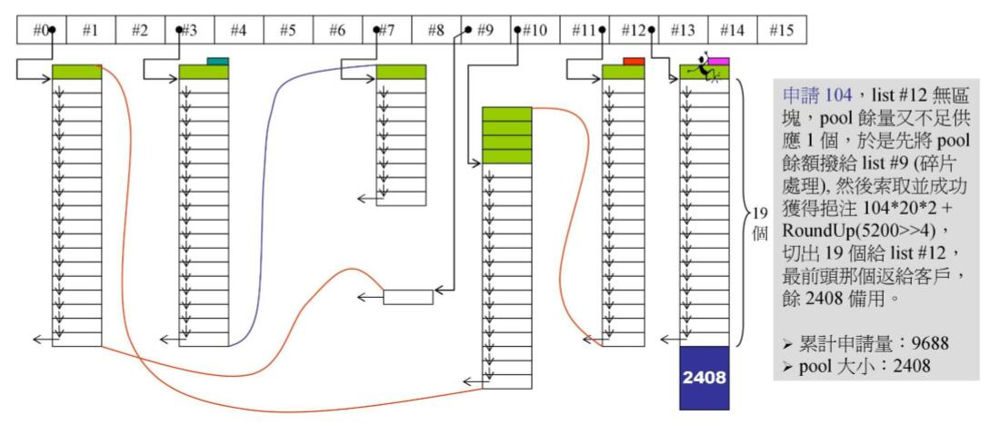

* 和 step2 有所不同，再申请 104 byte内存， list#12为空，战备池有内存，但是**不足** 104 byte, **产生了内存碎片**！
* 处理内存碎片的方法，将剩余的后备池在freelist上寻找合适的list。(因为每次申请都是 8 的倍数，每次分配也都是8的倍数，所以剩余的一定也是8的倍数，freelist上一定有合适的大小等于后备池的剩余量)。把后备池挂到对应的 list 上，在这里 后备池剩余 80 byte,挂到 list#10上
* 处理完内存碎片之后，再执行 step 2 的操作

step 9 : 

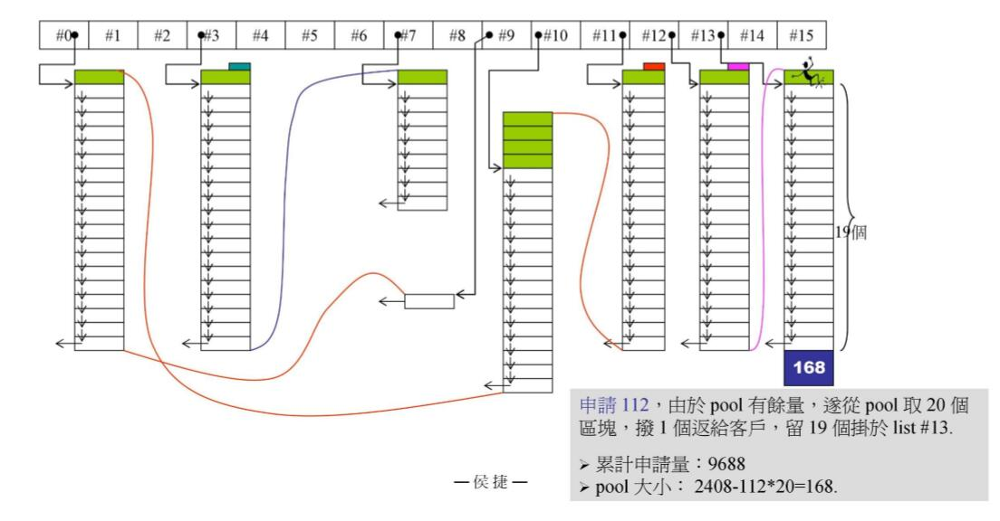

类似 step 3

step 10 : 

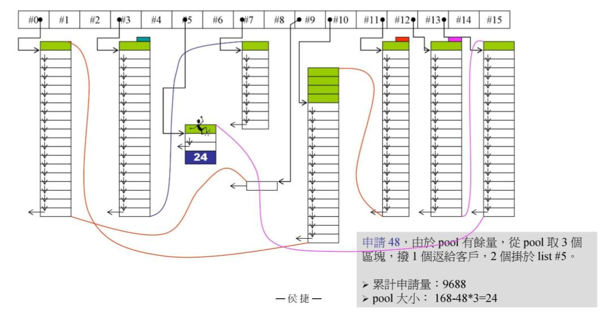

类似 step 10 

step 11 : 

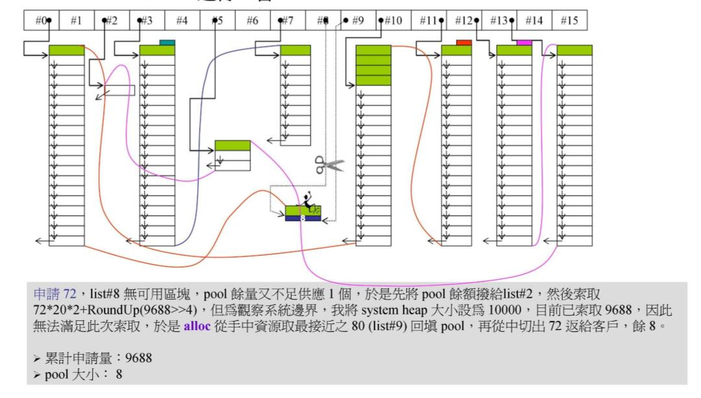

类似 step 8

step 12: 

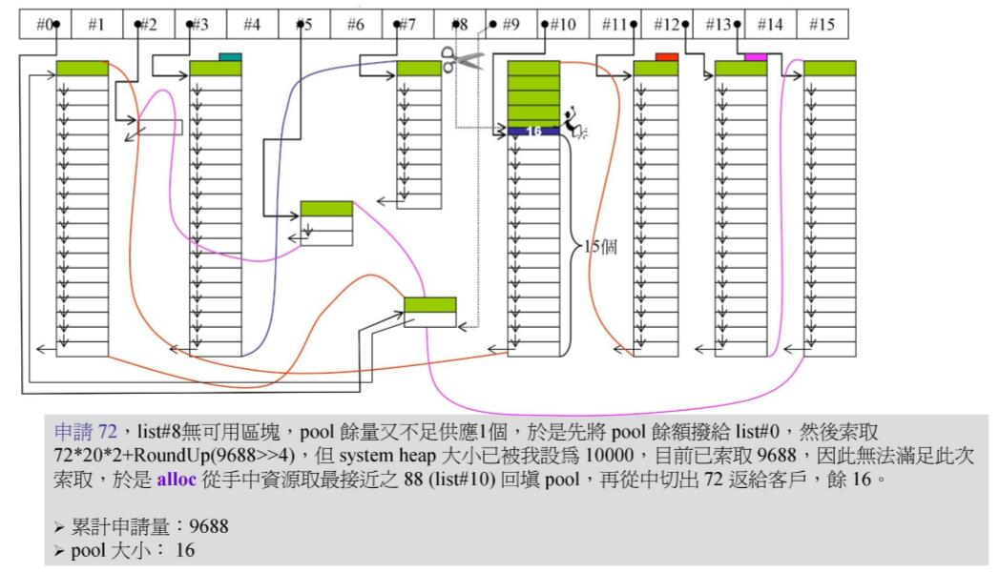

* 类似与 step8 ，处理完 内存碎片之后，调用 malloc,但已经无法通过 malloc 获得内存了！
* 此时， alloc，尝试用已有的资源来满足需求，于时 alloc 验证 freelist 向上寻找(size 变大) 最接近 所要求内存块大小的 list, 这里申请 72, list#9下没有内存块，找到了 list#10 (88), 从 list#10上取下一个内存块 **填充后备池**
* 填充后备池之后，再次执行分配动作，显而易见，分配72给客户，后备池剩下 16

step 13 : 


* 申请 120， 但是已经 无法从后备池，从 malloc，从 freelist上获取内存了，于时内存分配失败！

几个思考:

* 现在从图上看，还有很多"可用内存"，但是这些内存是不能拿来供应 120 的，因为 内存块链表通过指针链在一起，并不是连续的内存。如果真的要这么做，势必要先将小的内存块合并成大的内存块再进行分配，但是这样做技术难度极大。(用链表，链表长度未知)
* malloc 只是无法拿到连续的 20块内存(在这里应该是 120*20*2 + roundup),但是不代表一个内存块都取不出来，为什么不尝试分配小一点的内存块呢？从现代操作系统 多道(multiprogramming)的角度来说，操作系统并不只是满足这一个进程，这样无所不用其极地拿内存，会给其它进程带来灾难。
* std::alloc 并没有将申请到的内存还给操作系统。因为 free必须要有 cookie，但如图所示，各个内存块链表都是通过内嵌指针串在一起的，不带有cookie(这是 alloc的优点)。因此 free的技术难度很大。无法将内存还给操作系统也是 alloc 受争议的地方。
* alloc 里我们可以看到很多操作系统连续内存管理的思想

### std::alloc 源码解析

直接放带有侯捷大神注释和简化的 alloc的源代码，一起来欣赏一下世界级团队的优雅之作！

```c++
// author : Hou Jie (侯捷)
// date : 2015/11/11 
// compiler : DevC++ 5.61 (MinGW with GNU 4.9.2)
//
// 說明：這是侯捷 E-learning video "C++內存管理" 的實例程式.
//
// filename : allocc.h
// 取材自 SGI STL 2.91 <stl_alloc.h>, 移植至 C language.


#include <stdlib.h>  //for malloc(),realloc()
#include <stddef.h>  //for size_t
#include <memory.h>  //for memcpy()

//#define __THROW_BAD_ALLOC   cerr << "out of memory" << endl; exit(1)
#define __THROW_BAD_ALLOC   exit(1)

//----------------------------------------------
// 第1級配置器。
//----------------------------------------------

void (*oom_handler)() = 0;

void* oom_malloc(size_t n)
{
  void (*my_malloc_handler)();
  void* result;

  for (;;) {    //不斷嘗試釋放、配置、再釋放、再配置…
    my_malloc_handler = oom_handler;
    if (0 == my_malloc_handler) { __THROW_BAD_ALLOC; }
    (*my_malloc_handler)();    //呼叫處理常式，企圖釋放記憶體
    result = malloc(n);        //再次嘗試配置記憶體
    if (result) return(result);
  }
}

void* oom_realloc(void *p, size_t n)
{
  void (*my_malloc_handler)();
  void* result;

  for (;;) {    //不斷嘗試釋放、配置、再釋放、再配置…
    my_malloc_handler = oom_handler;
    if (0 == my_malloc_handler) { __THROW_BAD_ALLOC; }
    (*my_malloc_handler)();    //呼叫處理常式，企圖釋放記憶體。
    result = realloc(p, n);    //再次嘗試配置記憶體。
    if (result) return(result);
  }
}

void* malloc_allocate(size_t n)
{
  void *result = malloc(n);   //直接使用 malloc()
  if (0 == result) result = oom_malloc(n);
  return result;
}

void malloc_deallocate(void* p, size_t n)
{
  free(p);  //直接使用 free()
}

void* malloc_reallocate(void *p, size_t old_sz, size_t new_sz)
{
  void* result = realloc(p, new_sz); //直接使用 realloc()
  if (0 == result) result = oom_realloc(p, new_sz);
  return result;
}

void (*set_malloc_handler(void (*f)()))()
{ //類似 C++ 的 set_new_handler().
  void (*old)() = oom_handler;
  oom_handler = f;
  return(old);
}

//----------------------------------------------
//第二級配置器
//----------------------------------------------

enum {__ALIGN = 8};                        //小區塊的上調邊界
enum {__MAX_BYTES = 128};                  //小區塊的上限
enum {__NFREELISTS = __MAX_BYTES/__ALIGN}; //free-lists 個數

// union obj {                   //G291[o],CB5[x],VC6[x]
//   union obj* free_list_link;  //這麼寫在 VC6 和 CB5 中也可以，
// };                            //但以後就得使用 "union obj" 而不能只寫 "obj"
typedef struct __obj {
  struct __obj* free_list_link;
} obj;

char*   start_free = 0;
char*   end_free = 0;
size_t  heap_size = 0;
obj* free_list[__NFREELISTS]
     = {0, 0, 0, 0, 0, 0, 0, 0, 0, 0, 0, 0, 0, 0, 0, 0 };

size_t ROUND_UP(size_t bytes) {
    return (((bytes) + __ALIGN-1) & ~(__ALIGN - 1));    // 这里做的先让其进位，然后将末尾设为0，就可以实现 round up 效果
}
size_t FREELIST_INDEX(size_t bytes) {
    return (((bytes) + __ALIGN-1)/__ALIGN - 1);
}

//----------------------------------------------
// We allocate memory in large chunks in order to
// avoid fragmentingthe malloc heap too much.
// We assume that size is properly aligned.
//
// Allocates a chunk for nobjs of size "size".
// nobjs may be reduced if it is inconvenient to
// allocate the requested number.
//----------------------------------------------
//char* chunk_alloc(size_t size, int& nobjs)  //G291[o],VC6[x],CB5[x]
char* chunk_alloc(size_t size, int* nobjs)
{
  char* result;
  size_t total_bytes = size * (*nobjs);   //原 nobjs 改為 (*nobjs)
  size_t bytes_left = end_free - start_free;

  if (bytes_left >= total_bytes) {
      result = start_free;
      start_free += total_bytes;
      return(result);
  } else if (bytes_left >= size) {
      *nobjs = bytes_left / size;         //原 nobjs 改為 (*nobjs)
      total_bytes = size * (*nobjs);      //原 nobjs 改為 (*nobjs)
      result = start_free;
      start_free += total_bytes;
      return(result);
  } else {
      size_t bytes_to_get =
                 2 * total_bytes + ROUND_UP(heap_size >> 4);
      // Try to make use of the left-over piece.
      if (bytes_left > 0) {
          obj* volatile *my_free_list =
                 free_list + FREELIST_INDEX(bytes_left);

          ((obj*)start_free)->free_list_link = *my_free_list;
          *my_free_list = (obj*)start_free;
      }
      start_free = (char*)malloc(bytes_to_get);
      if (0 == start_free) {
          int i;
          obj* volatile *my_free_list, *p;

          //Try to make do with what we have. That can't
          //hurt. We do not try smaller requests, since that tends
          //to result in disaster on multi-process machines.
          for (i = size; i <= __MAX_BYTES; i += __ALIGN) {
              my_free_list = free_list + FREELIST_INDEX(i);
              p = *my_free_list;
              if (0 != p) {
                  *my_free_list = p -> free_list_link;
                  start_free = (char*)p;
                  end_free = start_free + i;
                  return(chunk_alloc(size, nobjs));
                  //Any leftover piece will eventually make it to the
                  //right free list.
              }
          }
          end_free = 0;       //In case of exception.
          start_free = (char*)malloc_allocate(bytes_to_get);
          //This should either throw an exception or
          //remedy the situation. Thus we assume it
          //succeeded.
      }
      heap_size += bytes_to_get;
      end_free = start_free + bytes_to_get;
      return(chunk_alloc(size, nobjs));
  }
}
//----------------------------------------------
// Returns an object of size n, and optionally adds
// to size n free list. We assume that n is properly aligned.
// We hold the allocation lock.
//----------------------------------------------
void* refill(size_t n)
{
    int nobjs = 20;
    char* chunk = chunk_alloc(n,&nobjs);
    obj* volatile *my_free_list;   //obj** my_free_list;
    obj* result;
    obj* current_obj;
    obj* next_obj;
    int i;

    if (1 == nobjs) return(chunk);
    my_free_list = free_list + FREELIST_INDEX(n);

    //Build free list in chunk
    result = (obj*)chunk;
    *my_free_list = next_obj = (obj*)(chunk + n);
    for (i=1;  ; ++i) {
      current_obj = next_obj;
      next_obj = (obj*)((char*)next_obj + n);
      if (nobjs-1 == i) {
          current_obj->free_list_link = 0;
          break;
      } else {
          current_obj->free_list_link = next_obj;
      }
    }
    return(result);
}
//----------------------------------------------
//
//----------------------------------------------
void* allocate(size_t n)  //n must be > 0
{
  obj* volatile *my_free_list;    //obj** my_free_list;
  obj* result;

  if (n > (size_t)__MAX_BYTES) {
      return(malloc_allocate(n));
  }

  my_free_list = free_list + FREELIST_INDEX(n);
  result = *my_free_list;
  if (result == 0) {
      void* r = refill(ROUND_UP(n));
      return r;
  }

  *my_free_list = result->free_list_link;
  return (result);
}
//----------------------------------------------
//
//----------------------------------------------
void deallocate(void *p, size_t n)  //p may not be 0
{
  obj* q = (obj*)p;
  obj* volatile *my_free_list;   //obj** my_free_list;

  if (n > (size_t) __MAX_BYTES) {
      malloc_deallocate(p, n);
      return;
  }
  my_free_list = free_list + FREELIST_INDEX(n);
  q->free_list_link = *my_free_list;
  *my_free_list = q;
}
//----------------------------------------------
//
//----------------------------------------------
void* reallocate(void *p, size_t old_sz, size_t new_sz)
{
  void * result;
  size_t copy_sz;

  if (old_sz > (size_t) __MAX_BYTES && new_sz > (size_t) __MAX_BYTES) {
      return(realloc(p, new_sz));
  }
  if (ROUND_UP(old_sz) == ROUND_UP(new_sz)) return(p);
  result = allocate(new_sz);
  copy_sz = new_sz > old_sz? old_sz : new_sz;
  memcpy(result, p, copy_sz);
  deallocate(p, old_sz);
  return(result);
}
//----------------------------------------------
```

从上面的源代码中我们能学到不少东西

1. if 语句条件判断的写法 eg `if (0 == start_free)`, 把常量写在左边，可以避免将 == 写 成 = (因为如果真的出错了，编译会报错)是一个很好的编程习惯
2. 巧用递归。在前面的描述中，一直提到了不论是从 malloc中取内存，还是沿着freelist找内存，都是先填充 后备池，然再执行相同的操作。在代码里体现在 chunk_alloc 中的递归操作。
3. 对于第2点，从架构的角度，在写代码的时候，可以将不同分支的公共操作抽出来，并放在最后，当各个分支执行相应操作，满足相应条件之后，用递归来执行公共操作，可以让代码变得很优雅。

### std::alloc 总结

优点 : 

1. 减少了 cookie 带来的空间损耗
2. 巧用 后备池的概念，巧用递归，让代码变得很优雅
3. 结合 freelist 和 后备池减少了 malloc的调用次数。
4. 结合 freelist 和 后备池 进行了**较好的内存碎片处理**

缺点 :

1. 当有较大内存块需求的时候，无法合并小内存块来满足需求。
2. 无法将申请到的内存还给操作系统
3. 上述两点缺陷是 std::alloc的先天缺陷，产生的原因是 std::alloc 用链表来将内存块组织起来。

注意点 :

1. 分配器一般是服务于容器的。而不是直接给程序员使用
2. 用分配器分配数组 (eg int* a = new int[5]),这是我之前的一个疑惑。分配数组也是直接拿整个数组大小的内存块，而不是一次一次地拿。(对应与 vector)