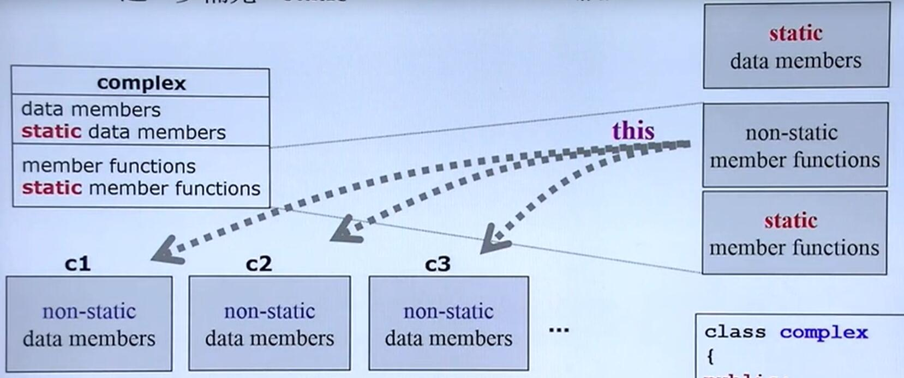
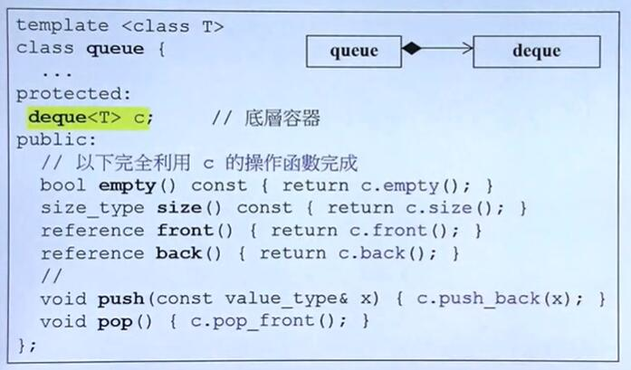
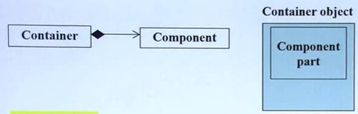
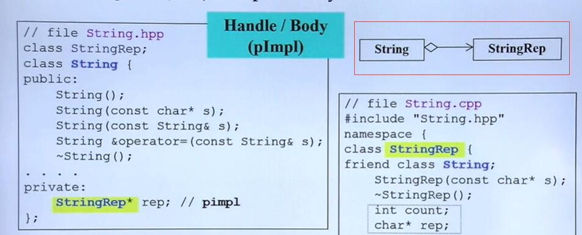
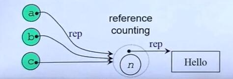
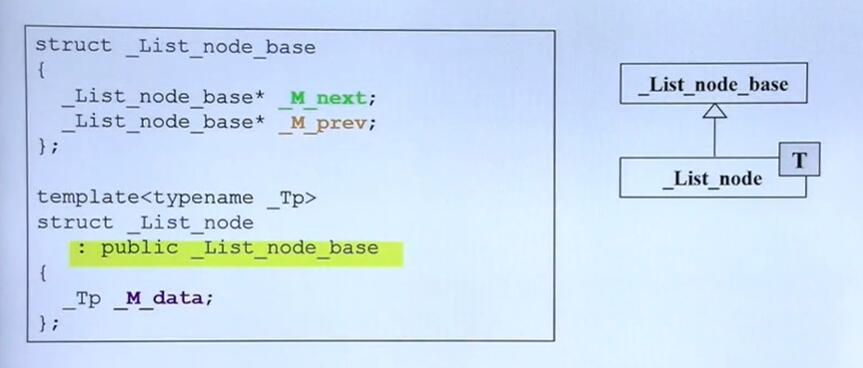

# C++复习之面向对象的编程

@author chonepieceyb 

## 1. 基于对象的设计(基于单个类)

### 1.1. 头文件的正规写法

```c++
#ifndef _COMPLEX_
#define _COMPLEX_
// 防卫式生成

// part 0 前置声明 （一些# include，一些后面要用到的声明

....

// part 1 类声明 class declaration

// part 2 类定义 class definition

#endif
```

### 1.2. inline 函数

* 如果函数直接定义在类里，那么这个函数会被当做**inline**函数。

* 但是过分复杂的函数无法变成**inline** function ,即使加上了**inline**关键字，是否真正是**inline**函数也由编译器决定

### 1.3. 构造函数

* 函数名称一定要和类的名称相同
* 构造函数没有返回值
* 如果没有构造函数，编译器会有一个默认的构造函数
* 如果自己定义了构造函数，编译器就不会再保留默认的版本（在C++11之后,可以用`=delete`获得默认版本）

* 构造函数的参数可以设置默认参数，如果参数都有默认值或者没有参数，那么该函数就变成默认构造函数。(默认构造函数只能有**一个**)
* 构造函数建议采用初始化参数列表(initialization list) eg `complex(double r =0, double i =0):re(r), im(i)`
  * 初始化参数列表的赋值会早于函数体内的赋值(这是两个阶段，也就是会先执行初始化参数列表，再执行函数体)
* 构造函数可以重载(可以有很多种构造函数)
* 把构造函数设为private,那么外界不能创建该类的实例。但是可以用在**单例**设计模式上。

### 1.4. const member functions

eg: `double real()const{return re;}`(这是一个成员函数)

* const成员函数表明这个函数不会改变数据内容
* 如果上述函数不加const
  
  ```c++
  {
     const complex c1(2,1);
     cout<< c1.real(); 
     //如果不加const 上述用法编译器会报错
     //，因为 const complex表明 complex的内容不应该发生变化
     // 但是 c1.real()这个函数
     // 没有显式告诉编译器
     // 这个函数不改变数据
     // 所以 real必须为const member function
  } 
  ```

### 1.5. 参数传递: pass by value vs pass by referenct (to const)

* 传值和传引用的区别只可意会不可言传`^_^`
* 引用的底部是用指针实现的，引用又成为别名，一个数据的引用和该数据可以看成是一个东西，两者是同步的(引用的值更改了，本体的值也会更改)。

* 尽量采用传引用的方式来传参数，特别是参数是一个对象(可以提升效率)。

* 传引用加上`const`限定符，既保证效率又保证安全性(保证一定不会修改数据) eg:`complex& operator +=(const complex&)`

### 1.6. 返回值传递: return by value vs return by reference(to const)

eg `complex& operator +=(const complex&)`

* 如果可以的话，返回值尽量用reference
* 什么时候可用用reference?
  函数的运算结果可能有两种情况:
  1. 运算结果放在一个已经存在的地方(eg a+=2的运算结果会赋给a)
  2. 运算结果必须创建一个新的空间(eg a+2 在实现的时候，函数内部应该会新创建一个变量用来保存 a+2的结果)
  对于 1，应该返回引用。对于2.因为函数要新建一个local变量，并且要返回这个local变量，函数结束这个local变量就消失了，这时候肯定不能用引用返回(local变量都没了引用个啥)，只能用值返回(编译不会报错，但是容易错)。换言之局部变量不能返回引用
  3. 如果传入的参数加了**const**限定符，那么不能直接返回该参数的引用，如果要返回该参数的引用必须在返回值加上**const**限定符(const 一致性，确保不修改数据，直接返回reference，导致了修改的可能)

      ```c++
        // 下面的函数编译会出错，不满足编译一致性原则
        int& testfunc(const int& a)
        {
          return a ;   
        }
        //下面的函数就正确了
        const int& testfunc(const int& a){
          return a;
        }

        //同理下面的也是错的
        int* testfunc(const int& a){
          return &a;  // 如果返回值 改成 const int* 那么就正确了
        }
      ```
  
  4. 如果函数的参数是采用值传递，不能直接返回参数的引用。

* 关于返回引用（指针）的两大准则（个人总结可能不一定准确）
  1. 不返回临时变量的指针或者引用(临时变量指的是函数结束之后其内存就被销毁了)
  2. const 一致性准则。如果声明了 const 就要保证 **函数定义**和**返回值**没有潜在的修改数据的可能(如前面的例子)，必要时用 const加以限制。

### 1.7. friend(友元)

* **友元函数**可以自由取得 **friend** 的 private 成员，friend打破了封装。
* 相同 class 的各个 objects 互为 **friends**(友元) (还真不知道`>_<`)
* 友元关系不能被继承
* 友元是单向的
* 友元关系不具备传递性

  ```c++
  class complex
  {
      public:
      complex(double r =0, double i =0):re(r),im(i){}
      int func(const complex& param){
          return param.re + param.im;  
          // 可以直接拿私有成员变量
          // 我还真不知道 emmm
      }
      private:
        double re,im;
  }
  ```

### 1.8. 操作符重载

`retType operator[操作符] (...);`  // 操作符重载的格式

* 成员函数操作符重载
  所有的成员函数参数有隐藏的一个this指针。

  ```c++
  inline complex&
  complex::operator += (this,const complex& r){
    return _doap1(this,r);    // this是成员函数隐藏的指针
    // 对于c2+=c1 -> c2.operator+=(c1);
  }
  ```

  * 链式调用 `a+=b+=c` -> `a.operator+=(b.operator+=(c))` 
  * 采用成员函数操作符重载，就意味着一定有一个参数是`this`指针，就意味着可能无法实现`c2 = 7+c1`这种操作

* 非成员函数操作符重载
  * 非成员函数的重载不带this指针
  * 非成员函数操作符重载用来应付各种情况 eg: `c2 =c1+c2, c2 = c1+5, c2=7+c1`

    ```c++
    inline complex // 在前面值返回和引用返回所述，这里不能用引用返回,只能返回值
    operator + (const complex& x,double y )
    {
      return complex(real(x)+y, imag(x));
    }
    // a+b -> operator +(a,b)
    ```

* 流操作符的重载 (<< 和 >>)

  流操作符重载比较特殊 eg:

  ```c++
  ostream& operatoe << (ostream& os, const complex& x)
  {
    return os <<'(' << real(x) << ',' << imag(x) << ')';
  }
  ```

  * 流操作符重载不能写成成员函数
  * 流操作符重载，流对象不能加**const**限定符(因为在函数体内 ostream对象会发生改变)
  * 流操作符应该返回**流对象的引用**，并且返回值不能加const限定符(为了支持 cout<< c1 << c2,这种连续输出)
  * 可以设置流操作符重载函数为友元(不是成员函数)，方便获取数据

### 1.9. 临时对象，temp object

`typename()` 临时对象，下一行就被销毁了，经常用在返回值，实际上调用了构造函数，标准库常用该语法
eg `complex(2,3)`  

### 1.10. BigThree, 三个特殊函数

复制构造函数(copy ctor)，拷贝赋值(copy op=)，析构函数(dtor)，

* 复制构造函数 `String(const String& s)` 
  复制构造函数，先分配足够的空间，再复制内容

使用情形:

  ```c++
    {
      String s1("hello")
      String s2(s1)  ;  // copy ctor
      String s2 = s1  ;  // copy ctor
    }
  ```

* 拷贝赋值 `String& operator=(const String& str)`
  拷贝赋值的写法和拷贝复制有所区别，eg:`s1 =s2`需要:
    1. 先delete掉 s1的内容
    2. 将s2的内容复制到s1(深拷贝)
    3. 需要检测自我赋值的可能(为了效率和正确性)
  ps: 拷贝赋值和拷贝复制是**有区别**的，拷贝复制不需要delete原始的内容，所以拷贝赋值和拷贝复制都必须要自己实现。

  ```c++
    inline
    String& String:: operator=(const String& str)
    {
      if(this == &str)
        return *this;    //大家风范的写法，检测是否存在自我赋值
                        //一定要检测自我赋值否则结果会出错
      delete[] m_data; // 先delete掉原本的内容
      m_data = new char[strlen(str.m_data)+1]
      strcpy(m_data,str.m_data);
      return *this;
    }
  ```

* 析构函数 `~String();` 如果有指针变量需要在析构函数里手动`delete`申请的内存，或者其它资源比如文件，窗口等

#### 1.10.1. 如果类里有**指针变量**一定要自己写BigThree

* 编译器的默认拷贝构造函数是**一个字节一个字节**地复制。
* 如果采用默认的copy opt(或者copy ctor), eg `str1 = str2`, str2的指针变量和str1的指针变量(str1的指针和str2的指针相同)会指向str1的内存区域。会导致
  1. 有两个指针指向相同区域
  2. 内存泄漏(没有指针指向str2原本的内存空间)
* 因为存在指针变量，所以在析构函数里必须手动delete申请的内存

#### 1.10.2. C++里的字符串

* 是一个char数组,可以表示为 `"hello", {'h','e','l','l','o','\0'}`
* 字符串结尾有一个 `'\0'`结束符
* `strlen()` 函数返回长度的时候不计算结束符的长度
* 在使用`strcpy()`，函数的时候切记不要忘记给结尾的`'\0'` 预留空间。

#### 1.10.3. 可能因为BigThree导致出错的地方

1. 手动调用的复制构造和赋值 `String s1 = s2` `s1 =s2`;
2. 函数采用**传值的方法传参** eg `void testfun(String s1)`;
3. 函数采用**传值的方法返回** eg `String testfun(String s1)`;

ps 2和3容易出错(以前在写C++实验的时候出错过),由于C++的机制，采用传值方式的时候涉及到"复制或者赋值"操作，所以容易出错。

### 1.11. C++ 内存管理(初级)

#### 1.11.1. Stack and Heap

* **Stack** 是存在与某作用域(scope)的一块内存空间(memory space),比如当我们能调用函数的时候，函数本身即会形成一个**stack**用来放置它所接受的参数，以及返回的地址。
在函数本体(function body)内声明的任何变量，其所使用的内存块都取自上述的stack
* **Heap** 或者称为 **system heap** ,是指由操作系统提供的一块**global**内存空间，程序可以通过**动态分配(dymatic allocated)** 从中获得若干内存块(blocks)

```c++
class Complex{...};
{
  Complex c1(1,2);   
  // c1所占用的空间来自stack，离开scope的时候会自动释放
  Complex* p = new Complex(3);
  // Compelx(3)占用的空间在heap，通过动态分配获得的，离开scope并
  // 不会自动释放，必须自己释放内存(delete)
}
```

#### 1.11.2. 几种不同的对象的生命周期

* **stack objects** (local object)

  ```c++
    class Complex {...};
    ....
    {
      Complex c1(1,2);
    }
  ```

  c1 是stack object，其生命在作用域(scope)结束之际结束。这种作用域内的object，又称为 auto object,会被自动清理

* **static local object**
  
  ```c++
  class Complex{..}

  {
    static Complex c2(1,2);
  }
  ```

  c2 是所谓的 static object ,其生命在作用域(scope)结束之后仍然存在，知道整个程序结束

* **golbal object**的生命期

  ```c++
  class Complex{..};
  Complex c3(1,2);
  int main()
  {
    ...
  }
  ```

  c3是所谓的global object其声明在升格程序结束之后才结束，所以可以视为一种 static object，其作用域是整个程序

* **heap object** 
  
  ```c++
  class Complex{...};
  ...
  {
    Complex* p = new Complex;
    ...
    delete p;
  }

  ```
  
  p **所指**的就是 heap object, 其生命在它被 **delete**之际结束(所以必须要手动delete)，指针p本身在scopy之外就死亡了，所以有new就必须有delete

#### 1.11.3. new  详解

new 本质上是用 malloc实现的，其过程 1 先分配 memory 2再调用 ctor

`Complex* pc  = new Complex(1,2);`
编译器转化为

```c++
Complex * pc;

// step1
void* mem = operator new( sizeof(Complex));   //分配内存
// 内部调用 malloc(n)

//step2 
pc = static_cast<Complex*>(mem);        // 强转
// step3
pc->Complex::Complex(1,2);   //构造函数
// Complex::Complex(pc,1,2) , pc其实就是 this
```

#### 1.11.4. delete 详解

delete: 先调用dtor,再释放memory

`delete ps;`
编译器转化为:

```c++
  String::~String(ps);  //析构函数,析构函数要释放堆对象(动态分配）的内存
  operator delete(ps); //释放内存(不会自动释放堆对象的内存)
  // 内部调用了 free(ps)
```

#### 1.11.5. 底层的内存分配(个人理解，不一定对)

一个类的所有的数据都被放在一个连续的内存块中(包括指针，指针本身占四个字节)，但是指针所指向的内存区域(放在堆中的，动态分配的内存)**并不是**放在这一连续的内存块中。所以系统能够释放掉这一连续的内存空间，但是无法释放不在这些连续内存空间里的动态分配得到的内存，必须在`dtor`中手动地delete掉这些动态分配的内存

#### 1.11.6. array new 要搭配 array delete

eg: `new int[3]` 要搭配 `delete[]`

为什么要用`delete[]`? 因为如果声明的是数组区域，内存里有一块(可能是一个字节.....或者其他)需要来存储数组的大小。

* 如果不用`delete`的话`dtor`只会调用一次。(造成内存泄漏)
* 如果用`delete[]`的话编译器读取内存里存放数组大小的区域，知道了数组的大小，就会调用 **3**次的 `dtor` 这样才不会造成内存泄漏。
* `delete`和`delete[]`都能够删除类所占的空间(不包含动态分配的空间)，但是类里面动态分配的空间必须通过调用`dtor`来删除，`delete`和`delete[]`的区别在于调用`dtor`的次数.

### 1.12. static

* 在类的数据加上static变成**static数据**
  静态的数据(或者方法)只有一份，eg:银行的利率只有一份，银行的利率应该设置成static
  **static**数据必须进行定义。(定义不等于声明，定义可以赋初值也可以不付初值，定义表示获得嫩村空间),因为static数据在实例创建之前就已经存在了
* 在类的方法前加上static变成**static方法**
  * 静态方法没有`this pointer`，所以静态方法**无法访问**非静态数据。(换言之，成员函数在类中只**保存一份**，但是成员函数能够处理各个对象实例的数据，就是因为成员函数中有this指针，this指针指向各个实例的data，让成员函数能够分别处理)
  * static 调用方法 1通过类的实例(如果有实例存在) 调用，2 通过类名调用



#### 1.12.1. static的典型应用 :单例设计模式

```C++
class A{
  public:
    static A& getInstance( ){return a};
    setup(){...}
  private:
    A();
    A(const A& rhs);
    static A a =A();     //唯一的实例
};

A::getInstance().setup();

// 更好的写法

class A{
  public:
    static A& getInstance( );
    setup(){...}
  private:
    A();
    A(const A& rhs);
};

A& A::getInstance(){
  static A a;
  return a;
}
A::getInstance().setup();
```

### 1.13. namespace(粗略)

可以简单理解为把函数，数据全部封在一个命名空间里，防止函数重名(因为必须要带上命名空间)

#### 1.13.1. 使用namespace

* **using directive** `using namespace std`
* **using declaration** `using std::cout`
* 普通使用 `std::cin<<;`

### 1.14. 写类的规范总结(经验,不一定全)

* 数据放在 private里
* 尽量用引用传参
* 可以的话尽量 用 reference 返回。
* 构造函数用 初始化参数列表
* 应该是const成员函数的应该加const(比如 get方法)
* 参数需要加const的应该要加const (保证不会修改数据(修改数据可能在**函数体**内也可能在**返回值**处，比如返回引用))
* 部分简单的函数，直接定义在类内 (比如部分的 get),或者设置成 inline
* 如果在类里使用了指针变量，一定要自己实现**Big Three**
* 有new 必须有 delete 
* array new 要搭配 array delete

## 2. 面向对象的编程(类和类之间的关系，初级)

### 2.1. Composition(复合)，表示 has-a

简单理解为一个类是另一个类的成员(UML里的组合，生命周期相同)


(适配器设计模式)

#### 2.1.1. Composition下的构造和析构



* 构造由内而外
  Container 的构造函数首先调用Component 的构造函数然后才执行自己。
  `Container::Container(...):Componet(){...} //辅助理解` 

* 析构由外而内
  Container 的析构函数首先执行自己，然后才调用Component的析构函数
  `Container::~Container(..){...,~Componet()};//辅助理解`

### 2.2. Delegation(委托). Composition by reference




* 简单理解:一个类有另一个类的reference()
(UML里的聚合，生命周期不同)
* pimpl : pointer implememtation
(可以指定不同的实现，编译防火墙)

### 2.3. Inheritance(继承)，表示 is-a



简单理解为：子类是父类的一种

#### 2.3.1. Inheritance(继承)关系下的构造和析构


* 构造由内而外
  Derived 的构造函数首先调用Base 的构造函数然后才执行自己。
  `Derived:: Derived(...):Base(){...} //辅助理解` 

* 析构由外而内
    Derived 的析构函数首先执行自己，然后才调用Base的析构函数
  `Derived::~Derived(..){...,~Base()};//辅助理解`

* 子类的析构函数最好设置为 virtual function

#### 2.3.2. 数据类型和访问权限

对于基类的数据和方法，基类，派生类，外部，友元的访问权限如下:\

|  |public|protected|private|
|:---:|:--:|:------:|:-----:|
|基类(自己)| yes | yes | yes|
|友元 | yes| yes| yes|
|派生类|yes| yes| no|
|外部|yes|no |no |

#### 2.3.3. 继承方式

采用 public, protected, private 继承方式，在子类中基类数据(方法)的权限类型会发生变化，
下面表格的表头表示基类中的数据类型，表格内容表示在不同继承方法下，基类数据在派生类中的权限类型。表格内容中带(no)的表示派生类无法访问。

|  |public |protected |private
|:---:|:--:|:------:|:-----:|
|public继承|public | protected | private(no)|
|protected继承|protected | protected |private(no)|
|private继承|private |private | private(no)|

ps: 继承方式的影响主要体现在隔代继承上。

### 2.4. Inheritance(继承) with virtual functions(虚函数)

* non-virtual 函数:你不希望  derived class 重新定义(**overrid  e**，覆写)它
* virtual函数 : 你希望 derived class 重新定义(**override** ),且有默认定义
* pure virtual 函数，你希望derived class 一定要重新定义它，没有默认定义

```c++
class Shape{
  public:
    virtual void draw()const =0; // pure virtual
    virtual void error(const std::string& msg); // impure virtual
    int objectID()const; // non-virtual
}
```

#### 2.4.1. 常见用法

template设计模式，子类调用父类的函数，在子类里定义新的行为，从而影响父类的行为。

```c++
#include<iostream>
using namespace std;
class CDocument
{
  public:
  void OnFileOpen()
  {
    //这是一个算法，每一个cout代表实际动作
    cout <<"dialog..."<<endl; // 通用操作
    .....
    Serialize(); //需要子类定义的操作
    ....
  }
  virtual void Serialize(){};
};
class CMyDoc:public CDocument
{
  public:
    virtual void Serialize()
    {
      // 只有应用程序本身才知道怎么做
      cout<<"CMyDoc"<< endl;
    }
}
int main(){
  CMyDoc myDoc;
  myDoc.OnFileOpen(); 
  //这个函数事实上是 CDocument::OnFileOpen(&myDoc)
  // 在执行到 Serialize这里的时候
  //调用  this->Serialize(),这时候this是myDoc，于时就调用了子类的方法
}
```
# Reference

1. 侯捷-C++面向对象高级编程课程

2. <https://github.com/harvestlamb/Cpp_houjie/tree/master/%E4%B8%8A%E7%AF%87>