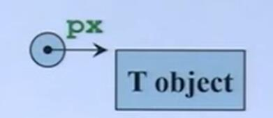
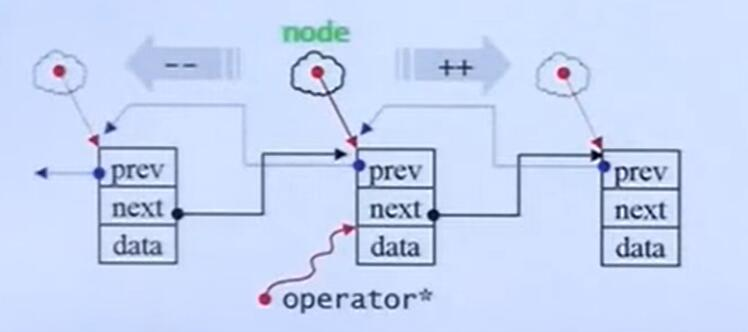
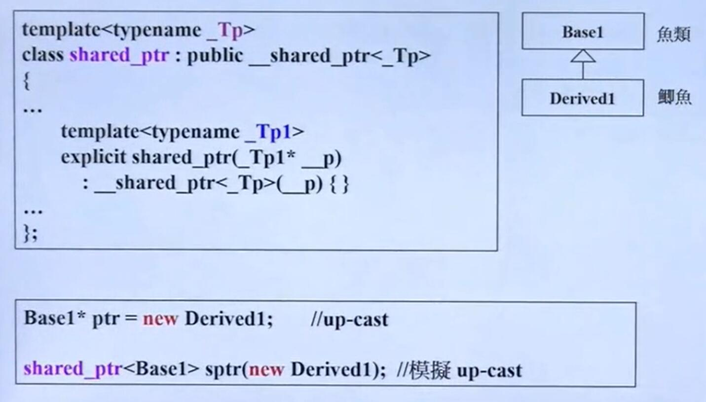
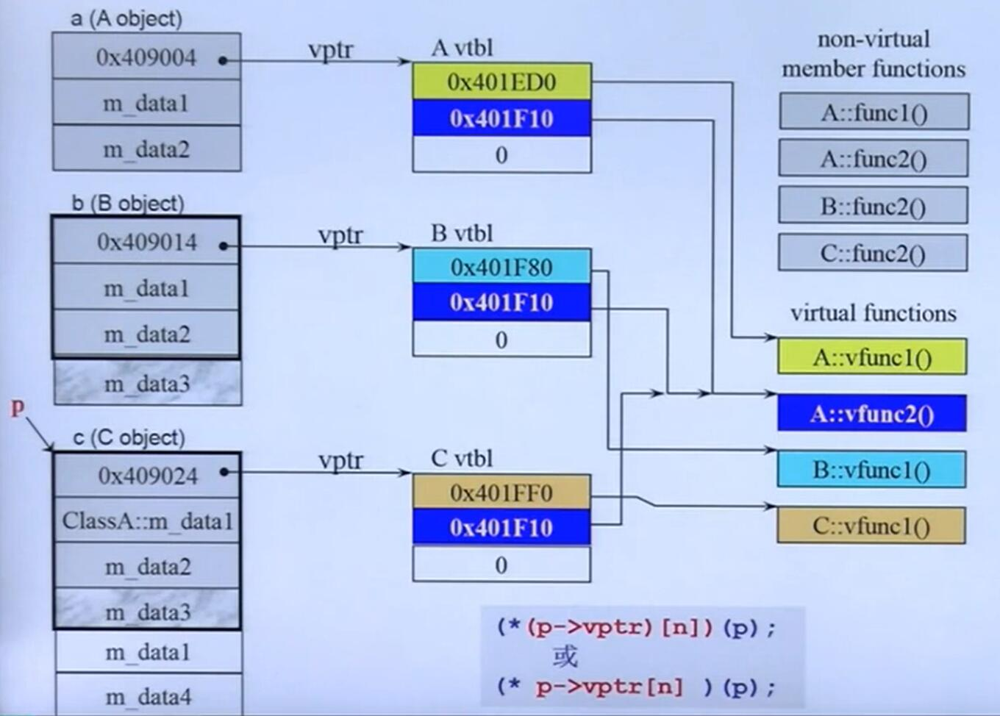
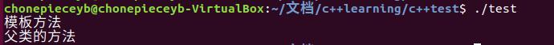
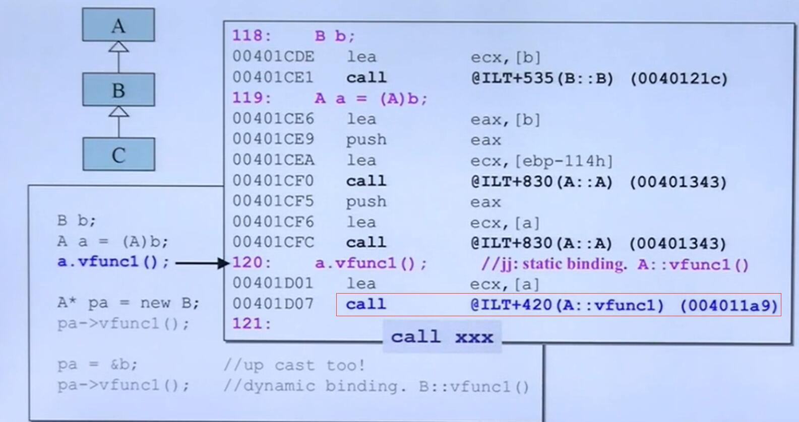
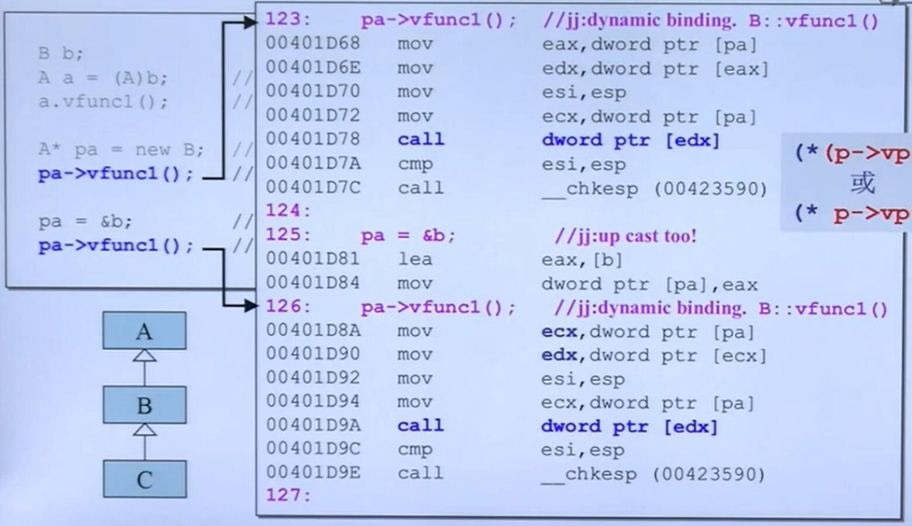

# C++高级编程

## conversion function

### 将类转化为其它类型

`operator type() const {...};`

* 通常都会加上 const
* 没有返回值(返回值由type指定)
* 没有参数

```c++
class Fraction
{
    public:
        Fraction(int num ,int den =1):m_numerator(num),m_denominator(den){}
        operator double() const{
            return (double)(m_numerator / m_denomicator)
        }
    private:
        int m_numerator;
        int m_denominator;
}

Fraction f(3,5);
double d = 4+f ; //调用的时候，先看有没有相应的操作符重载函数，然后看看能不能进行类型转换
```

### 将其它类型转化为类

用构造函数实现

#### non-explicit-one-argument ator (这里 one-argument 表示只需要一个实参)

这种ctor可以用来把别的数据类型转化为类

eg : `Fraction(int num, int den=1): m_numerator(num), m_denominator(den){}`这个函数只需要一个参数即可，可以用来将int类型转化为类
`Fraction d2 = f+4`

#### explicit-one-argument ctor

**explicit** 显示的指定编译器不能进行隐式转化,比如加上 **explicit**的时候，上述调用`Fraction d2 = f+4` 会报错(因为无法将 4 隐式转化为 Fraction)

## pointer-like class

有者指针行为的类

### 智能指针

```c++
template<class T>
class shared_ptr
{
    public:
        T& operator*() const
        {return *px;}

        T* operator->() const
        { return px;}
        /*
           上述的代码怎么理解？
           sp->method(); ->
           px->method(); 
           ->很特别，得到的符号需要用->继续作用下去
        */

        shared_ptr(T* p): px(p){}
    private:
        T* px;
        long* pn;
}   

//使用
shared_ptr<Foo> sp(new Foo);
Foo f(*sp);
sp->method();
```



### 迭代器

和智能指针相比，还需要重载`++` `--`操作

```c++
template<class T,class Ref , class Ptr>
struct __list_iterator{
    typedef __list_iterator<T,Ref,Pter> self;
    typedef Ptr pointer;
    typedef Ref reference;
    typedef __list_node<T>* link_type;
    link_type node ;
    reference operator*() const{return (*node).data;}
    pointer operator->() const{
        return &(operator*()):
    }
}

```



* 重载 **\***操作

```c++
reference operator*() const{return (*node).data;}  
//这里的 reference 是一个 T&，迭代器的行为和智能指针的不太一样
```

* 重载 **\-\>** 操作

```c++
pointer operator->() const{
        return &(operator*()):
    }
//这里返回 data的指针
```

迭代器的设计和智能指针的设计的差别在于，对于使用迭代器的用户来说，用户**只关心data**。

## fucntion-like classes 仿函数

标准库里有很多仿函数，这些仿函数继承了喝多奇怪的基类，重载了 **()** 操作符，这里先简单涉略一下。

```c++

// 代码仅用来做直观参考

template<class T>
struct identy {

const T& operator()(const T& x) const {return x;}
}

template<class Pair>
struct select1st{
    const typename Pair::first_type&
    operator()(const Pair& x) const
    {return x.first;}
}

template<class T1,class T2>
```

## 模板

部分模板具体语法就不赘述了，只放出例子作为简单复习

### class template 类模板


### 函数模板

```c++
template <class T>
inline
const T& min(const T& a, const T& b)
{
    return b<a ? b: a;
}

// 调用
min (1.5 1); //函数模板不需要指定模板参数了 
```

### 成员模板 

```c++
template<class T1,class T2>
struct pair{
    typedef T1 first_type;
    typedef T2 second_type;

    T1 first;
    T2 second;

    pair()
        :first(T1()),second(T2()) {}
    pair(const T1 & a, const T2& b)
    : first(a),second(b){}

    //注意下面这段,成员函数的模板，是一个函数模板，让构造函数更有弹性
    template<class U1,class U2>
    pair(const pair<U1,U2>& p):
    first(p.first),second(p.second){}
}
```

上述代码中，类有一层模板，外面的模板参数被定下后，内部的模板参数U1，U2还是可以指定,在标准库中，很多构造函数被设置为类模板。

使用场景:

```c++
pair<Base1,Base2> p2(pair<Derived1,Derived2>); 
/*
把派生类的pair，赋值给基类的pair。
这里 Derived满足 first(p.first)的赋值
*/
```

eg2:智能指针



为了能满足可以将子类的指针赋值给基类的指针，也用了成员模板。

### specialization，模板特化

```c++
template<class Key>
struct hash{};

/*
   特化的语法，
   1 template<> ; 一定是 template<>（没有可变的模板参数了和偏特化对应）
   2 hash<char>,表示把模板参数固定为 char
   3 在调用的时候，编译器优先找特化的模板
   再找非特化的模板
*/
template<>
struct hash<char>{
    size_t operator()(char x ) const{return x;}
}
```

### partial specialization,模板偏特化

#### 个数的偏

```c++
template<typename T,typename Alloc=...>
class vector
{
    ...
}

/*
语法：
1 模板生命是 template<typename 
Alloc=..>,可以看到剩下了一个 Alloc，是可变的
通过这个就很好理解为什么全特化是
template<>(因为全都制定了)
2 vector<bool,Alloc>，指定了一个bool,
还有一个可变的 Alloc
和 模板声明相对应
*/
template<typename Alloc=...>
class vectr<bool, Alloc>
{
    ....
}
```

#### 范围上的偏

```C++
template <typename T>
class C
{
    ...
};
/*
指定这个T必须是一个指针，限定了T的范围
*/
template <typename T>
class C<T*>
{
    ....
};

//所以
C<string*> obj2 ; //编译器会调用第二套模板的代码
C<string> obj1 ; //编译器嗲用第一套模板的代码
```

个人理解编译器按照特化的程度来匹配代码，也就是优先找全特化的，然后找偏特化的，最后再用没有特化的模板。

### template template parameter，模板模板参数

比较高深的技巧，还是用例子来理解

```C++
template<typename T,
    template <typename T>
        class Container
>
class XCls
{
    private:
        container<T> c;
    public:
        ....
};
// 模板的参数是一个模板...
/*
    这里有一个模板参数是一个模板，假设为T1
    也就是说T1要用的话，需要指定模板参数
    因此T1的模板参数来自于除T1外的其他
    的模板参数(非模板)
    就像这个例子用的这样
*/
// c++11的特性模板别名 
template<typename T>
using Lst = list<T,allocator<T>>;
// 这里显然 Lst也是一个模板
XCls<string,Lst> mylst2 ; 

```

注意:

```c++
//这个不是模板模板参数，
//因为第二个参数事实上已经指定了，
//可以把 deque<T>看成一个类型

// eg vector<int, vector<int>>,第二个模板参数显然不是模板了
template <class T,class Sequence = deque<T>>
class stack{
    .....
}
```

### variadic templates(since C++11)

```c++
// 递归边界，最后一次调用print(args...)
// args...已经没有参数了
void print()
{

}

//  typename...Types 表示一包模板
// 任意个数任意类型的模板
template<typename T, typename...Types>
void print(const T& first Arg,const Types&...args)
{
    cout<<firstArg<<endl;
    print(args...);
}
// 用 variadic templates 可以方便地实现函数递归

/* 
    简单地理解记忆:
    ...args 表示封包
    args... 表示解包
    所以上面的参数 const Type& ...args 表示 args是一包
    而 print(args...)表示把
    原本的一包进行解包分成一个参数和
    另外一包
    只是帮助理解
*/
```

ps : 可以用`sizeof...(args)`来获得一包里有几个参数

## C++标准库简述(部分)

### 容器

* Sequence containers
  * array
  * vector
  * deque
  * forward_list
  * list

* Container adapotors:
  * stack
  * queue
  * priority_queue
* Associative containers:
  * set
  * multiset
  * map
  * multimap
* Unordered associative con
  * unordered_set
  * unordered_multiset
  * unordered_map
  * unordered_multimap

### 算法

* Sorting
  sort
  stable_sort
  partial_sort
  partial_sort_copy
  is_sorted
  is_sorted_until
  nth_element

* Binary search
  * lower_bounder
  * upper_bound
  * equal_range
  * binary_search

* Merge
  * merge
  * inplace_merge
  * includes
  * set_union
  * set_intersection
  * set_difference
  * set_symmetric_difference

....

## reference 

```c++
int x =0;
int* p =&x;
int& r =x; 
// r代表x，r是x的别名，
//r不是指针应该把r看成一个整数，虽然说是用指针实现的
int x2= 5;
r = x2 ;// r不能重新代表新事物，
//这句话事实上让 r和 x的值都变成了5
int& r2 = r;//现在r2是5(r2代表r也相当与代表x)
```

reference:

* reference必须附初值
* reference不能重新绑定新的变量
* reference看成被绑定变量的别名(就是被绑定变量)。二者是等价的(一个数据发生变化，相应的另一个数据也发生变化)
* sizeof(reference)的大小为被绑定变量的大小(区别于指针，指针的sizeof固定是4个字节)
* reference底层是指针实现的，但是编译器制造了一种假象(主要是sizeof)，就是r等价于被绑定对象。
* reference的地址和被绑定对象的地址相同。`int& r =x;`则`&r`和`&x`相同

### reference常见用途

reference 通常不用于声明变量，而用于描述参数类型(parameters type) 和 返回类型(return type)的描述。

ps:

```c++
double imag(const double& im){..};
double imag(const double im){...};
```

上述的两个函数的函数签名视为相同，也就是二者不能共存。

## 对象模型(Object Model): 关于 vptr 和 vtbl

```c++
class A{
    public:
        virtual void vfunc1();
        virtual void vfun2();
        void func1();
        void func2();
    private:
        int m_data1,m_data2;
};

class B:public A{
    public:
        virtual void vfunc1();
        void func2();
    private:
}       int m_data3;

class C:public B{
    public:
        virtual void vfunc1();
        void func2();
    private:
        int m_data1,m_data4;
}
```


* 关于继承，内存上继承父类的data， 继承父类函数的调用权(不继承内存 )

* 只要类里有虚函数，那么类里一定会增加一个指针—— **虚指针vptr**(就是上图的 ox409014)

* **虚指针**指向一张表**虚表vtbl**，虚表里存放着虚函数的函数指针

* 父类和子类都有各自的**虚表**，虚表中的函数指针指向各自版本的虚函数，下面以**B**类的虚表为例:
  * 如果B类的虚函数是继承父类(A),没有override,那么B的**vtbl**中相应的的 **vfunc**的函数指针指向 父类版本的**vfunc**，如图的 **vfunc2**所示。
  * 如果B类override基类的虚函数，那么那么B的**vtbl**中的相应的 **vfunc**的函数指针将会指向自己版本的**vfunc**，如图的 **vfunc1**所示。

* 虚函数的调用实现的是动态绑定。这就是C++能够实现多态的原因。动态绑定指的是编译器在调用**虚函数**的时候会通过对象的指针 **p**,找到虚指针**vptr**，根据虚指针找到相应的**虚表vtbl**，然后再根据vtbl里相应的函数指针实现函数的调用。而不是普通的静态绑定(直接根据函数名进行编译)

  用C代码来解释这种关系:

  ```c++
    (*(p->vptr)[n])(p);
       // 或者
    (* p->vptr[n])(p);
    
    // 这里把p传过去，相当于传this指针,vptr[n]表示虚表里的第n个函数指针
  ```

* 虚函数是实现多态的基础。实现动态绑定的方法:
  * 通过**指针**(或者引用)调用函数(不能直接通过对象来调用)
  * 指针必须是 **upcast** 即用一个**基类的指针**(或者引用）指向派生类。(本质上是想让虚指针是子类的虚指针)
  * 必须是虚函数。
  
  **个人理解**: 
  
  1. 如上所述，由于存在 vtbl和 vptr，编译器能通过 vtpr 和 vtbl这条路径调用相应的函数。
  2. 当使用**指针**(或者引用)的时候，eg `Base* p = &(Derived)`,`p->vptr`和 Derived的vptr是相同的，
  3. 当使用指针调用函数的时候:`p->vfunc()`,编译器知道要通过 **vptr** 和 **vtbl**来调用相应的函数(这时候调用Derived版本的vfunc) 
  4. 如果不使用指针 eg： `Base p = Derived; p.vfunc()`这时候调用的是 Base版本的 vfunc。
  5. 上述机制不作用于非**virtual function**，其它版本的函数即使派生类override了，仍然是静态绑定，也就是根据使用者的类型(不管是指针还是引用还是对象)，调用对应版本的函数，Base调用Base的，D调用D的

## 对象模型(Object Model) 关于 this

再看template设计模式

```c++
#include<iostream>
using namespace std;
class CDocument
{
  public:
  void OnFileOpen()
  {
    //这是一个算法，每一个cout代表实际动作
    cout <<"dialog..."<<endl; // 通用操作
    .....
    Serialize(); //需要子类定义的操作
    ....
  }
  virtual void Serialize(){}; // 一定要加virtual
};
class CMyDoc:public CDocument
{
  public:
    virtual void Serialize()
    {
      // 只有应用程序本身才知道怎么做
      cout<<"CMyDoc"<< endl;
    }
}
int main(){
  CMyDoc myDoc;
  myDoc.OnFileOpen(); 
  //这个函数事实上是 CDocument::OnFileOpen(&myDoc)
  // 在执行到 Serialize这里的时候
  //调用  this->Serialize(),这时候this是myDoc，于是就调用了子类的方法
}
```

有上面的注释可知，调用了子类的`Serialize()`，那么为什么会调用子类的？运用了动态绑定。

在 `OnFileOpen()`方法里调用了`Serialize()`方法，实际上这里是通过 `this->Serialize()`调用的，因此它满足多态的三个条件

* 通过指针调用(this)
* this 指向子类的对象(虚指针是子类的虚指针)
* 调用的是虚函数。

ps: 如果这里的 `Serialize()`不是虚函数。那么Serialize()使用的将是父类的`Serialize`方法! (很容易错)

### important! 如果上述的例子中调用的不是虚函数

```c++
#include<iostream>
using namespace std;
class Base{
   public:
	  void templatefunc(){
	 	cout<<"模板方法"<<endl;
		operation();
	  }
	  void operation(){
	  	cout<<"父类的方法"<<endl;
	  }
};

class Derived : public Base
{
	public:

	void operation(){
		cout<<"子类的方法"<<endl;
	}
};

int main(){
	Derived d = Derived();
	d.templatefunc();

}
```

输出结果:


**如果不满足**动态绑定的条件，那么将是静态绑定的，如果要实现**多态**，要实现动态绑定函数的行为**必须满足**3个条件。上述例子从逻辑上很容易出错。

为什么会出错的个人理解:

1. 如前所述上述用法是静态绑定，也就是说在函数`templatefunc()`中调用的`operation()`方法已经被静态地绑定为`Base::operation()`了.
2. 更确切地说使用静态绑定，意味着在编译的时候`templatefunc()`里面的`operation()`方法采用的是`Base`版本。而我们知道基类函数的继承只是继承函数的使用权，并不会单独地再编译一份子类版本(子类没有重载 templatefunc方法)。所以当子类使用`templatefunc`的时候，里面的`operation`方法还是基类的版本。
3. 因为不满足条件(不是虚函数)，编译器不会通过虚指针和虚表寻找正确版本的operation,也就是说，编译器在编译`templatefunc`方法的时候，不会采用`(*(p->vptr)[n])(p);`这种方式调用`operation()`。所以即使子类 override了operation方法。仍然无法改变父类里`templatefunc()`方法的行为。
4. 因此如果要实现多态(动态绑定)必须满足三个条件，否则只能是静态绑定(函数只能有一个版本)

上述只是个人理解，如有错误还请指正。

## 对象模型(Object Model): 关于Dynamic Binding

进一步理解

### 静态绑定

静态绑定的汇编代码:



可以看到这里 **call 的是一个固定的标号，已经静态绑定了 a版本的 vfun**

### 动态绑定



汇编代码解释:看第二个 call(蓝色那部分,也就是  `pa =&b,pa->vfunc1`那里)

* `mov ecx,dword ptr[pa]` 这里 `pa`是一个地址，所以直接寻址，取出4个字节的地址为pa的内存区域的内容，这里 pa是this指针，也就是这时候的 `ecx` 存放的是虚指针。(对应前面虚表的那张图，虚指针正好是类对象内存区域的前4个字节)

* 第二次寻址，`edx,dword ptr [ecx]`直接寻址，同理取出4个字节的 ecx 的内容，由于 ecx是虚指针，虚指针指向虚表(虚指针的值是虚表的地址)。因此这时候`edx`是虚表

* 第三次寻址，`call dword ptr [edx]`我们已经知道 edx是虚表(edx的值是虚表的首地址，和数组的名称是数组首个单元的地址相同),所以这句话就是调用虚表里的虚函数(虚表内存放着相应的标号)

* 因此上述过程等价于 `( *(p ->vptr)[n])(p);` 

(感觉学了汇编 真好 ^_^)


## 再谈const

### const 成员函数

`void func()const{}` 这里 func是一个成员函数，这里的const事实上等价于用const 修饰 **this指针** 等价于`void func(const this*){}`,所以 const 成员函数 保证不修改 **成员变量**

| | const object(data members 不得变动) | non-const object(data members 可变动)|
|:---: | :----:| :---:|
| const member fucnctions（保证不更改data members)|yes | yes|
|non-const member functions（不保证 data members不变）| no | yes

const 一致性原则。

### Copy On Write(COW) and const

除了上述表格的规则， 当成员函数 **const** 和 **non-const** 版本都存在， **const object** **只能**调用 const版本， **non-const object** **只能**调用 **non-const**版本，(可以防止二义性) const 属于函数签名的一部分。

```c++
// class template std::basic_string<...>
// 有如下两个 member functions

charT operator[](size_type pos)const{ /*不需要考虑COW*/}

reference
operator[] (size_type pos)
{/* 必须考虑COW*/}

```

* COW :写时复制，当不改变数据内容的时候共享数据，当要改变数据内容的时候才COPY一份让其中有修改需求的去修改。
* 这里同时存在 const 和 非 const，符合上面的规则。所以此时 non-const object 不能调用 const版本的member function

## 重载::operator new ,::operator delete,::operator new[],::operator delete[] (初略涉及)

### 重载全局 new 和 delete

是可以重载 全局 new 和 delete的，但是影响非常大

```c++
void* myAlloc(size_t size)
{return malloc(size);}

void myFree(void* ptr)
{return free(ptr)}

inline void* operator new(size_t size)
{cout<<"重载new\n", return myAlloc(size)}

inline void* operator new[](size_t size)
{cout<<"重载new[]\n", return myAlloc(size)}

inline void* operator delete(void* ptr )
{cout<<"重载delete\n", myFree(ptr)}

inline void* operator delete[](void* ptr )
{cout<<"重载delete[]\n", myFree(ptr)}
```

### 重载 member oeprator new/delete

```c++
class Fool{
  public:
    void* operator new(size_t);
    void operator delete(void* size_t);
};

//由于在C++中 new 操作和 delete操作都会被分解

//所以下面代码

Foo* p = new Foo;
delete p;
//等价于

void* mem = operator new(sizeof(Foo))// 调用重载的new函数
p = static_cast<Foo*>(mem);
p->Foo:Foo();

p->~Foo() //析构函数主要用来释放如动态申请的内存，打开的文件等资源
operator delete(p); //刚才重载的delete

// new[]和 delete[]类似
```

### 重载 new()，delete()的多个版本

* 我们可以重载 **class member oeprator new()**,写出多个版本，前提是每一个版本的声明都必须有独特的参数列表，其中第一个参数 **必须** 是 size_t,其余的参数一 new 所指定的 **placement argument** 为初值。
**placement new** 
`Fo* pf = new (300,'c') Fol;`

* 我们也可以重载 `class member operator delete()`，写出多个版本，但他们绝对不会被 `delete`调用。只有当 new 所调用的 ctor抛出 exception, 才会调用 重载版的 **operator delete()**。它只能这么被调用。主要用来归还未能完全创建成功的 object所占用的 memory

