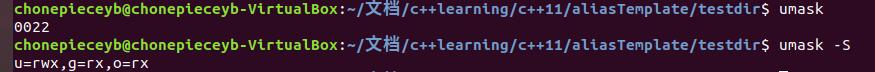

## 权限管理命令

### chmod

|    说明    |  内容       | 备注
| :----: | :----: | :------:|
|命令名称| `chmod`|
|英文原意| **ch**ange the permissions **mod**e of a file| 
|命令所在路径| `/bin/chmod`
|执行权限| 所有用户| 只有 root 用户和文件的所有者可以改变文件的权限
|功能描述|改变文件或者目录的权限| 
|语法| `chmod [OPTION]... [{ugoa}{+-=}{rwx}] FILE...` `chmod [mode]...FILE...` | 这个命令详细的格式可以查看man手册，在这里列出来的，第一种：u g o 表示 所有者，所属组，其他人。a 表示所有用户。 +-= 分别表示 增加权限，减少权限，把权限设置为。 r、w、x 分别表示读、写、执行(其实不只有rwx,还有其他的选项比如 t X s(查man)) 第二种采用数字表示法，mode的值是一个数字其中:**r ---4 (100)**,**w---2 (010)**,**x ---1 (001)**,rwx可以叠加（用二进制比较好理解，每一位(总共三位)表示 r、w、x权限的一种(可以取0 或者 1)，所以如果权限是 **rw-** ,对应的数字就是 6(110)

|参数简写|参数全称|参数作用|备注|
|:-----:|:-----:|:-----:|:-----:|
| `-R`| `--recursive`| 递归修改权限，如果在修改文件夹权限的时候加了`-R`那么该文件夹下所有文件的权限也都会被修改|

eg:`chmod g= test` 把test的 group的权限设置为 **---**
    `chmod o+x test` 给test增加 x权限
    `chmod 755 test` 将test的权限设置为 **rwxr-xr-x**

#### 文件权限的深入理解

|权限简写|权限|文件|目录|
|:---:|:-----:|:---:|:--:|
| r | 读权限| 可以查看文件的内容| 可以列出目录的内容|
|w | 写权限| 可以修改文件的内容|可以在目录中创建，删除文件|
|x| 执行权限|可以执行文件| 可以进入目录|

ps:要很注意文件的rwx权限和目录的rwx权限的含义不同。
eg:    `test/test.cpp`
test 是一个文件夹，test.cpp是一个文件

假如现在的身份是 u 

1. test 的 u权限为 rwx
test.cpp的 u权限 为 --- 
这时候 仍然**可以**删除 test下的 test.cpp
2. test 的 u权限为 r-x,test.cpp的u权限为rwx，这时候u**不能**删除test.cpp

### chown

|    说明    |  内容       | 备注
| :----: | :----: | :------:|
|命令名称| `chown`|
|英文原意| **ch**ange file **own**ership| 
|命令所在路径| `/bin/chown`
|执行权限| 所有用户| 只有root才能改变一个文件的所有者\所属于=组
|功能描述|改变文件或者目录的所有者\或者所属组| 
|语法| `chown [OPTION]...[OWNER][:[GROUP]] FILE...`| 这个命令我们既可以更改所有者也可以更改所有组，1.如果只给了**OWNER**那么只有该文件的所有者会被改为**OWNER**, 2.如果在**OWNER**后面加了冒号，并且跟上了**GROUP** eg `chmod root:root file` 那么会把所有者改成**OWNER**,所属组改成**GROUP** 3.如果只在**OWNER**后面跟上冒号，那么会把所有者改为**OWNER**所属组改为**OWNER的所有组** 4 如果只有 冒号+**GROUP** eg `chmod :root file`,那么只会将所属组改为 **GROUP** 5 如果只有冒号，那就什么都不改
ps:上述的chown是GUN版本的chown，修改所有者或者所属组的时候，OWNER和GROUP必须存在
|参数简写|参数全称|参数作用|备注|
|:-----:|:-----:|:-----:|:-----:|
| `-R`| `--recursive`| 递归修改 |

eg
`chmod root:root file` 把file 的所有者改为root,所属组也改为root

### chgrp

|    说明    |  内容       | 备注
| :----: | :----: | :------:|
|命令名称| `chgrp`|
|英文原意| **ch**ange file **gr**ou**p** ownership| 
|命令所在路径| `/bin/chgrp`
|执行权限| 所有用户| 只有root才能改变一个文件的所属组
|功能描述|改变文件或者目录的所属组| 
|语法| `chown [OPTION]... GROUP FILE...`| 这个命令等价于 只加冒号和GROUP 的chown

|参数简写|参数全称|参数作用|备注|
|:-----:|:-----:|:-----:|:-----:|
| `-R`| `--recursive`| 递归修改 |

eg:`chgrp root file` 改变 file的所属组为 root

## 缺省的所有者和所有组

一个文件创建的时候，所有者默认为创建文件的用户，所属组默认为创建文件用户的缺省组

## umask

|    说明    |  内容       | 备注
| :----: | :----: | :------:|
|命令名称| `umask`|
|英文原意|the **u**ser file-creation **mask**| 
|命令所在路径| Shell内置命令`
|执行权限| 所有用户| 
|功能描述|显示，设置文件的缺省权限|  非root用户也可以修改umask默认值
|语法|  `umask [-S] [mask]`| 当不加 [mask]的时候就是显示默认的权限，当加上mask表示设置默认的权限。 

|参数简写|参数全称|参数作用|备注|
|:-----:|:-----:|:-----:|:-----:|
| `-S`| | 使用 **rwx**的格式输出|

eg : `umask 022` 设置默认权限为 rwxr-xr-x

ps：在linux中新建的文件(非目录)**不具有**执行权限，这是出于安全考虑。

### umask输出说明

这里数字有四位，第一位表示**特殊权限**，后三位分别表示 u g o的默认权限。

数字的含义:
把数字转换成2进制后，有三位，从高位到低为分别表示 **r,w,x**，如果值去1表示**没有**这个权限(这就是mask的含义)，输出的结果相当于一个mask, !mask 与 777 与操作就可以得到相应的权限的编码。

eg : umask 的结果 0 -> 000 表示三种权限都有， 2-> 010 表示没有写权限。