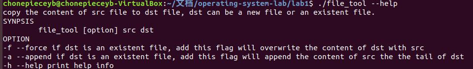
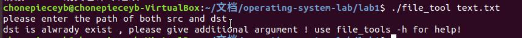
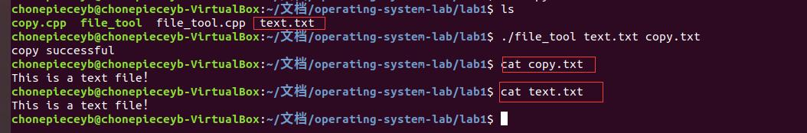
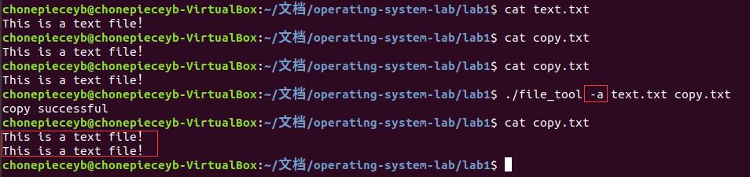
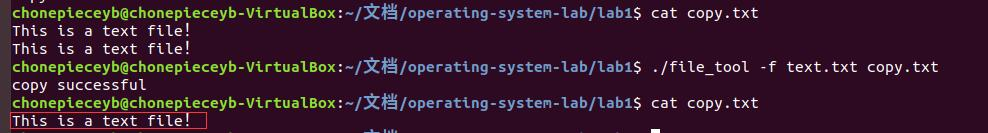

# 操作系统第二次实验报告

09017423 杨彬 2020-4-1

## 1. 实验内容

使用系统调用，用C或C++写一个程序，实现如下功能：从一个文件中读出数据，写入另一个文件中。

## 2. 实验要求

* 具有良好的交互性
* 使用者可输入源文件和目的文件的路径和文件名。
* 具有完善的错误处理机制
* 针对可能出现的各种错误，要有相应的错误提示输出，并作相应处理。
* 在Linux操作系统上调试并运行

## 3. 实验目的

* 通过实验，加深对系统调用概念的理解，了解其实现机制以及使用方式。
* 通过在Linux操作系统上编写和调试简单程序，进一步熟悉Linux操作系统的使用，初步掌握linux环境下的C或C++编译和调试工具，为进一步理解和学习Linux操作系统的内核结构和核心机制作准备

## 4. 设计思路和流程图

```flow
st=>start: 开始
ed1=>end: 成功
ed2=>end: 退出
op1=>operation: 解析命令行参数
cond1=>condition: 解析成功?
cond2=>condition: src是regular file?
op2=>operation:  以CREATE模式调用open()
cond3=>condition: 成功CREATE？
cond4=>condition: src和dst不指向同一文件？
op3=>operation: 以APPEND或者TRUNC模式调用open
op4=>operation: 调用read 和 write


st->op1->cond1
cond1(yes)->cond2
cond1(no)->ed2
cond2(no)->ed2
cond2(yes)->op2->cond3
cond3(yes)->cond4
cond3(no)->op3->cond4
cond4(no))->ed2
cond4(yes)->op4->ed1
```

## 5. 代码及注释

```C++
#include<iostream>
#include<sys/types.h>
#include<sys/stat.h>
#include<fcntl.h>
#include<unistd.h>
#include<stdio.h>
#include<getopt.h>
#include<errno.h>
#include<string.h>
#include<limits.h>

using namespace std;
void print_helpinfo(){
   //打印帮助信息
   cout<<"copy the content of src file to dst file, dst can be a new file or an existent file.\n";
   cout<<"SYNPSIS"<<endl;
   cout<<"\tfile_tool [option] src dst"<<endl;
   cout<<"OPTION\n";
   cout<<"-f --force if dst is an existent file, add this flag will overwrite the content of dst with src\n";
   cout<<"-a --append if dst is an existent file, add this flag will append the content of src the the tail of dst\n";
   cout<<"-h --help print help info\n";
   return;
}
void copy_file( char* src, char* dst , const short flag){
	//检查 src 是否为普通文件
	struct stat sb ;
	stat(src,&sb);
	if (!S_ISREG(sb.st_mode)){
		printf("bad src! %s\n",strerror(errno));
		return ;
	}
	int src_fd = open(src,O_RDONLY);
	int dst_fd = open(dst,O_CREAT|O_EXCL|O_RDWR,S_IRWXU);
	//尝试创建 dst
	if(dst_fd<0){
	    // 如果文件已经存在
	    if(flag ==-1){
	       printf("dst is alwrady exist , please give additional argument ! use file_tools -h for help!\n");
	       return ;
	    }
	    dst_fd = ( flag == 1) ? open(dst, O_RDWR|O_APPEND) : open(dst,O_RDWR|O_TRUNC);
	    if(dst_fd < 0){
	    	printf("some error happen! %s\n",strerror(errno));
		return ;
	    }
	}
	// 判断 src 和 dst 是不是同一个文件 防止 无限复制
	char abs_path_src[PATH_MAX] , abs_path_dst[PATH_MAX];
	realpath(src,abs_path_src);
	realpath(dst,abs_path_dst);
	if ( strcmp(abs_path_src, abs_path_dst) == 0){
		printf("the src and dst are the same!\n");
		return ;
	}
	// 开始进行文件操作, 一次读写 1k byte
	char buffer[1024]={0};  
	while(1){
	  int  count = read(src_fd, &buffer , 1024 ); // 使用 linux 系统调用读取 1024个字节
	  if(count ==0 ){
		printf("copy successful\n");
		return ;
	  }else if(count < 0){
	  	printf("some error happen! %s\n", strerror(errno));
		return ;
	  }else{
		// 向dst写字节
		int  wcount = write(dst_fd , &buffer , count);
	        if(wcount < 0){
			printf("some error happen! %s\n", strerror(errno));
			return;
		}
	  }
	}	
	return ;
}

extern int optind;     // 解析参数需要的变量

int main(int argc, char** argv){
  //解析命令行参数
  short  flag = -1;          // flag 根据解析参数的结果 -1初始值，0 force, 1 append
  while(1){
	 int option_index = 0;
	 int c; 
	 static struct option long_options[] = {
		 {"force",0,NULL,'f' },
		 {"append",0,NULL,'a'},
		 {"help",0,NULL,'h'},
	 };
	 c = getopt_long(argc,argv,"fah",long_options,&option_index);
	 if(c==-1){
		 // 参数解析完成
	 	break;
	 }
	 switch(c){
	 	case('?'):            //解析到未知参数
			return 1 ;
		case('a'):            
		       flag = 1; break;
	        case('f'):
		       flag = 0; break;
	        case('h'):
		       print_helpinfo();  return 0;
	  	default:
		       printf("some unknown error!\n");
		       return 1 ;
	 }
	 
  }
  //获得 src 和 dst
  if (argc - optind <2 ){
	// 判断参数的个数是否足够，最后两个参数需要是 src 和 dst  
  	cout<<"please enter the path of both src and dst\n";
  }
  char* src = argv[optind],*dst = argv[optind+1];
  copy_file(src, dst ,flag);

  return 0;
}
```

## 6. 程序运行结果

说明:本程序在linux进行调试，具有完善的错误判断机制，能够实现将一个文件复制到另一个文件，将一个文件的内容append到另一个文件的尾部，将一个文件的内容覆盖到另一个文件这三种功能，选择哪一种功能通过命令行来指定，使用方法类似linux下的 `cp`

### 6.1. 用户可交互性



### 6.2. 异常处理

#### 6.2.1. 参数错误处理




#### 6.2.2. 路径错误处理


#### 6.2.3. 当src和dst相同时错误处理


#### 6.2.4. dst已存在时错误处理


### 6.3. 程序功能展示

#### 6.3.1. 复制src为dst(dst不存在)



#### 6.3.2. 在dst(dst存在)末尾添加srt的内容



#### 6.3.3. 用src覆盖dst(dst存在)



## 7. 实验体会

### 7.1. 遇到的问题

#### 7.1.1. 问题 1：

在本实验中我遇到一个问题是当 src 和 dst 的值相同的时候，也就是src和 dst指向同一个文件的时候，会导致无限循环读写，也就是一边读一边写，导致程序无法退出，并且破坏src。

为了解决这个问题，我一开始通过linux的 file descriptor (open的返回值) 来判断两个是不是同一个文件，但是我发现尽管给的路径是一样的 其 file descriptor竟然不同（在实际操作中一个是 3 一个是 4）。

最后我采用了一个比较简单的方案，就是在判断src和dst都存在的情况下，将src和dst都转换为绝对路径，判断绝对路径的字符串是否相等就解决这个问题。

#### 7.1.2. 问题 2：

我遇到的第二个问题就是 `read()`和 `write()` 的配合问题，由于 `write` 将 buf中的内容写入到文件中，但是`write`必须指定写入的字节数，如果采用固定的字节数（buf的size)，会导致在最后的`read`的时, buf事实上不是满的，因此在最后一次write会导致写入冗余的数据。

为了解决这个问题，我将`wirte`的 count指定为上一次`read`函数的返回值就解决了这个问题。

### 7.2. 实验学到的知识总结

本次实验全程在Linux环境下开发。、

* 学习用 g++ 进行 c++文件的链接和编译。
* 学习使用 vim 在 Linux环境下进行高效编程。
* 学习使用 `man` 手册在Linux下进行高效的文档查询。
* 学习使用 `getopt_long()` 函数进行命令行参数解析。
* 学习使用 `stat()` 系统调用获取文件状态(包括文件类型，读写权限等)。
* 学习使用 `open()` 系统调用获取 file_descriptor ,以及open的各项参数。
* 学习使用 `realpath()` 函数获取绝对路径。
* 学习使用 `write() 和 read()` 系统调用进行文件的读写。

### 7.3. 本实验系统调用总结

本实验主要使用了 `open()` 、`read()` 和 `write()`系统调用。各个系统调用功能总结如下

#### 7.3.1. open函数

open 的函数原型如下：
`int open(const char *pathname, int flags, mode_t mode);`
该函数根据给定的 pathname(路径) 路径对应的文件的文件描述符（file descriptor），read 和 write函数需要用到文件描述符。

flags: 指定了open的模式 比如:
* O_RDONLY, O_WRONLY, O_RDWR， 以 只读、只写、读写的方式打开文件，必须指定一种。
* O_APPEND 以 append的方式打开文件
* O_TRUNC 以覆盖的方式打开文件
* O_CREATE 当 文件不存在的收就新建一个文件

mode:
当flags 指定了 O_CREATE时候， 该参数指定新建文件的模式。

#### 7.3.2. read函数

函数原型如下:
`ssize_t read(int fd, void *buf, size_t count);`

该函数从指定文件（用 文件描述符 fd指定）,读取 count 个字节，读取的内容存储在 buf 中。 该函数返回实际读取的字节数。如果发生错误 返回 -1 

#### 7.3.3. write函数

函数原型如下：
`ssize_t read(int fd, void *buf, size_t count);` 
该函数 从 buf 写入 count 个字节到指定的文件中（由文件描述符fd表示），返回实际写入的字节数，如果发生错误 返回-1

### 7.4. windows 下的系统调用

windows的 系统调用可以从MSDN查询：https://docs.microsoft.com/en-us/windows/apps/


* `OpenFile()` 对应 linux 下的 `open()`
* `ReadFile()` 对应 linux 下的 `read()`
* `WriteFile()` 对应 linxu 下的 `write()`


#### 7.4.1. OpenFile

```c++
HFILE OpenFile(
  LPCSTR     lpFileName,
  LPOFSTRUCT lpReOpenBuff,
  UINT       uStyle
);
```

#### 7.4.2. ReadFile

```c++
BOOL ReadFile(
  HANDLE       hFile,
  LPVOID       lpBuffer,
  DWORD        nNumberOfBytesToRead,
  LPDWORD      lpNumberOfBytesRead,
  LPOVERLAPPED lpOverlapped
);
```

### 7.5. WriteFile

```c++
BOOL WriteFile(
  HANDLE       hFile,
  LPCVOID      lpBuffer,
  DWORD        nNumberOfBytesToWrite,
  LPDWORD      lpNumberOfBytesWritten,
  LPOVERLAPPED lpOverlapped
);
```

