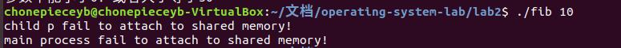
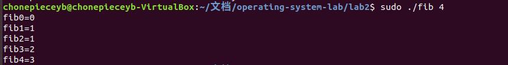
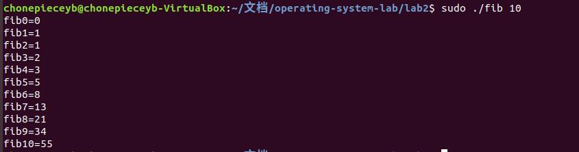
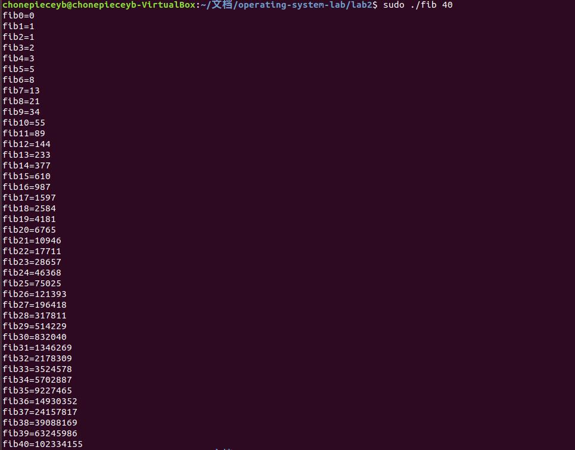

# 操作系统第三次实验报告

09017423 杨彬 2020-4-12

## 1. 实验内容

在Linux操作系统上，利用fork（）创建一个子进程去生成Fibonacci数列，并采用POSIX share memory 将结果传递给父进程，具体要求见”Operating System Concepts(Seventh Edition)” Chapter 3后的习题3.10。编写程序并在父进程中输出测试结果

## 2. 实验要求

* 具有完善的错误处理机制
* 针对可能出现的各种错误，要有相应的错误提示输出，并作相应处理。
* 在Linux操作系统上调试并运行

## 3. 实验目的

1. 通过实验，了解Unix/Linux中新进程的创建，以及父进程与子进程之间关系
2. 通过实验，掌握共享内存的创建、使用和删除 


## 4. 设计思路和流程图

```flow
st=>start: 开始
op1=>operation: 创建共享内存
cond1=>condition: 创建成功?
op2=>operation: 开辟子进程
cond2=>condition: 子进程开辟成功?
ed1=>end: 成功
ed2=>end: 退出
cond4=>condition: 进程为父进程?
op3=>operation: 进入父进程
op4=>operation: attch共享内存
op6=>operation: waiting
cond3=>condition: 子进程结束？
op5=>operation: 输出Fbi数列

op7=>operation: 进入子进程
op8=>operation: attach
op10=>operation: 计算Fbi
op11=>operation: detach and quit 

op12=>operation: detach and delete shared memory
st->op1->cond1
cond1(yes)->op2
cond1(no)->ed2
op2->cond2
cond2(no)->ed2
cond2(yes)->cond4
cond4(yes)->op3->op4->op6->cond3
cond3(yes)->op5->op12->ed1
cond3(no)->op6
cond4(no)->op7->op8->op10->op11
```

## 主要数据结构

主要数据结构是共享内存区域，该区域是一个结构体。

```c++
struct shared_data{
	long fib_sequence[MAX_SEQUENCE];     //数组
	int sequence_size;
};
```

* MAX_SEQUENCE 表示数组的最大的长度
* sequence_size用来存放当前数组里有多少项是有效的，子进程在计算fib数列的时候，每计算一项将该值+1；

## 5. 代码及注释

```C++
/* 
author chonepieceyb, operatiing-system lab2 

2020年 03月 31日 星期二 21:24:51 CST
*/
#include<iostream>
#include <sys/types.h>
#include <unistd.h>
#include <sys/types.h>
#include <sys/wait.h>
#include<string>
#include <sys/ipc.h>
#include <sys/shm.h>
#define MAX_SEQUENCE 50           // fbi 最大的个数
using namespace std;

struct shared_data{
	long fib_sequence[MAX_SEQUENCE];     //数组
	int sequence_size;
};

int main( int argc, char** argv){
	if(argc!=2){
		cout<<"请输入一个参数\n";
		exit(-1);
	}
	int parm = std::stoi(string(argv[1]));   // 将字符串转化为 整形
	if(!(parm>=0&& parm <MAX_SEQUENCE) ){
		cout<<"参数不能小于0！或者大于等于50"<<endl;
		exit(-1);
	}
	// 创建共享内存	
	int shm_id = shmget((int)getpid(),sizeof(shared_data),IPC_CREAT);
	if(shm_id ==-1){
		//如果没有成功开辟共享内容
		cout<<"child p fail to get  a shared memory !"<<endl;
		exit(-1);
	}	
	// 开辟子进程
	int pid = fork();
	if(pid<0){
		cout<<"child p fail to fork child process!\n";
		exit(-1);
	}else if(pid ==0){
		//如果是子进程的话
		// attach到共享进程
		void* shm = shmat(shm_id,NULL,0);    // 由操作系统自动分配，有读写权限
		if(shm == (void*)-1){
			cout<<"child p fail to attach to shared memory!\n";
			exit(-1);
		}
                shared_data * share =	 (shared_data*)shm;      //强转
		if(parm ==0){
			share->fib_sequence[0] = 0;
			share->sequence_size = 1;
		}else if(parm == 1){		
			share->fib_sequence[1] = 1;
			share->sequence_size =2;
		}else{
			share->fib_sequence[0] = 0;
			share->fib_sequence[1] = 1;
			share->sequence_size =2;
			long fb1 = 0 , fb2 = 1;
			for(int i =2 ; i<=parm;i++){
				long v = fb1 + fb2;
				share->fib_sequence[i] = v;
				share->sequence_size ++ ;
				fb1 = fb2;
				fb2 = v ;	
			}
		}
		// detach 
		if(shmdt(shm)==-1){
			cout<<"child p fail to detach shared memory!\n";
			exit(-1);
		}else{
			exit(0);
		}
	}else{


		int status;
		waitpid(pid,&status,WUNTRACED);          // waitpid的作用和wait 类似等待 pid = pid的子进程结束;
		// attach to shared memory 
		void* shm = shmat(shm_id,NULL, SHM_RDONLY);    // 由操作系统自动分配，只有读权限
		if(shm == (void*)-1){
			cout<<"main process fail to attach to shared memory!\n";
			exit(-1);
		}
		shared_data* share = (shared_data*)shm;      //强转
		for(int i=0;i<share->sequence_size;i++){
			printf("fib%d=%ld\n",i,share->fib_sequence[i]);
		}
		// detach 
		if(shmdt(shm)==-1){
			cout<<"main  p fail to detach shared memory!\n";
			exit(-1);
		}else{
			exit(0);
		}
		// delete shared memory 
		shmctl(shm_id, IPC_RMID ,NULL);
		exit(0);
	}
		
}

```

## 6. 程序运行结果

说明:本程序在linux进行调试，具有完善的错误判断机制，能够实现将一个文件复制到另一个文件，将一个文件的内容append到另一个文件的尾部，将一个文件的内容覆盖到另一个文件这三种功能，选择哪一种功能通过命令行来指定，使用方法类似linux下的 `cp`

### 6.2. 异常处理

#### 6.2.1. 参数错误处理


#### 共享内存异常处理

这里由于没有给权限，所以无法分配内存



### 6.3. 程序功能展示

fib:4

fib:10

fib:40


## 7. 实验体会

通过本实验，初步了解了开辟子进程，初步掌握了通过共享内存的方式进行进程间 ICP 的方法。理解了Linux系统中通过共享内存进行进程通信的函数。加深了对进程通信的理解，同时为之后的进程通信的同步实验打下基础。

### 7.2. 实验学到的知识总结

本次实验全程在Linux环境下开发。、

* 学习Linux下创建子进程的系统调用 `fork`
* 学习了Linux下创建共享内存系统调用 `shmget`
* 学习了Linux下attach共享内存的系统调用 `shmat`
* 学习了Linux下dettach共享内存的系统调用  `shmdt`
* 学习了Linux下等待子进程的系统调用 `waitpid`
* 学习了Linux下删除共享内存的系统调用 `shmctl`

### 7.3. 本实验系统调用总结

本实验使用了 `fork` , `shmget` ,`shmat` `shmdt`,`waitpid` `shmtcl`等系统调用，总结如下：

#### **fork()**

fork函数原型如下

`pid_t fork(void);`

* fork() 通过复制(duplicating)调用进程的防止创建一个新的进程。新创建的进程是调用进程的子进程。

* 父进程和子进程在独立的内存空间运行，在fock()调用的时刻，两个进程的 memory space的 content相同，各个进程的 memory writes , file mappings , file unmappings 不印象其它进程。

* **但是** 父进程和子进程不是所有的属性都相同。(不同的属性请翻阅API文档)

* 返回值
  1. 如果失败，返回 -1 ，创建子进程失败，没有子进程被创建， errno(可以通过strerror()函数打印errno) 变量保存错误信息。
  2. 如果成功，在父进程中，fork返回子进程的pid
     在子进程中，fork返回0。可以通过返回值区分是父进程还是子进程

#### **shmget**

shmget函数原型如下:

```c++
  #include <sys/ipc.h>
  #include <sys/shm.h>

  int shmget(key_t key, size_t size, int shmflg);

```

* shmget()， 根据参数 **key** 返回共享内存的 **identifier**。共享内存的大小由 size参数指定，同时 size(字节为单位)必须满足是 PAGE_SIZE的倍数(round up to a multiple of PAGE_SIZE),这是为了满足边界对齐。 shmflag参数指定创建的模式。

* shmflg 部分取值
  1. IPC_CREAT. 如果 和指定key相关联的共享内存不存在，那么创建新的共享内存，否则返回和key相关联的共享内存(如果有足够权限的话)
  2. IPC_EXCL 和 IPC_CREAT 一起使用的话，如果和key 关联的共享内存存在，那么创建失败，并设置errno

* 返回值
  1. 如果成功有效的共享内存identifer返回(后面函数会用),否则返回 -1 并设置errno

* 这里的key个人认为可以设置为调用进程的pid


#### **shmat** 和 **shmdt**

这里 **shmat**的英文原意应该是 shared memory attach,**shmdt** 就是 shared memory deattach

函数原型

```c++
 #include <sys/types.h>
       #include <sys/shm.h>

       void *shmat(int shmid, const void *shmaddr, int shmflg);

       int shmdt(const void *shmaddr);

```

shmat(), 根据共享内存的标识符 shmid将共享内存attach到调用进程的地址空间中，attaching address可以由 shmaddr指定， shmflg 制定了attahc的模式

* shmid 共享内存的 identifier
* shmaddr, 可以指定 attaching address， 当 为NULL时，就由操作系统自动指定。(其它的值目前用不到)
* 返回值 如果成功 shmat()返回共享内存的地址(指针)，需要进一步做强转操作，同时更新和这段共享内存相关的shmid_ds数据结构的成员，如果失败返回 (void*)-1,并记录 errno 。

shmdt(), dettach 给定的(由 shmaddr指定，是shmat获得的指针)共享内存。

* shmaddr 共享内存的指针
* 返回值 如果成功 返回 0 否则返回 -1，并且记录 errno

#### **waitpid** 

函数原型:

```c++
  #include <sys/types.h>
  #include <sys/wait.h>
   pid_t waitpid(pid_t pid, int *wstatus, int options);

```

* pid 如果 pid =-1 那么 wait所有的子进程，pid =0 等待所有的 process group ID 和 嗲用进程相等的子进程
pid>0 等待指定的进程(由pid参数标识)
pid<-1 (其他情形)

* options wait 选项，如果是 WHOHANG 表示 子进程 exit的时候，立刻返回
* wstatus, 如果 watatus 不是 NULL 那么状态信息将为保存在该指针指向的变量。
* 返回值 : 如果成功 返回 0， 发生错误返回 -1 ； 
