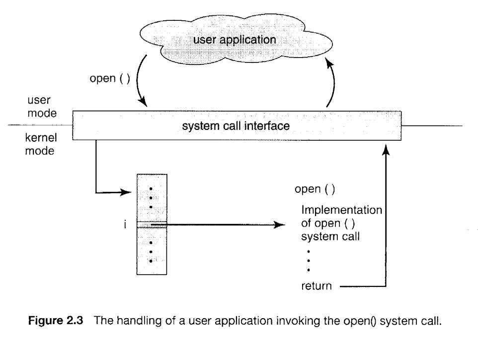
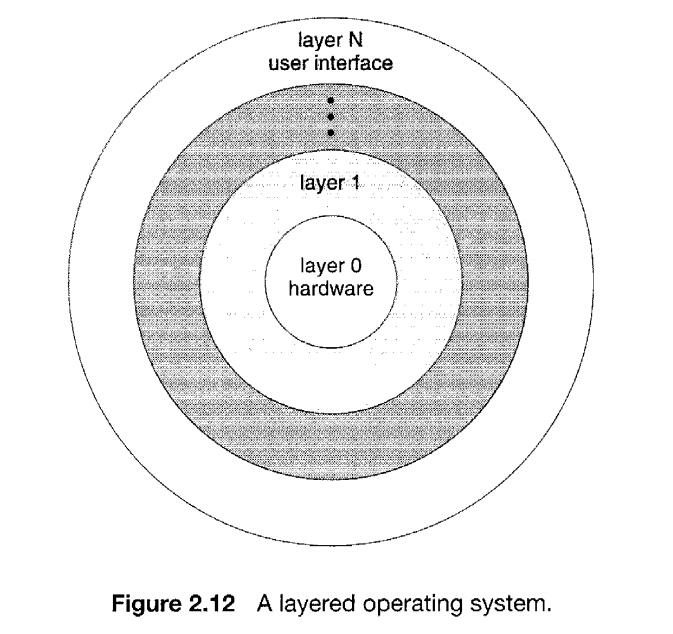
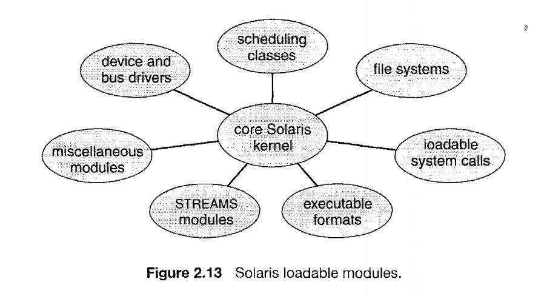

# 操作系统第二章笔记

## 1. Operating-System Services

operating-system provide some common servers:

1. User interface  
eg: command-line-interface\batch-interface\graphical user interface

2. Program execution
3. I/O operations
4. File-system manipulation

    eg: read\write\delete\create\search
5. Communications
    one process needs to exchange information with another process. by 
    shared momory or message passing
6. Error detection
7. Resource allocation
   eg: CPU cycles, main memory , file storage, I/O devices
8. Accounting
9. Protection and security 
    Protection involves ensuring that all access to systemm resources is controlled
    Security extends to defending invalid access attempts outside (保护主要是防止来自外部的攻击)

## 2. User Operating-System Interlace

### 2.1. Command Interpreter

There are two general ways in which these commands can be implemented

1. the command interpreter itself contains the code to execute the command.

2. An alternative approach-used by UNIX, among other operating systems-implements most commands through system programs. 
    
ps: 在第二种情况下 命令行解释器的作用是识别哪一个程序需要被读入内存并且执行,比如UNIX下的命令 `rm file.txt` ，命令行解释器会搜索名为`rm`的文件，将文件读入内存，并且以 `file.txt` 为参数执行它。采用第二种方式可以很容易增加新的命令而不用改动命令行解释器

### 2.2. Graphical User Interfaces

## 3. System Calls

System calls provide an interface to the services made available by an operating system. 

The API specifies a set of functions that are available to an
application programmer, including the parameters that are passed to each function and the return values the programmer can expect.

ps: API 是对系统调用的进一步封装。使用API的好处有：

1. 提升可移植性  
2. 提升易用性

### 3.1. system-call interface
    The system-call interface intercepts function calls in the API and
    invokes the necessary system call within the operating system.

most of the details of the operating-system interface
are hidden from the programmer by the API and are managed by the run-time
support library. 

### 3.2. methors to pass parameters

Three general methods are used to pass parameters to the operating system

1. pass the parameters in registers.
2. parameters are generally stored in a block, or table, in memory, and the address of the block is passed as a parameter in a register.(This is the
approach taken by Linux and Solaris)

3. Parameters also can be placed, or pushed, onto the stack by the program and popped off the stack by the operating system.

## 4. Operating-System Structure

### 4.1. Simple Structure

an enormous amount of functionality to be combined into one level. This monolithic structure was difficult to implement and
maintain.

ps: 比如 ms-dos 和 早期的 UNIX

### 4.2. Layered Approach

the operating system is broken up into a number of layers (levels). The bottom layer (layer 0) is the hardware; the highest (layer N) is the user interface.

A typical operating-system layer-say, layer M-consists of data structures and a set of routines that can be invoked by higher-level layers. Layer M, in turn, can invoke operations on lower-level layers.

**advantages** :
The main advantage of the layered approach is simplicity of construction and debugging. because the layers are selected so that each uses functions (operations) and services of only lower-level layers.

**disadvantages** :

1. The major difficulty with the layered approach involves appropriatelydefining the various layers. (很难分层)

2. 会导致循环调用。 for example:   memory-management routines -> backing store driver -> CPU scheduler -> backing-store driver

3. A final problem with layered implementations is that they tend to be less
efficient than other types. (层层调用，每一层都需要修改数据，传递参数，导致低效)

### 4.3. Microkernels

This method structures the operating system by removing all nonessential components from the kernel and implementing them as system and user-level programs.  The result is a smaller kernel.

Typically, microkernels provide minimal process and memory management, in addition to a communication facility.

The main function of the microkernel is to provide a communication facility between the client program and the various services that are also running in user space. (比如一个客户端程序需要访问文件，那么它必须和文件服务进行互动，两者通过传递信息的方式 **分别和微核通信** ，来实现彼此的信息交换，而**不是直接通信**)

**advantages** :

1. One benefit of the microkernel approach is ease of extending the operating system.
2. The microkernel also provides more security and reliability, since most services are running as user-rather than kernel-processes.

**disadvantages** :

1. microkernels can suffer from performance decreases due to increased system function overhead.

### 4.4. Modules

the kernel has a set of core components and dynamically links in additional services either during boot time or during run time. Such a strategy uses **dynamically loadable modules** .

Such a design allows the kernel to provide core services yet also allows certain features to be implemented dynamically

* The Modules approach resembles a layered system in that each kernel section has defined, protected interfaces
* more flexible than a layered system in that any module can call any other module.
* the approach is like the microkernel approach in that the primary module has only core functions and knowledge of how to load and communicate with other modules
* it is more efficient, because modules do not need to invoke message passing in order to communicate.

## 5. Vitual Machines

The fundamental idea behind a virtual machine is to abstract the hardware of a single computer (the CPU, memory, disk drives, network interface cards, and so forth) into **several different execution environments** (多个操作系统）thereby creating the illusion that each separate execution environment is running its own private computer.

By using **CPU scheduling** (Chapter 5) and **virtual-memory techniques**(Chapter 9), an operating system can create the illusion that a process has its own processor with its own (virtual) memory.

A major difficulty with the virtual-machine approach involves disk systems. The solution is to provide virtual disks-termed minidisks。

### Implementation

The underlying machine has two modes: user mode and kernel mode.

* The virtual-machine software can run in kernel mode,since it is the operating system. 

* The virtual machine itself can execute in only user mode.

Just as the physical machine has two modes, however, so must the virtual machine. Consequently, we must have a **virtual user mode** and **a virtual kernel mode**, both of which run in a physical user mode. Those actions that :

* cause a transfer from user mode to kernel mode on a real machine.
*  cause a transfer from virtual user mode to virtual kernel mode on a virtual machine.

