# 进程同步

## 信号量

### 定义 

* 用整形(**sem**ephore)表示,有两个原子操作
* **P()**:  先把sem -1, 如果 **sem<0** 等待，否则继续
* **V()**:  先把sem+1. 如果  **sem<=0** (说明当前有进程在等待，如果信号量 <0 进程就会等待，这里执行了+1操作所以变为 <=0), **唤醒**一个等待的进程
* 信号量的值可以理解为当前**剩余**可进入临界区的**进程数**，或者理解为用信号量表示**系统资源的数量**(信号量>0，表明当前系统有剩余资源，进程可以进入)

### 信号量的特性

* 信号量是**被保护**的整形变量
  * 初始化完成后，**只能**通过 **P()**和**V()** 对信号量进行修改
* 操作系统保证，PV操作是原子操作
* **P()** 操作可能阻塞(在P操作里如果 **sem** < 0 会进入等待，导致堵塞)
* **V()** 操作不会阻塞
* 通常假设信号量是公平的，这意味着:
  * 线程不应该无限阻塞在 P 操作。(不会无限等待)
  * 信号量等待在实践中通常遵循**先入先出**原则。(不会插队能在一定程度上保证线程不会无限等待)

### 信号量的可能实现

```c++
class Semaphore{
    int sem;
    WaitQueue q;
}

Semaphore::P(){
    sem--;
    if(sem<0){
        // 把进程放入等待队列，然后锁住
        Add this thread to q;
        block(p);
    }
}

Semaphore::V(){
    sem++;
    if(sem<=0){
        // 信号量 <=0 说明 等待队列里有进程
        // 现在当前进程执行V操作让出了资源
        // 所以可以唤醒等待队列里的进程
        Remove a thread t from q;
        wakeup(t);
    }
}

```

### 信号量的分类

* 二进制信号量 : 资源数目 为 0 或者 1 (互斥型信号量) 临界区里只能有 0 个 或者1 个进程
* 资源信号量 : 资源数目可以为任意负值(计数型信号量)。临界区可以有多个进程 

### 信号量的使用

1. 互斥访问——控制临界区的互斥访问
2. 条件同步——线程间的事件等待

#### 用二进制信号量实现临界区的互斥访问

```c++
mutex = new Semaphore(1);

mutex -> P();
...
Critical Section;
...
mutex->V();
```


#### 用二进制信号量实现调度约束

```c++
condition = new Semaphore(0);

// Thread A
...
condition->P();
...

// Thread B
...
condition->V()
...
// A执行到条件的时候，必须等B执行完condition之前的部分，A才能接着执行剩下的不放呢

```

#### 生产者消费者问题

* 缓冲区互斥(只能有一个进程，访问缓冲区) 互斥访问——二进制信号量**mutex**
* 缓冲区为空，消费者必须等待生产真(条件同步)——资源信号量 **fullBuffers**
* 缓冲区满，生产者必须等待消费者(条件同步)——资源信号量 **emptyBuffers**

```c++
Class BoundedBuffer{
    mutex = new Semaphore(1); // 互斥
    fullBuffers = new Semaphore(0);
    emptyBuffers = new Semaphore(n);
}

// 生产者
BoundedBuffer::Deposit(c){
    // 必须先判断是否能写
    // 再访问互斥锁
    emptyBuffer->P(); // 先条件判断。这句话之后 sem-1,资源就被占用了
    mutex->P() ;  //互斥访问
    add c to buffer;
    mutex->V() ; // 解除互斥
    fullBufferr->V();  // 增加满资源
}

// 消费者
BoundedBuffer::Remove(c){
    // 必须先判断是否能读
    // 再访问互斥锁
    fullBuffer->P(); // 先条件判断
    mutex->P() ;  //互斥访问
    remove c from buffer;
    mutex->V() ; // 解除互斥
    emptyBuffer->V();  // 增加空资源
}


```

ps: 

* V()操作本身没有阻塞，所以V操作交换顺问题不大
* P()操作内部存在阻塞，P操作随便交换顺序会有问题

#### 使用信号量的问题

* 读/开发代码比较困难
* 容易出错
  * 执行了P()操作确没有执行V()操作，忘记释放信号量
  * 使用的信号量已经被另一个线程占用
* 不能处理死锁问题


## 管程 Moniter

管程是一种用于多线程互斥访问共享资源的程序结构

* 采用面向对象的方法，简化了线程间的同步控制
* **任意一个时刻** 只有**一个**线程执行管程代码
* **正在管程**中的线程可以**临时放弃**管程的互斥访问，**等待**时间出现的恢复(等待被唤醒)

使用管程:

* 在对象/模块中，收集相关的共享数据
* 定义访问共享数据的方法。

### 管程的组成

* 一个锁
  * 控制管程代码的互斥访问
* 0 或 多个**条件变量**
  * 管理共享数据的并发访问
  * 灭个条件变量管理一个队列
  * 在管cheng

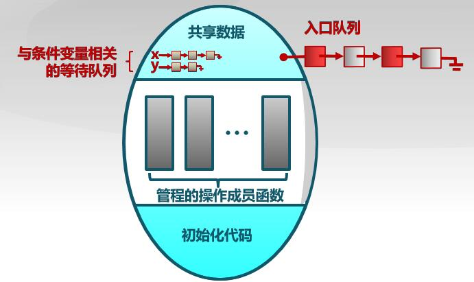

#### lock

* Lock::Acquire() ——直到锁可用，然后抢占锁
* Lock::Release()——释放锁，唤醒等待者。

#### 条件变量

* 条件变量是管程内的**等待机制**
  * 进入管程的线程因为**资源被占用**而而进入等待状态
  * 每个条件变量表示一种等待的原因，对应**一个等待队列**
* Wait() 操作
  * 释放锁，睡眠。
* Signal()操作
  * 将等待队列中的一个线程唤醒
  * 如果一个线程为空，等同于空操作

条件变量实现:

```c++
class Condition{
    int numWaiting =0;
    WaitQueue q;
}
Condition::Wait(lock){
    numWaiting++;
    Add this thread t to q;
    release(lock);
    schedule(); // need mutex，需要互斥访问，选择下一个线程进入管程
    require(lock); //申请管程执行
}
Condition::Signal(){
    // 如果 numWaiting<=0 表明队列里没有进程就什么都不做
    if(numWaiting>0){
        Remoe a thread t from q;
        wakeup(t); // need mutex
        numWaiting--;
    }
}

```

### 用管程解决生产者———消费者问题

```c++
class BoundedBuffer{
    ...
    Lock lock;
    int count =0;
    Condition notFull, notEmpty;
}
BoundedBuffer::Deposit(c){
    lock->Acquire();     //互斥,用管程需要保证互斥，同时只能有一个进程在管程里
    while(count == n)    //条件
      notFull.wait(&lock);  //这个 lock的含义是在 wait里需要释放锁
    Add c to the buffer;
    count++;
    notEmpty.Signal();
    lock->Release();   // 条件
}
BoundedBuffer::Remove(c){
    lock->Acquire();
    while(count==0)
        notEmpty.wait(&lock)
    Remove c from buffer;
    count--;
    notFull.Signal();
    lock()->Release();
}
```

### Hansen-style and Hoare-style

唤醒线程之后，是唤醒的线程(发送signal信号的进程)先执行，还是被唤醒的先执行。

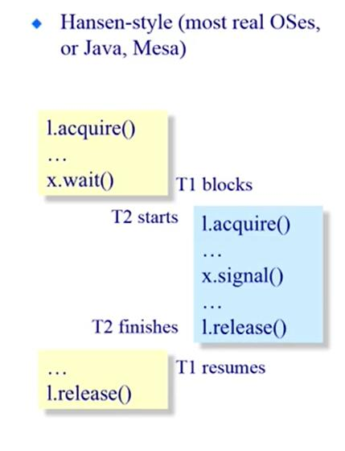


唤醒的进程执行完再让被唤醒的进程执行

* Hoare-style

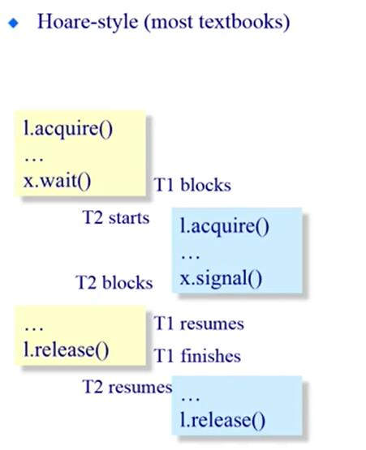

被唤醒的进程先执行再让唤醒的进程执行

#### 使用这两种不同的方式

* Hansen-style
  * Signal is only a "hint" that the condition may be true
  * need to check again
* Benifits
  * Efficient implementation

```c++
Hansen-style : Deposit(){
    lock->acquire();
    /*
    这里必须用 while是因为，hansen
    方式在唤醒线程的时候并不是让
    该线程马上执行，有可能有其它线程
    在排队，有可能对count进行修改
    所以只是暗示count可能不变
    需要用while进行判断
    */  
    while(count ==n){
        notFull.wait(&lock);
    }
    Add thing;
    count++;
    notEmpty.signal();
    lock->release();
}

```

* Hoare-style
  * Cleaner,good for proofs
  * When a condition variable is signaled,it does not change
* Benifits
  * Inefficient implementation(需要做更多的工作才能保证)

```c++
Hansen-style : Deposit(){
    lock->acquire();
    /*
    因为线程被唤醒之后，就直接执行，
    所以条件不会发生变化
    因此用 if 即可
    */  
    if(count ==n){
        notFull.wait(&lock);
    }
    Add thing;
    count++;
    notEmpty.signal();
    lock->release();
}

```

## 同步方法总结

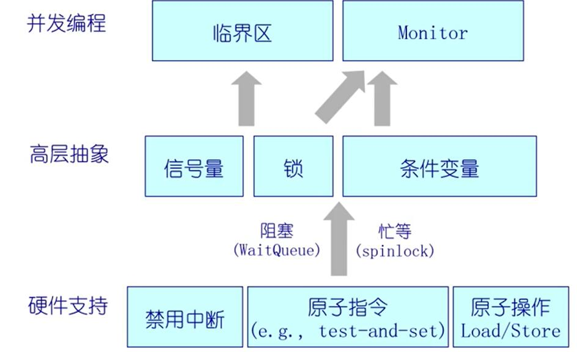

## 同步经典问题

### 读者-写者问题

#### 读者优先，信号量


多个并发进程的数据集共享

* 读者——只读数据集，它们不执行任何更新。
* 写者——可以读取和写入
* 上述问题读者优先

共享数据

* 数据集
* 信号量 CountMutex 初始化 1 (保护 Rcount)
* 信号量 WriteMutex 初始化 1 
* 整数 Rcount 初始化为0

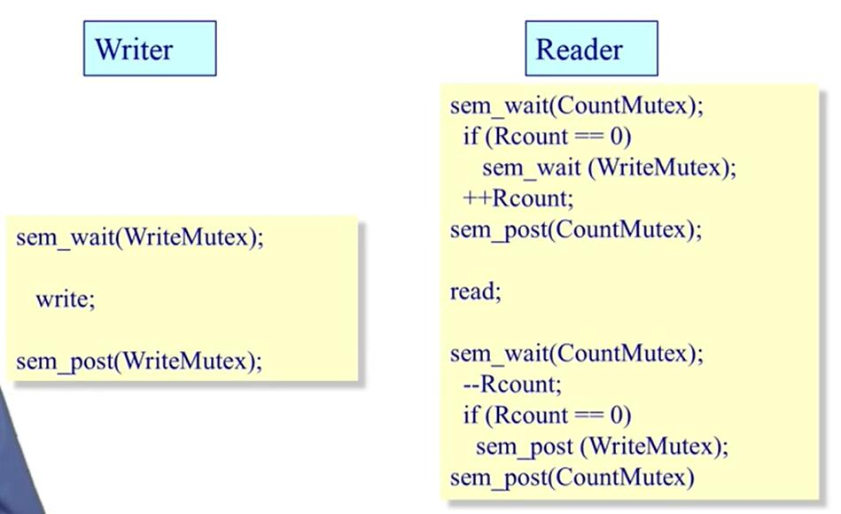

总结: 思考同步问题需要考虑有哪些共享变量。需用用用信号量对共享变量进行保护

#### 写者优先，管程

* 读者除了要等待当前正在操作的写者
* 读者还需要等待在等待队列上的写者

(从粗到细的设计)

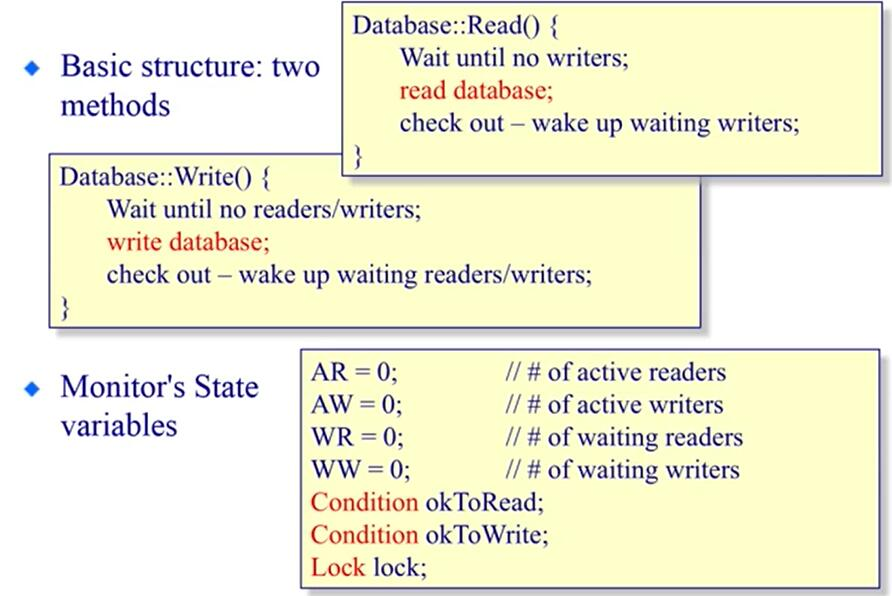

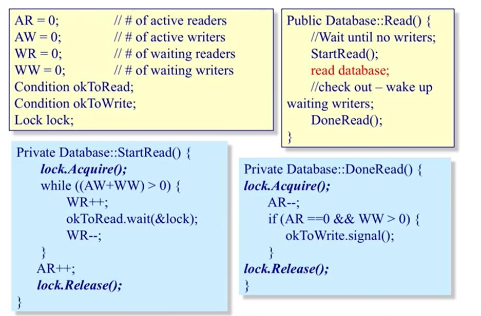

ps ：在 DoneRead()中，if 的条件 AR==0 表示应该使得当前没有写者了， WW>0 表示有没有等待的写者

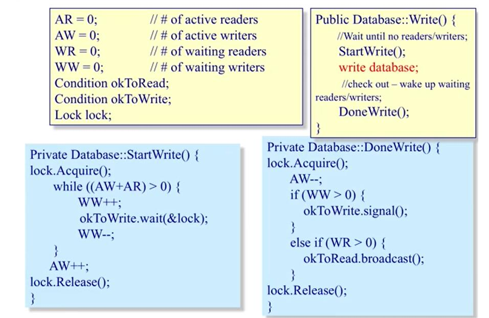

ps:

1. DoneWrite 先判断 WW  表明了写优先
2. broadcast 表示唤醒等待队列里的所有读者(因为允许多个读者同时读)

### 哲学家问题

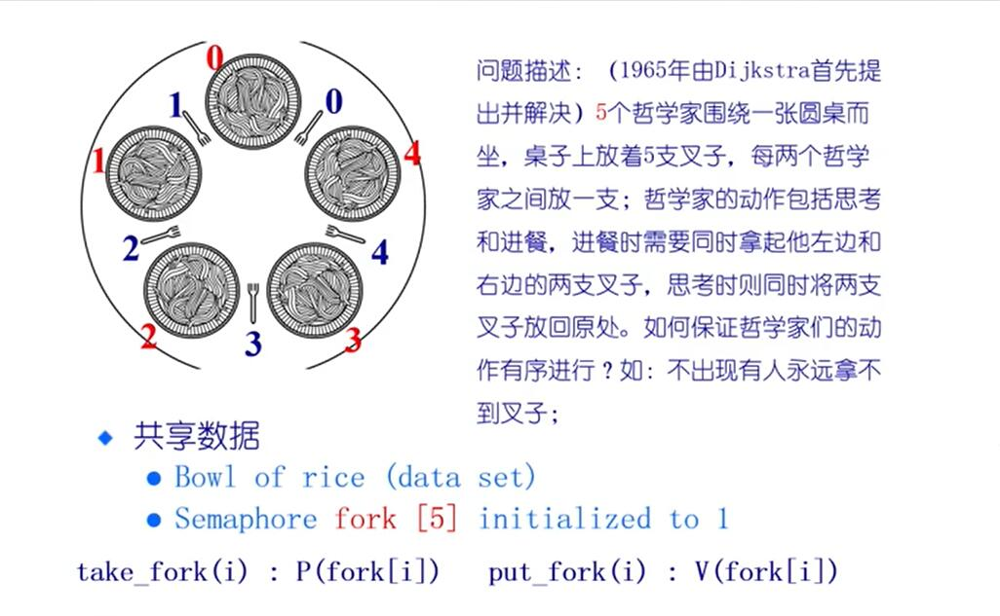

#### 解法1(错)

可能造成死锁,每个人都同时拿起左边的叉子

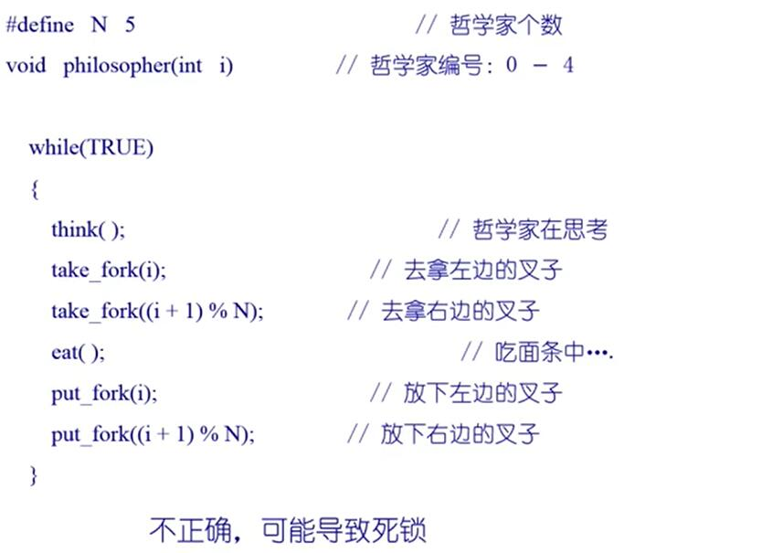

#### 解法2(错)

当五个人同时执行(第一句话五个进程一起执行完，然后又一起执行第二局)永远吃不上饭。

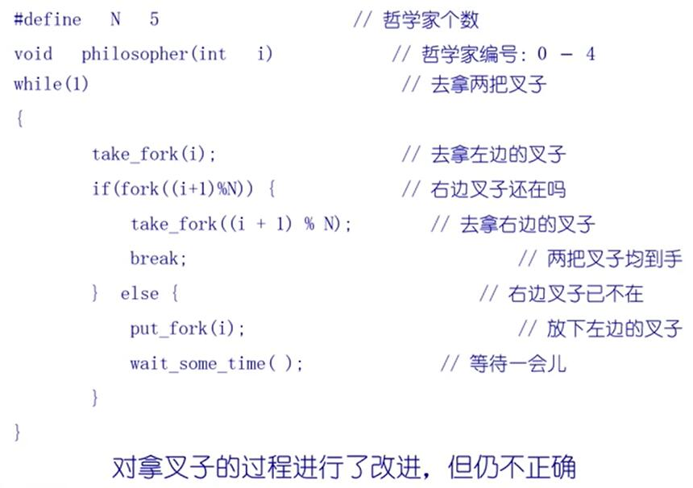

#### 解法3 只让一个人吃饭

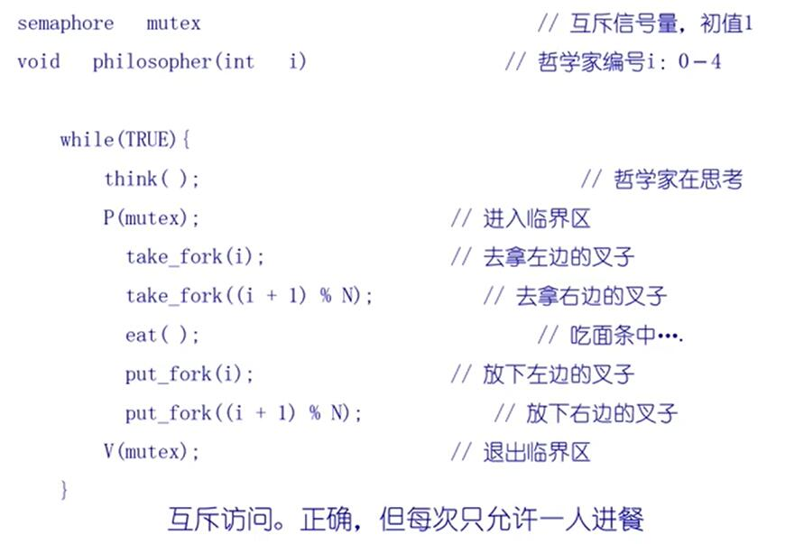

#### 正确解法

指导原则: 要么不拿，要么拿两把叉子。(检查邻居有没有在吃饭)

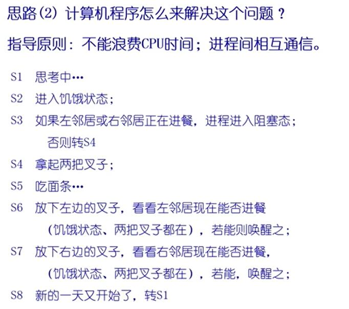

在上述描述中: 将 **eating**状态作为临界资源(互斥访问)

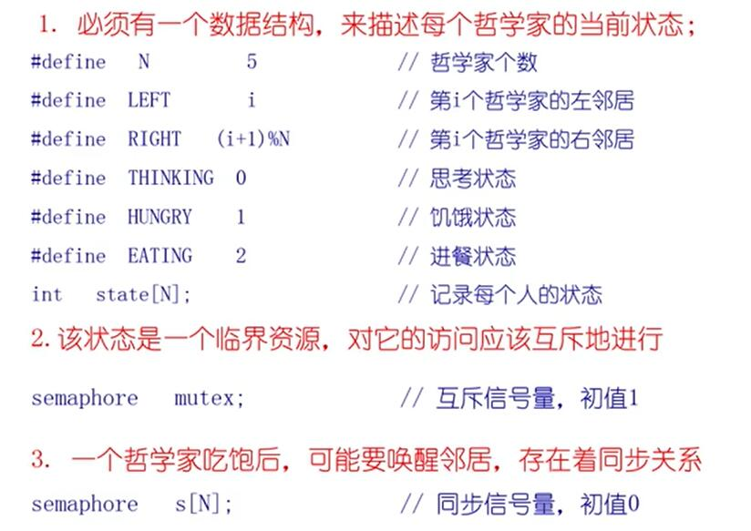

代码


ps： think 操作需要用 mutex 保护起来，因为在 think 里也需要设置THINKING状态

take_fokes

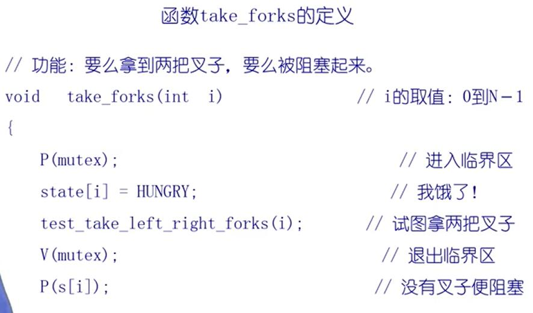

test_take_left_right_forks

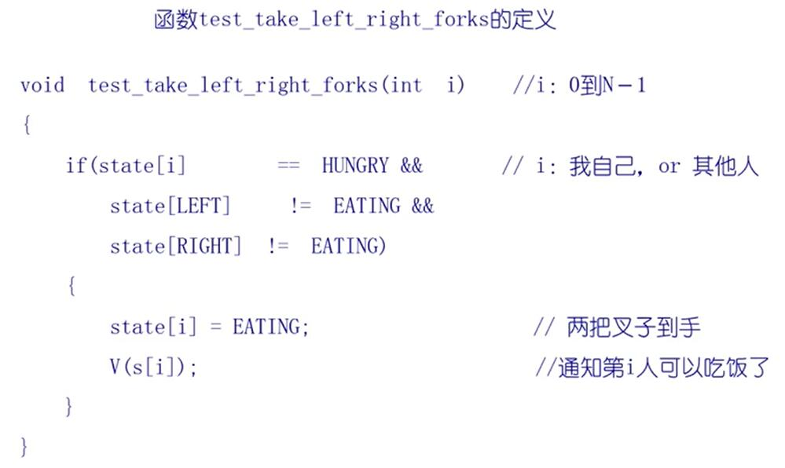

ps : 这里 V(s[i]]) s[i] 初值是0，V(s[i]) 通知自己可以吃饭了。后面的 P(s[i]) 不会阻塞

put_forks

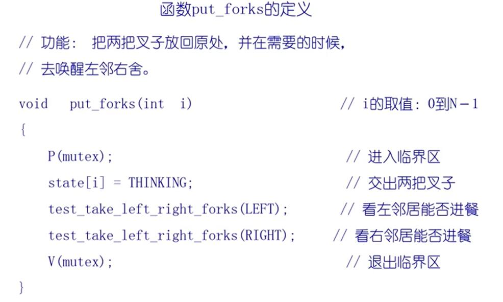

当为了别人调用 test_take_left_right_forks

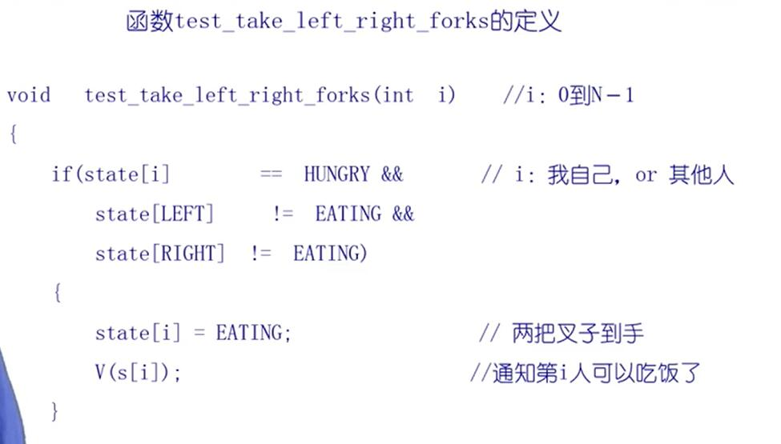


### 同步问题思考方式 

1. 按照正常人的思路思考应该怎么做，可以把场景具现化
2. 写出伪代码
3. 思考需要哪些共享变量(需要用信号量、管程 或者其它机制保护的)
4. 完善代码细节
5. 思考又没哟**低效**或者**死锁**的问题