# 死锁和进程间通信

* 一组阻塞的进程持有一种资源等待获取另一个进程所占有的一个资源。导致谁都没有办法执行
* 死锁产生的原因是 并发执行，拥有一部分资源，抢资源。

形象比喻:

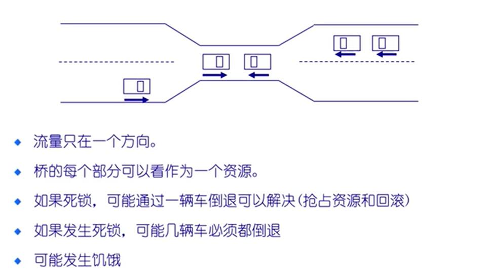

## 死锁系统模型

* 资源类型 $R_1$ ,$R_2$...$R_m$
* 资源具有互斥性。(资源被一个进程占有，其它进程不能访问这个资源)
* 进程获得资源，用完后需要释放由其他进程重用
* 如果每个进程**拥有**一个资源，并请求其它资源，死锁可能发生
* 如果接收消息阻塞可能会发生死锁。
* 少见的事件组合会引起死锁
* 每个资源类型有 $R_1$ 和 $W_1$ 实例
* 每个进程使用的资源过程为
  1. request/get <- free resource
  2. use/hold    <- requested/used resource
  3. release <- free resource
  4. 从 free - used - free 周而复始

### 资源分配图

一组顶点V和边E的集合

* $P=\{ P_1,P_2....,P_n\}$ 集合包括系统中所有的进程
* $R=\{ R_1,R_2....,R_n\}$ 集合包括系统中所有的进程
* 有向边 $P_i -> R_j$ 表示 进程 i 需要 资源 j
* 有向边 $R_j -> P_i$ 表示 现在资源 j 被 进程 i 占用

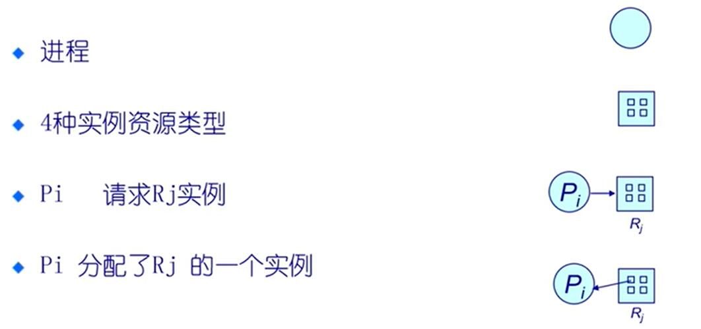

ps: 小方框表示资源个数。

* 无死锁例子:

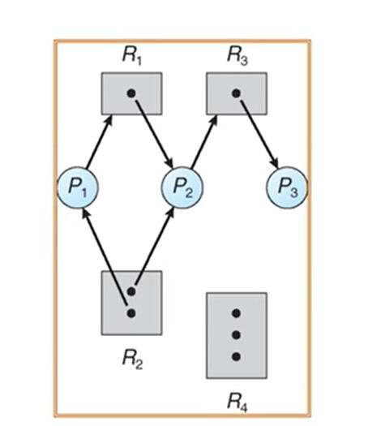

* 死锁例子:

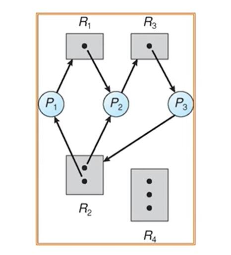

ps: 图中存在环

死锁产生后典型的特征: 有向图中存在环(存在环不一定会死锁)

* 有环不死锁

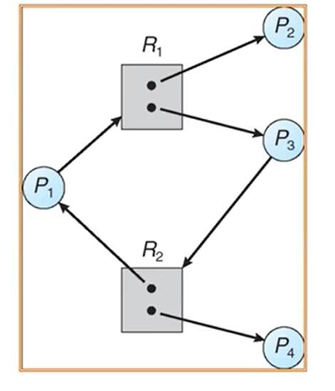

ps: 虽然有环但是 P2 在一定时间之后会释放资源。

### 基本结论

* 如果图中不包含循环 => 没有死锁
* 如果图中包括循环:
  * 如果每个资源类只有一个实例，那么死锁
  * 如果每个资源类有几个实例，可能死锁

有环是死锁的充分不必要条件

## 死锁特点

如果下面的四个条件同时成立可能出现死锁:

* **互斥**
* **持有并等待**: 进程保持至少一个资源并正在等待获取其他进程所持有的额外资源
* **无抢占** 资源只能被进程资源释放。
* **循环等待**
  * 存在等待进程集合{P0，P1，...，PN} 
  * P0正在等待P1所占用的资源，
  * P1 正在等待P2占用的资源，...，
  * PN-1在等待PN所占用资源，
  * PN正在等待P0所占用的资源

上述 4 个条件是死锁的必要条件。

## 死锁处理办法

1. Deadlock Prevention (死锁预防)
2. Deadlock Avoidence (死锁避免)
3. Deadlock Detection (死锁检测)
4. Recovery from Deadlok (死锁恢复)

* 确保系统永远不会进入死锁状态
* 运行系统进入死锁状态，然后恢复
* 忽略这个问题，假设系统中从来没有发生郭死锁，用于大多数操作系统，包括UNIX

### 死锁预防

打破死锁出现的某一个条件

* 打破 互斥条件， 比较少在某些条件下可以
* 打破占用并等待 
  * 要么没有资源，要么把资源全部分配给它
  * 资源利用率低，可能出现饥锇
* 打破无抢占
  * 如果进程占有某些资源，并请求它不能被立即分配的资源，则释放当前正占用的资源。(把资源抢过来，直接kill调其它进程)
* 打破循环等待——对所有资源类型进行排序，并要求按照资源顺序进行申请，会出现资源利用不够。(在通用操作系统应用不多，嵌入式操作系统里有)

### 死锁避免

* 最简单和最有效的模式是要求每个进程声明它可能需要的每个类型资源的**最大数目**
* 资源的分配状态是通过限定**提供**与**分配**的资源数量，和进程的**最大**需求
* 死锁避免算法，动态检查资源分配状态，确保不会出现环形等待状态，存在一个安全状态。

安全状态是指: 

* 针对所有进程，存在安全序列
* 序列 < P1,P2,...PN >是安全的 : 对每个 Pi, Pi 要求的资源 能够由当前可用的资源 + 所有 Pj(j< i) 所持有的资源来满足 。(因为 i之前的进程执行完资源都会释放掉)

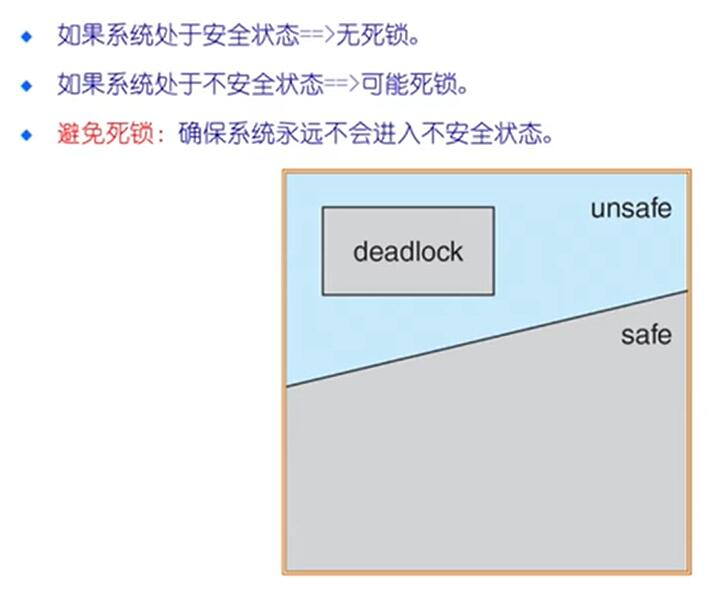

#### 银行家算法

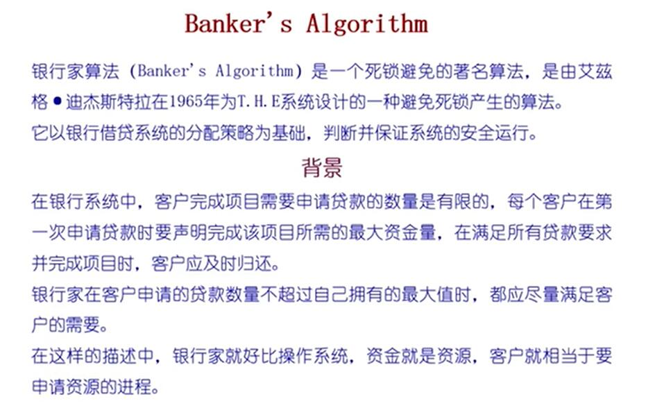

前提条件: 

**数据结构**:

* n = 进程数量
* m = 资源类型数量
* $Max$(总需求量) : n*m 矩阵。 如果 $Max[i,j] = k$, 表示 $P_i$ 最多请求 $k$个 $R_j$ 类型的资源
* $Available$(剩余空闲量): 长度为 m 的向量， 如果 $Available[j] = k$, 有 k 个类型的 $R_j$资源可用
* $Allocation$(已分配量) : n*m 矩阵。$Allocation[i,j]$ 表示当前分配给$Pi$     k 个 $Rj$  的实例
* $Need$(未来需要量)。m*n矩阵 如果 $Need[i,j] = k$, 表示未来 $P_i$ 需要 k 个 $P_j$类型的资源
* $Need[i,j] = Max[i,j] - Allocation[i,j]$

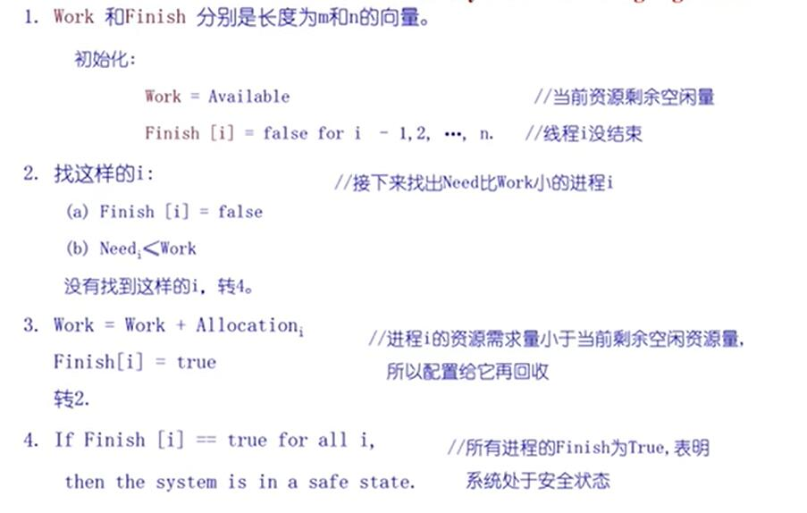
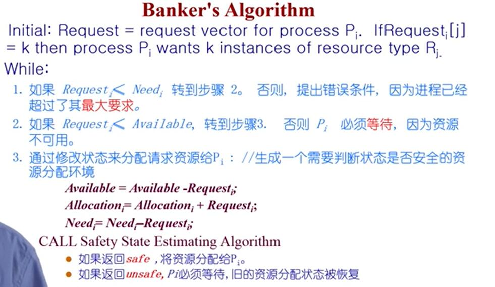

这个其实就是 一种贪心算法。

### 死锁检测

1. 判断资源分配图里有没有环
2. 类似于银行家算法
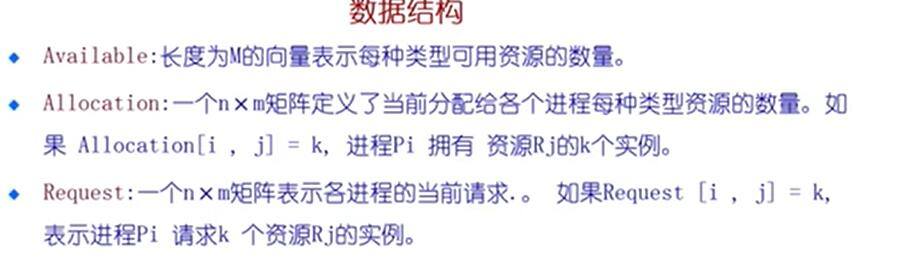
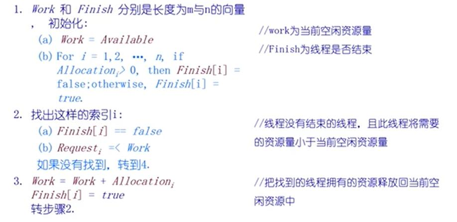

* 死锁检测算法开销很大
* 很难获得资源总数
* 所以通常在调试的时候使用

### 死锁恢复

* 终止所有的死锁进程
* 在一个时间内终止一个进程直到死锁消除
* 进程终止顺序
  * 进程优先级
  * 进程运行了多久以及需要多少时间才能完成
  * 进程占用的资源
  ....

## IPC

进程之间资源是相互独立的，所以进程之间的通信需要建立通信链路。

* 通信模型
* 直接简介
* 阻塞非阻塞
* 通信链路缓冲   

### 信号

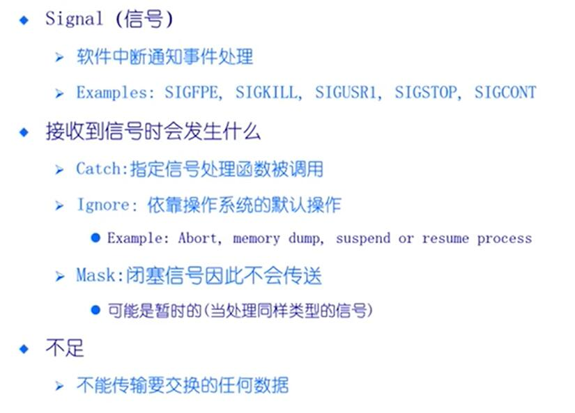

用使用信号机制，需要先用操作系统的系统调用 注册一个 signal handle, 当信号产生的时候，会跳到应用程序指定的处理函数   

### 管道

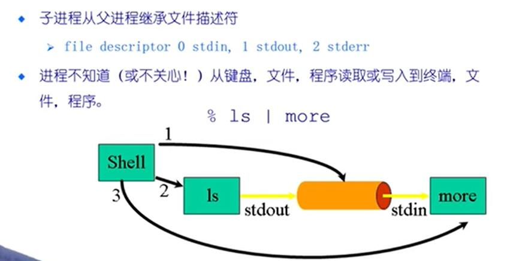

例子: linux 下的 管道机制

` cat file.txt | head -n 100 `

管道相当于一个 buffer

### 消息队列

消息队列按照FIFO来管理消息

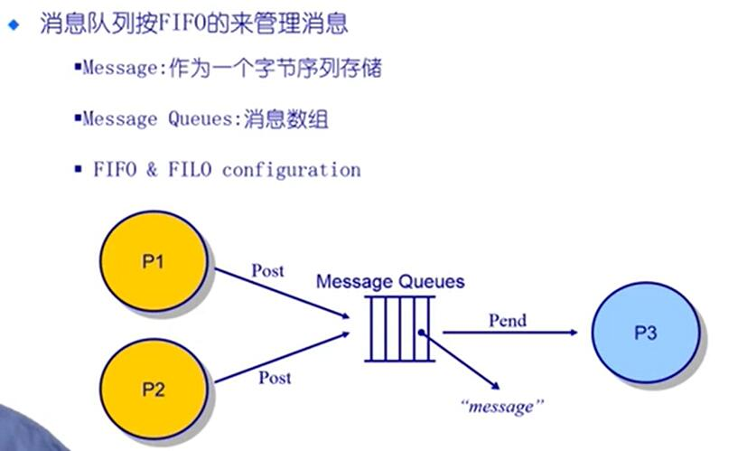

### 共享内存

* 优点
  快速、方便地共享数据
* 不足
  * 必须同步数据访问

