# 第三章 内存管理

## 内存层次结构

简单复习一下

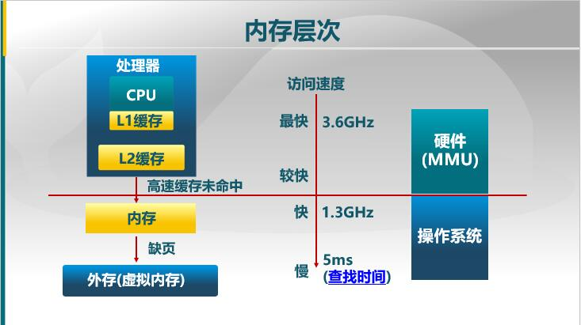

### 操作系统内存管理的任务

* 抽象——逻辑地址空间
* 保护——独立的地址空间
* 共享——访问相同的内存
* 虚拟化——更多的地址空间

操作系统实现上述任务的手段：

1. 程序和重定位
2. 分段
3. 分页
4. 虚拟内存
5. 按需分页虚拟内存

### 地址空间&地址生成

* 地址空间定义
* 地址生成(怎么生成逻辑地址空间和物理地址空间)
* 地址安全检查

#### 地址空间

* 物理地址空间——硬件支持的地址空
* 逻辑地址空间——一个进程所拥有的内存范围

#### 逻辑地址空间生成

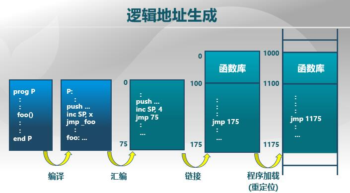

* 从符号的逻辑地址(代码中每一个语句的位置)到最终可以在内存中运行的地址(逻辑地址)。
* 经过上面的操作得到的是逻辑地址，是应用程序能看到的地址。       

#### 物理地址生成

* CPU获得逻辑地址，通过MMU获得物理地址
* 操作系统建立从 逻辑地址到物理地址之间的映射

#### 地址检查

操作系统拥有

1. 起始地址(基址)
2. 地址长度

通过这两个参数就可以确定地址的范围。

操作系统获取一个逻辑地址，先检查其是否在规定的地址空间中，如果在再将其转化为物理地址。

## 连续内存分配

### 内存碎片问题

空闲内存不能被利用，内存碎片有两种

1. 外部碎片
   **分配单元间**的未使用的内存
2. 内部碎片
   分配单元中的未使用内存。(内存空间已经分配出去了，但是应用程序用不了  )

### 简单内存管理方案

1. 当一个程序准许运行在内存中时，分配一个连续的空间
2. 给一个运行的程序分配一块连续的内存空间来访问数据 (比如 c++里的 new)

三种简单内存分配算法

#### 首次适配算法 first fit

分配 n 个字节的空间。

从低地址往高地址找(按照地址的顺序找)，找到**第一个**适合分配的地址空间(size>n)，就直接分配给它。

需求:

* 按地址排序的空闲块列表
* 分配需要寻找一个合适的分区
* 重分配(回收)的时候进行检查，看看能不能和相邻的空闲块进行合并，合并成比较大的空闲块。

优点:

1. 简单
2. 易于产生更大的空闲块(更大空闲块向着地址空间的结尾)。(因为前面如果有就分配出去了，不需要破坏之后地址的空闲块)

缺点:

1. 容易产生外部碎片(随着分配的持续加剧),前后两次分配之间的地址很可能用不了产生碎片
2. 不确定性，可能导致分配大块较慢(因为按照顺序找)

#### 最优适配算法 best fit

为了分配 n字节，分配一块最小的并且大于 n 的空闲块。或者说分配一块空闲块其大小比n大，但是和n的差距最小。 

需求:

1. 按尺寸排列的空闲块列表
2. 分配需要寻找合适的分区
3. 重分配(回收)需要重新搜索并合并相邻的空闲分区

优势:

* 大部分分配是小尺寸的时候很有效
* 比较简单
* 避免大的空闲分区被拆分
* 减少外部碎片大小(产生小碎片)

劣势:

* 外部碎片
* 重分配时间慢
* 容易产生很多没用的微小碎片(不好)，因为是按照最适合大小分的，所以会切下来一块比较小的碎片  

#### 最差匹配分配

为了分配 n 字节，使用**最大**的空闲块，是的空闲块比 n大

为了避免有太多微小的碎片

* 按尺寸排列的空闲块列表
* 分配很快(获得最大分区)
* 重分配(回收)需要重新搜索并合并相邻的空闲分区

优势

* 分配是中等尺寸效果最好
* 避免出现太多小碎片

劣势

* 重分配慢
* 外部碎片
* 容易产生碎片大的空闲块(破坏了大的空闲块，当再次需要大的块的时候，比较难分配)

### 压缩式碎片整理

* 重新放置程序的位置来合并漏洞(外部碎片)
* 要求所有程序是动态可重置的。

因此需要考虑两个问题:

1. 什么时候挪程序。(如果在运行的时候挪可能导致出错)
2. 挪程序的开销怎么样

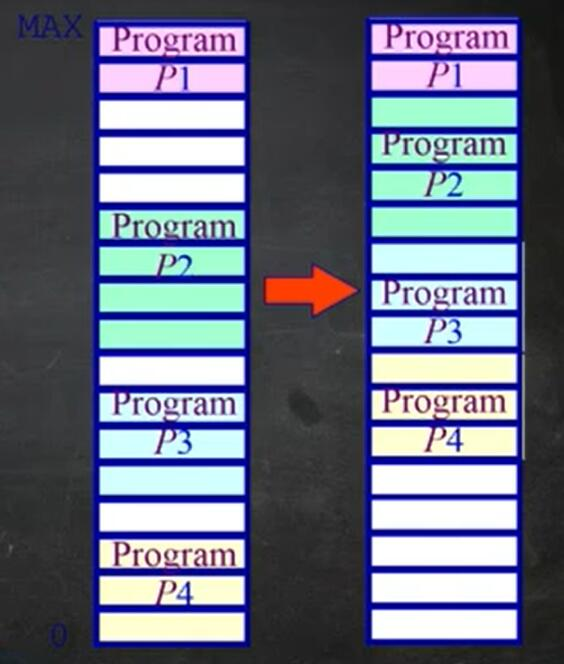

### 交换式碎片整理

swaping

将主存把进程搬到硬盘(来腾出内存块)
把进程从硬盘搬到主存(进程需要再执行的时候)

问题:

1. 对哪些程序进行 swaping
2. 什么时候执行 swaping
3. swaping的开销(这里的swaping都是以一个程序的连续的内存空间为单位)

## 非连续物理内存管理

* 为什么要采用非连续物理内存分配
* 分段(Segmentation)
* 分页(paging)
* 页表(page table)

### 为什么非连续分配

连续内存分配的缺点:

* 采用连续内存分配会产生碎片(内碎片和外碎片)
* 分配给一个进程的物理内存是连续的
* 内存利用率较低

非连续内存分配的优点:

* 一个程序的物理地址空间是非连续的
* 更好的内存利用和管理
* 允许共享代码和数据(共享库...)
* 支持动态加载和动态链接(这个不懂)

非连续内存分配的缺点:

* 如何建立虚拟地址和物理地址的转换。
  * 两种硬件方案 1 分段 2 分页

### 分段

分段: 更好地分离和共享

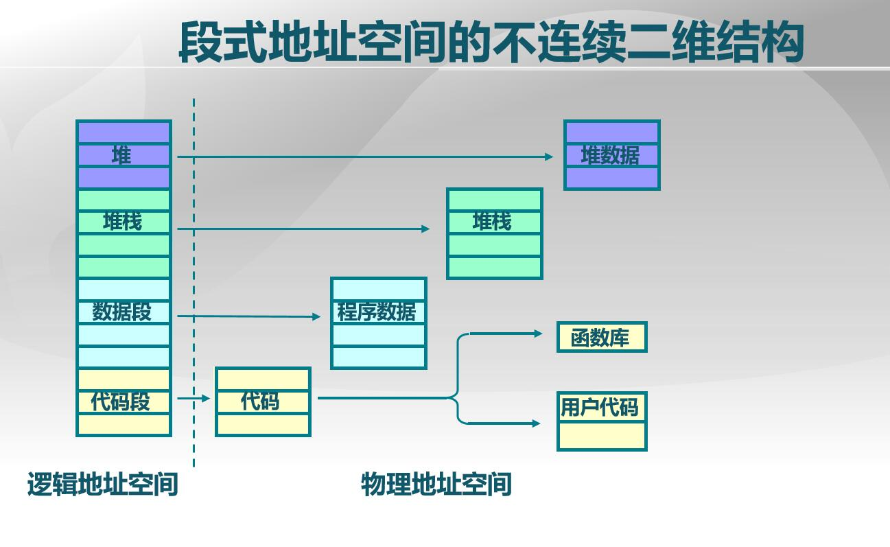

* 左边是连续的虚拟地址
* 右边是不连续的物理地址
* 需要映射机制

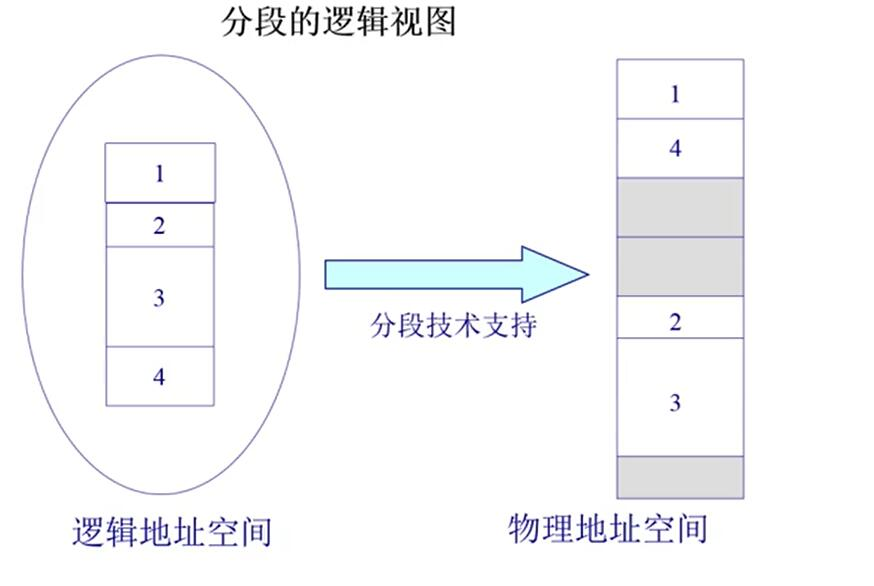

#### 分段寻址方案

二元组 (s, addr)

* s 段号
* addr 段内偏移

微机接口里的 段地址和段内偏移 ( s<<4 + addr)

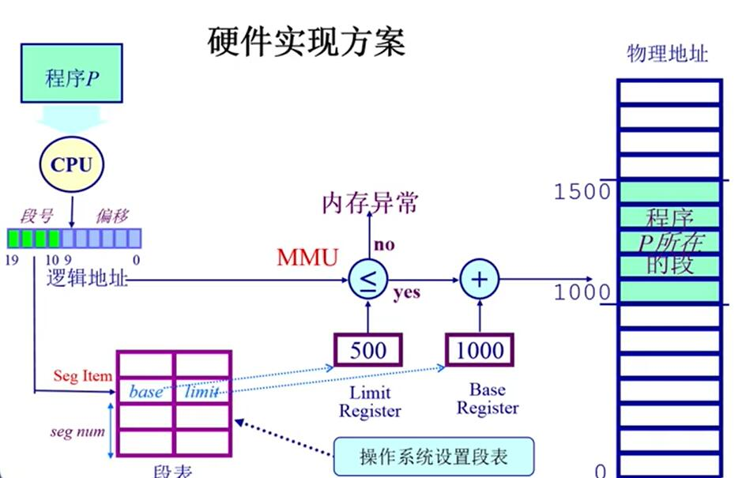

* 把逻辑地址分为 (段号，偏移)
* 硬件里保存着段表 (base,limit), base是基址，limit是限制(段的长度)
* 从逻辑地址中的段号查找段表 获得 base 和 limit
* 段表由操作系统建立

### 分页

现在大部分 CPU采用分页机制

* 分页地址空间
* 分页寻址方案

分页也需要 (页号，页内偏移)。和分段最大的区别是 页的大小**是固定**的

#### 分页地址空间

* 划分物理内存至固定大小的 帧 (frame),大小为 $2^n$ 比如 512,4096...
* 划分逻辑地址空间至大小相同的页 (page)
* 建立物理页和逻辑页的映射关系——转换逻辑地址为物理地址 (pages to frames)
  1. 页表
  2. MMU/TLB (内存管理单元和快表)

frame:

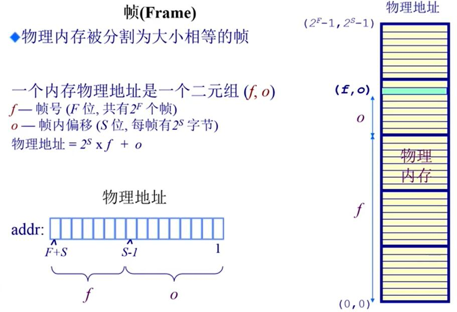

page:

程序的逻辑地址空间被分为大小相等的页

和 frame的区别:

1. page的页号的 size(有多少个 page) 和 frame的帧号的 size(有多少帧)的大小可能不同。表现逻辑地址空间可能会比物理地址空间要大
2. 每个 page大小 和 每个 frame的大小相同。

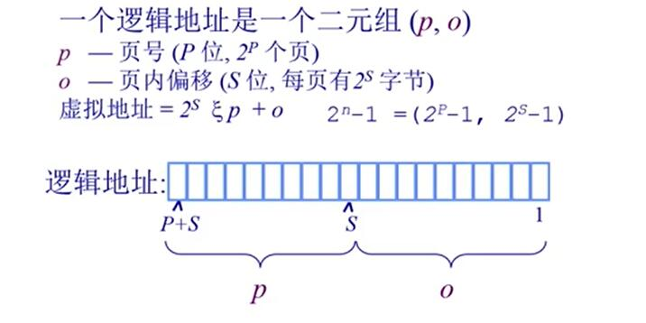 

ps: 图片里的是乘号

#### 分页寻址

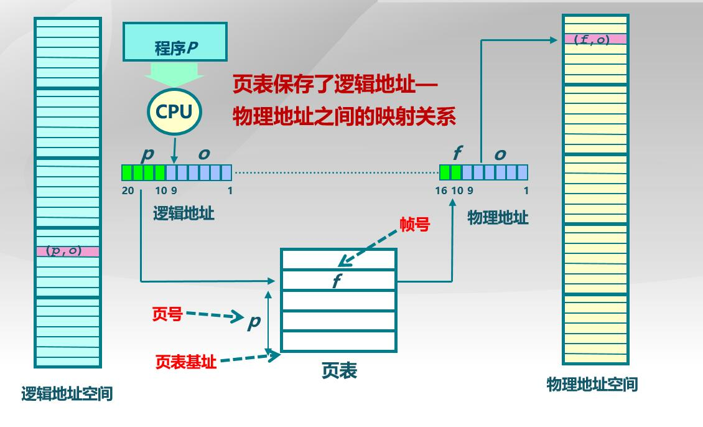 

如何映射地址:

1. 逻辑地址划分为 (p,o), page number 和 页内偏移
2. 物理地址划分为 (f,o), frame number 和 frame内偏移
3. 这里上面两个式子中，o 是一样的，所以关键就是将 p->映射为 f
4. 页表里存储者 p 到 f的映射关系，通过 p 查找页表 找到 f 从而将逻辑地址空间映射为物理地址空间
5. page table 由操作系统建立

page vs frame 

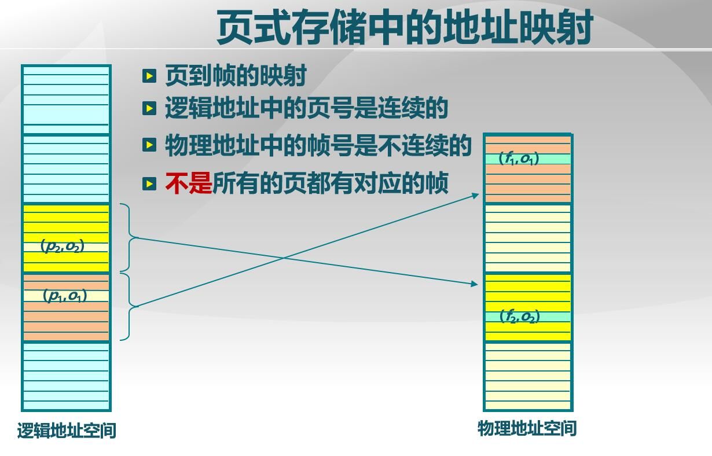 

ps : 最后一点可以由虚拟内存机制解决

#### 页表

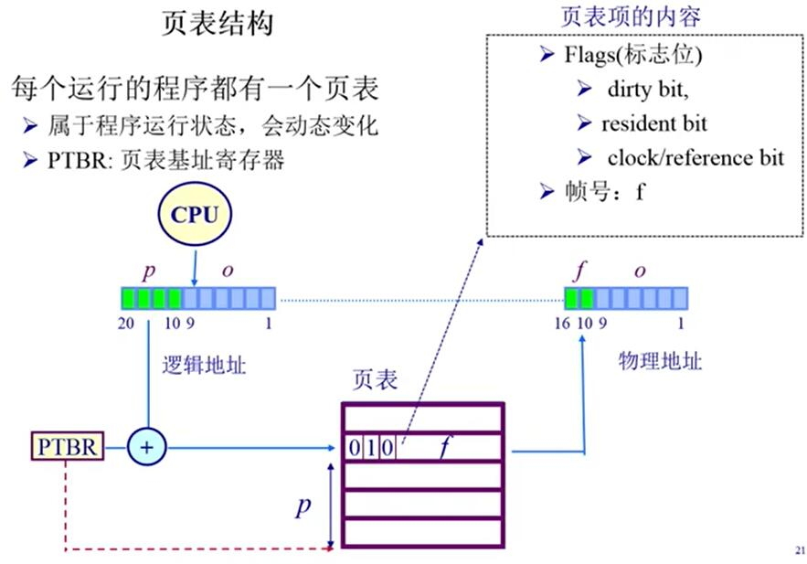 

页表项 

* 保存帧号
* 一些其它辅助位,比如是否读写，是否在物理内存中存在(缺页异常)

上述机制看起来完善，但是才能在性能问题

1. 页表可能非常大(因为逻辑地址空间很大)
2. 为了实现进程间地址空间的隔离，每一个进程有一个页表。(存储空间的问题)
3. 访问速度的问题。页表很大，因此页表只能放在内存中，每次寻址需要两次访存带来了开销。

在计算机中解决这种时空问题通常有两种方法

1. cache 机制
2. 采用间接方式 (多级页表)

##### TLB (Translation Look-aside Buffer)

解决访问速度的问题:

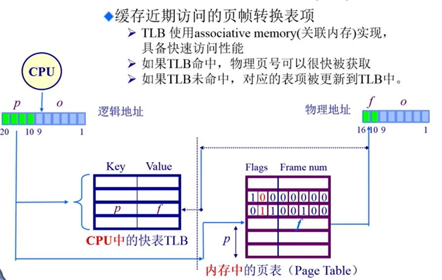 

* TLB 放在 MMU中
* TLB 缓冲页表的内容 

CPU拿到一个逻辑地址的时候:

1. 先查找TLB，查看是否有需要的项，如果命中，物理页号可以很快被获取。
2. 如果 TLB 未命中，对应的表项更新到TLB中(可能和 cache 一样，一次拿好几个项进去，程序时间和空间一致性原理)。未命中的更新可能由硬件实现，也可能由软件实现。

##### 多级页表

解决页表过大的问题。(类似于多级索引)

二级页表

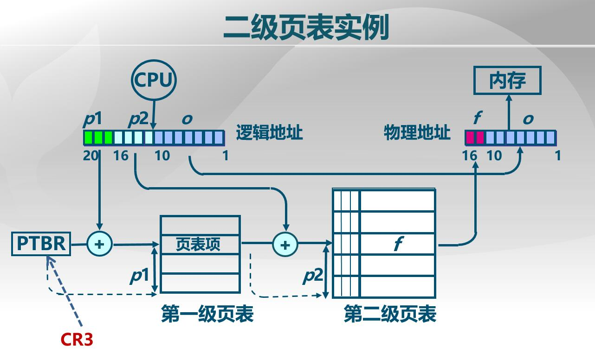 

* 页号细分为 一级页号和二级页号
* 通过第一张页表找到对应第二张页表的基址。
* 再通过第二级页表和二级页号找到帧号

* 多级页表可以极大节省空间 (上一级的页表如果不再主存里，二级页表就不需要存了)    
* 随着页表级数增加，时间开销增大

多级页表:

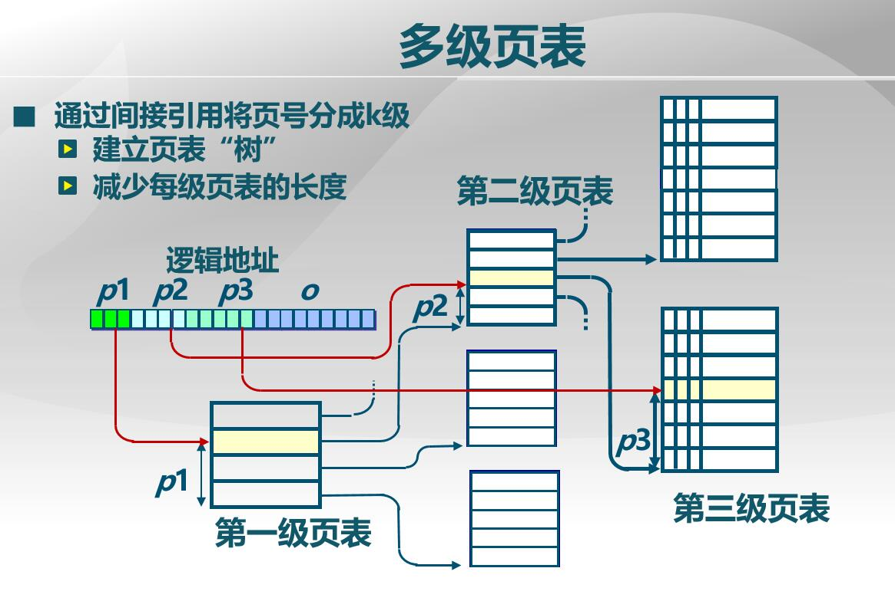 

##### 反向页表

如何解决 当逻辑地址空间增大的时候，页表随之变大的问题？

* 有大地址空间(64-bit),前向映射页表变得很**繁琐** (5级页表)

* 因此将思路逆转，采用反向页表。不让页表与逻辑地址空间大小相对应，而是让页表于物理地址空间大小相对应。(产生这种想法的原因是逻辑空间大小增长速度大于物理空间大小增长速度)

* 上述想法就是说，不通过逻辑页号来获取物理帧号，而是反过来用物理帧号来查找逻辑页号。

###### **基于页寄存器** 

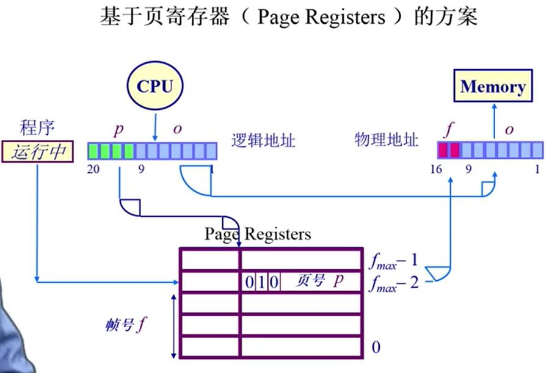 

* 页寄存器数组。寄存器里存的是页号，以帧号为索引。
* 寄存器容量只和物理空间大小相关

 

上述设计解决了空间问题，但是带来了查找的问题！

解决查找速度问题可以使用**关联型存储器**(这种存储器可以并行比较)，但是会带来设计制造成本的上升

 

###### **基于hash的查找方案**

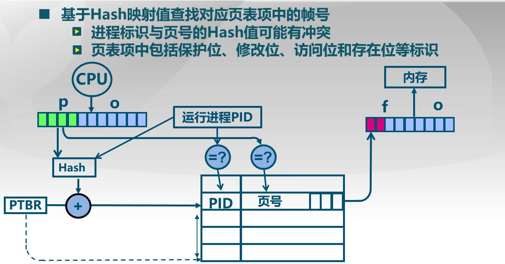 

* 采用 hash方式这张表仍然是反向页表
* 根据 page 号和 pid号通过一个 hash函数计算得到 hash值，用 hash值作为索引查找相应的表项(表项存储着 pid 和 页号)
* 在上图中，帧号就代表索引，也就是hash值是帧号

但是 hash 可能产生冲突。需要冲突解决方案，可以采用 "桶+链表"的方式

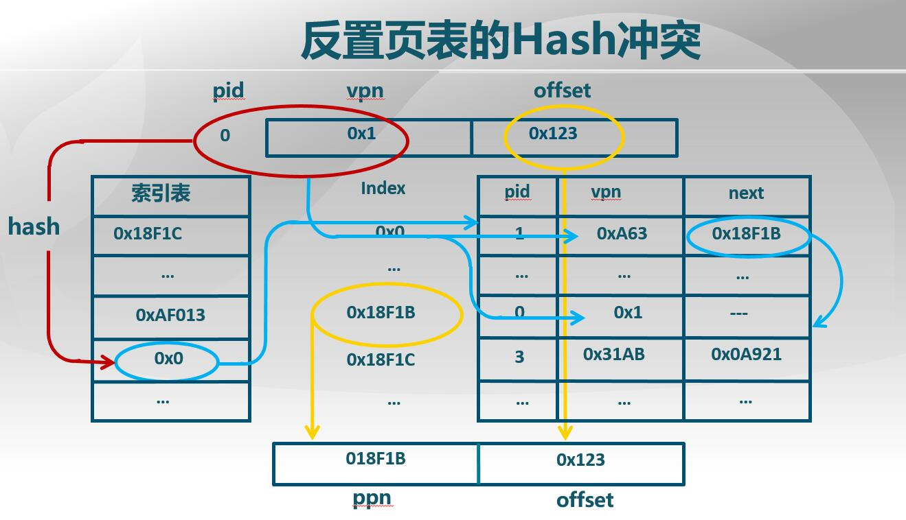 

* 通过 hash值(红色部分)找到桶
* 桶里保存这一个链表(蓝色部分)
* 再遍历链表找到需要的项(pid , vpn),
* 找到的项对应的索引就是 帧号(黄色部分)

### 段页式

* 段表的每一项 保存这一张页表(也就是一个段的内容 由若干页组成)
* 逻辑地址 由 (段号，页号，页内偏移)组成

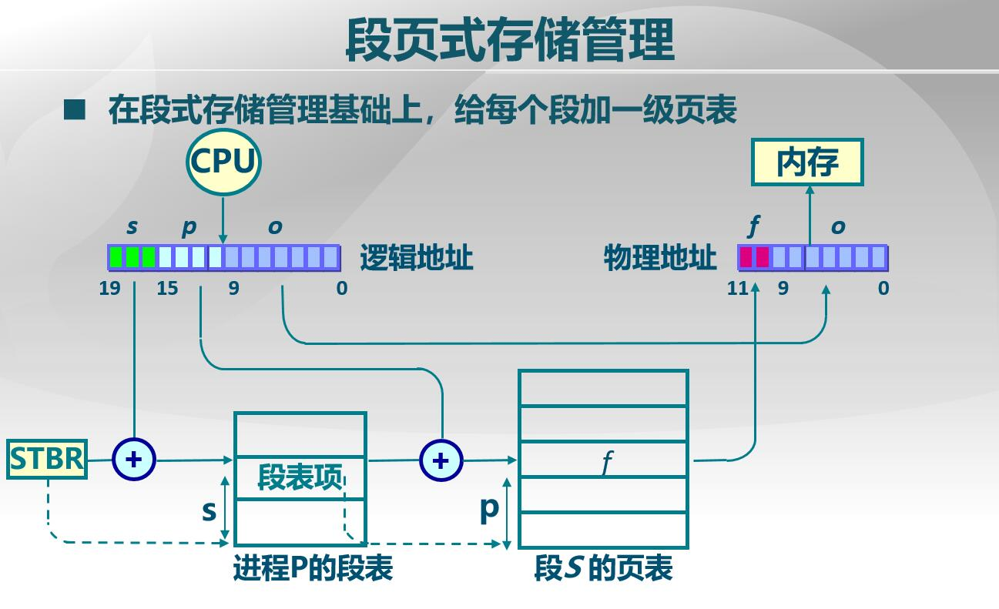

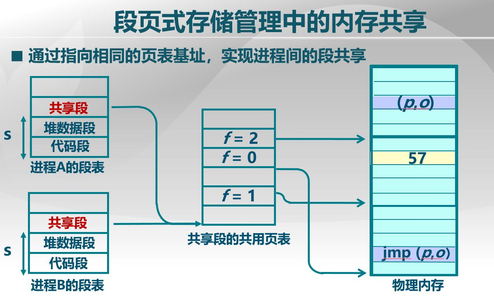