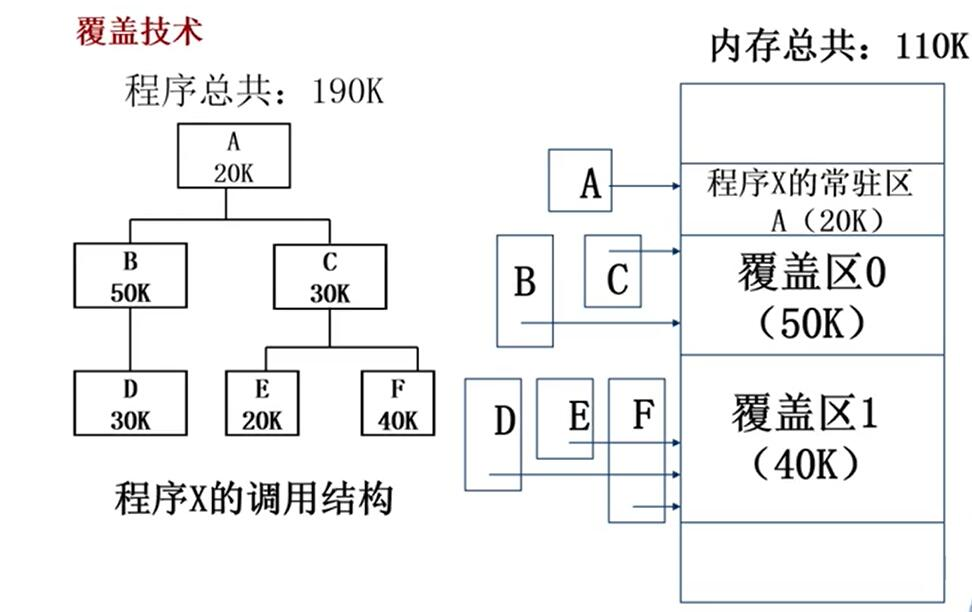
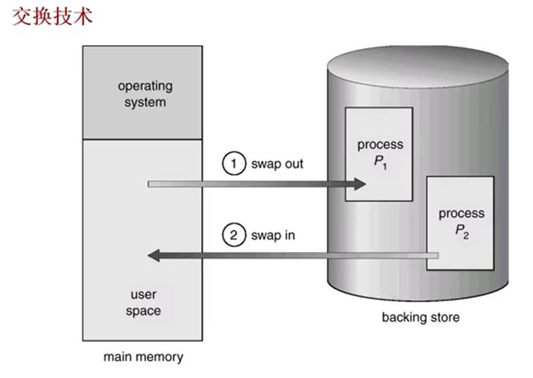
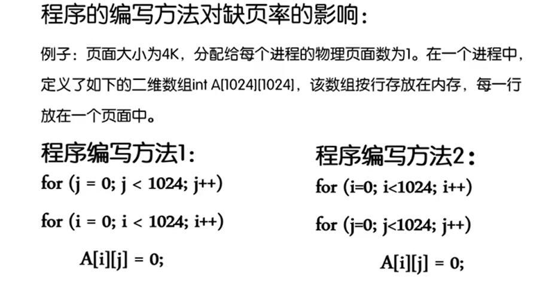
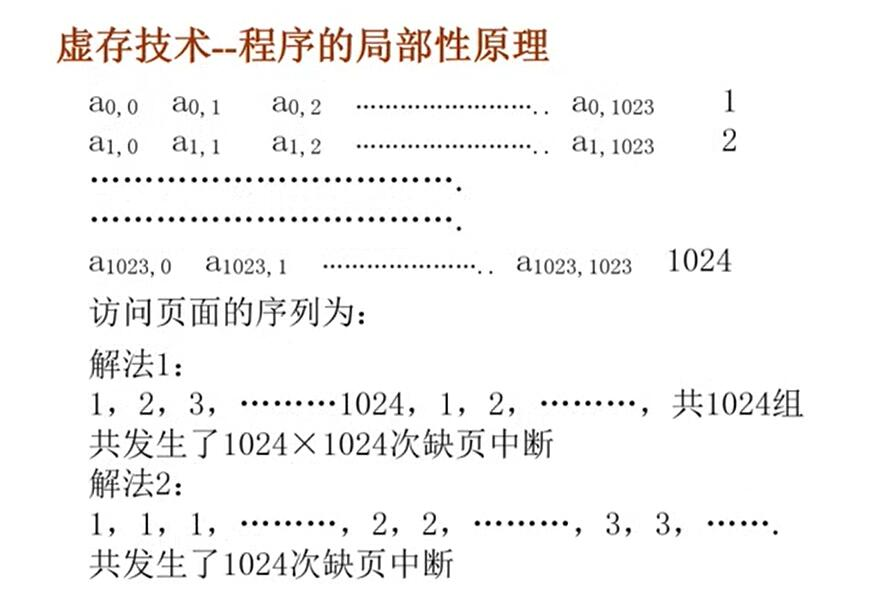
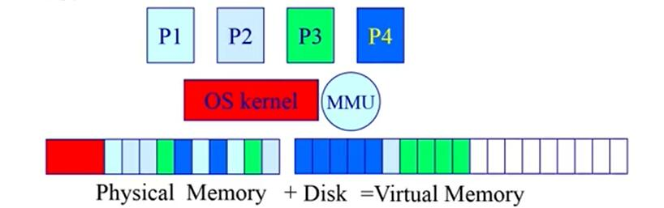
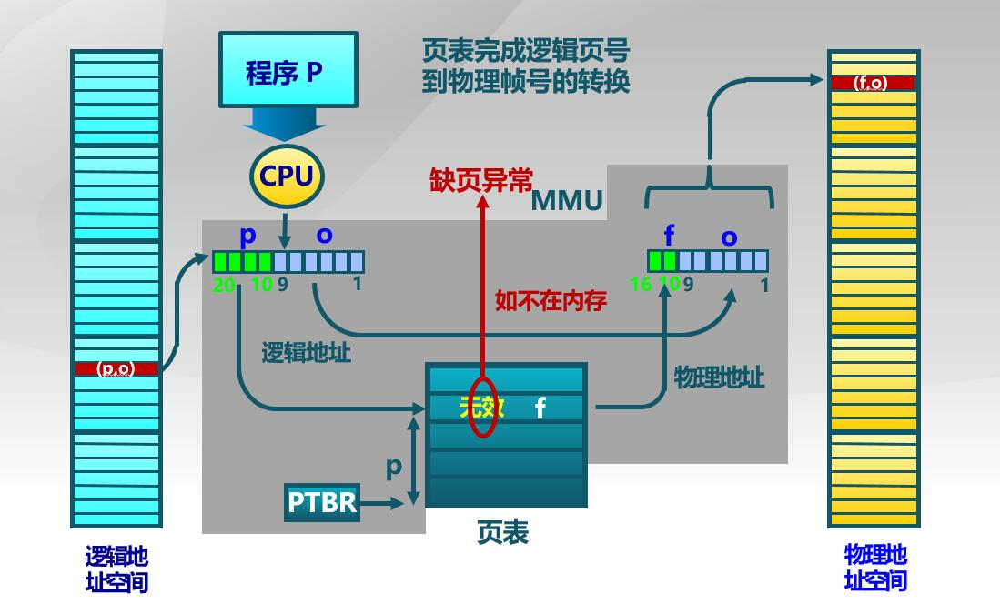
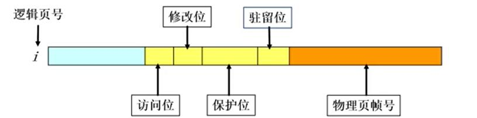
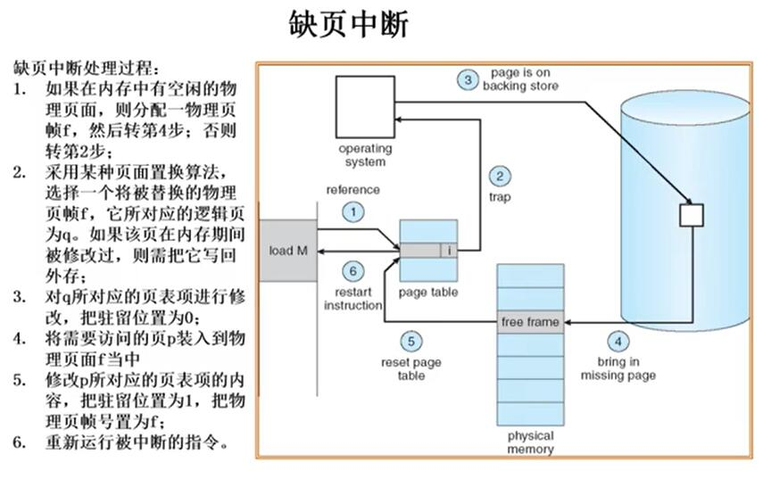
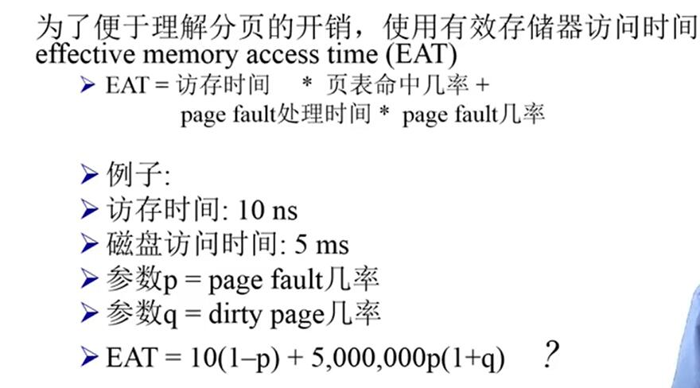

# 虚拟内存

扩展程序可用的内存空间。
计算机系统时常出现内存空间不够用的情况，有一下几种方式可以解决这一问题:

1. 覆盖(overlay)
   应用程序手动把需要的指令和数据保存在内存中
2. 交换(swapping)
   操作系统自动把暂时不能执行的程序保存到外存中
3. 虚拟存储
   在有限容量的内存中，以**页**为单位**自动**装入**更多更大**的程序

## 覆盖技术

目标: 在较小的可用内存中运行较大的程序。代表 dos操作系统

原理:

依据程序逻辑结构，将程序划分为若干功能相对独立
的模块；将不会同时执行的模块共享同一块内存区域

1. 必要部分（常用功能）的代码和数据常驻内存 (负责管理)
2. 可选部分（不常用功能）放在其他程序模块中,只在需要用到时装入内存
3. 可选部分（不常用功能）放在其他程序模块中,只在需要用到时装入内存

即采用分时的方法来扩展内存空间.

覆盖技术是以一个程序块为粒度。

### 覆盖技术觉点

* 程序员来将大的模块划分为小的功能模块，增加编程复杂度
* 覆盖模块从外存装入内存吗，以时间换空间。

## 交换技术

swaping

目标：
多道程序在内存中时，让**正在运行**的程序或需要运行的程序获得更多的内存资源

方法:

* 将暂时不能运行的程序送到外存，从而获得空闲的内存空间
* swap out : 操作系统把一个进程的整个地址空间内容保存到外存中
* swap in : 将外存中某个进程的地址空间读入到内存中.
* swap 的 粒度为整个进程的地址空间

交换技术实现的几个问题

1. 交换时机的确定 : 只有当内存空间不够有不够的危险时换出。
2. 交换区的大小： 必须足够大以存放所有用户进程的所有内存映像的拷贝；
3. 程序换入时的重定位。需要一种机制使得swap前后寻址不会发生错误。(采用动态地址映射的方法)

ps 动态地址映射 : 比如页表机制，在换入之后，重建页表，虚拟地址不变，物理地址变化。实现一种动态的地址映射

## 虚存技术

* 覆盖技术 程序员负担太大
* 交换技术 粒度太大
* 虚存技术是 覆盖技术和交换技术的结合

目标 ：

* 像覆盖技术那样，不把程序的所有内容放在内存中。并且由操作系统自动完成。
* 像交换技术一样，实现进程在内存和外存之间的切换。但是**粒度更小**(以页为单位)，只对进程的部分进行交换
* 理论基础——程序局部性原理
  1. 时间局部性： 一条**指令**的一次执行和下一次执行，一个**数据**的访问和下一次数据的访问都集中在**比较短的时期内**
  2. 空间局部性: 当前指令和**邻近**的几条指令，当前访问的数据和**邻近**的几个数据集中在一个较小的区域内

### 虚存技术————基本概念

可以在页式或段式内存管理的基础上实现。

思路: 将暂时不常用的部分内存块暂存到外存

原理 :

1. 在装入程序时，不必将全部代码、数据装入内存。而只需要将当前需要执行的部分**页面**或**段**装入到内存。让程序开始执行
2. 在程序执行过程中，如果需要执行的指令，或者数据尚未在内存中，产生**缺页异常**或者**缺段异常**.此时处理器通知操作系统将相应的页面或者段调入内存(可能需要替换)，然后继续执行程序。
3. 操作系统将内存中**暂时不使用**的页面或者段调出保存在外存上，从而腾出更多的空闲空间存放将要装入的程序和将要调入的页面或者段。

从上面3点看出，操作系统存在选择的问题(选择调出的页或者段)，选择的好坏极大影响效率。(涉及置换算法)

可以看到程序只有一小部分在内存中

### 虚存技术——特征

* 大的用户空间。把物理内存和外存相结合，提供给用户的虚拟内存空间通常大于实际的物理内存。
* 部分交换: 和交换技术相比较，swap的粒度更小(页或者段)
* 不连续性：物理内存分配不连续，虚拟地址空间使用的不连续。(由于swap机制，使用的时候可能发生缺页异常)

### 虚存技术——虚拟页式内存管理

在页式存储管理的基础上。增加

1. 请求调页:访问的时候，发现页不在主存中，请求将虚拟页调入到内存中。
2. 页面置换。将不常用的页面调出去，将需要的页调进来(极大影响性能)

#### 页表项

* 驻留位:表示该页是否在主存
  1：该位在内存中可以使用， 0：该页在外存中(访问该位导致缺页异常)
* 保护位，表示允许对该页做何种类型的访问，如只读，可读写，可执行等。
* 修改位(脏位) : 表明此页在内存中是否被修改过。
  1 : 页被写过 (说明内存中的数据和硬盘中的数据不一致，要做写回操作，把数据从主存写回硬盘)
  0 : 页没有被写过。表明内存中的数据和硬盘中的数据一致。可以直接替换
* 访问位 : 表明这个页最近是否被使用过。在一定程度上表明当前页是否经常被访问。(应该换当前可能不会被使用的页)

#### 缺页异常

#### 后备存储 backing store

没有在主存中的数据怎么在硬盘中保存？

* 一个虚拟地址空间的页面可以被映射到某个文件(二级存储)中的某个位置
* 代码段 : 映射到可执行二进制文件(比如.exe文件)
* 动态加载的共享库程序段:映射到动态调用的库文件
* 其他段(在程序运行过程中产生的其它数据)，可能被映射到 swap file(操作系统专门开辟的一个文件)

#### 虚拟内存的性能

* 命中了就只需要访存。
* 未命中发生缺页异常，需要访问硬盘（1-p)
* 如果脏位为1 需要写回，还要访问硬盘(最后的 (1+q))