# 页面置换算法

* 功能: 当缺页中断发生，需要调入新的页面而内存已满时，选择内存当中哪个物理页面被置换。
* 目标： 尽量减少页面换入环出的次数。

标准:尽量选择那些短期内不可能被访问的页

## 1. 局部页面置换算法

针对一个程序的页面置换算法

### 1.1. 最优页面置换算法

这是一种理想的算法。

* 当缺页异常发生的时候，对于保存在内存中的每一个页，计算在下一次访问的时候还需要多少等待时间，选择等待时间最长的哪一个，作为置换的野蛮。
* 这是理想算法，在实际系统无法实现。(无法预知每个页面等待时间)
* 可以作为其它页面置换算法的评价依据(base line)。 我们希望算法能尽量逼近最优置换算法。(在一次实验时候，我们可以算出来每一页帧的等待时间，可以计算出最佳的性能)

eg:

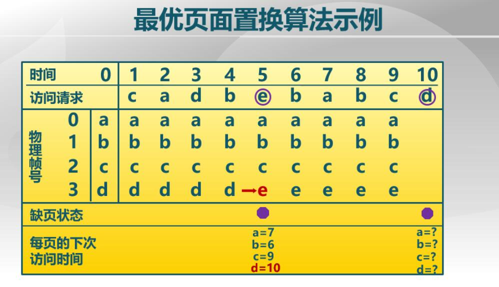

### 1.2. 先进先出算法 FIFO

* 选择在内存中驻留时间最长的页面并淘汰制。(可以维护一个 list ，list的头是驻留时间最长的页面)
* 实现简单，但性能较差。调出的页面很可能是经常要访问的页面。有 **Belady**现象

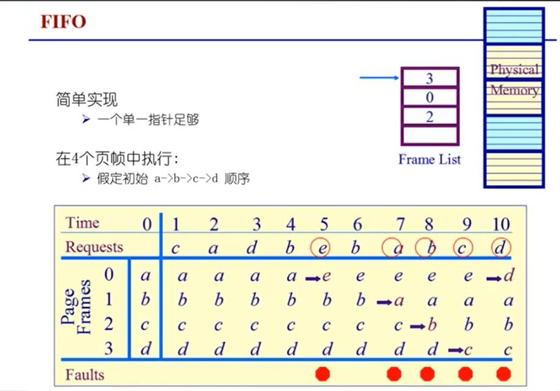

### 1.3. LRU算法 最近最久未使用算法

* 当一个缺页中断发生时，选择最久未使用的那个页面
* 本质上是对最优置换算法的一个近似，根据过去来推断未来(如果过去很少访问，那么可能未来也不会访问，反之如果某些页面被频繁访问，那么在未来的一小段时间内，它们很可能会再一次被频繁访问)
* 依据是程序局部性原理。
* LRU算法查找开销较大。可能会影响性能

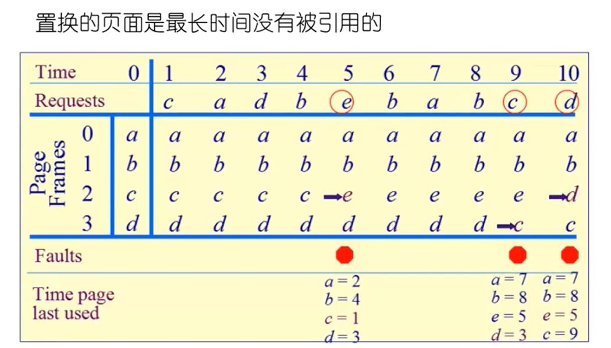

LRU算法需要记录各个页面的使用时间的先后顺序。

* 系统维护一个链表，最近刚刚使用过的页面作为首节点，最久未使用的页作为尾节点。每次访问的时候，访问链表把它从链表中摘下再移动到链表首。每次发生缺页中断淘汰链表的尾部。
* 设置一个活动页面栈，当访问某页时，将页号压栈，然后考察堆栈中是否与此页面相同的页号，若有从栈中抽出。需要淘汰一个页面时候，总是选择栈底的页面。

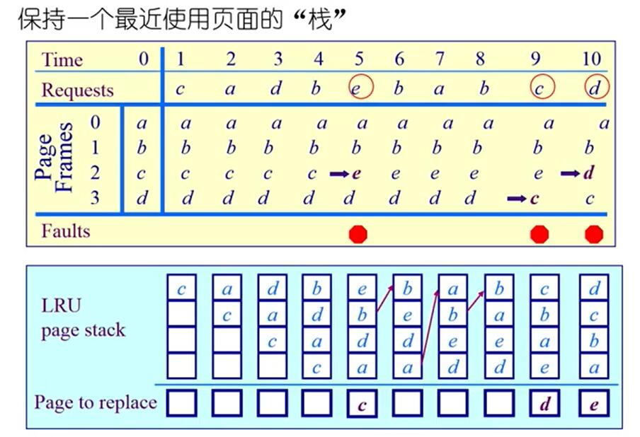

### 1.4. 时钟页面置换算法

Clock页面置换算法，LRU的近似，对FIFO的一种改进。clock算法仅对页面访问情况做大致的统计。

数据结构:

* 需要用到页表项中的访问位(硬件可以自动置1)，当一个页面被装入内存时初始化为0，如果这个页面被访问，该位置1
* 各个页面组织成**环形链表**
* 指针指向最先调入的页面(最老的页面)

算法:

* 每次访问页面的时候，将对应的访问位置1
* 发生缺页异常时，从指针处开始顺序查找访问位为 0 的页面进行置换(访问位为0表示可能是比较老的页)
* 操作系统定期将访问位置0 (在时钟扫描的过程中，如果当前指针的访问位为 1 就将该bit 清 0，然后跳过这个页)
 
clock算法是 LRU 和 FIFO的折中。

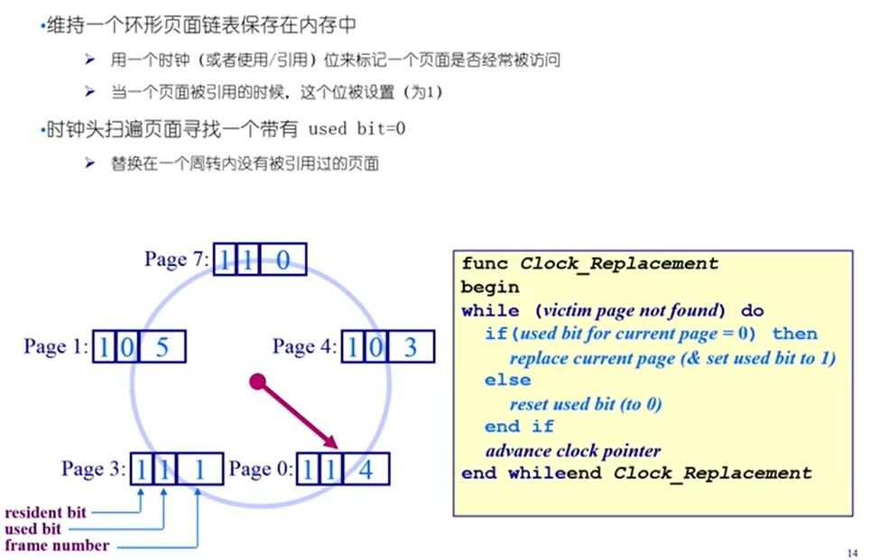

example:

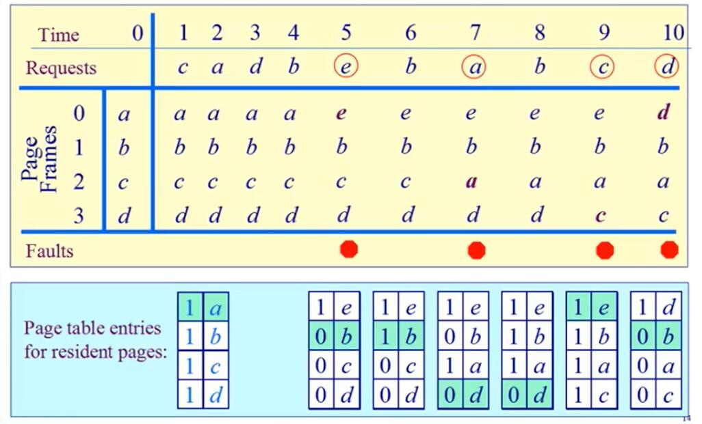

### 1.5. 二次机会法(clock算法的改进)

指导思想就是，如果脏位为 1 替换的时候需要写回操作，因此替换脏页有巨大的代价。所以减少写过的页的替换机会

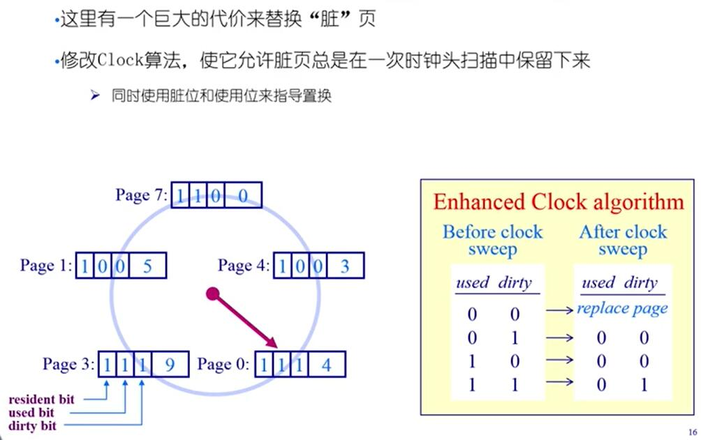

* 同时使用脏位和访问位，读入内存的时候初始值设为0。(访问位，脏位)
* 指针扫描的时候，为(0,0),那么这个页被替换出去
* 指针扫描的时候，为(1,0),将访问位设置为0，跳过这个页
* 指针扫描的时候，为(0,1),将脏位设为0.跳过这个页
* 指针扫描的时候，为(1,1),将访问位设置为0，即变为(0,1),跳过这个页。
* 每次页面替换的时候，将旧页写入磁盘(这里有一个疑问就是什么时候进行写回，按照上面的描述，除非增加一位来描述是否写过，并且这位不会发生变化，否则每次替换都要进行写回)
* 通过脏位和访问位，减少替换的次数从而提升效率。
* 优先把只读页换出去，而给了修改过的页多一次机会，所以成为二次机会法。

example：

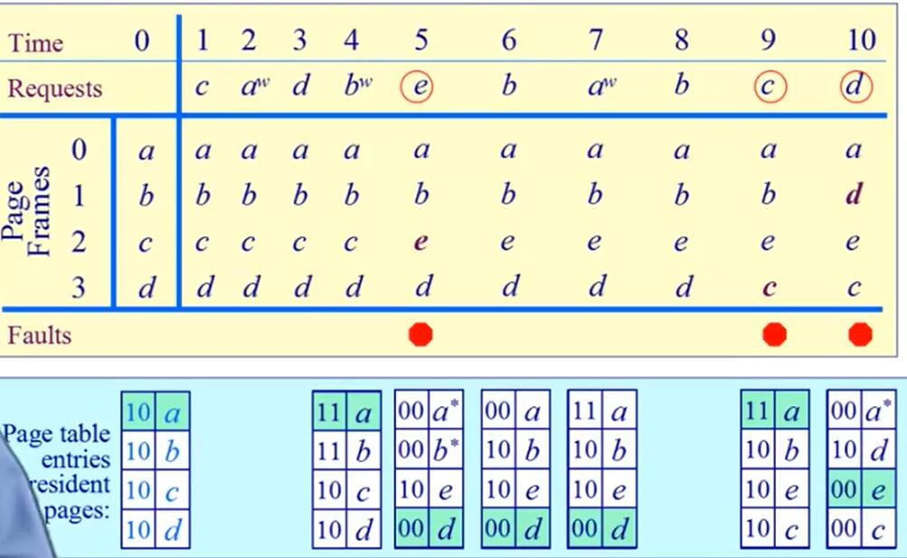

### 1.6. 最不常用算法 LFU算法

Least Frequently Used, LFU

基本思路: 当一个缺页中断发生时，选择访问次数最少的页面，然后替换它

实现方法: 对每个页面设置一个计数器，每次访问计数器+1,在替换的时候选择计数器值最少的页替换(可以结合时间，一定时间之后，将计数器值/2)

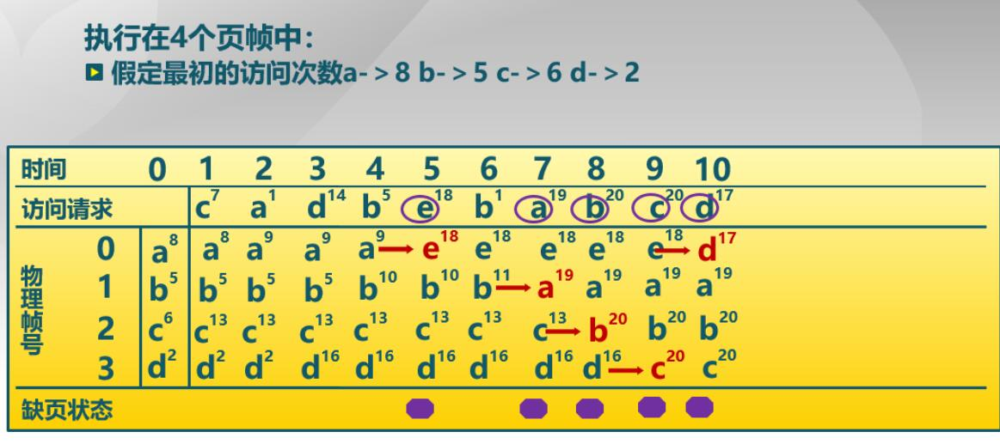

### 1.7. Belady现象

Belady现象: 采用FIFO算法的时候，有时候会出现分配的物理页面数增加时，缺页率反而提高的异常现象。

原因:

* FIFO算法的置换特征与进程访问内存的动态特征矛盾
* 被它置换出去的页面并不一定是进程近期不会访问的

分配3个物理页

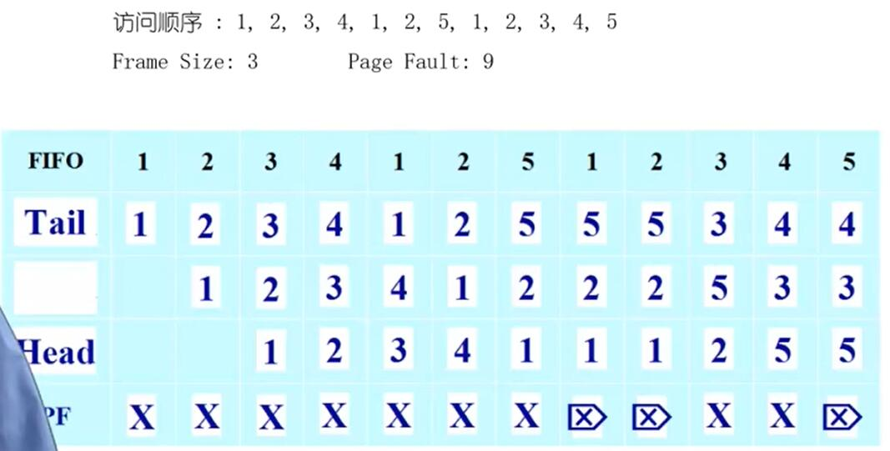

缺页率为 9/12 = 0.75

分配4个物理页

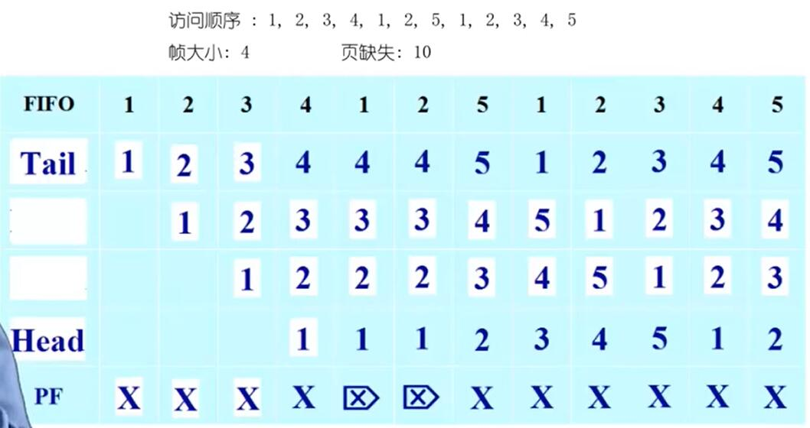

缺页率为 10/12 

LRU不会产生 belady 现象 (可以深入研究)
 
### 1.8. LRU CLOCK FIFO 比较

* LRU算法和FIFO算法本质上都是先入先出的思路
  * FIFO 根据进入内存的时间排序
  * FIFO 的排序是不变的
  * LRU 根据页面最近的访问时间排序
  * LRU 算法的排序会根据访问的情况动态调整
* LRU算法可能退化为FIFO算法(当页面进入内存之后一直没有被访问)
* CLOCK算法是LRU算法的近似，因此CLOCK算法也可能退化为 FIFO算法

根据上面几点我们发现,缺页的次数取决于

1. 替换算法的有效性
2. 程序本身是否具有局部性的特点(如果局部性很差，LRU算法就可能退化为FIFO，比如当页面进入内存一直没有被访问)

## 2. 全局页面置换算法

* 物理页帧的数目对性能有很大的影响
* 如果给每个进程分配固定的页帧数，影响灵活性(因为程序在不同时间对内存的需求可能是不同的)

### 2.1. 工作集模型

上述的置换算法都基于一个前提: 程序的局部性原理

用工作集模型来论证该原理

* 工作集: 一个进程当前正在使用的逻辑页面的集合

可以用一个二元函数 $W(t,\Delta)$ 表示

* $t$ 是当前执行时刻
* $\Delta$ 称为 **工作集窗口**(working-set window),即一个定长的页面访问时间窗口
* $W(t,\Delta)$ 表示在当前时刻 $t$之前的 $\Delta$时间窗口中所有逻辑页面组成的集合。(换言之一个程序在 $(\Delta-t,t)$的时间段内的逻辑页面的集合 )
* $|W(t,\Delta)|$ 指工作集的大小，即页面的数目

example:

看一下上述的例子，工作集t2的局部性比t1的局部性好。

程序工作集大小变化特点:

* 进程开始执行后，随着访问新的页面**逐步建立**比较稳定的工作集
* 当内存访问的局部性区域的大致稳定时。工作集大小也大致稳定
* 局部性区域位置改变时，工作集快速扩张和收缩过度到下一个稳定值

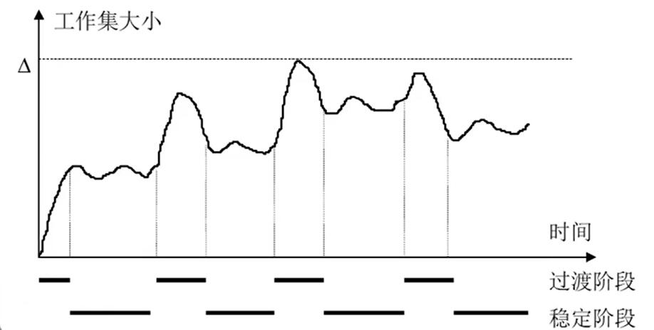

#### 2.1.1. 常驻集

常驻集指当前时刻，进程实际驻留在内存中的页面集合。

* 我们希望常驻集和工作集尽量重合，这样缺页次数会减少
* 当工作集全部在常驻集时，不会产生缺页
* 随着常驻集的增大，当到达某一个大小的时候，常数集的增大不会显著降低缺页的效率，常数集过大甚至浪费物理帧

### 2.2. 工作集页面替换算法

这是在整个系统的层面进行页面置换，确保时刻有足够的内存

* 设定一个固定的工作集窗口大小
* 每个时刻把不再当前工作集内的物理帧置换出去
* 通过这种方法做到当程序局部性好的时候(工作集较小)分配比较少的内存，当局部性差(变化较快)的时候(工作集大)分配更多的物理帧从而在全局上达到比较好的性能。

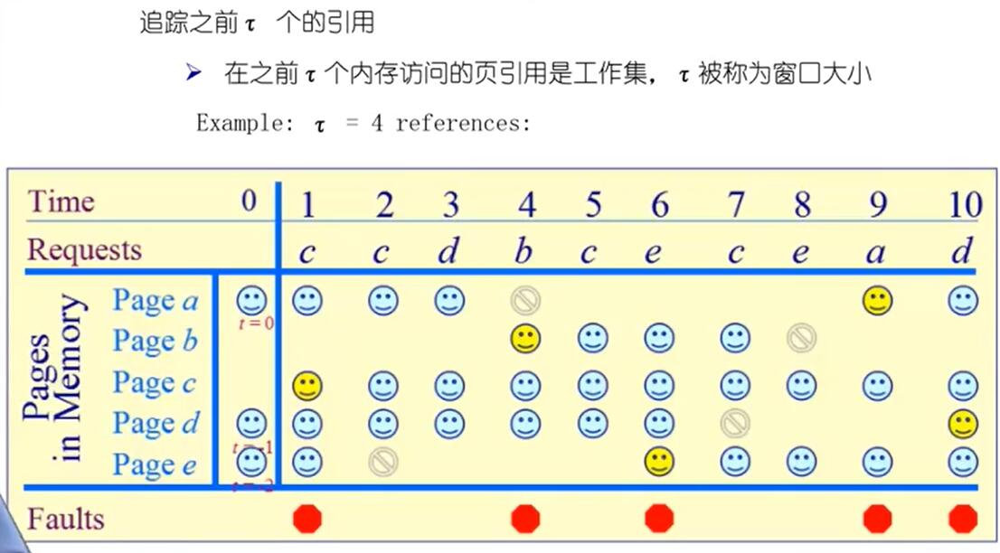

ps 黄色表示缺页， 灰色表示被替换出去(q全局)，蓝色表示在内存中的帧

### 2.3. 缺页率页面置换算法

* 可变分配策略: 常驻集大小可变。
* 当缺页率上升的时候分配更多的物理帧数，
* 当缺页率较小的时候压缩物理帧。
* 采用全局置换算法，当缺页的时候，被置换的页面可以在其它进程中

#### 2.3.1. 缺页率

$缺页次数/内存访问次数$

缺页率影响因素:

* 页面置换算法
* 分配给进程的物理页的数目
* 页面本身的大小
* 程序编写方法(是否具有局部性)

#### 2.3.2. 算法描述

思路:

* 当缺页率高的时候——增加工作集
* 当缺页率低的时候——减少工作集

算法:

当缺页发生时，$t_{last}$表示上次缺页的时间，$t_{current}$ 表示当前缺页的时间

* 如果 $t_{current} - $t_{last}$ >T$. 从内存中移除所有在 $[t_{last},t_{current}]$ 内没有被访问的页 (压缩物理帧) ， 这种情况暗示缺页率低
* 如果$t_{current} -t_{last} \le T$ 则增加缺失页到工作集中(分配物理帧)，这种情况暗示缺页率高

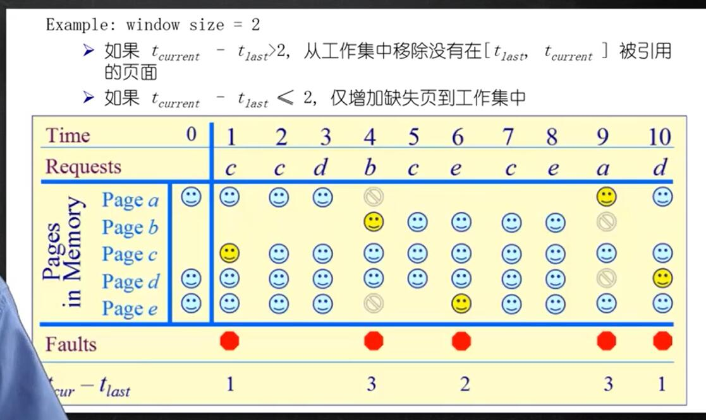

和上一个算法不同，这里只在中断的时候判断是否需要重新清楚物理帧。而上一个算法是在每一个时刻t都把不再工作集里的页面替换出去。

### 2.4. 抖动问题

* 如果分配给一个进程的物理页面太少，不能包含工作集
* 造成大量的缺页，频繁置换
* 最终导致运行的速度变慢

产生抖动的原因:

* 随着多道程度的上升(并行运行进程数增加)，分配给每个进程物理页面数不断降低，缺页率上升。

因此:

* 操作系统需要在并发水平 和 缺页率之间做出权衡。同故宫调节并发进程数目来进行系统负载控制

如何量化这种权衡？引入一下概念

* $MPL$并发进程数
* $CPU利用率$
* $MTBF$ mean time between page faaults 平均缺页间隔时间
* $PFST$ page fault service time 缺页中断服务时间

* 我们希望 $MTBF/PFST =1$

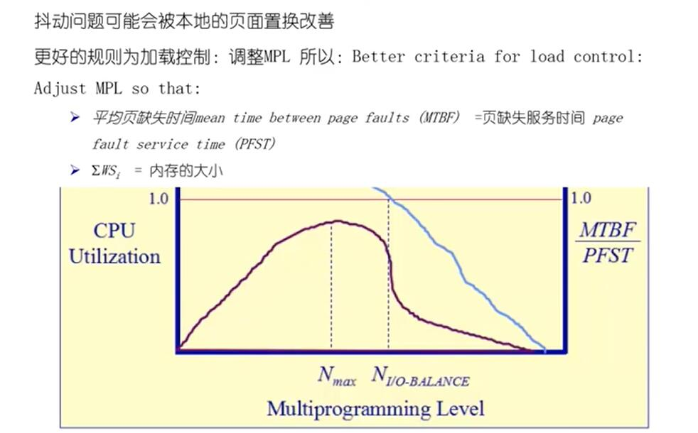

在多道数目叫小的时候， $MTBF$ 很小，当并发程度达到一定值时， $MTBF$开始上升，这时候比值开始下降。操作系统要做的就是一个权衡( 并发程度和缺页率 ) 提升 cpu利用率。