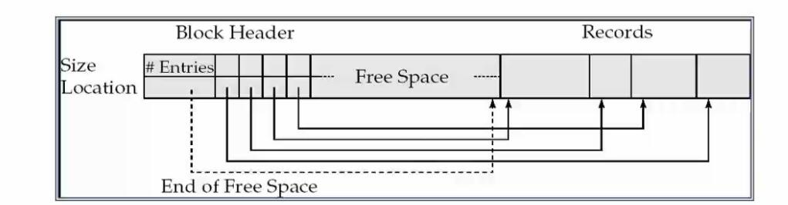
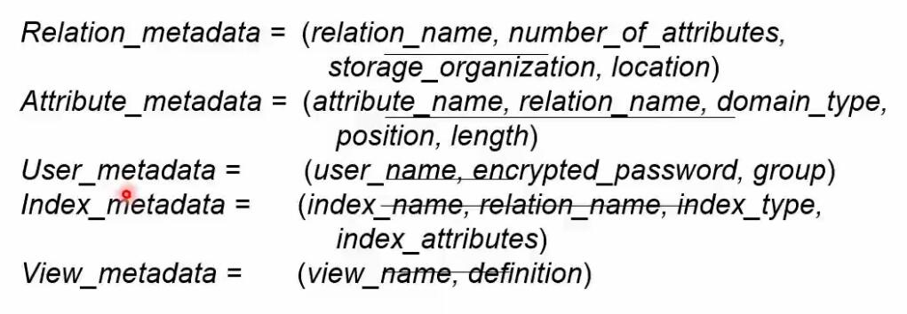

# Storage and file system 

* 内存访问任何一个存储单元的时间是一样的，但是磁盘不同
* 磁盘访问的基本单位是 512 byte(不同操作系统不同)
* file organization.(使磁盘访问块的次数更少)
* Nonvolatile write buffers (使用缓冲区)
* log disk
* RAID

## File Organization 

* the database is stored as a colletion of files
* each file is a sequence of records
* a record is a sequence of fields

### Fixed-Length Records

每一条记录，每一个field的存储空间是固定的
静态类型系统，查询时间开销小的，但是不灵活

Simple appoch 

* Simple approach
  * store record i starting form byte n*(i-1), where n is the size of each record
  * Record access is simple byt records may cross blocks blocks(to solve this problem, Modification :do not allow records to cross block boundaries) 

* Delete of record i :
alternatives:
  * move records i+1,... n to i... n-1
  * move record n to i
  * do not move records, but link all free records on a free list

#### Free Lists

因为磁盘的删除操作开销很大，涉及两次IO，所以一般使用free List 来进行删除操作，通过free list管理哪些block是可用的

### Variable-Length Records: Slotted Page Structure

#### 为什么需要变长的记录

有可能需要将不同表格的同一对象的记录映射为同一个记录(多个表格描述一个文件)。这时候虽然每个记录的长度是固定但是数目可能是不固定的。这时候需要变长。主要为了减少读写。(比如将学生基本信息和学生的选课信息映射为一个记录，这时候学生的选课数目是不固定的)
可能多个记录对应一个文件。

* Slotted page header contains
  * number of record entries
  * end of free space in the block
  * location and size of each record

### Organization of Records in Files

把表格的行映射为记录，不同的方法会导致访问磁盘块数的差别很大，最终导致了性能的差异。
开销主要在于 I/O次数(和磁盘进行数据交换的次数)

* Heap -文件可以放在任意位置，插入开销很小，但是查找的代价很大
* Sequential -根据键值按照顺序存放文件,插入(删除）的代价很大。查找代价小
  * suitable for applications that require sequential processing of teh entire file 
  * the records in the file are ordered by a search-key 
* Hashing- 根据 hash函数计算出来的值来存放文件，hash值可能发生冲突，查找代价较小

### 查询的类型

* 点查询(查询某个记录)
* 范围查询(查询一些记录)
* 存在查询(只查询在不在数据库里)

## Data Dictionary Storage 

数据库总的信息，目录信息，记录了表格之间的关系.
用关系描述关系,关于关系的数据，元数据

* Catalog structure
  
  * Relational representation on disk 
  * specialized data structures designed for efficient acess in momory 

* A possible catalog representation:

## Hash an Indexing

**Primary index** : in a sequentially ordered file, the index whose search key sepcifies the  sequential order of th file(主键对应的索引)

