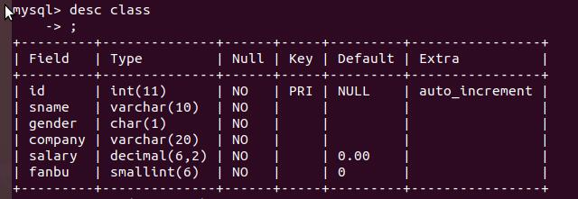

# MYSQL 基础语句

## 入门最基本语句

### 连接 mysql 

`mysql -u username -p password`

连接到 mysql 数据库

-u : username 用户名
-p : password 密码

### 选库语句

`use 库名 ;`

选择特定库名的数据库

### 查看所有库

`show databases;` 

ps： mysql 语句需要用 ; 结尾

### 查看库下面所有表

`show tables;`

### 创建数据库

`create database 数据库名 [charset 字符集];`

eg: `create database test charset utf8;`

### 删除数据库

`drop database 数据库;`

eg: `drop database test;`

### 简单的建表语句(供联系使用)

```sql
create table student(
    snum int,
    sname varchar(10)
)engine myisam charset utf8;
```

ps : engine 指表引擎

仅供练习使用 ,方便使用后面的语句

### 删除表

`drop table tablename;`

eg `drop table test;`

### 给表改名

`rename table oldname to newname;` 

eg: `rename table student to stu;`

把 student 表 改名字为 stu；

### 清空表数据

`truncate tablename;`

eg : `truncate stu;`

ps:

* truncate 和 delete 有所区别
* truncate 相当于删表再重建一张同样结构的表，操作之后得到全新表
* delete 是从删除某个行的层面来做
* truncate 清空表的内容。

### 查看表的结构

`desc tablename;`

eg: `desc class;`



下面的增删改查语句以此数据库为基础


## 最基本的 增删改查语句

针对单表。

### 增 insert

```sql
# 插入一行，可以只插入部分列
insert into table
(attr1,attr2,attr3...)
value
('value1','value2','value3'),
('value1','value2','value3'),
('value1','value2','value3'),
....
```

```sql
# 插入一行，按顺序插入所有的列
insert into table
value
('value1','value2','value3'。...'value_last'),
('value1','value2','value3'。...'value_last'),
('value1','value2','value3'。...'value_last'),
....
```

简单记忆:

1. 往哪张表插入值
2. 在哪几列插入值
3. 插入什么值
4. 可以同时插入多行

eg:

```c++
insert into sql
     (sname,company,salary)
     value
     ("Tom","Baidu",6000),
     ("Nico","Microsoft",9000);
```

### 改 update

```sql
undate tablename
set
attr1 = value1,
attr2 = value2,
where expression ; 
```

1. 在那一张表改
2. 改哪些列的值
3. 改成什么值
4. 改哪些行 (where,修改 使 where后面表达式的值为真的那些行)


eg:

```sql
update class
    set
    gender = "男",
    fanbu  = 1000
    where sname = "Jim" ;

```

### 删 delete 

```c++
delete from tablename
where expressino;
```

1. 删哪几张表的数据 : class
2. 删哪集行 : where expression

```sql
delete from class
      where salary >=8000;
```

### 查 select

```sql
select attr1, attr2... 
from tablename 
where expression
```

1. 查哪张表 
2. 查哪些列
3. 查哪一行(where 表达式为真选择这行)
4. * 表示查所有行所有列 (`select * from class`)

ps: 上述语句其实支持嵌套查询...

## 建表

### 数据类型

整形:

1. TINYINT , 1个字节
2. SMALLINT, 2个字节
3. MEDIAINT, 3个字节
4. INT/INTEGER, 4 个字节
5. BIGINT,  8 个 字节

ps: 整形默认是 有符号数

1. unsigned 表示使用无符号数 eg `tinyint unsigned`
2. zerofill , 表示用 0 填充。 zerofill 和 (M) 参数配合使用
3. (M) 表示补0的宽度。如果位数不足M，用0填充，如果位数>M 不填充。
4. zerofill 同时也是 unsigned 类型
eg : `smallint(5) zerofill` 
