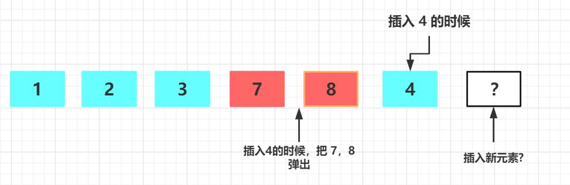
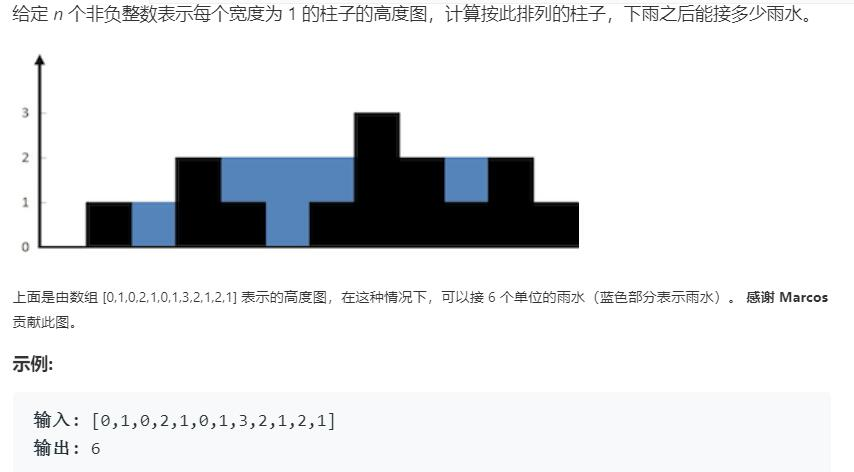
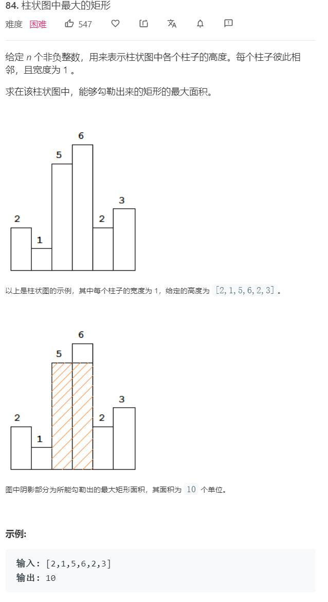

# 单调栈

## 场景

(该场景借鉴了几篇博客的场景)

想象这样一个场景:

* 一群人要去餐厅吃饭，由于餐厅的人很多，餐厅外排着长队.
* 每个人手里都拿着一张号码排，号码小(对应递增栈)的排在前面。
* 小明虽然也有号码牌，但是在中途小明去上厕所了，等他回来的时候，发现队伍和原来的队伍不太一样。向明想要找到在现在的队伍中，自己的位置

1. 为了达到这个目的，小明从队伍尾部开始，问排在队尾的那个人的号码
2. 如果这个人的号码比小明的大。小明说:"我先来的，往一边去"于时把这个人从队伍中挤出去了(对应这出栈)， 转 4
3. 如果这个人的号码比小明的小，这个人排在小明前面，小明没办法，只能排在队尾了。这时候小明找到了自己应该在对列中的位置，同时也找到了队伍前面(对应数组左边)第一个号码比他小的人
4. 小明继续问现在排在队尾的人的号码(刚才那个队尾的已经被踢出去了) 转 2.

## 单调栈定义和性质

### 定义

1. stack 具有先进后出的特点。在单调栈中主要用到了，push_back()和 pop_back()的这种特点
2. 单调栈意味着在当前栈中的每一个元素都是 **递增/递减** (严格递增/严格递减) 的。
3. 单调栈每一次 push 操作必须维护单调栈的单调性。

### 单调栈的操作

下面的操作以递增栈为例:

当push一个元素的时候:

1. 如果栈为空，直接入栈。
2. 如果 当前元素 >= 栈顶元素 (非严格单调栈，如果是>就是严格单调栈)。那么直接将当前元素压入栈中
3. 反之(和上面的条件相反)，如果直接将当前元素压入栈会破坏单调栈的单调性。因此需要:
   * 将当前栈顶的元素出栈。
   * 转 1 ，重复刚才的判断。
4. 通过 3 的操作，我们将所有破坏单调性的元素都弹出栈了，从而维护了单调栈的单调性

单调栈c++风格伪代码

```c++

stack q ;
for( auto elem: coll){
    // 注意扫描元素
    while( !s.empty() && elem < s.top()){
        // elem < s.top() 表明是非严格单调栈
       // elem <= s.top() 表明是严格单调栈
       s.pop(); 
    }
    s.push(elem);   
}

```

### 单调栈的性质

单调栈有一些很好用的性质(可能不全)

对于一个数组 array,

1. 如果从左往右扫描数组，并将数组元素依次压单调栈(以**递增栈**为例)
执行 `s.push(elem)` 操作时的栈顶元素(elem还未入栈), 是 elem 左边**第一个**小于等于(非严格单调栈) \ 小于(严格单调栈) elem 的元素
2. 如果从右往左扫描数组，执行 `s.push(elem)` 操作时的栈顶元素是elem右边**第一个**小于等于 \ 小于 elem 的元素。

因此可以将上述性质简单总结为

1. 递增栈可以找到某元素（左边/右边） 第一个 （小于/小于等于） 该元素的元素。
2. 递减栈可以找到某元素（左边/右边） 第一个 （大于/大于等于） 该元素的元素。

性质的简单说明:



* 插入 元素 4 的时候，弹出 7，8
* 现在插入新的元素：
  1. 如果 这个元素 >4， 那么显然 4 是其左边第一个小于它的元素
  2. 如果 该元素 <=4, 显然刚才弹出去的元素 7,8 不可 小于该元素。此时左边第一个小于其的元素一定还在栈里。需要循环判断

## 单调栈妙用

### [leetcode 42 接雨水](https://leetcode-cn.com/problems/trapping-rain-water/)



本题有多种解法，使用单调栈是其中一种比较巧妙的解法。

思路:

1. 当出现 "低洼" 才有可能接住雨水 (两边的柱子高，中间的柱子低)
2. 为了计算接住雨水的总量，我们希望计算每个低洼出接住的雨水量
3. 为了找到每一个低洼，我们使用递减栈。当递减栈。每一次破坏单调性，我们找到了一个低洼。

代码:

```c++
class Solution {
public:
    int trap(vector<int>& height) {
        //用递减栈
        int size = height.size();
        if(size<=2) return false;
        stack<int> s;
        int rain =0;
        for(int i=0;i<size;i++){
            int current = height[i];
            while(!s.empty() && current > height[s.top()]){
                // 递减栈被破坏了可能存在坑
                int low = height[s.top()];
                s.pop();
                if(s.empty()) break;   // 左边没有更高的柱子，无法形成低洼
                rain+= (i-s.top()-1) * (min(current,height[s.top()])-low);
            }
            s.push(i);
        }
        return rain;
    }
};

```

### [leetcode 84 柱状图中最大的矩形](https://leetcode-cn.com/problems/largest-rectangle-in-histogram/)



给出我自己的一种解法，这种想法可能比较自然，但是并不是使用单调栈的最优解。

```c++
class Solution {
public:
    int largestRectangleArea(vector<int>& heights) {
        // 递归栈 分别算某一个高度左边第一个比它低的 和 右边第一个比它低的
        int size = heights.size();
        if(size<=0) return 0;
        vector<int> left_first_low(size);   // 保存着下标
        vector<int> right_first_low(size);
        stack<int> s;  // 严格递增栈
        for(int i=0;i<size;i++){
            while(!s.empty() && heights[s.top()]>= heights[i] ){
                s.pop();
            }
            if(s.empty()){
                left_first_low[i] = -1;  // -1 表示左边没有比它更小的
            }else{
                left_first_low[i] = s.top();
            }
            s.push(i);
        }
        // 将 s 清空
        stack<int> temps;
        s.swap(temps);
        for(int j=size-1;j>=0;j--){
            while(!s.empty() && heights[s.top()]>= heights[j] ){
                s.pop();
            }
            if(s.empty()){
                right_first_low[j] = size;  // size 表示右边没有比它更小的
            }else{
                right_first_low[j] = s.top();
            }
            s.push(j);
        }
        int max_result = heights[0] * (right_first_low[0] - left_first_low[0]-1);
        for(int i=1;i<size;i++){
            int temp =  heights[i] * (right_first_low[i] - left_first_low[i]-1);
            if(temp > max_result) max_result=temp;
        }
        return max_result;
        
    }
};

```

(未完待续)

## Reference 

https://www.cnblogs.com/grandyang/p/8887985.html