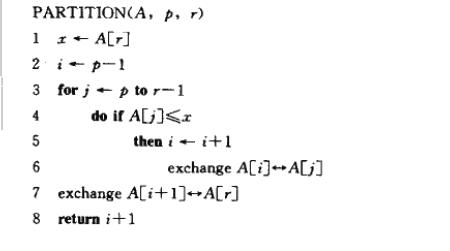
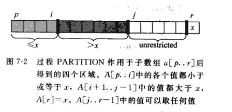
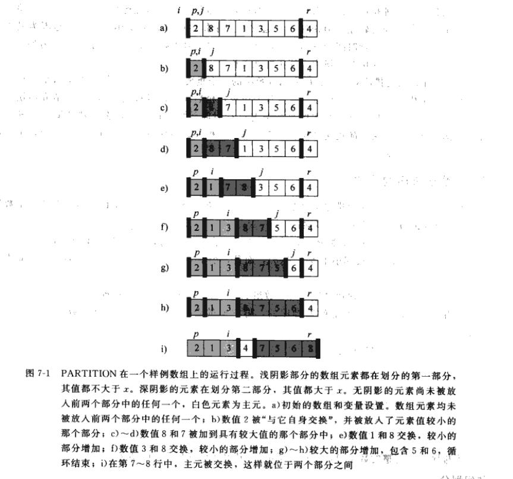
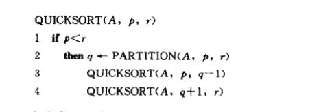
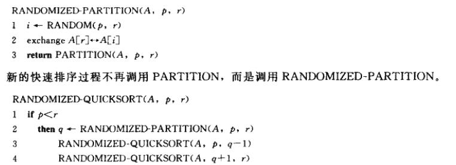

# 排序算法

## 快速排序

### 快排描述

快速排序基于**分治法**。有以下步骤 : 

1. **分解** : 数组 $A[p..r]$ 分解为两个(可能空)的子数组 $A[p..q-1]$ 和 $A[q+1..r]$。使得:
    * $A[p..q-1]$ 中每个元素都 **小于**  $A[q]$。
    * $A[q+1..r]$ 中每个元素都 **大于**  $A[q]$。
2. **解决** : 递归调用快速排序程序，对子数组 $A[p..q-1]$ 和 $A[q+1..r]$ 进行排序
3. **合并** : 因为两个字数组已经就地排序(就地排序适合虚存环境，因为其程序的局部性很好)了，所以**不需要**合并操作,$A[p..r]$已经排好序。(相对应的 归并排序，需要合并操作)。

### partition 部分伪代码


  
伪代码解释:

首先应该明确4个变量 $r$,$i$,$j$，$返回值$

1. $r$ ， 在上述伪代码中，$r$是最后一个元素，表示当前划分的主元素。划分的目的就是将 $A[r]$ 放到一个合适的位置，使得 $A[r]$ 左边的数都比$A[r]$ 小， 右边的数都比它大
2. $返回值$， 如上一点所述，返回值就是 $A[r]$ 最终的位置
3. $j$,扫描指针，$j$从 $p$ 扫描到 $r-1$ , $A[r]$表示在这次扫描中待处理的元素
4. $i$, 这个变量和已处理元素中小于等于 $A[r]$的变量个数有关，经过一次循环之后 $[p,i]$的区间(左右都是闭)里是所有的数都比 $A[r]$ 小。
5. 结合上面 4 点，和伪代码，和下面这张图，我们可以得出:
   
   
   * $[p,i]$ -> 已扫描的元素中的比$A[r]$小的元素
   * $[i+1,j-1]$ -> 已扫描的元素中所有比$A[r]$小的元素
   * $[j,r-1]$ -> 待扫描的元素。
6. 因此一次划分的复杂度为 $O(n)$
7. 第 4 行， 如果 $A[j] < x$ 将 $i$ 加 1 表明又找到一个元素小于等于$A[r]$，我结合第5点 和 第 6 行 **exchange A[i] <-> A[j]** ，这步操作相当于把深黑色的区域**往右挪**(通过交换一个元素来实现，因为我们只需要元素都比 $A[r]$ 大或者 $A[r]$小即可)
8. 到了第 7 行，我们将所有的元素划分为了3个部分 全部比$A[r]$ 小的，全部比$A[r]$ 大的，和 $A[r]$ 一个元素， 这时候只需要把 $A[r]$ 和 i+1位置元素交换，相当于把深色部分往右挪一位，就完成划分。



### 快排伪代码 



这部分就很简单了，先判断临界条件，然后划分，之后递归调用。

### 复杂度分析

(这里只给结论就好了)
时间复杂度:

* 最好情况 $O(nlgn)$ (每次都划分之后得到的子数组长度相同)
* 平均情况:  $O(nlgn)$
* 最差情况: $O(n^2)$  (每次划分 得到 长度为 1 和长度为 n-1 的子数组)，在上述伪代码中，当初始的数组已经排好序的情况下出现最差情况。

### 快速排序的随机化版本

采用随机取样的随机化技术，避免出现最坏的情况，让快排性能总是能趋于平均性能



ps: 这种简单的方法就是每次从数组中随机选一个数作为本次划分的主元素。

### 代码范例

这里的代码是我自己实现的，实现了两个版本

1. 模仿STL的quick_sort，对迭代器进行操作，并且用 function-like class 实现

```c++
template<typename T>
class QuickSort{
    public :
        // 这个类只能对能随机访问的容器起作用
        // 模板参数 T 存放迭代器类型
        typedef T iterator;
        typedef typename iterator_traits<T>::difference_type difference_type; // 必须加上 typename 
        typedef typename iterator_traits<T>::value_type value_type;
        QuickSort(){
            srand(size_t(time(0)));
        }
        // 重载 operator()函数
        void operator()(const iterator begin, const iterator end) {
            // 排序 [begin,end)内的元素
            // 判断是否为边界
            if (begin < end  ) {
                iterator pos = partition(begin, end);
                // 递归
                operator()(begin, pos);  // 左开右闭 [begin,pos)
                operator()(pos + 1, end);   //  [pos+1,end)
            }
        }
    private:
        void swap(const iterator iter1,const iterator iter2) {
            if (iter1 != iter2 ) {
                value_type temp = *iter1;
                *iter1 = *iter2;
                *iter2 = temp;
            }
        }
        iterator partition(const iterator begin, const iterator end, bool use_rand = true) {
            // partition [begin,end) ， 这里由于迭代器的特性对算法做了修改，以第一位为基准
            difference_type length = end - begin;
            iterator pos_iter = use_rand ? begin + rand() % length : begin;  
            swap(pos_iter, begin);
            iterator i = begin ;
            value_type v = *begin;
            // 扫描每一个元素
            for (auto j = begin+1; j != end ; j++) {
                if ( *j <= v ) {
                    swap(++i, j);
                }
            }
            // 最后一次往前推一格
            swap(i, begin);
            return i;
        }
    
};

//测试代码:
void test() {
    srand(time(0));
    array<int, 20> a;
    for (int & e : a) {
        e = -100 + rand() % 200;
    }
    cout << "排序前\n";
    for (int e : a) {
        cout << e << " ";
    }
    cout << endl;
    QuickSort<array<int, 20>::iterator> qs;
    qs(a.begin(), a.end());
    for (int e : a) {
        cout << e << " ";
    }
}

/* 
结果
排序前
-6 -54 -32 41 -53 9 80 -43 -3 26 25 -69 63 73 71 -48 -62 9 3 -80
排序后
-80 -69 -62 -54 -53 -48 -43 -32 -6 -3 3 9 9 25 26 41 63 71 73 80
*/
```

1. 按照本文给出的伪代码实现

```c++
template<typename T>
void swap(T& a, T& b) {
    T temp = a;
    a = b;
    b = temp;
}
template<typename T>
int partition_func(T& a, const int p, const int r) {
    typedef typename T::value_type value_type;
    int i = p - 1;
    int j = p;
    value_type v = a[r];
    for (j; j != r; j++) {
        if (a[j] <= v) {
            swap(a[++i], a[j]);
        }
    }
    swap(a[++i], a[r]);
    return i;
};
template <typename T>
void quick_sort(T& a, const int p, const int r) {
    if (p < r) {
        int pos = partition_func(a, p, r);
        quick_sort(a, p, pos - 1);
        quick_sort(a, pos+1,r);
    }
    
}

void test() {
    srand(time(0));
    array<int, 20> a;
    for (int & e : a) {
        e = -100 + rand() % 200;
    }
    cout << "排序前\n";
    for (int e : a) {
        cout << e << " ";
    }
    cout << endl;
    quick_sort(a, 0, a.size()-1);
    cout << "排序后\n";
    for (int e : a) {
        cout << e << " ";
    }
}
/*
排序前
82 -67 -49 60 93 -86 31 -99 25 52 10 7 -28 -11 -99 8 26 29 67 -61
排序后
-99 -99 -86 -67 -61 -49 -28 -11 7 8 10 25 26 29 31 52 60 67 82 93
*/

```

