# 红黑树

by chonepeceyb . 根据 《算法导论》整理，并加上了自己的一些解释

---

## 1. 红黑树的定义和性质

### 1.1. 定义

红黑树是一棵高度平衡(黑色完美平衡)的二叉搜索树。它在每个节点上增加一个存储位表示节点的颜色，可以是RED或者BLACK。通过对任何一条根到叶子的路径上，各个节点着色方式的限制，红黑树确保没有一条路径会比其它路径长两倍(黑色节点的个数相同)，因此是近似平衡的。

* 红黑树每个节点的域 **( color,key,left,right,p )**
* 外节点 : 如果某节点**没有一个子节点**或**父节点**,则其 **p**域的值为 **NIL**(NULL)，这些NIL节点视为树的**外节点**(叶子节点).
* 相应的带有关键字(key)的节点成为**内节点**。
* 从某个节点 x 出发(不包括该节点)，到达一个叶节点的任意一条路径上，黑色节点的个数成为 x的**黑高度** 用 $bh(x)$ 表示
* 红黑树的黑高度，定义为根节点的黑高度。(由红黑树的性质可知，从根节点到任意叶节点，其黑高度都相同)，例如在(图1)中红黑树的黑高度 3
* **NIL**节点的黑高度为 0 

### 1.2. 红黑树的性质

1. 每个节点是红的，或是黑的
2. **根节点**是黑的
3. 每个**叶节点 NIL**是黑的。
4. 如果一个**节点是红**的，则它的两个儿子都是黑的。
5. 对每个节点，从**该节点**到其子孙节点的**所有路径**上包含**相同数目的黑节点** (黑色完美平衡)

（图1）红黑树范例：

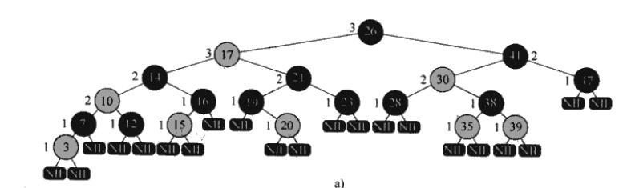

#### 1.2.1. 红黑树性质推论

1. 在以某个节点 x 为根的子树中，至少包含 $2^{bh(x)}-1$ 个**内节点**。
  证明:
  思路通过对 x 的高度进行归纳证明(数学归纳法)
    1. 若 $h(x)=0 \to x 必为叶节点(nil[T])$ ,此时 $h(x) = 2^{bh(x)}-1 = 2^0 -1 =0$ 个节点。归纳的边界条件成立
    2. 现假设 节点$x_1$至少包含 $2^{bh(x_1)}-1$ 个**内节点**。考虑其父节点 $x$, $x$有两个子节点，如果 x 的子节点**红节点**，那么 $bh(x) = bh(x_{子节点})$, 如果 x 的子节点是**黑节点**，那么 $bh(x) = bh(x_{子节点})+1$ 。
    3. 现考虑最差情况，即 $x$的子节点都是黑节点，即 $x_1$是黑节点。x的两棵子树都是黑节点，以 x 为根的子树至少包含 $(\: 2^{bh(x_1)}-1 \:) + (\: 2^{bh(x_1)}-1 \:) \: +1 = 2^{bh(x_1)+1}-1 = 2^{bh(x)+1}-1 $ . 得证
2. 以一棵有 n 个内节点的红黑树高度**至多**为 $2log_2(n+1)$
  证明:
    1. 由性质(4), 如果在一条路径上存在一个红节点，那么必然存在一个黑节点(因为红节点的孩子都是黑节点) $\to$  根的**黑高度**至少为 $h/2$
    2. 由 1 和性质1可得 $ n \ge 2^{h/2} -1 \:  \leftrightarrow \: log_2(n+1) \ge h/2 \:  \leftrightarrow \: h \le 2*log_2{n+1}$
3. 由性质2 我们可以知道，红黑树的 SEARCH MINIMUM MAXMUM SUCCESSOR 操作的时间复杂度均为 $O(lgn)$ 

### 1.3. 哨兵节点

为了方便代码实现，定义一个哨兵节点 **nil[T]** , 其 color域为**BLACK**,其它域可以设任何值。原树中，所有指向 **NIL**的指针，都被指向哨兵节点，换句话说用一个哨兵节点来代替**NIL**节点(叶子节点)和**树根的父节点**(给树根设置一个父节点应该是为了代码实现方便)

ps: 树根的父节点也是**哨兵**

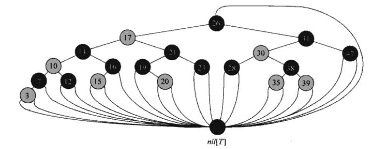

## 2. 红黑树的旋转

ps 旋转是插入操作和删除操作的基础

当对红黑树进行 INSERT 和 DELETE 操作时，普通的二叉树操作的时间复杂度为$O(lgn)$,但插入和删除操作对树做了修改，修改后的树可能不是一棵红黑树。为了让修改之后的树还能是一棵红黑树，需要改变**某些节点的颜色**和**指针结构**。而指针结构的操作称为**旋转** 。

旋转操作涉及**两个节点**，旋转绕着两个节点之间的**边**(或者轴)进行旋转。

**important:** 左右旋转不会导致**二叉搜索树**性质的改变，即旋转之后仍然是**二叉搜索树** (左孩子比树根小，右孩子比树根大)

前言万语不如一张图和加了注释的伪代码。所以直接放图和伪代码，操作和**AVL**树的**单旋**操作类似

旋转操作图解:
(假设x的右孩子y不是 nil 左旋 或者 y的左孩子 x 不是nil 右旋)
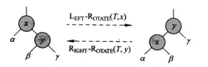

左旋伪代码(右旋的伪代码类似)

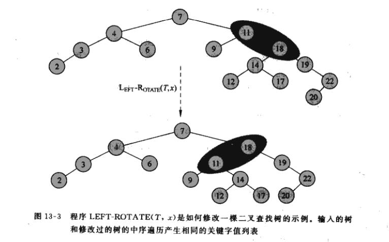

## 3. 插入操作

红黑树的插入操作分为两个阶段

1. 用普通的二叉搜索树算法，找到待插入节点位置，这个位置应该是一个叶节点(根据二叉搜索树的性质),这里的叶节点指的是新节点的孩子是 nil[T] ，将节点插入，并将新插入的节点(z)染成红色。
2. 因为染色之后会破坏性质 (2) 和 (4) (因为插入的节点染为红色，所以不会破坏性质 5 )，需要进行调整，使之重新满足红黑树的性质。

    ps :如果新节点**z**是根节点就破坏性质2

### 3.1. 插入一阶段伪代码分析

注释:

* 第8行的 y 是 z的父节点，8行前面的while循环操作，就是为了找到 z的父节点
* 第9行 判断 z是不是根节点(根节点的父节点为哨兵节点)
* 第11行是为了判断 z 应该插在 y的左边还是右边
* 第17 行是调整操作。

### 3.2. 插入二阶段伪代码分析

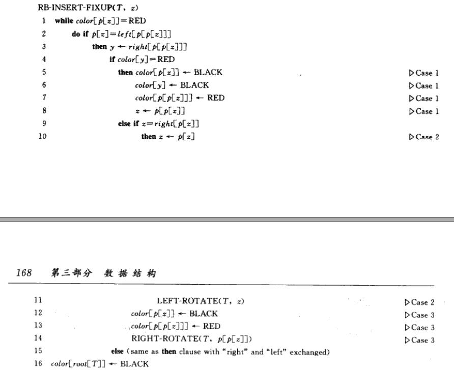

根据 第 1 行 while循环，我们可以得知需要调整(进入while)的条件为 $p[z]$ 为 RED。那么在初始化的时候:

1. 当 $p[z]$为黑色的时候,不进入循环，表示不破坏原红黑树的红黑性质，可能的情况为:
  
    1. $p[z]$是**根节点**，这时候插入新的红色节点，显然不会破坏性质 (2) 和 (4)
    2. $p[z]$是**非跟节点**，这时候插入新的红色节点，同样不会破坏 性质(2) 和 (4)
    3. $z$是**根节点**，由于根节点的父节点是哨兵节点，哨兵节点$nil[T]$是黑色的，此时满足$p[z]$是黑色。但是此时$z$是红色的，并且$z$是这棵树唯一的内节点，因此只需要改变$z$的颜色即可

2. 当 $p[z]$为红色，根据红黑树的性质$p[z]$不可能为根节点，因此$p[p [ z ] ]$,存在，并且$p[p[z]]$一定是黑色的。(否则如果$p[p[z]]$是红色的， $p[z]$一定是黑色的)。在此基础上有一下的分析。

#### 3.2.1. p[z]为红色时插入分析

在 2 阶段，需要调整的情况总共有 6 种，但是由于对称性，实际上只有 3 种(另外3种是对称的)。第 2 行的 if 判断 就表示只取1种对称，下面分情况讨论。
在下面的分析中我们仅关注 4 个节点。 
  
  1. 新插入的节点 $z$ ， $z$ 为 **红色**
  2. $z$ 的父亲节点 $p[z]$， $p[z]$ 为**红色**
  3. $z$ 的祖父节点 $p[p[z]]$ ，$p[p[z]]$ 为**黑色**
  4. $z$ 的叔叔节点 $y$ , 也就是 $p[z]$的兄弟节点
  
  ps： 四个节点的颜色分析看上一部分.

##### 3.2.1.1. case1: $y$ 节点为红

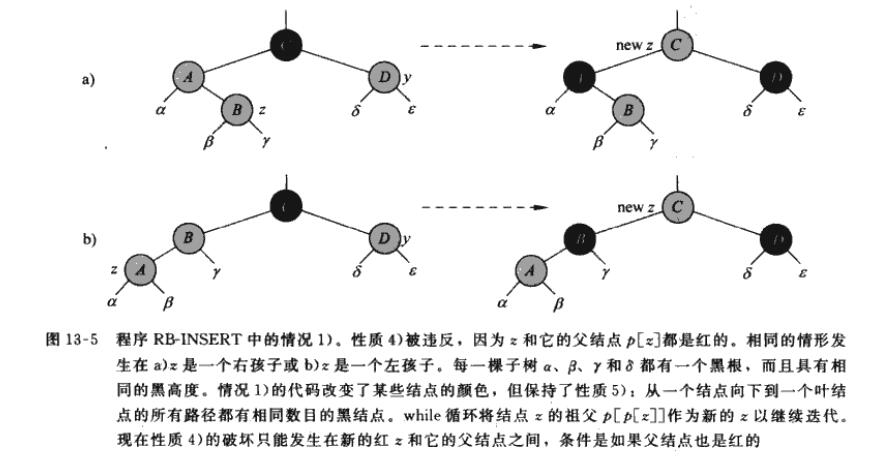

ps: (a) 和 (b) 等价。

操作是，将 $p[z]$  和 $y$ 染成黑色，并将 $p[p[z]]$ 染成红色。

  1. 将 $p[z]$  和 $y$ 染成黑色是为了修正性质(4)
  2. 将  $p[p[z]]$ 染成红色。是为了满足性质 (5)，如果 $p[p[z]]$ 是黑色的话，那么会导致 $p[p[z]]$ 的父节点的黑色节点数+1 .可能破坏了性质(5)。(按照定义，原本子树A和子树D的黑色节点数同，那么C子树的黑色节点数是 NUM(A)+1 , 现在假如C是黑色的。子树B的黑色节点数不变，但增加了一个黑色节点(C)，所以C子树的黑色节点数变为 NUMA)+2)

操作过后，令 $z1 = p[p[z]]$, $z1$进入新的while循环，但是操作过后也可能出现以下的情况:

  1. $z1$是根，那么$p[z1]$为黑色跳出循环，此时只有性质(2)被破坏了，此时只需要把$z1$染成黑色(语句16)，那么所有的性质都得到满足.（包括性质（5）,因为根节点不计入黑色高度中)
  2. $z1$不是根，那么$p[z1]$存在。
    1. 如果$p[z1]$是黑色的，显然此时所有的性质都得到了满足。(因为我们在上一步操作中证明了不会破坏性质(5),且上一步操作修正了性质(4),$p[z1]$是黑色的显然不会破坏性质(2),其余的性质很自然不会被破坏)
    2. 如果$p[z1]$是红色的，重复进入**while**循环，继续对$z1$进行调整。

##### 3.2.1.2. case2 and case3

case2: 如果 $y$ 节点为黑色，且$z$是右孩子
case3: 如果 $y$ 节点为黑色，且$z$是左孩子

对于case2 可以通过 **左旋** 操作转化为 case3,因此主要集中于case3 (注意case2旋转之后，z也变了),且由于 $z$和$p[z]$都是红色的，旋转操作不破坏性质(5)

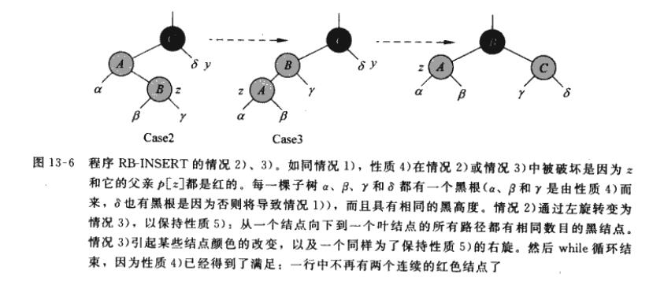

对于case3:
我们做的操作是

   1. 对 $p[z]$ 和  $p[p[z]]$,作右旋操作。
   2. 并把$p[z]$染为黑色，把$p[p[z]]$染红色

执行完操作之后，修正了性质(4),同时不会破坏性质(5)(仔细观察图可知，这里不赘述了)。同时旋转之后， $p[z]$成为最上面的节点
  
  1. 如果 $p[z]$ 是根节点，显然满足(2)，所有的性质都满足，并且退出while循环
  2. 如果 $p[z]$ 不是根节点，显然不会破坏(2)，所有的性质都满足，并且退出while循环

因此对于 case2 和 case3来说，最多经过2次旋转即可保持红黑树的性质。

### 3.3. 插入操作的复杂度分析

RB-INSERT的复杂度为 $O(lgn)$, 因为高度为 $O(lgn)$,所以阶段一的查找操作的复杂度为$O(lgn)$。对于case1:最多做$O(lgn)$次 while循环，对于case2 和 case3 ,旋转操作的复杂度为 $O(1)$。综上，总的插入操作的复杂度为: $O(lgn)$ 。

## 4. 删除操作

和插入操作类似，红黑树的操作也分为两个阶段。

1. 普通的二叉树删除算法。普通二叉树删除算法概述:
   首先找到待删除节点 $z$,根据 $z$ 的类型:
     1. 如果 $z$是**叶子节点**($z$的左右孩子都是$nil[T]$),直接把$z$删除，并将$p[z]$的孩子设置为 $nil[T]$
     2. 如果 $z$ **只有一个孩子**(不管是左孩子还是右孩子),直接把$z$删除，并将$z$的孩子和$p[z]$链起来
     3. 如果 $z$ 有**两个孩子**，那么首先找到 $z$的后继节点 ($SUCCESSPR$) $y$ (也就是$z$的右子树中序遍历的第一个节点，或者是树的中序遍历下$z$的下一个节点)。先删除节点$y$,此时删除$y$的情形就是情况 1,2 ($y$一定没有左孩子),然后再将$z$替换为$y$即可。
2. 执行完普通删除之后，再根据被删除节点的颜色进行调整(**RB-DELETE-FIXUP**)。使之重新满足红黑树的性质。

### 4.1. 删除一阶段伪代码分析

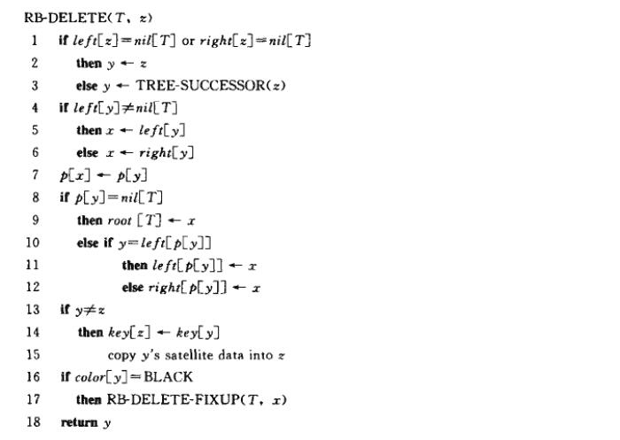

注释 :

* $z$是待删除节点。
* 在代码中 $y$ 表示 **执行 case1/case2 删除的节点**。换言之，如果是 case1/case2 $y$就是待删除节点$z$。 如果是 case3， $y$是 $z$的后继节点。
* $x$是$y$的孩子节点,如果$y$有一个内节点孩子，$x$是非$nil[T]$的孩子，如果$x$没有内节点孩子，那么$x$是$nil[T]$
* 第 1 行， 这个 if 将 case1\case2 和 case3区分开 。case1和case2的处理方式相同(第 2 行)。
* 第 3 行， 处理 csas3, 找到 待删除节点 $z$的后继节点 $y$
* 第 4 - 7 行，将 $y$ 的 左孩子(或者右孩子)设为$x$, 将 $x$ 和 $p[y]$ (y的父节点)链起来
* 第 8 - 9 行，如果节点$y$是根节点 (根节点的父节点是 $nil[T]$),那么因为$y$原本的位置现在是$x$了，将树的根节点设置为$x$.
* 第 10 -12 行，将 $x$ 和 $p[y]$ 链起来
* 第 13 - 14 行 判断 $y$和$z$是否为同一个节点，如果是(对应case1,case2)什么都不做，如果不是意味着现在$z$还在树种，将$z$替换为$y$ 从而完成对节点$z$的删除
* 第 16 - 17行 根据 $y$的颜色对红黑树进行调整，使之重新满足红黑树的性质

### 4.2. 删除二阶段伪代码分析

RB-DELETE-FIXUP 伪代码如下

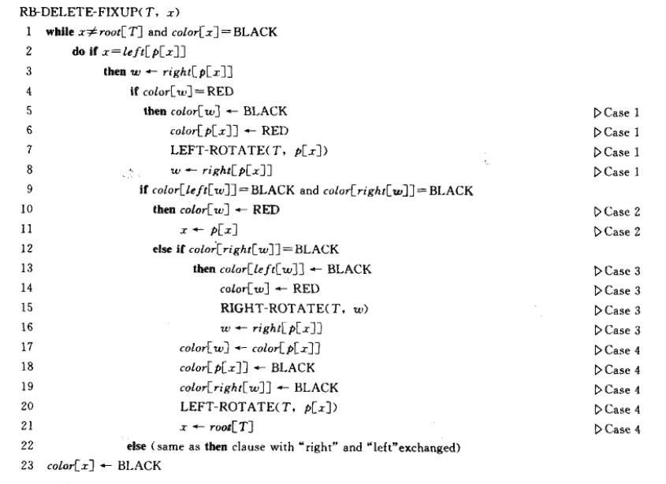

#### 4.2.1. $y$是红色

首先还是看 1阶段的代码 16-17行，这里的 if 语句表明只有 $y$ ($y$ 表示 执行 case1/case2 删除的节点)是黑色的才需要调整。如果$y$是红色的并不会破坏红黑树的性质。显然，当$y$是红色的时候:
  
  1. $y$不是根节点，删除$y$不影响性质(2)
  2. $y$是红色节点，删除红色节点不影响黑色节点的数目，所以删除$y$不影响性质 (5)
  3. 由于$y$的子节点一定是黑色的，所以删除$y$之后不可能出现两个连续的红色节点,不破坏性质(4)
  4. 显然剩下的性质也不会被破坏。

因此只需要对 $y$是黑色且不是根的情况进行讨论，

#### 4.2.2. $y$是黑色

如果$y$是黑色的，此时$y$被删除，可能带来的问题有:
  
  1. 如果$y$是根节点，且$y$的孩子$x$是红色的，那么此时$x$为根，破坏了性质(2)
  2. $y$不是根节点，但是$x$和$p[y]$ (删除后同时也是 $p[x]$ )都是红色的，此时破坏了性质(4)
  3. 因为$y$是黑色的，删除$y$导致包含$y$的任意路径的黑色节点个数少1，因此性质(5)被 $y$的某一个祖先破坏了。

事实上对于上述的 1,2,3 最重要的是解决 3，如果问题 3解决了，1和2能同时得到解决。

解决问题3的方法是: 把 $x$视为还有额外的一重黑色。此时多出的这重黑色解决了(5),但此时 $x$为**红黑**(x原本的颜色是红) 或者 **黑黑**(x原本的颜色是黑) 。此时破坏了性质(1) (颜色只能是红色或者黑色)。为了解决这一随之而来的问题，我们希望在经过某种操作之后，能把多出的一重颜色去掉。

解决多重颜色问题先考虑:

1. 如果 $x$是**红黑**的，也就是$x$原本的颜色是**红色**，此时直接把$x$着色为**黑色**。就可以解决这个问题。(伪代码的第 1 行，就做了这个判断，第 23 行直接将$x$染黑)
  此时红黑树的所有性质满足:
    1. 将$x$染成黑色补偿了性质 (5)
    2. $x$为黑色显然就不会发生问题2和3了
2. 如果 $x$是**黑黑**的且$x$为根，也就是$x$原本是**黑色**，此时直接把$x$多余的那重黑色去掉，也即是把$x$染黑。(伪代码第 1 ，23行)
  此时红黑树所有性质得到满足;
    1. $x$为根，$x$的颜色不影响 黑色节点的数目(也就是说在原本树中$y$为根，$y$的颜色不影响黑色高度)，此时性质(5)满足
    2. $x$为跟，且$x$为黑色，问题 2，3都不会发生。

3. $x$ 是 **黑黑** ，但**x**不是根节点，此时需要额外的调整。**调整的目标**是通过某些操作，使得在 **保持性质 5**的基础上，将多出来的黑色层层上移，最终转化为前面两种情况，完成调整。(最外层的while循环体现了这种层层上移)。注意 **拥有额外一重黑色**的节点由 $x$标识，而不是由 节点原本的颜色标识。

##### 4.2.2.1. $x$为 **黑黑** 且不为根节点时的调整操作

首先有上面的 3.所述，我们必须确保这些操作能够**保持性质(5)**，如何判断是否保持性质(5) ? : **子树根节点到无关节点的路径上(包括子树根节点本身)黑色的数目 操作前后不变**。 这里的 无关节点指的是不涉及操作的节点。

下面可能出现的节点定义 :

1. 在代码中 $y$ 表示 **执行 case1/case2 删除的节点**。换言之，如果是 case1/case2 $y$就是待删除节点$z$。 如果是 case3， $y$是 $z$的后继节点。
2. $x$ 是 被删除节点 $y$ 的子节点(和上面所有的$x$一致)，且由上面分析之此时， $x$的颜色为 **黑黑**.
3. $w$ 是 $x$ 的兄弟
4. 上述伪代码和下面的分析中 $x$是$p[x]$的左节点，$x$是右节点和$x$是左节点是对称的。因此只分析$x$是左孩子的情况。

在不考虑对称性的前提，一共有 **4种**情况(其它的4种和这4种对称)

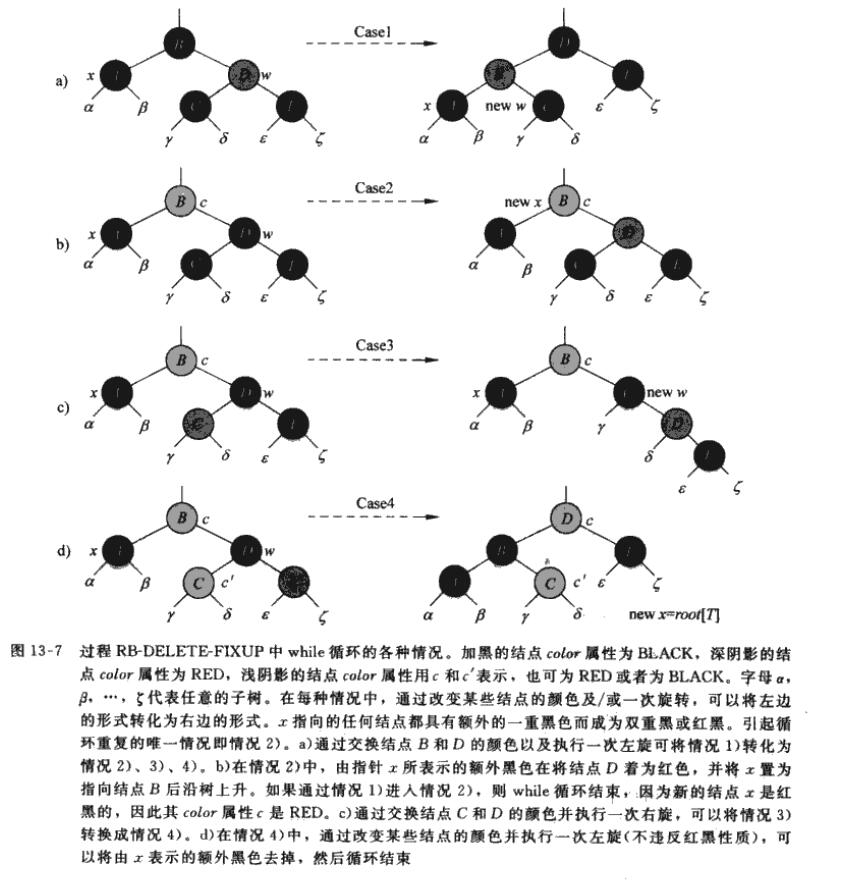

###### 4.2.2.1.1. Case 1 x的兄弟 w 是红色的

当 $x$的兄弟 $w$ 是红色的，$p[x]$一定为黑色

我们做的操作为 : 交换 $p[x]$ 和 $w$ 的颜色，并对 $p[x]$ 和 $w$ 做一次左旋。此时$w$变为子树根节点且为黑色， $p[x]$ 变为红色。 (图可能不是很清楚)
显然在做了这个操作之后:

  1. 保持了性质(5)，从子树根节点到 $\alpha$ , $\beta$ 距离均为3 ($x$为双重黑节点)。 到其余无关节点的距离可以类推。
  2. 不违反红黑树的其它性质。

上述操作将 case1 转化为 case2 / case3 /case4

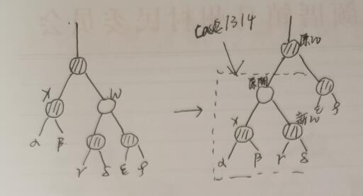

###### 4.2.2.1.2. Case 2 x的兄弟 w 是黑色的，且w的两个孩子都是黑色的

x 的兄弟 w 是黑色的，且w的两个孩子都是黑色的。$p[x]$可为红色，可为黑色，图片以红色为例

我们的操作是:

1. 将$x$和$w$的黑色同时去掉，此时$x$变为黑色，$w$ 变为红色(上面图不是很清楚)
2. 此时 $x$的那重黑色去掉了，但是 $x$路径上的某个祖先节点的黑色节点数目 -1 。
3. 为了补偿黑色节点的数目。我们将 $p[x]$ 新增一重额外的黑色。 
4. 令 $p[x] = x_1$ ,此时针对 $x_1$做新一轮的while循环。(等价于将额外的黑色上移)

显然在操作之后，性质(5)未被破坏。

###### 4.2.2.1.3. Case 3 x的兄弟 w 是黑色的，且w的左孩子是红色的，右孩子是黑色的

x的兄弟 w 是黑色的，且w的左孩子是红色的，右孩子是黑色的。$p[x]$可为红色，可为黑色，图片以红色为例

我们的操作是:

   1. 将 $w$ 染为红色
   2. 将 $left[w]$ 染为黑色
   3. 对 $w$ 和 $left[w]$ 进行右旋操作。(这里的右旋操作指的是，$w$ 绕  $left[w]$ 右旋)

经过上述操作 我们将 case 3 转化为 了 case4 并保持了性质(5)

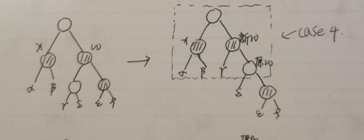

###### 4.2.2.1.4. Case 4 x的兄弟 w 是黑色的，右孩子是红色的。

x的兄弟 w 是黑色的，右孩子是红色的。(左孩子此时是无关节点，红色或黑色都一样)。$p[x]$可为红色，可为黑色,图片以红色为例

我们的操作为: 

1. 将 $w$的颜色设为$p[x]$的颜色(这步操作为了保持性质5)
2. 将 $right[w]$的颜色设为 **黑色** (这部操作是为了 补偿 $w$变为红色。保持了性质(5))
3. 将 $p[x]$ 绕着 $w$ 做一次左旋。
4. 将 $p[x]$ 的颜色设为**黑色**,去除$x$多余的一重黑色(这步其实将$x$多余的那重黑色转移到了 $p[x]$上，同时补偿了 $w$的黑色，目的都是为了保持性质 5)
5. 将 $x$设为根节点。(直接进行伪代码 23行统一的操作)，同时将 $x$设为跟之后，就跳出循环。

通过上述操作，红黑性质都得到满足了。

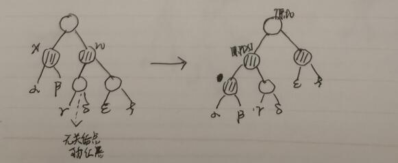

#### 4.2.3. 伪代码注释

* 第 1 行 如果 $x$ 是 或者 $x$是红色就**不进入**循环。和 第 23 行统一将 $x$ 设置为黑色。 处理的就是 **解决多重颜色问题**的 1，2两点 ($x$是红黑的和$x$是根)

### 4.3. 复杂度分析

含 $n$个节点的红黑树高度为 $O(lgn)$ , 所以执行第一阶段的删除代码的复杂度为 $O(lgn)$ , 在第二阶段的调整操作中， case 1, 3, 4 只需要经郭一定次数的颜色修改和最多三次(case1->case2->case3)的旋转操作便结束。 复杂度为 $O(1)$, 对于case2,while循环最多执行 $O(lgn)$ 次(上升次数)。综上 RB-DELETE的总的时间代价为 $O(lgn)$