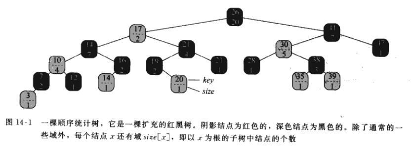
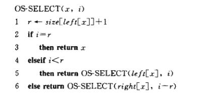
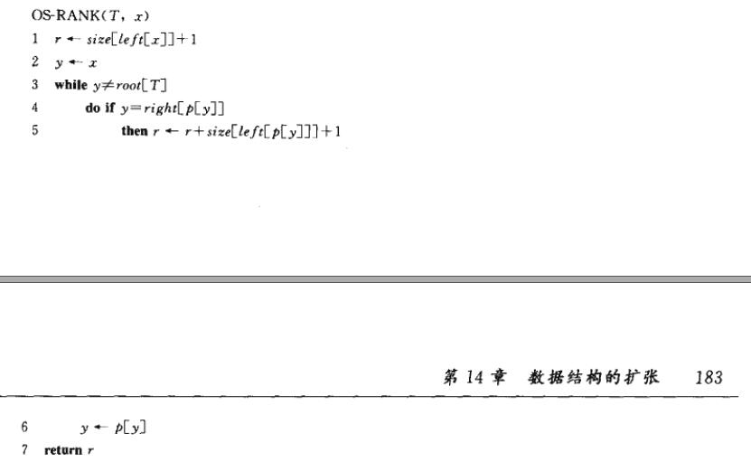
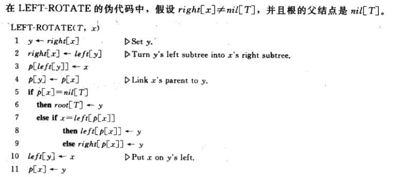
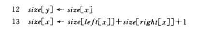
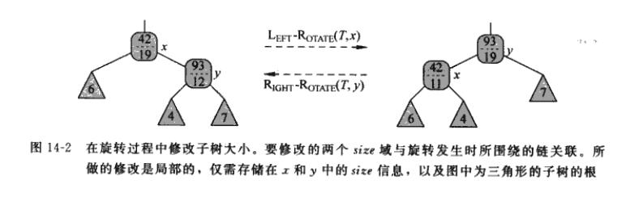

# 红黑树扩张

## 红黑树性质复习

基本性质 :

* 红黑树的节点为红色或黑色
* 红黑树的根为黑色
* 红色节点的孩子节点必定为黑色节点(不可能同时出现两个红色节点)
* 红黑树的叶子节点(NIL)是黑色的
* 对每个节点，从该节点到其子孙节点的所有路径上包含相同数目的黑节点 (黑色完美平衡)

扩展性质 :

* 在以某个节点 x 为根的子树中，至少包含 $2^{bh(x)}-1$ 个**内节点**。
* 以一棵有 n 个内节点的红黑树高度**至多**为 $2log_2(n+1)$

基本操作 : 

* 查找 : 同普通的二叉树搜索树查找，复杂度为 $O(lgn)$
* 插入 : 普通二叉搜索树插入 + 6 种 需要调整颜色和旋转的情形(3+3存在对称性)。插入操作**最多执行**两次旋转，最多循环 **height** 次， 红黑树插入操作复杂度为 $O(lgn)$
* 删除 : 普通二叉搜索树删除 + 8 种 需要调整颜色和旋转的情形(4+4)，删除操作**最多执行**三次旋转，最多循环 **height** 次， 红黑树删除操作复杂度为 $O(lgn)$

## 动态顺序统计

动态顺序统计有两种主要的操作

1. 在包含n个元素的集合中，找到第 k 小的元素。(leetcode经典题目只一，可以用红黑树实现)
2. 在包含n个元素的集合中，找到 元素 x 的排序(找到x是第k大的元素,在线性序的位置)

### 顺序统计量树

通过简单地在红黑树的每个节点存入附加信息，并修改相应的操作，可以实现一种支持快速顺序统计量操作的数据结构

1. 在红黑树的节点 x 增加 $size[x]$ 域表明 以 $x$ 为根的子树内部节点(包括 $x$)的总数.
2. $size[x]$ 可有左右子树的 $size$ 计算得来 有公式 : $size[x] = size[left[x]] + size[left[y]] +1$,  $nil$的 $size$ 为 0 
3. 顺序统计树中，并不要求关键字互不相同，因此定义排序为按中序遍历时输出的节点位置。(比如 第 k 个位置指的是中序遍历序列的位置 k )

### 检索具有给定排序的元素

(找到第 k 大的数)

OS-SELECT(root[T],i), 操作寻找树T中第 i 小关键字，返回指向第 i 小关键字节点的指针

思路 : 

1. 和二叉查找数的思路类似, 注意二叉搜索树的特性。
2. 如果  i < 左子树的 size + 1 (当前根节点在中序序列中的位置)，递归查找左子树
3. 反之递归查找右子树。 

伪代码:

代码注释:

1. 第 1 行， 根据二叉搜索树的性质，不难得出 r 表示节点 x 在中序序列的额位置。(x是 第 r 大的)
2. 第 2 行， 递归出口
3. 第 5,6 行，递归搜索。

**复杂度** : 容易看出该操作复杂度为 $O(lgn)$

### 确定一个元素的秩

(确定 节点 x 是第几大的 )

操作 OS-RANK(T,x) 表示查找树 T 的节点 x 的秩。

思路: 

1. 由于已经知道 节点 $x$ 的指针，关键是计算 $x$ 的位置
2. 如果 $x$ 是树根，那么很自然 $x$ , 的位置是 $size[left[x]]+1$
3. 如果 $x$ 是左子树，那么 $x$ 的兄弟树($rignt[p[x]]$)的节点都排在 $x$的后面,对计算没有影响.
4. 如果 $x$ 是右子树，那么 $x$ 的兄弟树($left[p[x]]$)的节点都排在 $x$的前面,因此 $x$ 的顺序需要修正为 : $r= r+ size[left[p[x]]] + 1$
5. 需要不断地向上检查，排除左右子树不同带来的影响(重复执行 2-3)，这句话请看代码

伪代码: 

伪代码注释 : 

1. 第 4 行， 判断 $y$ 是不是右子树
2. 第 5 行， $y$ 的 左兄弟子树的节点都排在 $y$ 前面，所以需要加上 左子树所有节点 和 父亲节点进行修正
3. 第 6 行， 不断向上迭代。

**复杂度** ， 显然 while 语句最多执行 **height**次，因此该操作的复杂度为 $O(lgn)$

### 维护顺序统计树

显然在给定每个节点的 size 域之后, OS-SELECT 和 OS-RANK 能迅速计算所需要的顺序统计信息。

但是当我们使用红黑树的基本修改操作:

* insert 
* erase 

时候显然会破坏 $size$的值，因此必须考虑在不影响插入和删除的复杂度的前提下维护子树。

### 维护插入操作

在红黑树篇中，我们知道，红黑树的插入有两个阶段。第一阶段找到插入的位置，第二阶段进行变色和旋转操作

* **第一阶段** : 为了在第一阶段保持子树的规模，对于从跟到叶子的路径上遍历的每个节点 x , 将 $size[x]+1$ ， 新增的节点的 $size$为1 。显然这步操作的复杂度为 $O(lgn)$
* **第二阶段** : 第二阶段变色不会改变 $size$,只有旋转会影响 $size$ , 旋转的次数最多为2。观察旋转操作我们发现，旋转是一种局部操作，旋转只会印象 参与旋转的两个节点的 $size$, 同时正确的值都能通过这两个节点极其孩子计算出来。
  修改 LEFT-ROTATE(T,x) 的代码为(右旋同理) :

  

  

  

  由于旋转最多 2 次， 所以复杂度为 $O(1)$

综上，经过修正之后插入操作复杂度仍然为 $O(lgn)$

### 维护删除操作

红黑树删除同样有两个阶段

* **第一阶段** : 第一阶段删除节点y，遍历从跟至节点 $y$的路径, 将 路径上每个节点的 $size$ -1 ，显然这步操作的复杂度为 $O(lgn)$
* **第二阶段** : 第二阶段变色不会改变 $size$,只有旋转会影响 $size$ , 旋转的次数最多为3。其余同插入操作, 复杂度为 $O(1)$ 。