# 计算机网络传输层笔记

## 1. 传输层的服务和协议

* 为不同主机的进程之间提供 **logical communication running on different host** 
* 传输层协议运行在端系统
    **send side** : 将消息分为 **segment** passes to network layer
    **rcv side** : reassembles **segments into messages** passes to app layer
* Internet 中存在两种传输层协议
    **TCP**(传输控制协议) and **UDP**(用户数据报(datagram)协议)

### 1.1. 传输层VS网络层

**network layer** :  **主机 hosts**之间的 logical communication
**transport layer** : **进程 prcesses**之间的 logical comminication。(传输层最终还是要调用网络层的服务)

### 1.2. Inter transport-ayer protocols

#### 1.2.1. **TCP** reliable , in-order delivery

* 报文段 ： segment
* 拥塞控制 ：congestion control 
* 可靠的数据传输
* 流量控制

#### 1.2.2. UDP unreliable , unordered delivery

* 报文 : datagram
* 流量不可调节
* 不可靠传输

#### 1.2.3. IP层的服务

* 尽力而为
* 不保证顺序和完整性

## 2. 多路复用/多路分解

### 2.1. 多路复用

multiplexing at sender:

从上到下，从socket中收集数据，加报文头传递到网络层
(可以理解为把一个主机里的数个process的message一起通过传输层发送出去)

### 2.2. 多路分解

demultiplexing at receiver

自下而上，传输层的报文交给正确的sorckt

如何实现：

1. IP报文里有源主机和目的主机的IP
2. 传输层报文里有源端口号和目的端口号
3. 通过 IP 和 port 就可以定位到主机的进程实现精确的分解

#### 2.2.1. 面向无连接的多路分解（UDP）

因为是面向无连接的，所以多个客户端的进程对应一个服务端的进程（客户端的进程只需要标明服务端进程的IP和端口号），所有客户端的报文都发送到客户端的**一个socket**上（不建立连接，不像TCP一样还要建立新的用来传输的sorckt**)

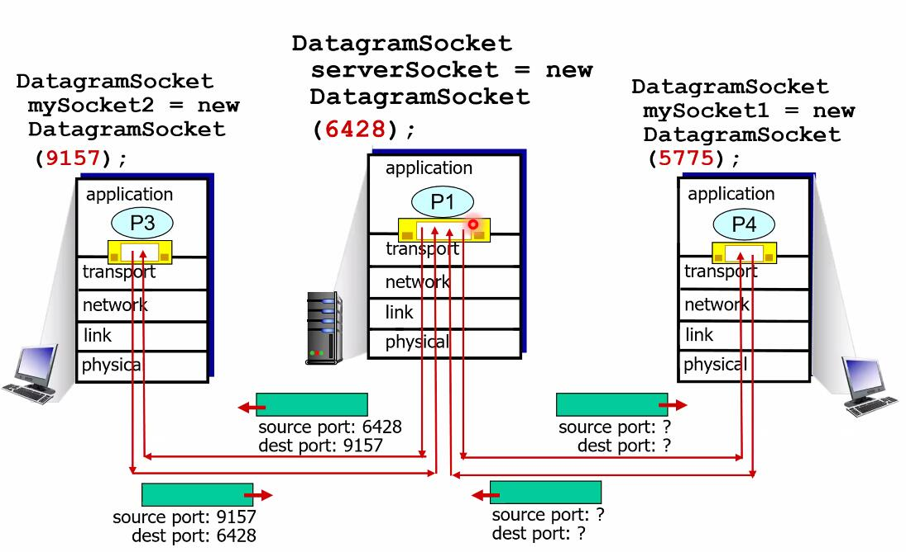

#### 2.2.2. 面向连接的多路分解

 **TCP socket identified** by 4-tuple:** (source IP , source port ,dest IP, dest prot)

对于面向连接的多路分解，在建立连接的时候，如上所述，客户端还需要给出自己的 IP和port(四元组)，可以唯一地识别不同的客户端进程，服务端在建立连接之后还会重新创建一个**socket**用来传输，换言之，**每一个客户端sorckt都对应一个服务端socket**

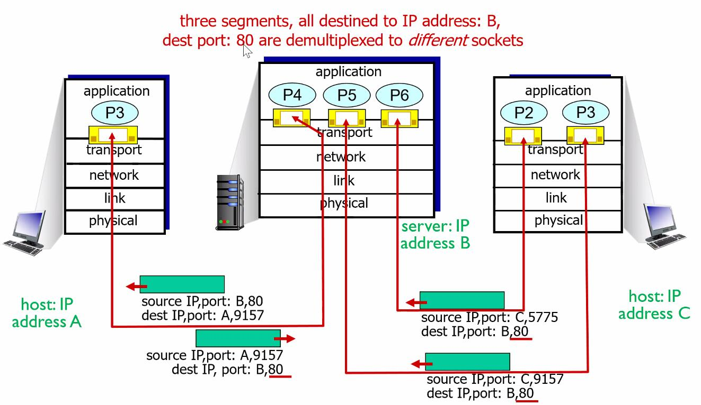

## 3. UDP

* "no frills" , "bare bones" Internet transport protocol(基本服务)（UDP没有多余的修饰，提供的是最基本的服务）
* “best effort" service(UDP追求效率) UDP segments may be : 1.lost 2. delivered out-of-order to app
* connectionsless: 1.没有握手过程 2.每个UDP segment分别处理
* UDP典型应用： 1.流媒体 2.DNS 3.SNMP (这些应用追求传输效率)
* 提升UDP的可靠性？ 在应用层加入一些查错机制

### 3.1. UDP 报文

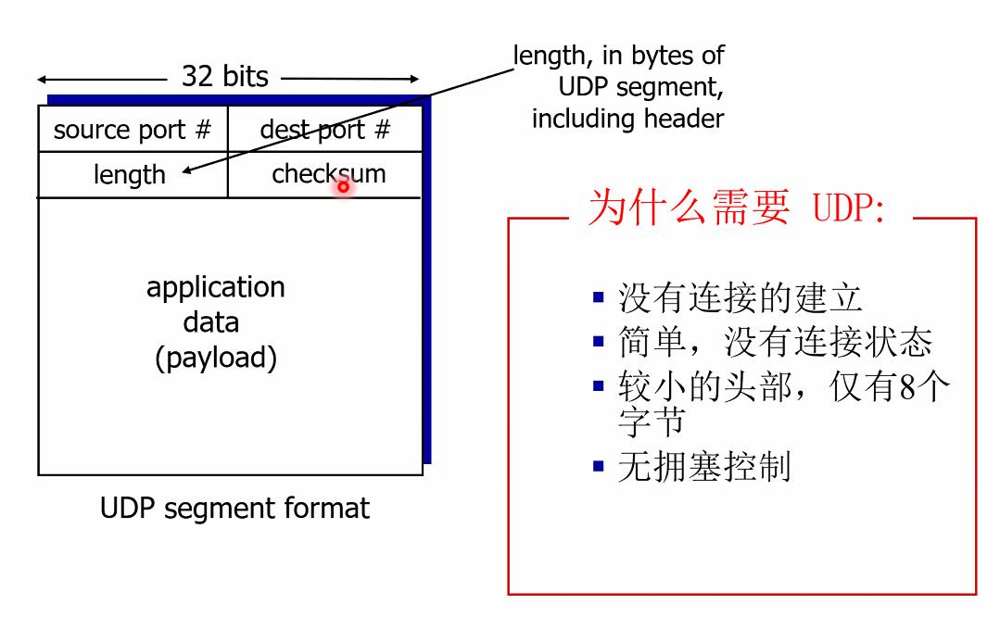

头部只有 8个字节

#### 3.1.1. UDP 校验和

checksum 有 16 bit

(代研究)
个人理解：
把所有的位都划分成16位的字，然后一个字一个字进行累加 ，如果在某次加法有进位 就把 1 加到最后一位，然后接着累加，最后所有字相加的结果取反

https://blog.csdn.net/DB_water/article/details/78468455

## 4. 可靠数据传输协议设计

过程的大致描述：

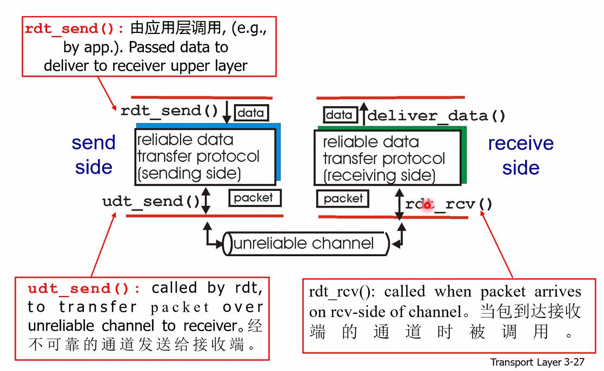

### 4.1. 如果底层的 channel 是可靠的

rdt1.0

* 不丢失 bit 
* 不丢包

只有两个状态，接受状态，发送状态，
发送端不断重复： **接受任务 -> 打包 ->发送** 的过程
接收端不断重复：**收包 -> 解包 -> 传递给应用层**的过程
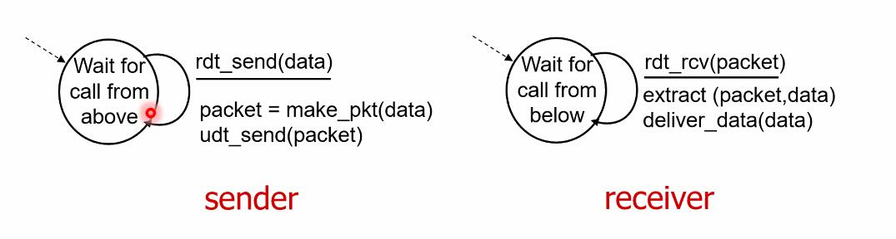

### 4.2. 如果 channel 可能发生 bit errors

rdt2.0

* 底层的传输可能会发生bit翻转(通过checksum 来检测 bit error)

* 如何纠错？如何从错误中恢复? 通过应答的方法

rdt2.0 引入新的机制
* 错误检测
* 应答（ACKs, NAKs）
* 出错重传

sender 两种状态，reciever一种状态

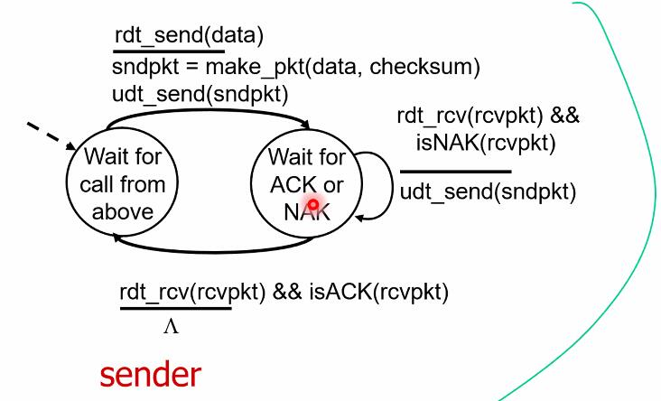
ps: 在每次发送的时候，等待应答，如果应答是 NAK(错误应答),就重传。如果应答是ACK,就进行下一个发送任务。

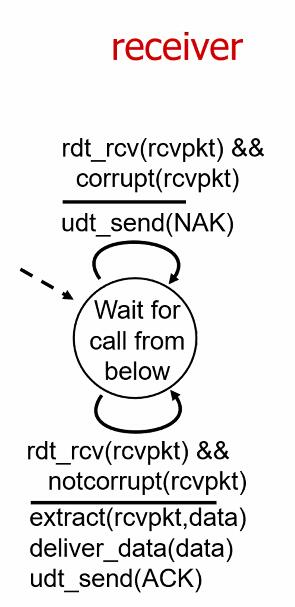
ps : 每次接受数据包的时候，先判断有没有出错，出错回复 NAK 放弃这个包；没有出错，回复ACK，解包，在发给应用层。

#### 4.2.1. rdt2.0 致命的弱点！

**如果ACK/NAK也出错了怎么办？**

* 重新发送当前数据包
* 给每个包增加序号
* 接收者抛弃部分数据包

由此引入 rdt2.1

#### 4.2.2. rdt2.1: 应对受损的 ACK/NAK

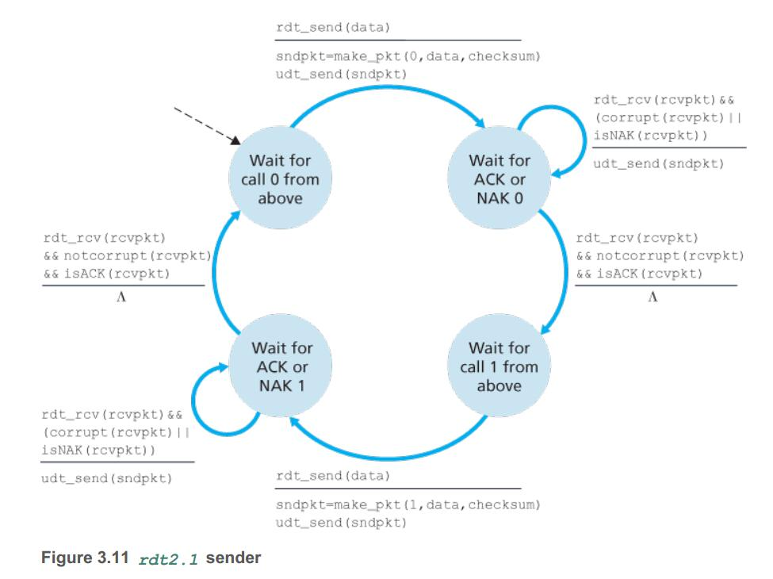
ps:发送方同时还要检测 ACK/NAK的包是否出错，如果出错了（即使受到的是ACK）那么，发送方会重新发送当前的数据包（并且要给当前的数据包编号，编号和上一次的发送相同，这个可以让接收方判断是不是收到同一个包）

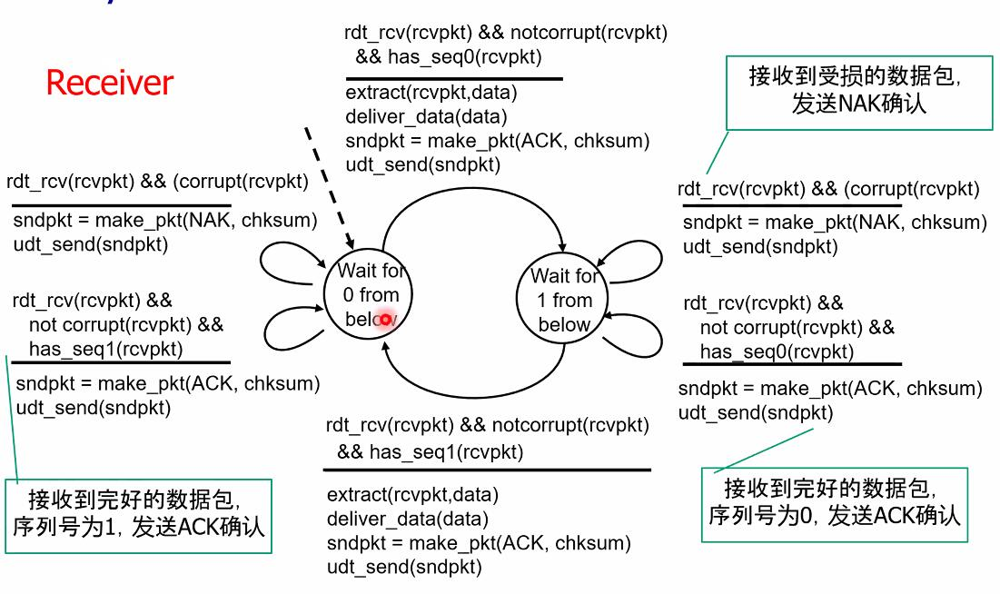
（接收方 增加一个检测包序号，如果序号不是需要的，说明发送方的 ACK回复受损了，接收方重新回复ACK给发送方（不需要解包，因为当前的包已经有了））

ps:序号只需要 0 和 1,因为我们只需要用 0 和1 来标识收到的包是不是同一个包。

#### 4.2.3. rdt2.2: a NAK-free protocol

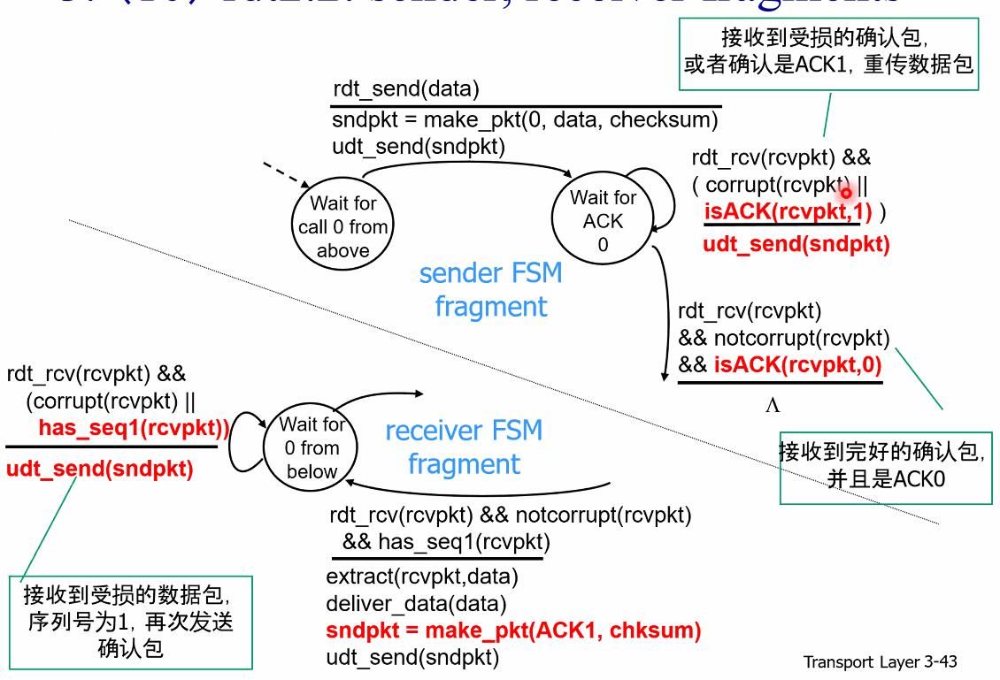

rdt2.2 去除了 NAK，因为在 0 状态下 接收方期望的是 ACK0， 因此 ACK1可以替代NAK的作用。所以只需要ACK0,和ACK1两个

### 4.3. 如果发生丢包怎么办?

解决方案：
sender 等待ACK一定的时间

* 如果在规定的时间内没有受到ACK，就重传
* 但如果只是延迟很大（而不是丢包）? 重传可能会造成冗余，但是可以用包序号（确定是不是相同的包）解决这个问题，**接收者为包指定序号** 
* 发送方设定一个计时器。

#### 4.3.1. rdt3.0

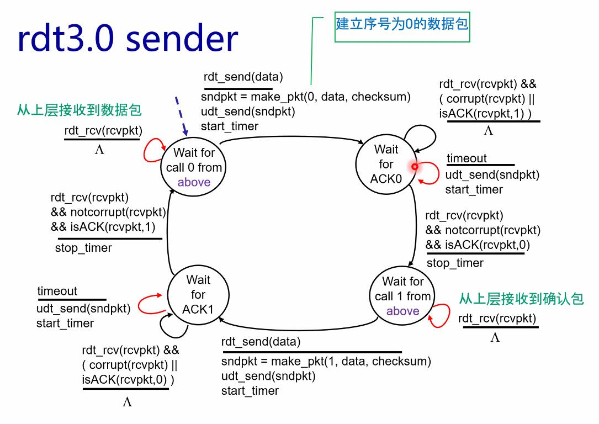
ps: 这里sender，如果timeout了，要重发数据包。注意在**wait for call 1 form above**状态里，如果收到了回复包(ACK),就直接抛弃了。因为这个包可能是延时受到的。(但是在前一步已经受到了 ACK 说明接收者已经收到了)

接收者同 rtd2.2

##### 4.3.1.1. rdt3.0 动作图

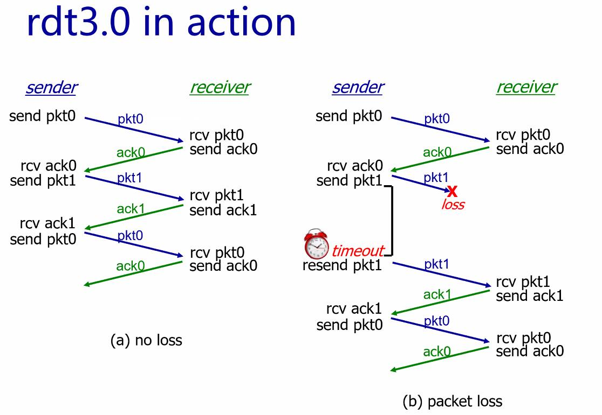
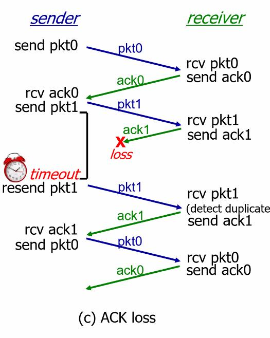
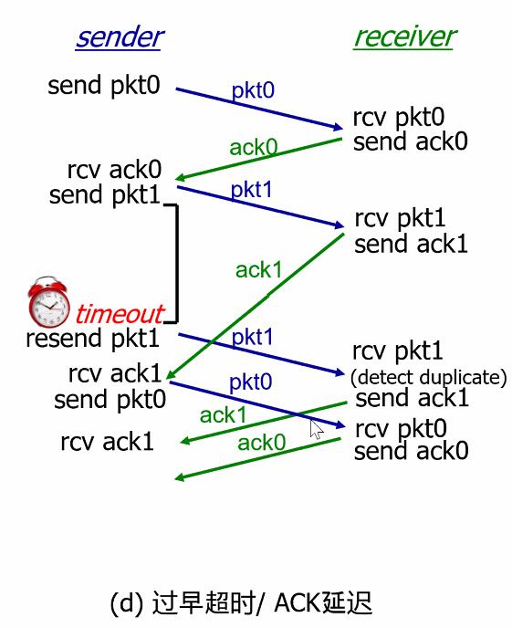
ps:在这种情况下会导致 网络上ACK包过多，会给网络造成负担（但是不会出错，因为不管受到的是哪一次的ACK，只要ACK是正确的说明接收方已经接收到了），这里也说明了需要设置一个合理的 timer 同时，在sender处要设置相应的缓存。