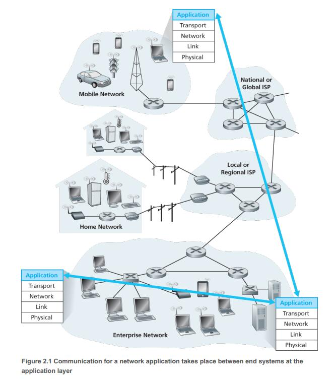
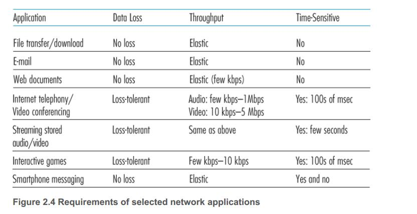
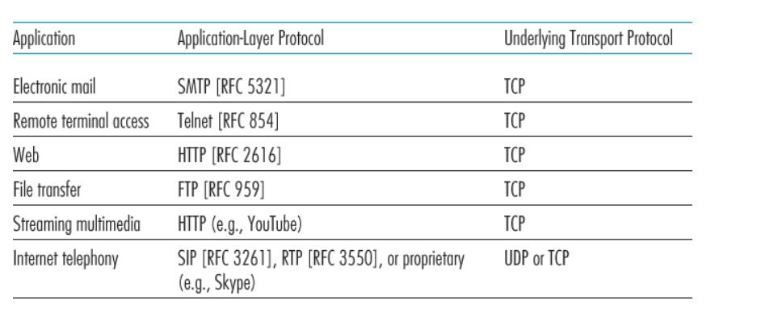

# Chapter2 Application Layer

## 1. Principles of Network Applications

At the core of network application development is writing programs that run on different end systems and communicate with each other over the network.

Importantly, you **do not need** to write software that runs on network-core devices, such as routers or link-layer switches. 

### 1.1. Network Application Architectures

#### 1.1.1. Network architecture vs  Application’s architecture

1. From the application developer’s perspective,the network architecture is fixed and provides a specific set of services to applications.
2. The application architecture, on the other hand, is designed by the application developer and dictates how the application is structured over the various end systems.

ps: InterNet 5 层网络架构是一个固定的，为开发者提供固定服务的网络架构，而应用层架构可以由开发者自行设计，不同端系统，不同应用软件的应用层架构不同。

#### 1.1.2. CS VS P2P

##### 1.1.2.1. CS architecture

* there is an **always-on** host, called the server
* server  services requests from many other hosts, called clients. 
* clients do **not directly** communicate with each other.
* the server has a **fixed, well-known address**, called an IP address.
* a client can **always** contact the server by sending a packet to the server’s IP address.

examples: web,FTP,Telnet,e-mail

##### 1.1.2.2. P2P architecture

* the application exploits direct communication between pairs of intermittently connected hosts, called peers

* One of the most compelling features of P2P architectures is their self-scalability. (每一个peer 增加了整个系统的服务能力，因为它使得文件被分布在每一个peer中)

* P2P architectures are also cost effective. (因为不需要专用的服务器和带宽)

* P2P applications face challenges of security, performance, and reliability due to their highly decentralized structure.

#### 1.1.3. Processes Communicating

Processes on two different end systems communicate with each other by **exchanging messages** across the computer network. 

#### 1.1.4. Client and Server Processes

* In the context of a communication session between a pair of processes, the process that initiates the communication (that is, initially contacts the other process at the beginning of the session) is labeled as the client.
* The process that waits to be contacted to begin the session is the server.

#### 1.1.5. The Interface Between the Process and the Computer Network

socket: the **software interface** through which a process send messages into and receives messages form the network. A socket is the **interface** between the application layer and thetransport layer within a host.
(如果说把进程比喻成房子的话，socket可以比喻成房子的门,当我需要送信的时候(传递消息)把消息扔到门外(发送给socket)，门外自然会有快递（应用层一下的传输层，网络层，链路层，物理层等）帮我把信送到地址的门口。socket 是传输层和应用层之间的接口,是一种由操作系统提供的API)

#### 1.1.6. Addressing Processes

Two pieces of information need to be specified: 

1. the address of the host. **IP address**(32-bit)
2. an identifier that specifies the receiving process(more specifically, the receiving socket) in the destination host. **port number**. (16-bit) 
(http:80,smtp:25....)

#### Transport Services Available to Applications

(指导我们如何选择传输层协议)

1. **Reliable Data Transfer.** When a transport protocol provides this service, the sending process can just pass its data into the socket and know with complete confidence that the data will arrive without errors at the receiving process
2. **Throughput**
3. **Timing** eg: every bit that the sender pumps into the socket arrives at the receiver’s socket no more than 100 msec later. 
4. **Security** eg: a transport protocol can encrypt all data transmitted by the sending process, and in the receiving host, the transport-layer protocol can decrypt the data before delivering the data to the receiving process

#### Transport Services Provided by the Internet

##### TCP

The TCP service model includes a **connection-oriented** service and a **reliable data transfer** service.

provided:

1. **Connection-oriented service.**  handshaking(exchange transport-layer control information) ->  TCP connection is built and exist(full-duplex) -> tear down the connection after finishing sending messages. (先握手建立TCP连接，再传输数据，传输结束之后关闭TCP连接)

2. **Reliable data transfer service** The communicating processes can rely on TCP to deliver all data sent without error and in the proper order. (出错会重传)

3. **congestion-control** throttles a sending process (client or server) when the network is congested between sender and receiver and  also attempts to limit each TCP connection to its fair share of network bandwidth

not provided:

* security (solved by using **Secure Sockets Layer (SSL)**) 
* throughout

##### UDP

UDP is a no-frills, lightweight transport protocol, providing minimal services. 

1. **UDP is connectionless** there is no handshaking before the two processes start to communicate. 
2. **UDP provides an unreliable data transfer service.**(出错不重传)
3. **UDP does not include a congestion-control mechanism** so the sending side of UDP can pump data into the layer below (the network layer) at any rate it pleases. 

##### Services Not Provided by Internet Transport Protocols

* **throughput**
* **timing**

#### Application-Layer Protocols

An application-layer protocol is only one piece of a network application (albeit, a very important piece of the application from our point of view!). 

 An application-layer protocol defines how an application’s processes running on different end systems, pass messages to each other. In particular, an application-layer protocol defines:

* The **types of messages** exchanged, for example, **request** messages and **response** messages.
* The **syntax** of the various message types, such as the **fields in the message** and how the fields are delineated.
* The ***semantics of the fields**, that is, the meaning of the information in the fields.
* Rules for determining **when and how** a process sends messages and responds to messages.

## The Web and HTTP

## Socket Programming: Creating Network Applications