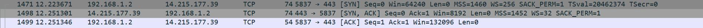
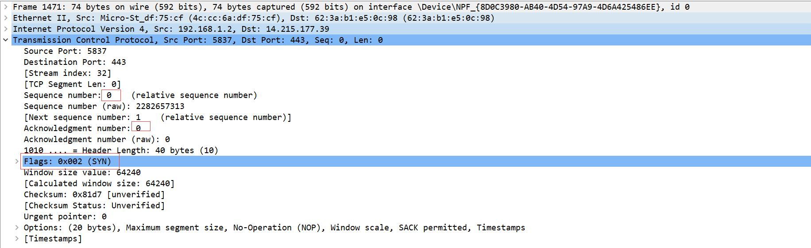
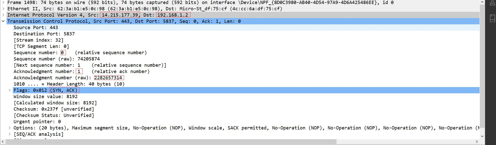
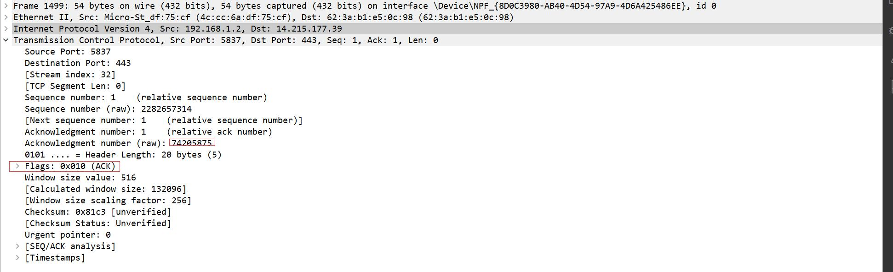
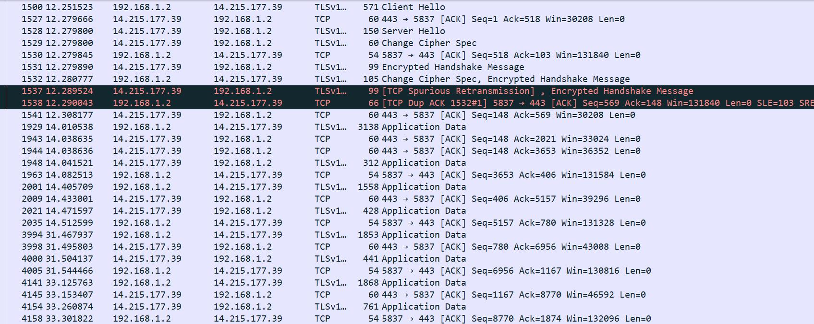
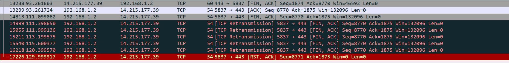
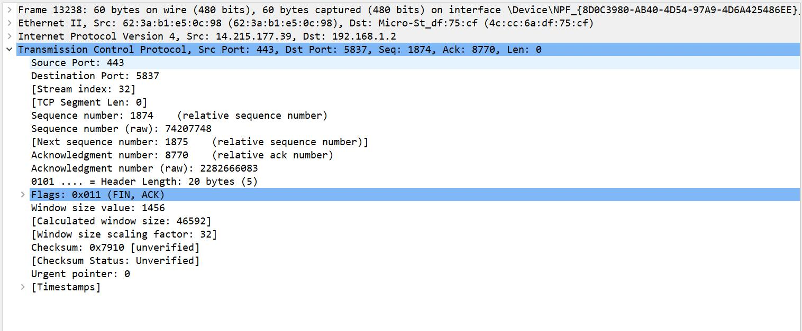
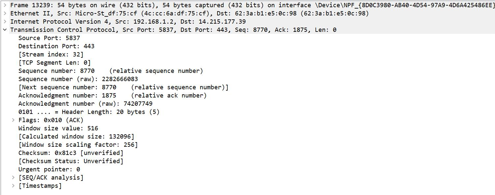
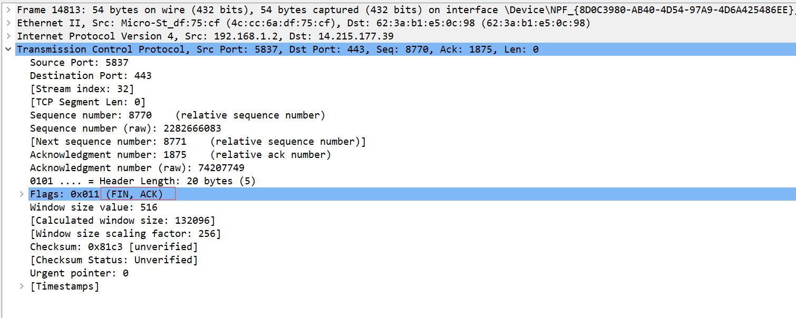
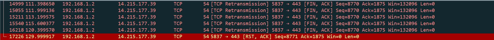

# TCP WireShark 抓包实验

09017423 杨彬

## 操作步骤

本次利用 wireshark进行抓包，我抓的是和 baidu.com进行通信的TCP数据报

1. 用 nslookup 查询 www.baidu.com 的 ip 为 14.215.177.39
2. 在 wireshark过滤器上添加 ip.dst == 14.215.177.39
3. 执行网络的打开关闭操作
4. 抓到包之后选择 TCP数据流
5. 对TCP数据流进行分析

## 结果

### TCP 三次握手

#### 第一次握手

#### 第二次握手

#### 第三次握手

### 数据传输

### TCP挥手

### 第一次挥手

### 第二次挥手

### 第三次挥手

### 第四次挥手

第四次挥手没有收到 ACK包，(挥手由百度服务器发器)，所以后面不断重传，最后自动关闭了。

## 分析

### 握手分析

从上图抓包的结果我们看到，完整经历了3个挥手过程

seq是相对的序号

1. 本地->百度服务器。 seq =0 , flag=[SYN]
2. 百度服务器->本地。 seq =0, **ack=1** flag=[SYN,ACK]
3. 本地->百度服务器。 seq =1, **ack=1** flag=[ACK]

和我们所学习的 TCP握手过程相同，同时在详细信息内我们可以看到源端口，目的端口，raw sequence 等信息。

### 挥手分析

本次抓包，挥手由服务器发器

1. baidi->本地 flags=[FIN,ACK], seq = 1874 Ack=8770 (这一个 ack应该是对上一个数据报的回复)
2. 本地->baidu flags=[ACK], seq=8770, ack=1875 （1875=1874+1） 告知 服务器，客户端知道连接要关闭了
3. 本地->baidu flags=[FIN,ACK], seq=8770, Ack=1875. 告知服务器客户端也准备关闭连接
4. 服务器没有 ACK响应。(或许是服务器傲娇吧)

再经过数次重传之后，定时器时间到了，自动关闭连接。