# 网络层 和 传输层

## IP 层的特点

* connectless
* not reliable
* best effort

## IP报头

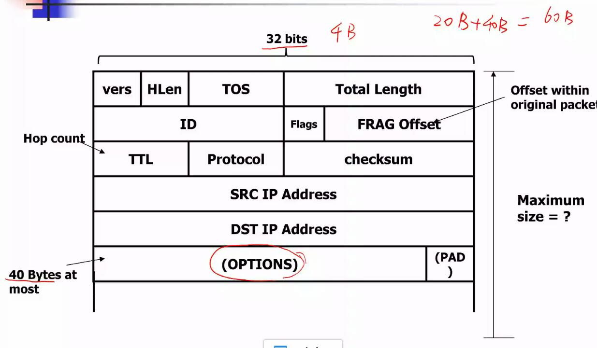

IP header 必选 20 bit  , 可选 40 bit 最大 60 bit , IP报文长度最多为 65536B （因为 TotalLength 是 16 bit )

## ICMP 

Internet Control Message Protocol: A special but useful IP datagram

* used by a router/end-host to report some types of error
* examples ：
  1. Destination Unreachable: packet can't be forwarded to/towards its destinaton. Ping
  2. Time Exceeded： TTL reachd zero, or fragment didn't arrive in time. **Traceroute** use this
* An ICMP message is an IP datagram, and is sent back to the source of the packet that caused the error.(如果网络中发生错误，那么ICMP报文会被发送回source )

## More flags 和 FRAG Offset 

被用在将大的报文拆分为小的报文。

more flags 表明后面还有拆分的报文(被拆分的最后一个报文，more flags 为 0)

FRAG Offset 表示偏移量，以 8 个 byte 为计数单元。

为什么以 8 个单元为单位？ 因为 Flag offset 的长度比 total length 长度短

* Fragments 在 目的主机进行组装，rooter不会组装报文。可以根据 FRAG OFFSET 进行组装

为什么 要分割报文 和 由 IP 层分割

1. 因为 IP 层下面可能是能力不同的物理链路层。(以太网，zigbee, wifi...)
2. IP 层作为通用的网络层语言，IP 层负责隐藏底层的异构性。

## IP 层 如何 路由

1. Data plane(负责转发数据)
2. Control plane (计算路由表)
    * Calculating the routing table periodically

数据平面和控制平面分里，抽象控制平面，将控制平面做的事给软件完成—— SDN的思想(software defined network)

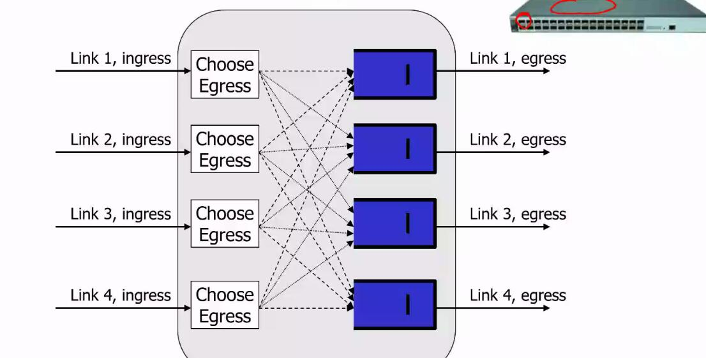

(全连接)

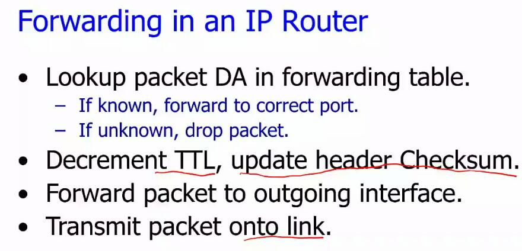

如何查询 路由表 ?

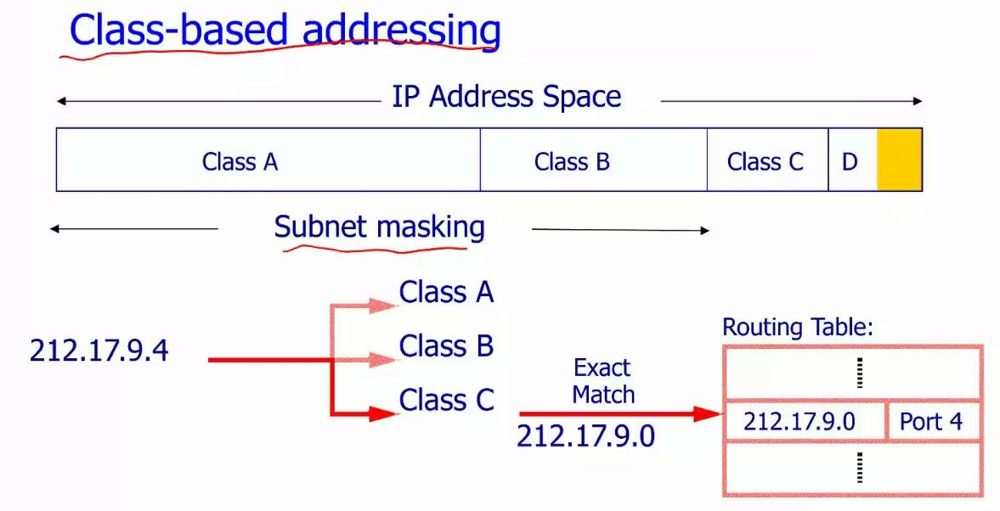

子网掩码，使用子网掩码对网络进行非类，只查询类别，(查询子网掩码的部分)

通过子网掩码可以计算网络 ID 。

eg 子网掩码为 : 255.255.252.0

则 IP 212.17.9.4 的 网络 ID 为 212.17.8.0

第三段  252 & 9 => 8

* 路由器中有专门的硬件 specific hardware inside the router "Contents addressable memory" (CAM)

关联式存储器，可以并行查询

Associative Memory or CAM

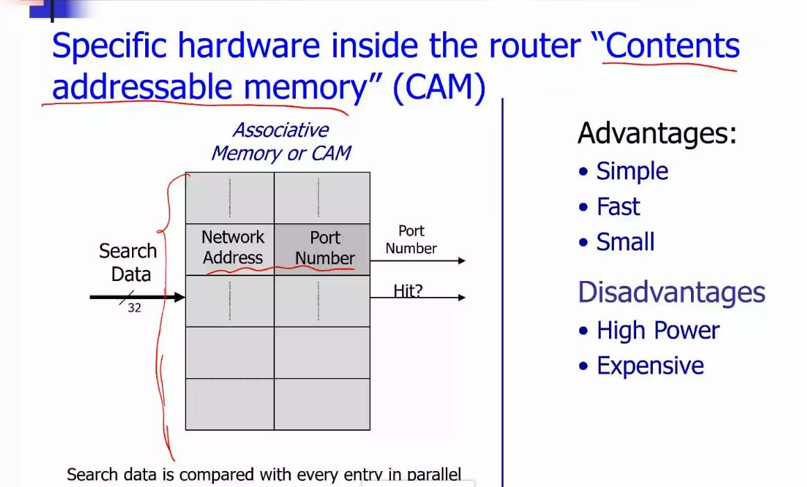

每个报文来了都需要查询路由表么？

**网络流** : 网络流指的是两个终端之间一系列的连续同学呢。

我们通常用一个 5 元组 来定义流
**(source IP,destination IP, source port, destination port , protocol)**

五元组相同的报文称为一条流。对相同的报文进行相同的决策

在 packet 级别进行负载均衡， 在 flow 级别进行负载均衡

在 flow 级别进行负载均衡

1. 同一条流的包执行相同的决策
2. 对于不同的流选择不同的路径
3. 选择路径的方法， 轮询、RTT优先、
带宽优先,ECMP(Equal-cost multi-path routing)算法

ECMP 算法 : 认为路径之间是等价的,等价地选择路径

Randomly choose an available path by hashing the 5-tuple.

问题:

1. Hash collision may cause congestion
2. Flow sizes may differ tremendously with each other.

在 packet 级别进行负载均衡

在 packet 进行负载均衡，可以很均衡但是

1. 路径之间的延迟不同，可能导致对包进行重排序导致降低性能(Difference in path delay may cause packet reordering and consequently degrade the net0work performance )

**flowlet** 把一个大流根据时间间隔拆分成小流——flowlet, 以 flowlet 为粒度进行负载均衡

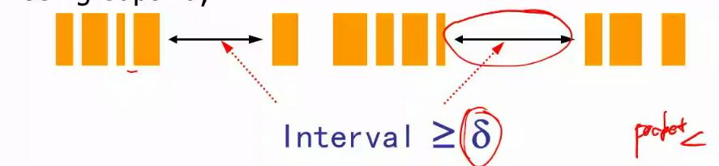

Why can Flowlet work in practice?

1. Compared to per flow routing, Flowlet routing allows more chance to rebalance the traffic. Statistically, the performance is close to per packet routing.
2. Applications usually generates the traffic in burst (eg. webpage browsing, online games)
3. Transport layer may generates the traffic in micro-bursts.

存在burst 现象，所以经常会产生这种一小段一小段的流。从统计上来说，使用 flowlet 能达到和 packet 差不多的效果。

TCP Segment offloading : 把很多小报文合并为一个大报文一起处理。

## 传输层

IP 层的特点 ： responsible for connectivity and routing

IP缺点:
not promise 

1. datagram delivery
2. arrive in order
3. no corrupted

因此需要传输层希望提供:

TCP:

1. Reliable delivery
2. Rate control...

为什么还需要 UDP :

有些场景不需要可靠的数据传输

* 网络隧道， 类似VPN， 把报文封装在 UDP报文里，然后把UDP报文发送出去，目的方收到UDP报文之后，再把之前的TCP报文解析出来。

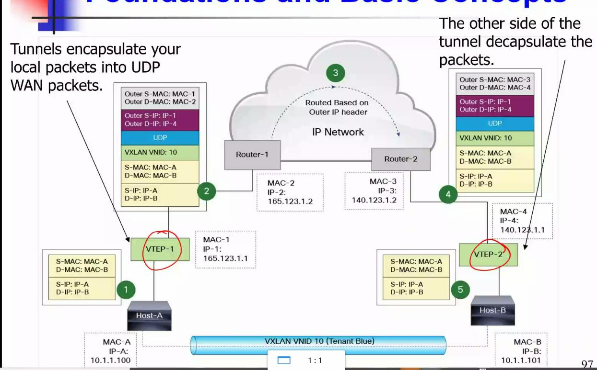

### TCP

* TCP 很复杂
* TCP 是面向连接的
* TCP 很可靠
  * Ack indicate delivery of data
  * Sequence numbers detect missing, or mis-sequenced daa
  * Corrupted ata is retransmitted after a timeout.
* TCP 使用华东窗口来控制发送方的速率
  * Receiver side flow control
  * Network side congestion control

### TCP 面向连接

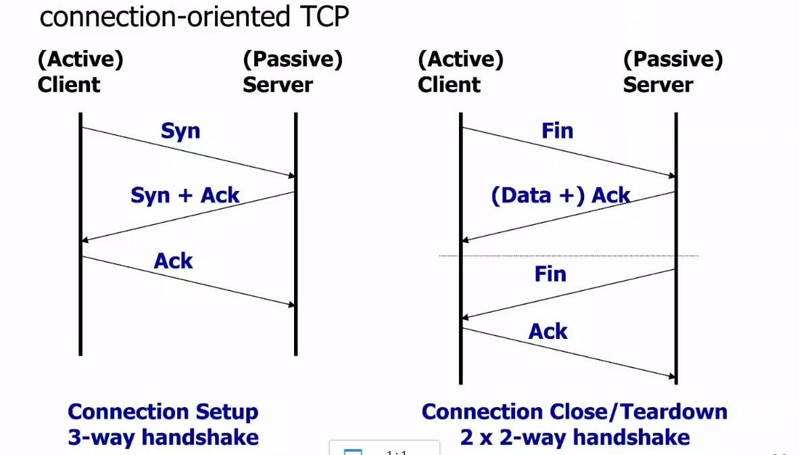

#### 如果 TCP 第三次握手丢包了

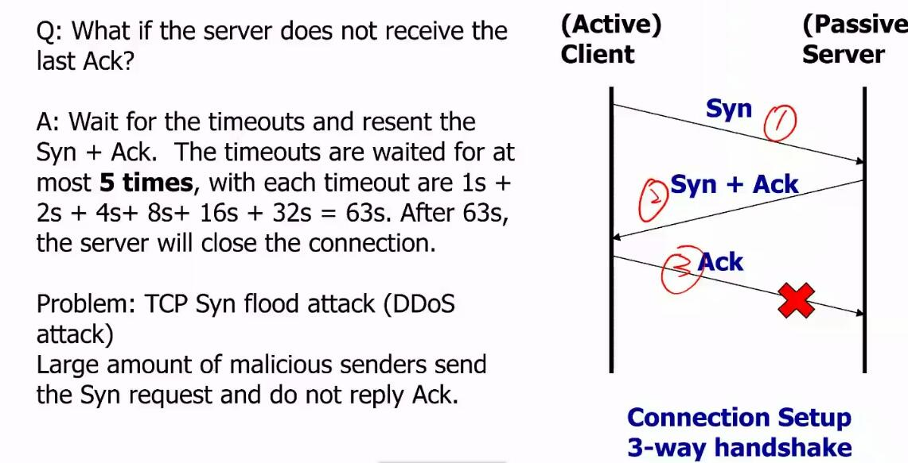

等待 timeout , 然后重发 ACK+Syn
最多等待5次，timeout 依次是 1s + 2s + 4s + 8s+ 16s+32s = 63s 。 63s 之后 server 关闭连接。

问题: 容易遭受DDos 攻击， TCP Syn flood attack （泛洪攻击)

Large amount of malicious senders send the Syn request and do not replay Ack.

DDos ( Distributed Deney of Service of Attack)

#### TCP 头

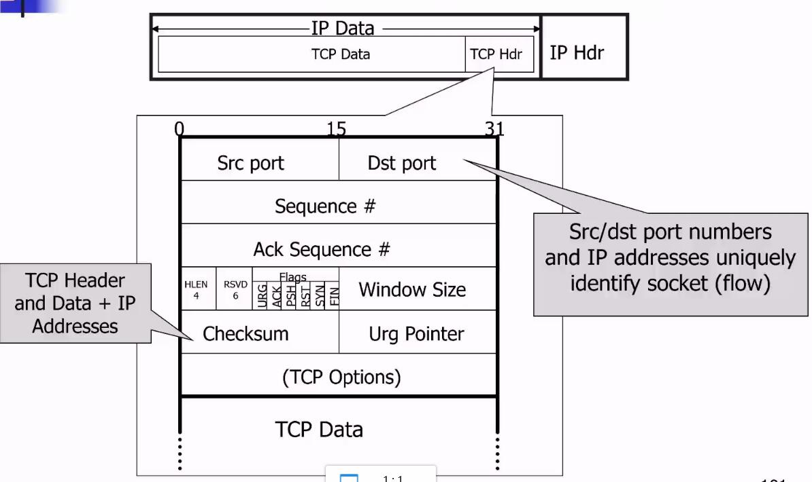

* Port Number. Port 有 16 为 范围是 0-65535
* Common port numbers
 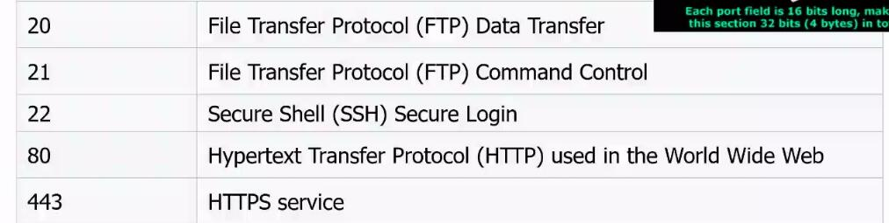 

标志位

1. UBG urgent ，报文很紧急，收到了就直接回复。
2. ACK
3. PSH PSH标志表示
4. SYB
5. FIN

**Sequence number** 序列号 

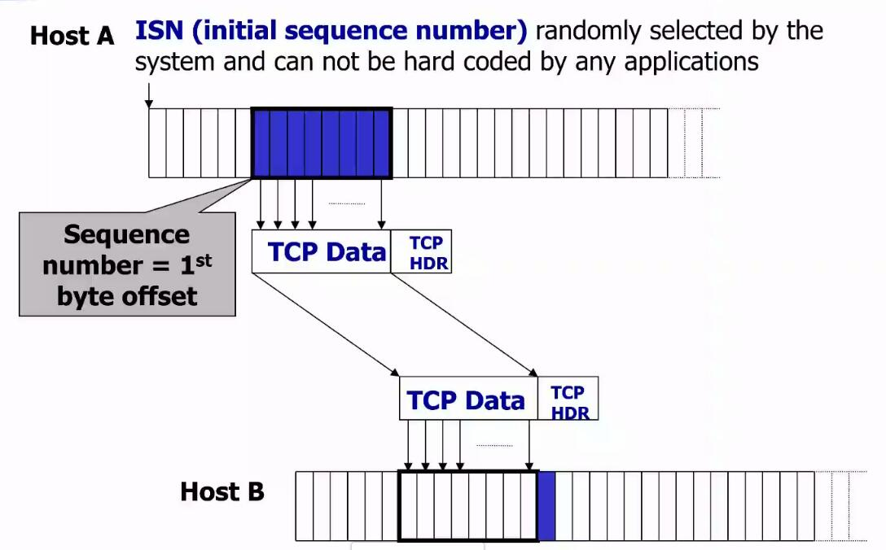

* 初始的 Seq num 随机产生
* ACK 回复的是期望的下一个报文
* TCP 采用累积回复，回复最新的期待的报文

* TCP 采用快速重传(因为 timeout 的时间可能会很长)。 如果连续收到 3 个 冗余 ACK (表明丢包了) 就马上重传 timeout 的报文 . 而不需要等到 timeout 再发， 这种机制就成为快速重传机制。

* TCP 通过发送累积 ACK 和 Seq，可以确保报文到达的有序性 

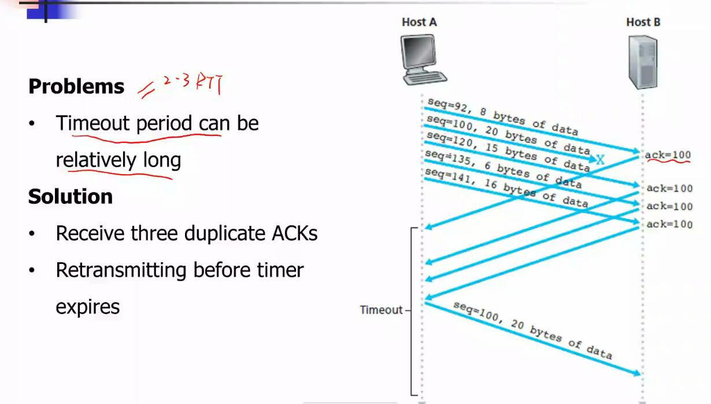

**send rate control** 发送速率控制

* why my download is too slow?
* why my online games lags?
* why my online movies always loading?

its all abou TCP Window. 

TCP 窗口表示 没有收到 ACK的时候可以发送多少数据。窗口决定了发送的速率

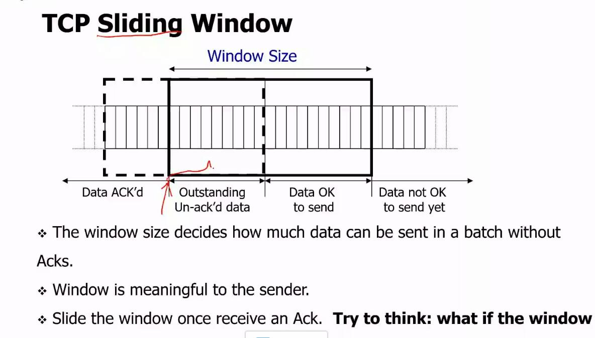

1. 什么是窗口，窗口里有两种报文，已发送但为收到 ACK , 可以发送的
2. windows size =0 的含义？ 无法发送数据(可能服务端缓冲区满)
3. 当窗口满的时候，服务端还需要不断和客户端进行通信(发送 TCP ZeroWindow packet)， 一种 keep alive 的请求。来获取最新的 窗口大小。  这种报文称为 probe 报文。 从 wireshark 抓包数据来看 依次间隔 1s 2s 4s 8s 16s... 发送一次keep alive 报文. 通常情况下是 5-6 次。
4. 由 3 和 握手阶段第3次握手的 这种泛洪类似。 通过设置 window size 为 0 来进行网络攻击
5. windows size 同时由接收方 和 网络情况决定  window = min{Advertized window, Congestion Window}; 

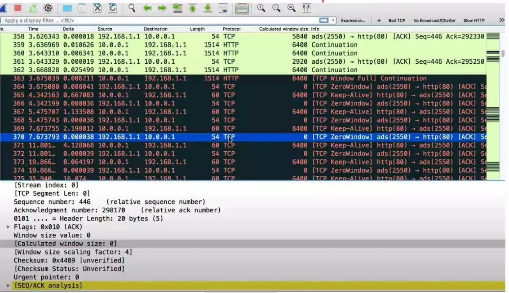

*
**congestion control** 拥塞控制

1. 慢启动 cwnd 初始值设为 1，每收到一个 ACK cwnd 增加 一个 cwnd(每次翻倍)。慢启动有一个慢启动阈值，一旦cwnd到达阈值，改为线性增长。(每次收到 ack, cwnd=cwnd+1)

  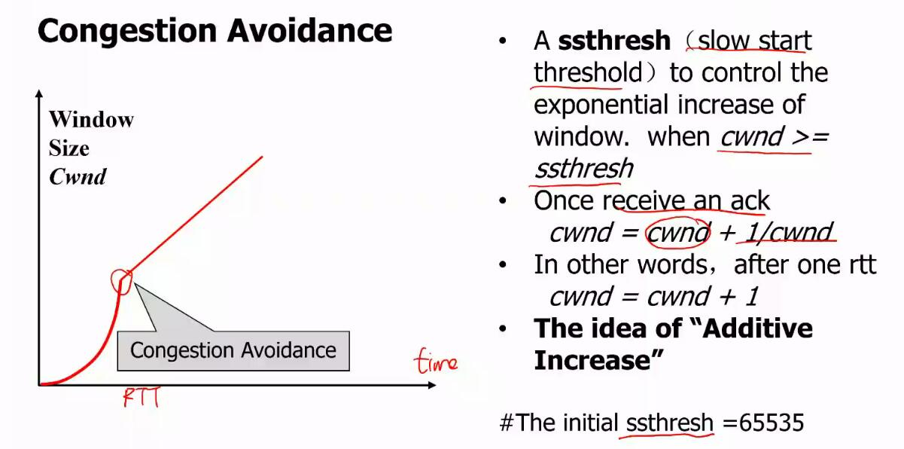

2. 当网络发生拥塞(congestion)的时候
   1. 等待一个 RTO(timeout),没有收到ACK
   sshthresh = cwnd/2
   cwnd set to be 1
   Back to slow start

   2. Receiving 3 duplicated Acks (这种情况比上一种情况好一点)
     cwnd = cwnd /2
     sshthresh = cwnd;

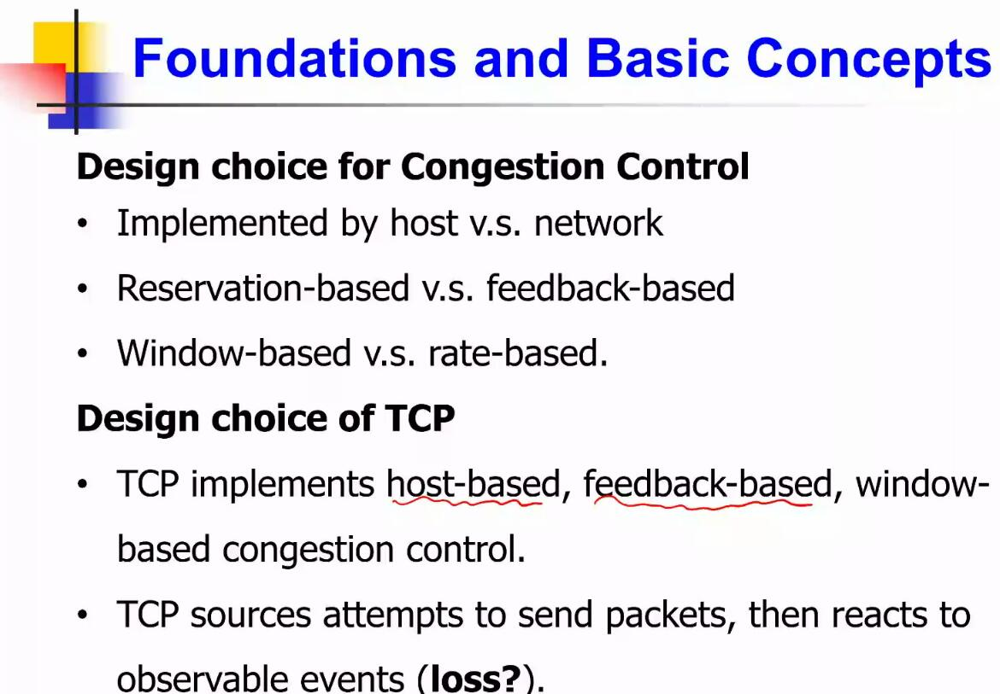